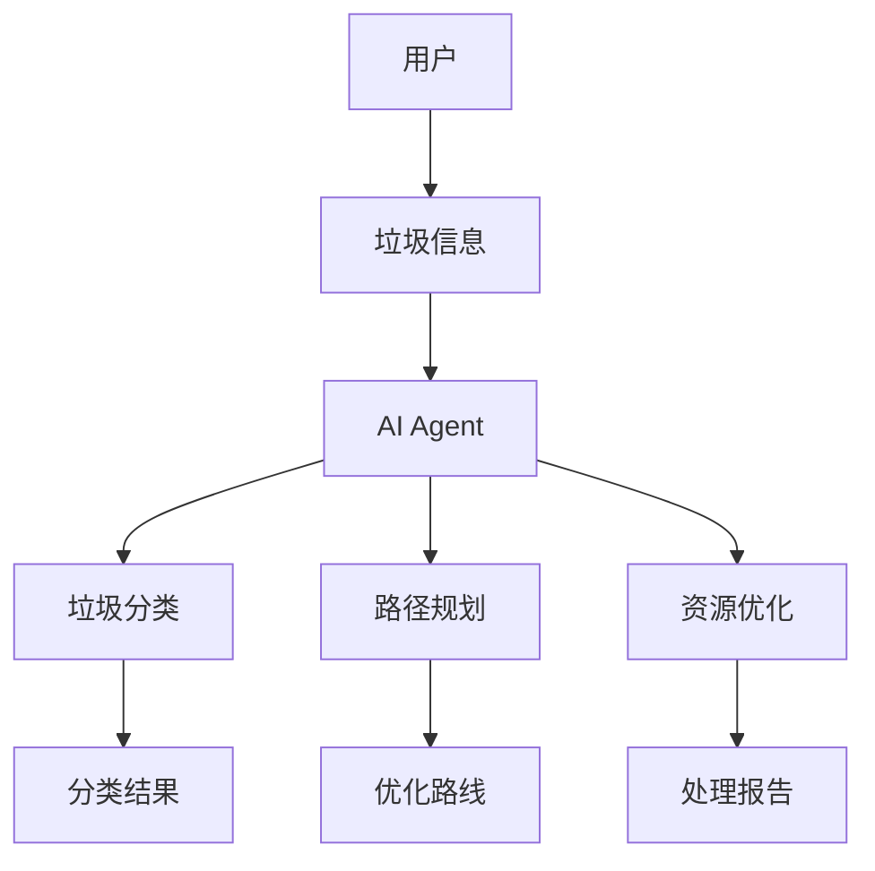

                 

# 智能垃圾处理站：AI Agent的社区回收管理

> 关键词：智能垃圾处理站，AI Agent，社区回收，垃圾分类，人工智能，系统架构

> 摘要：本文详细探讨了AI Agent在社区垃圾回收管理中的应用，从问题背景、核心概念、算法原理到系统架构和项目实战，全面解析了智能垃圾处理站的设计与实现。通过理论与实践的结合，展示了AI技术在环保领域的巨大潜力。

---

# 第一部分: 智能垃圾处理站的背景与概念

## 第1章: 智能垃圾处理站的背景介绍

### 1.1 问题背景

#### 1.1.1 当前垃圾处理的主要问题
随着城市化进程的加快，垃圾产生量急剧增加，传统的垃圾处理方式面临着效率低、资源浪费、环境污染等问题。社区垃圾回收管理的痛点日益突出，具体表现为：

1. **分类不准确**：居民随意丢弃垃圾，导致后续处理困难。
2. **效率低下**：人工分类效率低，成本高。
3. **资源浪费**：可回收资源未被有效利用。

#### 1.1.2 社区垃圾回收的痛点
社区垃圾回收管理的核心问题在于如何高效、准确地进行垃圾分类。传统方法依赖人工操作，存在以下问题：

1. **人工成本高**：需要大量人员进行分类和处理。
2. **分类错误率高**：人工分类容易出错，影响后续处理效率。
3. **缺乏实时监控**：无法实时掌握垃圾的分布和处理情况。

#### 1.1.3 AI技术在垃圾处理中的应用潜力
人工智能技术，特别是AI Agent（智能代理），在垃圾处理中的应用具有巨大潜力。AI Agent可以通过图像识别、自然语言处理和强化学习等技术，实现垃圾的智能分类、路径规划和资源优化。

---

### 1.2 问题描述

#### 1.2.1 社区垃圾回收的流程与挑战
社区垃圾回收的流程通常包括垃圾产生、分类、运输和处理。然而，现有流程存在以下挑战：

1. **分类环节效率低**：人工分类耗时长，容易出错。
2. **运输路径优化难**：垃圾运输路线复杂，难以实时优化。
3. **处理效率低**：垃圾处理站的处理能力有限，容易造成堆积。

#### 1.2.2 现有垃圾处理系统的不足
传统的垃圾处理系统主要依赖人工操作，存在以下不足：

1. **缺乏智能化**：无法实时监控和优化垃圾处理流程。
2. **资源浪费**：可回收资源未被有效利用。
3. **环境污染**：垃圾处理过程中容易产生二次污染。

#### 1.2.3 智能化垃圾处理的需求分析
为了提高垃圾处理效率、降低人工成本并减少环境污染，智能化垃圾处理的需求日益迫切。具体需求包括：

1. **智能分类**：通过AI技术实现垃圾的精准分类。
2. **路径优化**：优化垃圾运输路线，提高效率。
3. **资源回收**：最大化可回收资源的利用。

---

### 1.3 问题解决思路

#### 1.3.1 引入AI Agent的必要性
AI Agent是一种能够感知环境、自主决策并执行任务的智能体。在垃圾处理中，AI Agent可以通过以下方式实现智能化管理：

1. **图像识别**：识别垃圾类型，实现精准分类。
2. **路径规划**：优化垃圾运输路线。
3. **决策优化**：实时调整处理策略。

#### 1.3.2 AI Agent在垃圾处理中的核心作用
AI Agent在垃圾处理中的核心作用体现在以下几个方面：

1. **智能化分类**：通过图像识别技术，AI Agent能够快速识别垃圾类型，提高分类效率。
2. **实时监控**：AI Agent可以实时监控垃圾的分布和处理情况，优化处理流程。
3. **资源优化**：通过数据挖掘和优化算法，AI Agent能够最大化资源的利用效率。

#### 1.3.3 智能化垃圾处理站的总体解决方案
智能化垃圾处理站的总体解决方案包括以下几个方面：

1. **AI Agent的设计与实现**：开发具备图像识别、路径规划和决策优化功能的AI Agent。
2. **系统架构设计**：设计高效的系统架构，实现AI Agent与社区系统的无缝对接。
3. **项目实战**：通过实际案例验证系统的可行性和有效性。

---

### 1.4 边界与外延

#### 1.4.1 智能垃圾处理站的功能边界
智能垃圾处理站的功能边界主要集中在以下几个方面：

1. **垃圾分类**：AI Agent负责对垃圾进行分类和识别。
2. **路径规划**：优化垃圾运输路线，降低运输成本。
3. **数据监控**：实时监控垃圾处理情况，提供数据支持。

#### 1.4.2 与社区其他系统的交互关系
智能垃圾处理站需要与社区其他系统进行交互，包括：

1. **社区管理系统**：接收垃圾处理数据，优化管理流程。
2. **运输系统**：提供运输路线优化建议，提高运输效率。
3. **用户终端**：为用户提供垃圾分类指导和服务。

#### 1.4.3 系统的可扩展性与灵活性
智能垃圾处理站的设计需要具备较强的可扩展性和灵活性，能够适应未来垃圾处理技术的发展和社区需求的变化。

---

### 1.5 概念结构与核心要素

#### 1.5.1 系统整体架构
智能垃圾处理站的整体架构包括以下几个部分：

1. **AI Agent**：负责垃圾分类、路径规划和决策优化。
2. **社区管理系统**：实现垃圾处理的实时监控和管理。
3. **用户终端**：为用户提供垃圾分类指导和服务。
4. **运输系统**：优化垃圾运输路线，提高运输效率。

#### 1.5.2 核心功能模块
智能垃圾处理站的核心功能模块包括：

1. **图像识别模块**：实现垃圾的精准分类。
2. **路径规划模块**：优化垃圾运输路线。
3. **决策优化模块**：实时调整垃圾处理策略。

#### 1.5.3 系统输入与输出
系统的输入包括：

1. **垃圾图像**：AI Agent通过图像识别技术进行分类。
2. **运输路线**：AI Agent优化垃圾运输路线。
3. **处理数据**：系统实时监控垃圾处理情况。

系统的输出包括：

1. **分类结果**：AI Agent输出垃圾分类结果。
2. **优化路线**：AI Agent输出优化后的运输路线。
3. **处理报告**：系统输出垃圾处理报告。

---

## 第2章: AI Agent的核心概念与联系

### 2.1 核心概念原理

#### 2.1.1 AI Agent的基本定义
AI Agent是一种能够感知环境、自主决策并执行任务的智能体。在智能垃圾处理站中，AI Agent主要负责垃圾分类、路径规划和资源优化。

#### 2.1.2 AI Agent的核心功能
AI Agent的核心功能包括：

1. **感知环境**：通过图像识别技术感知垃圾类型。
2. **自主决策**：根据感知信息做出最优决策。
3. **执行任务**：通过执行任务优化垃圾处理流程。

#### 2.1.3 AI Agent与智能垃圾处理站的关系
AI Agent是智能垃圾处理站的核心组成部分，负责实现垃圾的智能化分类和优化处理。

---

### 2.2 概念属性特征对比

#### 2.2.1 不同AI技术的对比分析
以下是几种常见AI技术的对比分析：

| **技术**       | **优势**                           | **劣势**                           |
|----------------|------------------------------------|------------------------------------|
| 图像识别        | 精准分类垃圾                       | 对硬件要求较高                     |
| 强化学习        | 能够优化决策策略                   | 需要大量训练数据                   |
| 自然语言处理    | 可用于垃圾信息的交互               | 不适用于图像分类                   |

#### 2.2.2 各种垃圾处理方式的优缺点
以下是几种垃圾处理方式的优缺点对比：

| **处理方式**     | **优势**                           | **劣势**                           |
|------------------|------------------------------------|------------------------------------|
| 人工分类          | 灵活性高                          | 效率低，成本高                    |
| 自动化分类        | 效率高，成本低                     | 设备初期投入高                    |
| 智能分类          | 精准分类，优化资源利用             | 技术复杂，维护成本高              |

#### 2.2.3 AI Agent与其他技术的协同作用
AI Agent可以通过与其他技术的协同作用，实现更高效的垃圾处理。例如：

1. **与图像识别的协同**：AI Agent通过图像识别技术实现垃圾的精准分类。
2. **与强化学习的协同**：AI Agent通过强化学习优化决策策略。
3. **与自然语言处理的协同**：AI Agent通过自然语言处理技术与用户进行交互。

---

### 2.3 ER实体关系图

---

## 总结

通过以上章节的分析，我们已经详细探讨了智能垃圾处理站的背景、核心概念和AI Agent的作用。接下来，我们将深入讲解AI Agent的算法原理与实现，为后续的系统设计和项目实战奠定基础。

