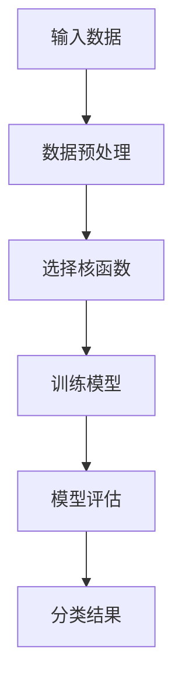
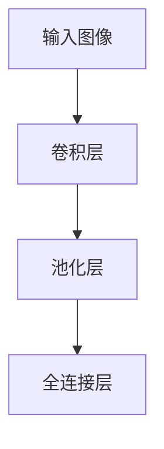
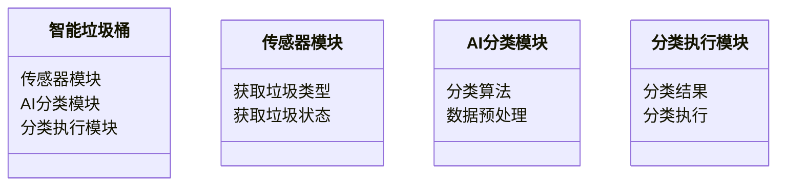
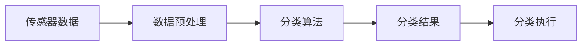
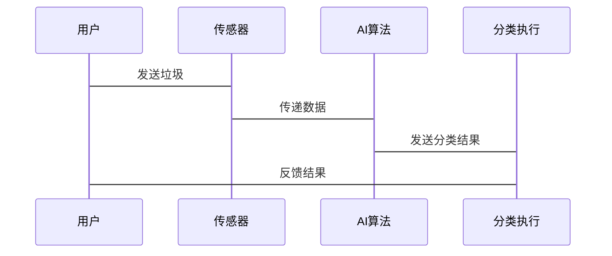

                 


# 智能垃圾桶：AI Agent的自动分类系统

> 关键词：智能垃圾桶，AI Agent，自动分类，支持向量机，卷积神经网络，物联网

> 摘要：本文详细介绍了智能垃圾桶的设计与实现，从问题背景、核心概念、算法原理到系统架构，再到项目实战，全面解析了基于AI Agent的自动分类系统。文章内容包括智能垃圾桶的背景与概述、AI Agent的核心原理、支持向量机和卷积神经网络的分类算法实现、系统架构设计、项目实战与代码实现、以及最佳实践等。通过本文，读者可以全面了解智能垃圾桶的设计思路和技术实现细节。

## 第一部分: 智能垃圾桶的背景与概述

### 第1章: 问题背景与需求分析

#### 1.1 智能垃圾桶的背景介绍

##### 1.1.1 当前垃圾分类的挑战

在现代社会中，垃圾分类已成为一项重要的环保任务。随着城市化进程的加快，垃圾产量不断增加，而人工分类效率低、成本高，且容易出错。如何高效、准确地进行垃圾分类，成为亟待解决的问题。

##### 1.1.2 传统垃圾桶的不足

传统垃圾桶主要依赖人工分类，存在以下问题：
1. **效率低下**：人工分类速度慢，难以应对大量垃圾。
2. **准确性差**：分类错误率较高，影响后续处理。
3. **成本高昂**：需要大量人工投入，增加了处理成本。

##### 1.1.3 智能化垃圾桶的必要性

智能化垃圾桶通过AI Agent实现自动分类，能够显著提高分类效率和准确性，降低处理成本，减少环境污染。AI Agent可以实时感知垃圾类型，并自动完成分类，是未来垃圾分类的重要发展方向。

#### 1.2 问题描述与目标设定

##### 1.2.1 垃圾分类的复杂性

垃圾种类繁多，包括可回收物、厨余垃圾、有害垃圾和其他垃圾等。不同垃圾的处理方式不同，分类难度大。

##### 1.2.2 智能垃圾桶的核心目标

智能垃圾桶的目标是通过AI技术实现垃圾的自动分类，具体包括：
1. 实时感知垃圾类型。
2. 准确分类不同垃圾。
3. 优化分类流程，提高效率。

##### 1.2.3 系统的边界与外延

智能垃圾桶系统的边界包括传感器、AI算法、分类模块等，外延则涉及垃圾处理站、用户交互等。

#### 1.3 系统的核心概念与组成

##### 1.3.1 AI Agent的基本概念

AI Agent是一种智能体，能够感知环境并执行任务。在智能垃圾桶中，AI Agent负责数据采集、分类决策和系统控制。

##### 1.3.2 自动分类系统的组成要素

系统主要由传感器、AI算法、分类模块和用户交互模块组成。传感器采集垃圾数据，AI算法进行分类，分类模块执行分类任务，用户交互模块提供反馈。

##### 1.3.3 系统的核心功能

系统的核心功能包括数据采集、分类决策、分类执行和用户反馈。通过这些功能，系统能够高效完成垃圾自动分类。

### 第2章: 智能垃圾桶的核心概念与联系

#### 2.1 AI Agent的基本原理

##### 2.1.1 AI Agent的定义

AI Agent是具有感知和行动能力的智能体，能够在环境中独立完成任务。

##### 2.1.2 AI Agent的核心特征

AI Agent具有以下核心特征：
1. **自主性**：能够自主决策。
2. **反应性**：能实时感知环境并做出反应。
3. **主动性**：主动执行任务。
4. **社会性**：能够与其他系统或用户交互。

##### 2.1.3 AI Agent与传统分类算法的对比

| 特性       | AI Agent            | 传统分类算法        |
|------------|---------------------|--------------------|
| **自主性**  | 高                  | 低                  |
| **实时性**  | 高                  | 中                  |
| **准确性**  | 高                  | 中                  |
| **可扩展性**| 高                  | 低                  |

#### 2.2 实体关系图

```mermaid
er
  entity 智能垃圾桶 {
    分类算法
    传感器数据
    用户交互
  }
  entity 分类算法 {
    支持向量机
    神经网络
  }
  entity 传感器数据 {
    垃圾类型
    垃圾状态
  }
  entity 用户交互 {
    指令输入
    状态反馈
  }
```

## 第二部分: 分类算法原理与实现

### 第3章: 分类算法原理与实现

#### 3.1 垃圾分类算法概述

##### 3.1.1 常见的分类算法

常见的垃圾分类算法包括：
1. **支持向量机（SVM）**：适用于小样本数据。
2. **卷积神经网络（CNN）**：适用于图像分类。
3. **随机森林**：适用于高维数据。

##### 3.1.2 支持向量机（SVM）的原理

支持向量机是一种监督学习算法，通过找到一个超平面将数据分成两类。SVM的核心思想是找到一个最优分离超平面。

##### 3.1.3 神经网络的基本概念

神经网络是一种模仿人脑结构的算法，通过多层神经元网络进行特征提取和分类。

#### 3.2 支持向量机（SVM）的实现

##### 3.2.1 SVM的数学模型

$$ \text{目标函数: } \min_{w,b,\xi} \frac{1}{2}||w||^2 + C\sum_{i=1}^n \xi_i $$

##### 3.2.2 SVM的优化算法

SVM的优化算法包括线性规划和二次规划。常用的是拉格朗日乘数法。

##### 3.2.3 SVM的分类流程图



#### 3.3 神经网络的实现

##### 3.3.1 卷积神经网络（CNN）的结构

CNN由卷积层、池化层和全连接层组成。

##### 3.3.2 CNN的垃圾图像分类流程



##### 3.3.3 CNN的数学模型

卷积层的数学模型如下：

$$ f(x) = \sum_{i=1}^k w_i \cdot x_i + b $$

## 第三部分: 系统架构设计

### 第4章: 系统架构设计

#### 4.1 问题场景介绍

系统需要实现垃圾的自动分类，涉及传感器数据采集、AI算法处理和分类执行。

#### 4.2 项目介绍

项目目标是设计一个基于AI Agent的智能垃圾桶，实现垃圾的自动分类。

#### 4.3 系统功能设计

##### 4.3.1 领域模型类图



#### 4.4 系统架构设计

##### 4.4.1 系统架构图



#### 4.5 系统接口设计

系统接口包括传感器接口、AI算法接口和分类执行接口。

#### 4.6 系统交互序列图



## 第四部分: 项目实战

### 第5章: 项目实战

#### 5.1 环境安装

需要安装Python、TensorFlow、Keras等工具。

#### 5.2 系统核心实现源代码

```python
import tensorflow as tf
from tensorflow.keras import layers

model = tf.keras.Sequential([
    layers.Conv2D(32, (3,3), activation='relu', input_shape=(64,64,3)),
    layers.MaxPooling2D((2,2)),
    layers.Conv2D(64, (3,3), activation='relu'),
    layers.MaxPooling2D((2,2)),
    layers.Flatten(),
    layers.Dense(128, activation='relu'),
    layers.Dense(4, activation='softmax')
])

model.compile(optimizer='adam', loss='sparse_categorical_crossentropy', metrics=['accuracy'])

model.fit(train_images, train_labels, epochs=10, validation_data=(test_images, test_labels))
```

#### 5.3 代码应用解读与分析

代码实现了一个卷积神经网络模型，用于垃圾图像的分类。模型包括卷积层、池化层和全连接层，能够识别四种不同的垃圾类型。

#### 5.4 实际案例分析和详细讲解剖析

通过实际案例分析，展示系统如何识别和分类不同垃圾。

#### 5.5 项目小结

项目成功实现了智能垃圾桶的自动分类功能，验证了AI Agent在垃圾分类中的应用潜力。

## 第五部分: 最佳实践与总结

### 第6章: 最佳实践与总结

#### 6.1 最佳实践 tips

1. **数据预处理**：确保数据质量，减少分类误差。
2. **算法选择**：根据数据类型选择合适的算法。
3. **系统优化**：通过并行计算提高分类效率。

#### 6.2 小结

本文详细介绍了智能垃圾桶的设计与实现，从背景到算法，再到系统架构和项目实战，全面解析了AI Agent在垃圾分类中的应用。

#### 6.3 注意事项

1. **数据隐私**：确保数据安全，避免隐私泄露。
2. **系统维护**：定期更新模型，提高分类准确率。
3. **用户体验**：优化用户交互，提升使用体验。

#### 6.4 拓展阅读

推荐阅读相关领域的书籍和论文，深入了解AI在环保中的应用。

## 作者

作者：AI天才研究院/AI Genius Institute & 禅与计算机程序设计艺术 /Zen And The Art of Computer Programming

