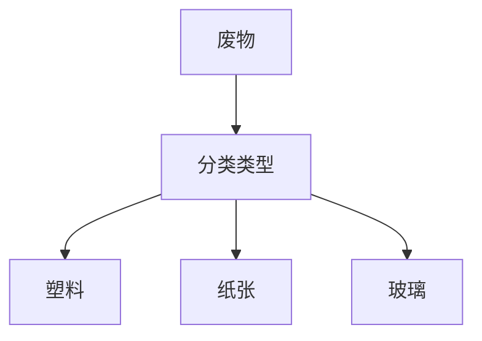
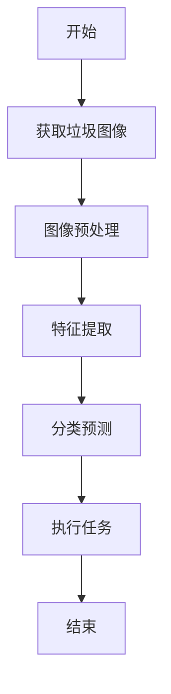
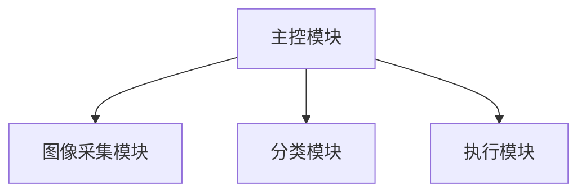

                 


# 智能垃圾箱：AI Agent的废物分类指导

---

## 关键词：智能垃圾箱、AI Agent、废物分类、算法原理、系统架构、项目实战

---

## 摘要

智能垃圾箱是一种利用AI Agent技术实现自动废物分类的创新系统。本文将从背景、核心概念、算法原理、系统架构、项目实战等多角度深入探讨智能垃圾箱的设计与实现。通过详细的技术分析和实际案例，本文旨在为读者提供一个全面了解AI Agent在废物分类中应用的视角，同时提供可参考的系统设计和优化建议。

---

## 目录

1. [背景与概述](#背景与概述)
2. [核心概念与原理](#核心概念与原理)
3. [算法原理与数学模型](#算法原理与数学模型)
4. [系统架构设计](#系统架构设计)
5. [项目实战](#项目实战)
6. [最佳实践与优化](#最佳实践与优化)
7. [未来展望与挑战](#未来展望与挑战)

---

## 1. 背景与概述

### 1.1 智能垃圾箱的定义与背景

#### 1.1.1 智能垃圾箱的定义

智能垃圾箱是一种结合了人工智能（AI）和物联网（IoT）技术的智能设备，用于自动分类、识别和处理各种类型的垃圾。通过AI Agent（智能代理）的帮助，智能垃圾箱能够实现对垃圾的高效分类，从而提高废物管理的效率和准确性。

#### 1.1.2 AI Agent在垃圾分类中的作用

AI Agent是一种能够感知环境、做出决策并执行任务的智能实体。在智能垃圾箱中，AI Agent主要负责以下任务：
- 识别和分类垃圾类型。
- 控制机械臂或其他执行机构进行垃圾处理。
- 与物联网设备（如传感器、摄像头）交互，获取实时数据。

#### 1.1.3 智能垃圾箱的发展背景

随着全球废物产生量的急剧增加，传统的垃圾分类方法（如人工分类）效率低下且成本高昂。AI Agent的引入为废物管理提供了新的解决方案，能够显著提高分类效率，降低人工成本，并减少环境污染。

---

### 1.2 废物分类的挑战与解决方案

#### 1.2.1 废物分类的重要性

废物分类是废物管理的基础，它决定了废物的回收利用效率和处理成本。通过智能垃圾箱，可以实现对废物的精准分类，从而提高资源回收率，减少环境污染。

#### 1.2.2 传统方法的局限性

传统的人工垃圾分类方法存在以下问题：
- 效率低：人工分类速度慢，且容易出错。
- 成本高：需要大量人工劳动力。
- 不可持续：随着废物量的增加，人工分类难以满足需求。

#### 1.2.3 AI Agent的优势与应用

AI Agent的优势在于其高效性、准确性和可扩展性。通过机器学习和深度学习算法，AI Agent能够快速识别和分类各种类型的垃圾，适用于大规模的废物处理场景。

---

## 2. 核心概念与原理

### 2.1 AI Agent的基本原理

#### 2.1.1 什么是AI Agent？

AI Agent是一种能够感知环境、做出决策并执行任务的智能实体。它能够通过传感器、摄像头等设备获取环境数据，并利用这些数据进行分类、识别和决策。

#### 2.1.2 AI Agent的分类

AI Agent可以分为以下几类：
- **基于规则的AI Agent**：通过预定义的规则进行决策。
- **基于机器学习的AI Agent**：通过训练数据进行分类和预测。
- **基于知识图谱的AI Agent**：利用知识图谱进行推理和决策。

#### 2.1.3 AI Agent的核心要素

AI Agent的核心要素包括：
- **感知能力**：通过传感器、摄像头等设备获取环境数据。
- **决策能力**：基于获取的数据进行分类和决策。
- **执行能力**：通过机械臂或其他执行机构执行任务。

---

### 2.2 废物分类的核心概念

#### 2.2.1 废物分类的属性与特征

废物分类的属性包括：
- **类型**：如塑料、纸张、玻璃等。
- **形状**：如瓶罐、盒子等。
- **颜色**：如红色、蓝色、绿色等。

废物分类的特征包括：
- **可回收性**：是否可以回收利用。
- **危险性**：是否具有危险性。

#### 2.2.2 废物分类的实体关系图

以下是废物分类的实体关系图：



---

## 3. 算法原理与数学模型

### 3.1 AI Agent的算法原理

#### 3.1.1 图像识别算法

图像识别是AI Agent进行废物分类的核心技术之一。常用的算法包括：
- **卷积神经网络（CNN）**：用于图像分类。
- **支持向量机（SVM）**：用于分类任务。

#### 3.1.2 垃圾分类的数学模型

以下是基于CNN的垃圾分类模型的数学表达式：

$$
\text{分类结果} = f(x) = \text{argmax}(y_1, y_2, y_3)
$$

其中，$y_i$ 是输出层的预测概率，$f(x)$ 是最终的分类结果。

---

### 3.2 算法流程图

以下是AI Agent的算法流程图：



---

## 4. 系统架构设计

### 4.1 智能垃圾箱的系统架构

#### 4.1.1 系统功能模块划分

智能垃圾箱的主要功能模块包括：
- **图像采集模块**：通过摄像头获取垃圾图像。
- **分类模块**：通过AI算法进行分类。
- **执行模块**：通过机械臂进行垃圾处理。

#### 4.1.2 系统架构图

以下是智能垃圾箱的系统架构图：



---

## 5. 项目实战

### 5.1 环境安装与配置

#### 5.1.1 安装Python与相关库

以下是安装Python和相关库的命令：

```bash
pip install numpy
pip install tensorflow
pip install keras
pip install opencv-python
```

#### 5.1.2 安装硬件设备

需要安装以下硬件设备：
- 摄像头
- 机械臂
- 传感器

---

### 5.2 系统核心实现源代码

以下是基于Python的垃圾分类代码示例：

```python
import numpy as np
from tensorflow.keras.models import load_model
import cv2

# 加载预训练模型
model = load_model('garbage_classifier.h5')

# 图像预处理函数
def preprocess_image(image):
    image = cv2.resize(image, (224, 224))
    image = image / 255.0
    return image

# 分类函数
def classify_garbage(image):
    processed_image = preprocess_image(image)
    prediction = model.predict(np.array([processed_image]))
    class_index = np.argmax(prediction[0])
    return class_index

# 示例图像
image = cv2.imread('garbage.jpg')
result = classify_garbage(image)
print(result)
```

---

## 6. 最佳实践与优化

### 6.1 提高分类准确率的技巧

1. **数据增强**：通过旋转、翻转、缩放等方法增加训练数据。
2. **模型调参**：通过调整学习率、批量大小等参数优化模型性能。

### 6.2 系统优化建议

1. **边缘计算**：将计算任务迁移到边缘设备，减少云依赖。
2. **物联网技术**：通过传感器和物联网设备实现更高效的垃圾管理。

---

## 7. 未来展望与挑战

### 7.1 未来发展趋势

随着AI技术的不断发展，智能垃圾箱将更加智能化和自动化。未来的智能垃圾箱可能会具备以下功能：
- **自适应学习**：能够根据新的数据自动调整分类模型。
- **多语言支持**：能够与不同语言的用户进行交互。

### 7.2 当前面临的主要挑战

1. **数据隐私问题**：如何保护用户的隐私数据。
2. **环境适应性**：如何在不同环境下稳定运行。

---

## 作者：AI天才研究院（AI Genius Institute） & 禅与计算机程序设计艺术（Zen And The Art of Computer Programming）

---

通过本文的详细讲解，我们了解了智能垃圾箱的设计与实现，从背景到算法，从系统架构到项目实战，再到未来展望，为读者提供了一个全面的技术视角。希望本文能够为AI Agent在废物分类中的应用提供有价值的参考和启发。

