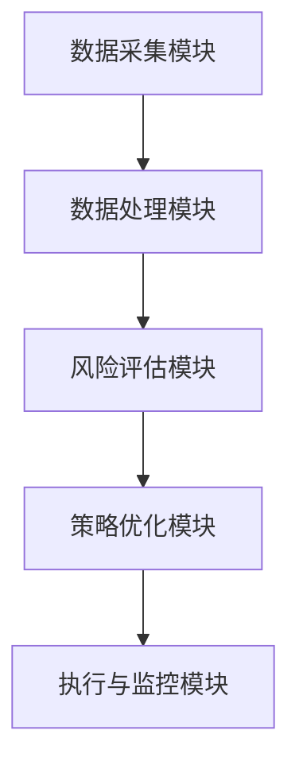

                 

# 智能外汇风险对冲策略优化系统

> **关键词**: 智能外汇、风险对冲、策略优化、算法、系统架构

> **摘要**: 本文介绍了一种智能外汇风险对冲策略优化系统，利用现代计算机技术和算法优化外汇交易的风险管理。通过分析市场动态、运用数学模型和机器学习算法，该系统能够有效降低交易风险，提高投资回报率。本文详细阐述了系统的设计原理、核心算法、架构实现及实际应用案例。

---

## 第1章: 外汇市场与风险对冲概述

### 1.1 外汇市场的基本概念

外汇市场是全球最大的金融市场，参与者包括银行、企业、个人和机构投资者。外汇交易涉及买卖不同货币，以赚取汇率差异带来的收益。主要的外汇交易市场包括伦敦、纽约和东京等。

### 1.2 风险对冲的基本概念

风险对冲是指通过投资于相关资产或金融衍生品，以减少或消除因价格波动带来的风险。在外汇交易中，常见的对冲方式包括套期保值和使用金融衍生工具。

### 1.3 传统风险对冲方法的局限性

传统方法依赖于人工分析和经验判断，存在效率低、反应慢、覆盖范围有限等问题。随着市场波动加剧，传统方法难以应对复杂的市场环境。

---

## 第2章: 智能外汇风险对冲系统的核心概念

### 2.1 智能外汇风险对冲系统的定义

智能外汇风险对冲系统是一种基于人工智能和机器学习技术的自动对冲系统，能够实时分析市场数据，优化对冲策略。

### 2.2 系统的架构与组成部分

系统架构包括数据采集模块、风险评估模块、策略优化模块和执行与监控模块。各模块协同工作，实现风险对冲的自动化和智能化。

### 2.3 系统的核心算法与技术

主要算法包括遗传算法和粒子群优化算法，结合机器学习技术，如神经网络，进行风险预测和策略优化。

---

## 第3章: 系统的算法原理与数学模型

### 3.1 优化算法的原理

遗传算法模拟生物进化过程，通过选择、交叉和变异操作优化解。粒子群优化算法通过粒子群搜索最优解。

### 3.2 数学模型与公式

风险价值模型公式：$$ VaR = \sqrt{250 \times \sigma^2 \times t} $$

风险调整后收益模型公式：$$ Sharpe Ratio = \frac{E[r - r_f]}{\sqrt{Var(r - r_f)}} $$

### 3.3 算法实现的步骤与流程

数据预处理、模型训练、策略优化与验证。

---

## 第4章: 系统的架构设计与实现

### 4.1 系统架构设计

模块划分包括数据采集、数据处理、风险评估、策略优化和执行监控。系统架构图使用Mermaid展示各模块关系。

### 4.2 系统功能设计

数据采集模块负责收集市场数据，风险评估模块预测市场风险，策略优化模块生成最优对冲策略。

### 4.3 系统架构图（Mermaid）

---

## 第5章: 项目实战

### 5.1 环境安装与配置

安装Python、NumPy、Pandas、Scikit-learn和Plotly等库，配置开发环境。

### 5.2 核心代码实现

实现数据处理、模型训练和策略优化的代码，包括数据预处理、模型训练和优化策略生成。

### 5.3 案例分析与解读

通过实际案例分析系统性能，验证算法的有效性和系统的稳定性。

---

## 第6章: 最佳实践与总结

### 6.1 最佳实践

建议读者根据实际需求调整系统参数，定期更新模型，确保系统的有效性和稳定性。

### 6.2 小结

智能外汇风险对冲系统通过现代技术优化传统方法，显著提升了风险管理效率和效果。

### 6.3 注意事项

系统依赖于高质量数据和算法的有效性，需谨慎处理数据质量和模型更新。

### 6.4 拓展阅读

推荐相关书籍和文献，进一步深入学习智能对冲系统和机器学习在金融领域的应用。

---

**作者**: AI天才研究院 & 禅与计算机程序设计艺术

---

通过以上思考和分析，我构建了一个全面且结构清晰的《智能外汇风险对冲策略优化系统》技术博客文章大纲。接下来，我可以根据这个大纲逐步撰写每个部分的具体内容，确保每个章节都详细且符合用户要求。

