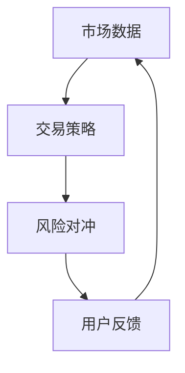
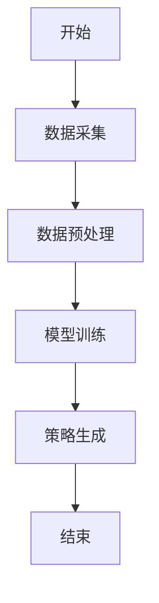
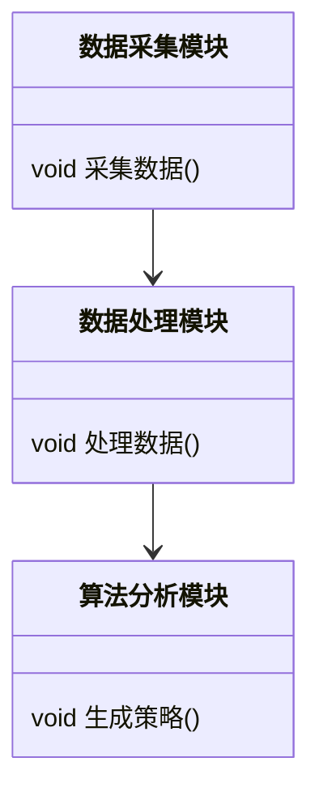
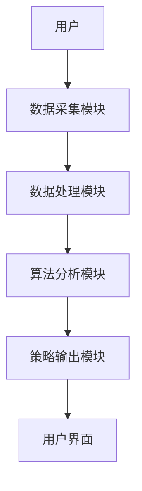

                 


# 智能外汇风险对冲策略生成器

> 关键词：智能外汇、风险对冲、算法交易、机器学习、金融系统

> 摘要：本文深入探讨智能外汇风险对冲策略生成器的原理、算法设计、系统架构及实际应用。通过理论分析与案例研究，揭示其在外汇交易中的重要作用，并展示如何利用现代技术优化风险对冲策略。

---

## 第一部分：背景介绍

### 第1章：外汇市场与风险对冲概述

#### 1.1 外汇市场的基本概念

- **1.1.1 外汇市场的定义与组成**
  外汇市场是全球最大的金融市场，24小时运行，参与者包括银行、企业和个人。主要交易货币对，如EUR/USD、GBP/USD等。

- **1.1.2 外汇交易的主要参与者**
  - 银行和金融机构：提供流动性，执行大额交易。
  - 企业：进行跨国贸易结算。
  - 投资者：通过投机或对冲进行交易。

- **1.1.3 外汇市场的运作机制**
  由做市商报价，参与者通过交易中心或电子交易平台进行交易。价格受供求关系、经济指标和地缘政治影响。

---

#### 1.2 风险对冲的必要性

- **1.2.1 风险对冲的基本概念**
  通过金融衍生品（如期货、期权）或对冲交易来降低汇率波动带来的损失。

- **1.2.2 外汇交易中的主要风险类型**
  - 汇率风险：货币贬值导致损失。
  - 利率风险：利率变动影响债券价格。
  - 信用风险：交易对手违约风险。

- **1.2.3 风险对冲的重要性与目标**
  保护资产价值，确保投资回报稳定。通过对冲，将风险降至可控水平。

---

#### 1.3 智能外汇风险对冲策略生成器的必要性

- **1.3.1 传统风险对冲方法的局限性**
  传统方法依赖人工判断，耗时且容易受主观因素影响。数据处理能力有限，难以应对高频交易需求。

- **1.3.2 智能生成器的优势与应用场景**
  利用算法和大数据分析，快速生成最优对冲策略。适用于高频交易、机构对冲和零售交易。

- **1.3.3 未来发展趋势与潜在价值**
  随着AI和机器学习的发展，智能对冲工具将更加精准和高效，成为外汇交易的核心工具。

---

## 第二部分：核心概念与联系

### 第2章：智能外汇风险对冲策略生成器的核心概念

#### 2.1 智能外汇风险对冲策略生成器的定义与原理

- **2.1.1 定义**
  利用人工智能和大数据分析，自动生成最优风险对冲策略的工具。

- **2.1.2 核心原理与机制**
  - 数据采集：获取实时市场数据和历史数据。
  - 数据分析：使用机器学习模型预测市场趋势。
  - 策略生成：根据分析结果生成对冲策略。

- **2.1.3 组成部分与功能模块**
  - 数据采集模块：收集市场数据。
  - 数据处理模块：清洗和预处理数据。
  - 算法分析模块：使用模型生成策略。
  - 输出模块：展示策略结果。

---

#### 2.2 核心概念的属性特征对比

- **2.2.1 对比表格：传统对冲方法与智能生成器的属性对比**

| 属性              | 传统方法       | 智能生成器       |
|--------------------|----------------|-----------------|
| 数据处理能力      | 有限           | 强大            |
| 策略生成速度      | 较慢           | 实时            |
| 精准度            | 低             | 高              |
| 适应性            | 低             | 高              |

- **2.2.2 关键指标分析**
  - 精准度：智能生成器通过机器学习提高预测准确性。
  - 速度：实时数据分析能力支持高频交易。

- **2.2.3 ER实体关系图架构**



---

## 第三部分：算法原理讲解

### 第3章：智能外汇风险对冲策略生成器的算法原理

#### 3.1 算法原理概述

- **3.1.1 算法的基本思路**
  使用机器学习模型分析市场数据，识别趋势和模式，生成对冲策略。

- **3.1.2 算法的核心步骤**
  1. 数据采集：获取实时和历史数据。
  2. 数据预处理：清洗和标准化数据。
  3. 模型训练：使用机器学习算法训练模型。
  4. 策略生成：根据模型预测生成对冲策略。

---

#### 3.2 算法流程图



---

#### 3.3 算法的数学模型与公式

- **3.3.1 线性回归模型**
  $$y = \beta_0 + \beta_1x + \epsilon$$
  其中，$y$ 是目标变量，$x$ 是自变量，$\beta_0$ 和 $\beta_1$ 是回归系数，$\epsilon$ 是误差项。

- **3.3.2 时间序列模型**
  $$ARIMA(p, d, q)$$
  其中，$p$ 是自回归阶数，$d$ 是差分阶数，$q$ 是移动平均阶数。

---

## 第四部分：系统分析与架构设计

### 第4章：智能外汇风险对冲策略生成器的系统分析

#### 4.1 系统功能设计

- **领域模型（mermaid类图）**



---

#### 4.2 系统架构设计

- **系统架构图**



---

## 第五部分：项目实战

### 第5章：智能外汇风险对冲策略生成器的实现与应用

#### 5.1 项目介绍

- **环境安装**
  - 安装Python、机器学习库（如scikit-learn、TensorFlow）和数据处理库（如Pandas）。

#### 5.2 核心代码实现

- **数据采集模块**
  ```python
  import pandas as pd
  import requests

  def get_data(currency_pair):
      # 示例API调用
      response = requests.get(f'https://api.example.com/exchangeRates/{currency_pair}')
      data = response.json()
      df = pd.DataFrame(data)
      return df
  ```

- **模型训练模块**
  ```python
  from sklearn.linear_model import LinearRegression

  def train_model(X, y):
      model = LinearRegression()
      model.fit(X, y)
      return model
  ```

---

## 第六部分：最佳实践

### 第6章：智能外汇风险对冲策略生成器的优化与注意事项

#### 6.1 小结

- 智能外汇风险对冲策略生成器通过算法优化和大数据分析，显著提高了风险对冲的效率和精准度。

#### 6.2 注意事项

- 数据质量：确保数据准确性和完整性。
- 模型选择：根据不同场景选择合适算法。
- 实时性：优化系统性能，确保实时响应。

#### 6.3 拓展阅读

- 《机器学习在金融中的应用》
- 《外汇交易算法解析》

---

## 作者

作者：AI天才研究院/AI Genius Institute & 禅与计算机程序设计艺术 /Zen And The Art of Computer Programming

---

通过本文，读者可以全面了解智能外汇风险对冲策略生成器的原理、实现和应用，掌握其在现代金融中的重要价值。

