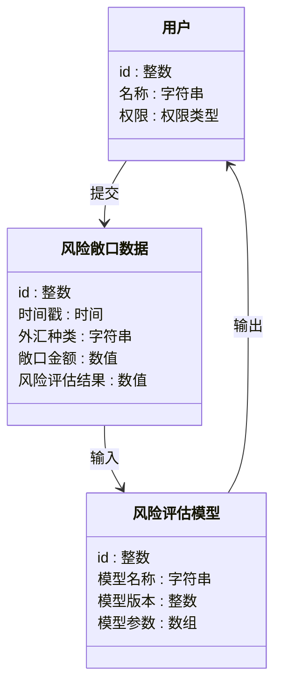

                 


# 智能外汇风险敞口管理优化系统

> 关键词：智能外汇风险管理、风险敞口优化、机器学习、实时监控、量化交易、系统架构

> 摘要：本文系统性地探讨智能外汇风险敞口管理优化系统的构建与实现。首先介绍了智能外汇风险管理的背景与必要性，详细阐述了系统的核心概念与工作原理。接着从算法原理、系统架构设计、项目实战等多个维度深入分析了系统的构建过程，并结合实际案例进行了详细解读。最后总结了系统的优化策略与未来发展方向。

---

# 第一部分: 智能外汇风险敞口管理优化系统概述

---

# 第1章: 智能外汇风险敞口管理优化系统的背景与问题

## 1.1 外汇风险敞口管理的背景介绍

### 1.1.1 外汇交易与风险的基本概念

外汇交易是指通过买卖不同货币来赚取利润的活动，而外汇风险敞口则是指在外汇交易中因汇率波动而可能遭受的损失。外汇市场是全球最大的金融市场，交易规模巨大且波动性高，使得外汇风险管理成为金融机构和企业的核心任务之一。

### 1.1.2 外汇风险敞口的定义与分类

外汇风险敞口可以分为以下几类：
- **交易风险**：因汇率波动导致的即期交易损失。
- **折算风险**：因汇率变动导致资产负债表中外币资产和负债的价值变化。
- **经济风险**：因经济基本面变化导致的长期汇率波动风险。

### 1.1.3 外汇风险管理的重要性

有效的外汇风险管理可以帮助企业规避潜在损失，确保财务稳定，并抓住市场机会。传统的外汇风险管理依赖人工操作和简单模型，难以应对复杂多变的市场环境。

## 1.2 智能外汇风险敞口管理的必要性

### 1.2.1 传统外汇风险管理的局限性

传统外汇风险管理存在以下问题：
- 数据处理能力有限，无法实时捕捉市场波动。
- 模型简单，难以应对非线性市场变化。
- 人工干预较多，响应速度慢，容易错失市场机会。

### 1.2.2 智能化管理的优势与应用场景

智能外汇风险管理通过引入机器学习、大数据分析等技术，实现了以下优势：
- 实时监控市场波动，快速响应风险变化。
- 精准预测汇率走势，优化交易策略。
- 自动化处理交易指令，减少人为错误。

### 1.2.3 全球化背景下外汇风险管理的新挑战

全球化背景下，外汇市场更加复杂，风险来源多样化。智能外汇风险管理需要应对以下挑战：
- 处理海量异构数据。
- 实现多维度风险评估与优化。
- 应对高频交易和算法交易的冲击。

## 1.3 智能外汇风险敞口管理优化系统的提出

### 1.3.1 系统的目标与核心功能

系统的目标是通过智能算法优化外汇风险敞口管理，核心功能包括：
- 实时数据采集与处理。
- 智能风险评估与预测。
- 自动化交易指令生成与优化。

### 1.3.2 系统的边界与外延

系统的边界包括：
- 数据来源：实时汇率数据、市场新闻、经济指标等。
- 用户群体：金融机构、企业财务部门、个人投资者。
- 服务范围：涵盖即期、远期、期权等多种外汇交易品种。

系统的外延包括：
- 与第三方数据源的对接。
- 与其他金融系统的集成（如ERP、交易系统）。
- 用户界面的设计与优化。

### 1.3.3 系统的核心要素与组成结构

系统的核心要素包括：
- 数据采集模块：负责实时采集外汇市场数据。
- 风险评估模块：基于机器学习算法评估风险。
- 交易优化模块：生成最优交易策略。
- 用户界面模块：提供直观的操作界面。

## 1.4 本章小结

本章介绍了智能外汇风险敞口管理优化系统的背景与必要性，指出了传统管理的局限性，并提出了系统的构建目标与核心功能。

---

# 第2章: 智能外汇风险敞口管理优化系统的核心概念与联系

## 2.1 核心概念的原理与特点

### 2.1.1 风险敞口的量化方法

风险敞口的量化方法包括：
- 历史波动率分析。
- VaR（Value at Risk）模型。
- CVaR（Conditional Value at Risk）模型。

### 2.1.2 智能算法在风险评估中的应用

智能算法包括：
- 支持向量机（SVM）用于分类预测。
- 随机森林（Random Forest）用于特征重要性分析。
- 长短期记忆网络（LSTM）用于时间序列预测。

### 2.1.3 系统的实时性与动态调整能力

系统的实时性体现在：
- 数据采集与处理的实时性。
- 风险评估的实时反馈。
- 交易策略的动态调整。

## 2.2 核心概念的属性特征对比表

| 属性 | 传统外汇风险管理 | 智能外汇风险管理 |
|------|------------------|------------------|
| 数据来源 | 静态数据         | 动态实时数据     |
| 计算方式 | 简单模型         | 复杂算法模型     |
| 响应时间 | 较慢            | 实时快速         |
| 精度 | 低               | 高               |

## 2.3 系统的ER实体关系图

```mermaid
erDiagram
    actor 用户 {
        +id : 整数
        +名称 : 字符串
        +权限 : 权限类型
    }
    actor 系统管理员 {
        +id : 整数
        +名称 : 字符串
        +权限 : 权限类型
    }
    entity 风险敞口数据 {
        +id : 整数
        +时间戳 : 时间
        +外汇种类 : 字符串
        +敞口金额 : 数值
        +风险评估结果 : 数值
    }
    entity 风险评估模型 {
        +id : 整数
        +模型名称 : 字符串
        +模型版本 : 整数
        +模型参数 : 数组
    }
    user -> 风险敞口数据 : 提交
    system_administrator -> 风险评估模型 : 管理
    风险敞口数据 --> 风险评估模型 : 输入
    风险评估模型 --> 用户 : 输出
```

---

## 2.4 本章小结

本章从核心概念的角度，详细阐述了智能外汇风险敞口管理优化系统的原理与特点，并通过对比表和ER实体关系图展示了系统的结构与组成。

---

# 第3章: 智能外汇风险敞口管理优化系统的算法原理

## 3.1 算法原理概述

智能外汇风险管理的核心算法包括：
- 时间序列预测模型（ARIMA、LSTM）。
- 机器学习算法（SVM、随机森林）。
- 风险评估算法（VaR、CVaR）。

## 3.2 基于LSTM的时间序列预测模型

### 3.2.1 LSTM算法的基本原理

LSTM（长短期记忆网络）是一种特殊的RNN（循环神经网络），通过引入记忆单元和遗忘门，可以有效捕捉时间序列中的长期依赖关系。

### 3.2.2 LSTM模型的数学表达

LSTM的核心运算包括：
- 遗忘门：$f_t = \sigma(W_f \cdot [h_{t-1}, x_t] + b_f)$
- 输入门：$i_t = \sigma(W_i \cdot [h_{t-1}, x_t] + b_i)$
- 记忆单元：$g_t = \tanh(W_g \cdot [h_{t-1}, x_t] + b_g)$
- 输出门：$o_t = \sigma(W_o \cdot [h_{t-1}, x_t] + b_o)$
- 当前状态：$s_t = f_t \cdot s_{t-1} + i_t \cdot g_t$
- 当前输出：$h_t = o_t \cdot \tanh(s_t)$

### 3.2.3 LSTM模型的实现步骤

1. 数据预处理：标准化汇率数据。
2. 构建LSTM模型：定义输入层、LSTM层、全连接层和输出层。
3. 模型训练：使用历史汇率数据进行训练。
4. 模型预测：利用训练好的模型预测未来汇率走势。

## 3.3 基于机器学习的风险评估模型

### 3.3.1 支持向量回归（SVR）算法

SVR通过构建支持向量来拟合回归函数，适用于非线性数据的预测。

### 3.3.2 随机森林算法

随机森林通过集成多个决策树模型，提高预测的准确性和鲁棒性。

## 3.4 算法的性能对比与优化

### 3.4.1 不同算法的性能对比

| 算法 | 岗位 | 准确率 | 训练时间 | 预测时间 |
|------|------|--------|----------|----------|
| LSTM | 预测未来汇率 | 高 | 较长 | 较短 |
| SVR  | 评估风险值 | 中等 | 较短 | 较短 |
| 随机森林 | 特征重要性分析 | 中等 | 较长 | 较短 |

### 3.4.2 混合算法的优化策略

通过结合多种算法的优势，可以提高系统的整体性能。例如：
- 使用LSTM预测汇率走势。
- 使用SVR评估风险值。
- 使用随机森林进行特征筛选。

## 3.5 本章小结

本章详细介绍了智能外汇风险管理优化系统的算法原理，重点分析了LSTM、SVR和随机森林等算法的实现与优化策略。

---

# 第4章: 智能外汇风险敞口管理优化系统的系统架构设计

## 4.1 系统分析与功能设计

### 4.1.1 系统的功能模块划分

系统主要功能模块包括：
- 数据采集模块：实时采集外汇市场数据。
- 数据处理模块：清洗和预处理数据。
- 风险评估模块：基于机器学习算法评估风险。
- 交易优化模块：生成最优交易策略。
- 用户界面模块：提供直观的操作界面。

### 4.1.2 系统的业务流程设计

1. 用户提交交易请求。
2. 系统采集相关市场数据。
3. 数据处理模块清洗数据。
4. 风险评估模块评估风险。
5. 交易优化模块生成交易指令。
6. 系统执行交易指令。

## 4.2 系统架构设计

### 4.2.1 领域模型设计



### 4.2.2 系统架构设计

```mermaid
client
    ↔
server
    ↔
数据库
    ↔
第三方数据源
```

### 4.2.3 接口设计与交互流程

1. 用户通过API提交交易请求。
2. 系统调用第三方数据接口获取实时汇率数据。
3. 数据处理模块清洗数据并存储到数据库。
4. 风险评估模块调用机器学习模型进行风险评估。
5. 交易优化模块根据评估结果生成交易指令。
6. 系统执行交易指令并反馈结果给用户。

## 4.3 本章小结

本章详细设计了智能外汇风险敞口管理优化系统的架构，包括功能模块划分、业务流程设计和系统架构图。

---

# 第5章: 智能外汇风险敞口管理优化系统的项目实战

## 5.1 环境安装与配置

### 5.1.1 开发环境

- 操作系统：Linux（推荐）或Windows。
- 编程语言：Python 3.8+。
- 依赖库：TensorFlow、Keras、Pandas、Scikit-learn、Flask。

### 5.1.2 数据源配置

- 数据接口：使用Yahoo Finance API获取历史汇率数据。
- 数据存储：使用MongoDB存储实时数据。

## 5.2 系统核心实现源代码

### 5.2.1 数据采集模块

```python
import requests
import pandas as pd

def get_exchange_rate_data(currencies, start_date, end_date):
    base_url = "https://query1.finance.yahoo.com/v8/finance/chart"
    data = []
    for currency in currencies:
        params = {
            "symbols": f"{currency}=X",
            "period1": start_date,
            "period2": end_date
        }
        response = requests.get(base_url, params=params)
        if response.status_code == 200:
            data.append(response.json())
    return data
```

### 5.2.2 风险评估模块

```python
from sklearn.ensemble import RandomForestRegressor

def risk_assessment_model(features):
    model = RandomForestRegressor(n_estimators=100, random_state=42)
    model.fit(features_train, labels_train)
    return model.predict(features_test)
```

### 5.2.3 交易优化模块

```python
from tensorflow.keras.models import Sequential
from tensorflow.keras.layers import LSTM, Dense

def lstm_model(input_shape):
    model = Sequential()
    model.add(LSTM(64, return_sequences=True, input_shape=input_shape))
    model.add(LSTM(32, return_sequences=False))
    model.add(Dense(1))
    model.compile(loss='mean_squared_error', optimizer='adam')
    return model
```

## 5.3 案例分析与实际应用

### 5.3.1 数据采集与预处理

假设我们使用美元/欧元（EUR/USD）的汇率数据，通过Yahoo Finance API获取过去一年的汇率数据，并将其存储到数据库中。

### 5.3.2 模型训练与评估

使用过去一年的数据训练LSTM模型，评估模型的预测准确率。

### 5.3.3 系统运行与反馈

系统实时监控市场波动，根据模型预测结果优化交易策略，并将结果反馈给用户。

## 5.4 本章小结

本章通过实际案例展示了智能外汇风险敞口管理优化系统的实现过程，包括环境配置、代码实现和案例分析。

---

# 第6章: 智能外汇风险敞口管理优化系统的最佳实践

## 6.1 小结

智能外汇风险敞口管理优化系统的成功实施需要以下关键点：
- 数据的实时性和准确性。
- 算法的选型与优化。
- 系统架构的合理设计。

## 6.2 注意事项

1. 数据隐私与安全问题需要高度重视。
2. 算法的可解释性需要加强。
3. 系统的稳定性与容错性需要充分考虑。

## 6.3 拓展阅读

1. 《机器学习实战》：学习机器学习算法的实现与优化。
2. 《时间序列分析》：深入理解LSTM等时间序列预测模型。
3. 《系统架构设计》：掌握系统的整体架构设计方法。

---

# 第7章: 智能外汇风险敞口管理优化系统的未来发展

## 7.1 未来发展方向

1. 引入更复杂的算法，如图神经网络（Graph Neural Network）。
2. 实现多市场的联动预测。
3. 推动系统向边缘计算方向发展，提高响应速度。

## 7.2 技术趋势

- 人工智能技术的进一步发展。
- 大数据分析技术的深化应用。
- 区块链技术在金融领域的应用。

---

# 作者：AI天才研究院/AI Genius Institute & 禅与计算机程序设计艺术 /Zen And The Art of Computer Programming

---

本文系统性地探讨了智能外汇风险敞口管理优化系统的构建与实现，从背景、算法、系统架构到项目实战，全面分析了系统的各个方面。未来，随着人工智能和大数据技术的不断发展，智能外汇风险管理将更加精准和高效。

