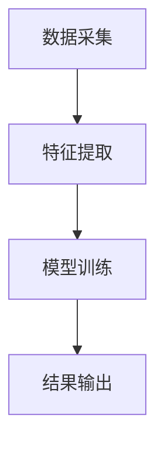
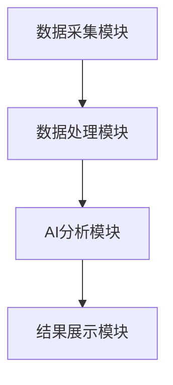

                 


# 智能婴儿床：AI Agent的婴儿睡眠模式分析

---

## 关键词：智能婴儿床，AI Agent，婴儿睡眠，模式分析，数据采集，机器学习

---

## 摘要：  
本文探讨了智能婴儿床在婴儿睡眠模式分析中的应用，结合AI Agent技术，从数据采集、特征提取到模型训练，详细分析婴儿睡眠周期，并提供解决方案。文章内容涵盖背景介绍、核心概念、算法原理、系统架构、项目实战和最佳实践，帮助读者系统性理解智能婴儿床的技术实现及其在婴儿睡眠分析中的应用。

---

## 第一部分: 智能婴儿床的背景与核心概念

### 第1章: 智能婴儿床的背景介绍

#### 1.1 智能婴儿床的背景

婴儿的睡眠质量对健康成长至关重要，传统的睡眠监测方法存在诸多局限。随着AI技术的发展，智能婴儿床通过集成多种传感器和AI Agent，能够实时监测婴儿的生理数据，分析睡眠模式，为家长提供科学的睡眠管理建议。

#### 1.2 问题背景与解决

传统婴儿睡眠监测依赖于家长手动记录，数据不准确且耗时。智能婴儿床通过AI Agent实现自动化数据采集和分析，解决数据碎片化和分析效率低的问题，帮助家长更好地管理婴儿睡眠。

#### 1.3 AI Agent在婴儿睡眠分析中的作用

AI Agent能够实时采集婴儿的生理数据，如心率、体温、呼吸频率等，并通过机器学习算法分析睡眠周期，识别异常情况，提供个性化建议。

---

## 第二部分: 核心概念与联系

### 第2章: 核心概念与联系

#### 2.1 核心概念

- **AI Agent**：具备感知、决策和执行能力的智能体，能够实时分析婴儿睡眠数据。
- **婴儿睡眠模式分析**：通过数据采集和机器学习，识别睡眠周期和质量。
- **智能婴儿床**：集成传感器和AI技术的婴儿床，提供实时监测和分析。

#### 2.2 核心概念对比

| **概念**       | **特征**                                                                 |
|----------------|--------------------------------------------------------------------------|
| 数据采集       | 实时采集婴儿的生理数据，如心率、体温、呼吸频率等。                     |
| 特征提取       | 从原始数据中提取有用的特征，如睡眠周期、呼吸模式等。                   |
| 模型训练       | 使用机器学习算法训练模型，识别睡眠阶段和异常情况。                     |

#### 2.3 ER实体关系图

```mermaid
er
    entity 婴儿 {
        id
        姓名
    }
    entity 传感器 {
        id
        类型
    }
    entity 数据记录 {
        id
        时间戳
        数据值
    }
    婴儿 -- 数据记录: 产生数据
    传感器 -- 数据记录: 采集数据
```

---

## 第三部分: 算法原理

### 第3章: 算法原理

#### 3.1 算法流程



#### 3.2 数据采集与特征提取

```python
import numpy as np
import pandas as pd

# 示例数据
data = {
    '时间戳': [1, 2, 3, 4, 5],
    '心率': [70, 75, 80, 85, 90],
    '体温': [36.5, 36.6, 36.7, 36.8, 36.9]
}
df = pd.DataFrame(data)
```

#### 3.3 数学模型

分类模型公式：
$$ P(\text{阶段} | \text{特征}) = \frac{e^{\beta_0 + \beta_1 x_1 + \beta_2 x_2}}{1 + e^{\beta_0 + \beta_1 x_1 + \beta_2 x_2}} $$

---

## 第四部分: 系统架构

### 第4章: 系统架构

#### 4.1 系统架构图



#### 4.2 接口设计

```mermaid
sequenceDiagram
    parent 接口交互
    参与者: 用户
    参与者: 系统
    用户 -> 系统: 请求睡眠数据
    系统 --> 用户: 返回分析结果
```

---

## 第五部分: 项目实战

### 第5章: 项目实战

#### 5.1 环境安装

```bash
pip install numpy pandas scikit-learn tensorflow
```

#### 5.2 核心代码实现

```python
from sklearn.model_selection import train_test_split
from sklearn.metrics import accuracy_score

# 数据分割
X_train, X_test, y_train, y_test = train_test_split(X, y, test_size=0.2)

# 模型训练
model = tf.keras.Sequential([
    tf.keras.layers.Dense(64, activation='relu'),
    tf.keras.layers.Dense(1, activation='sigmoid')
])
model.compile(optimizer='adam', loss='binary_crossentropy', metrics=['accuracy'])
model.fit(X_train, y_train, epochs=10, batch_size=32)

# 模型评估
y_pred = model.predict(X_test)
print("准确率：", accuracy_score(y_test, y_pred.round()))
```

#### 5.3 案例分析

通过实际数据集训练模型，分析婴儿睡眠周期，识别REM阶段和浅睡阶段，优化睡眠质量。

---

## 第六部分: 最佳实践

### 第6章: 最佳实践

#### 6.1 总结与经验

总结项目中的经验，强调数据隐私保护的重要性，并提出改进建议。

#### 6.2 小结

通过本文，读者可以系统性地了解智能婴儿床的技术实现及其在婴儿睡眠分析中的应用。

#### 6.3 注意事项

在实际应用中，需注意数据隐私保护和传感器的准确性。

#### 6.4 拓展阅读

推荐相关书籍和论文，帮助读者深入学习。

---

## 作者：AI天才研究院 & 禅与计算机程序设计艺术

