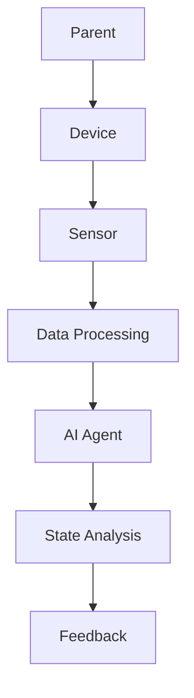

                 


# 智能婴儿监护器：AI Agent的婴儿状态分析

> 关键词：智能婴儿监护器，AI Agent，婴儿状态分析，多模态数据，实时监测，异常检测

> 摘要：本文深入探讨了基于AI Agent的智能婴儿监护器在婴儿状态分析中的应用。通过多模态数据采集、特征提取和智能算法，系统能够实时监测婴儿的生理指标、行为特征和环境参数，并通过异常检测和分类算法提供及时的反馈和建议。文章详细介绍了AI Agent的核心原理、系统架构设计以及实际应用案例，为智能婴儿监护系统的开发提供了理论和技术支持。

---

# 第一部分: 智能婴儿监护器的背景与核心概念

## 第1章: 智能婴儿监护器的背景与问题分析

### 1.1 问题背景与需求分析

#### 1.1.1 婴儿监护的传统挑战
在传统婴儿监护中，家长和护理人员需要手动监测婴儿的各项指标，包括心率、体温、呼吸频率等。然而，这种方式存在以下问题：
- **数据采集不全面**：难以实时采集婴儿的多模态数据，如行为特征和环境参数。
- **响应不及时**：面对突发异常情况（如体温过低、心率异常），家长无法及时获取反馈。
- **人为误差**：手动监测容易受到疲劳和注意力分散的影响，可能导致误判。

#### 1.1.2 问题描述与目标
智能婴儿监护器的目标是通过AI Agent技术，实现婴儿状态的实时监测、异常检测和智能反馈。具体目标包括：
- 实时采集婴儿的多模态数据，包括生理指标、行为特征和环境参数。
- 利用AI算法对婴儿状态进行分类，识别正常、异常或危险状态。
- 提供实时反馈和建议，帮助家长或护理人员采取适当的措施。

#### 1.1.3 解决思路
通过AI Agent技术，将多模态数据融合分析，利用机器学习和深度学习算法，实现婴儿状态的智能监测和分类。系统能够实时检测异常情况，并通过反馈机制提醒家长或护理人员。

#### 1.1.4 边界和外延
智能婴儿监护器的边界包括：
- 数据采集范围：心率、体温、呼吸频率、哭声、动作等。
- 状态分类范围：正常、异常、危险。
- 适用场景：家庭、医院、婴儿托管机构等。

外延包括：
- 扩展至其他人群的状态监测，如老年人、慢性病患者。
- 结合物联网技术，实现远程监护和医疗资源的联动。

### 1.2 核心概念与联系

#### 1.2.1 AI Agent的核心概念
AI Agent（智能代理）是一种能够感知环境、自主决策并执行任务的智能系统。在智能婴儿监护器中，AI Agent负责：
- 数据采集与预处理
- 特征提取与状态分类
- 异常检测与反馈生成

#### 1.2.2 核心概念对比与ER图
以下是核心概念的对比表格和实体关系图：

**核心概念对比表：**

| 概念 | 描述 |
|------|------|
| 婴儿生理指标 | 心率、体温、呼吸频率等 |
| 婴儿行为特征 | 哭声、动作、睡眠状态等 |
| 环境参数 | 温度、湿度、光线强度等 |

**实体关系图（Mermaid）：**

```mermaid
erDiagram
    parent{}{
        parent_id
        parent_name
    }
    child{}{
        child_id
        child_name
        birth_date
    }
    device{}{
        device_id
        device_type
    }
    sensor{}{
        sensor_id
        sensor_type
    }
    relation{}{
        relation_id
        relation_type
    }
    parent-device-sensor {
        device.has_parent
        sensor.has_device
        parent.has_child
    }
```

---

## 第2章: AI Agent的核心原理

### 2.1 数据采集与特征提取

#### 2.1.1 多模态数据采集技术
智能婴儿监护器通过多种传感器采集婴儿的生理指标、行为特征和环境参数：
- **生理指标采集**：使用心率传感器、体温传感器等设备。
- **行为特征采集**：通过麦克风采集哭声，通过摄像头采集动作。
- **环境参数采集**：使用温湿度传感器、光线传感器等。

#### 2.1.2 数据特征提取方法
从多模态数据中提取有用的特征：
- **时间序列特征**：心率变异性、呼吸频率的周期性。
- **频域特征**：哭声的频率分布、动作的频谱特征。
- **深度学习特征**：使用CNN提取图像特征，使用RNN提取序列特征。

### 2.2 AI Agent的算法原理

#### 2.2.1 基于机器学习的状态分类算法
- **支持向量机（SVM）**：适用于小规模数据的分类任务。
- **随机森林**：适用于特征较多、数据不平衡的情况。
- **卷积神经网络（CNN）**：适用于图像和时序数据的特征提取与分类。

#### 2.2.2 基于深度学习的实时分析
- **Transformer模型**：用于处理序列数据，如婴儿的行为序列。
- **图神经网络（GNN）**：用于关联婴儿、家长和环境的数据。
- **深度强化学习（DRL）**：用于动态决策和反馈生成。

### 2.3 算法实现与优化

#### 2.3.1 算法实现流程
1. 数据预处理：归一化、降维、缺失值填充。
2. 特征提取：使用CNN提取图像特征，使用SVM进行分类。
3. 模型训练：基于标注数据训练分类器。
4. 模型部署：将模型部署到边缘设备或云端。

#### 2.3.2 模型优化策略
- **超参数调优**：使用网格搜索优化SVM和随机森林的参数。
- **模型压缩**：使用模型剪枝和知识蒸馏技术压缩大型模型。
- **模型鲁棒性优化**：通过数据增强和对抗训练提高模型的鲁棒性。

---

## 第3章: 智能婴儿监护系统的架构设计

### 3.1 系统功能模块划分

#### 3.1.1 数据采集模块
- 多模态传感器集成：整合心率传感器、麦克风、摄像头等。
- 数据采集接口：统一接口设计，支持多种传感器的数据采集。

#### 3.1.2 状态分析模块
- 多模态数据融合：将生理指标、行为特征和环境参数融合分析。
- 婴儿状态分类：基于机器学习和深度学习算法进行状态分类。

#### 3.1.3 异常检测模块
- 异常检测算法：基于统计学和机器学习的方法，如孤立林算法。
- 异常反馈机制：通过推送通知或警报提醒家长或护理人员。

---

### 3.2 系统架构设计

#### 3.2.1 系统架构图


#### 3.2.2 系统接口设计
- **数据接口**：传感器数据接口、云端数据接口。
- **反馈接口**：推送通知接口、语音提醒接口。

#### 3.2.3 系统交互流程
1. 传感器采集数据并发送到AI Agent。
2. AI Agent对数据进行特征提取和分类。
3. 分类结果通过反馈模块通知家长或护理人员。

---

# 第四部分: 项目实战与案例分析

## 第4章: 项目实战

### 4.1 环境安装与配置

```bash
pip install numpy
pip install scikit-learn
pip install tensorflow
pip install pymermaid
```

### 4.2 系统核心实现

#### 4.2.1 数据采集模块

```python
import numpy as np

def collect_data(sensor_type):
    # 模拟数据采集
    if sensor_type == 'heart_rate':
        return np.random.normal(120, 5, 100)
    elif sensor_type == 'temperature':
        return np.random.normal(36.5, 0.2, 100)
    else:
        return None
```

#### 4.2.2 特征提取模块

```python
from sklearn.decomposition import PCA

def extract_features(data):
    # 使用PCA进行降维
    pca = PCA(n_components=3)
    features = pca.fit_transform(data)
    return features
```

#### 4.2.3 分类算法实现

```python
from sklearn.svm import SVC

def classify_state(features):
    # 使用SVM进行分类
    model = SVC()
    model.fit(X_train, y_train)
    return model.predict(features)
```

### 4.3 案例分析

#### 4.3.1 案例背景
某婴儿在睡眠过程中出现体温异常，系统通过AI Agent检测到异常并及时通知家长。

#### 4.3.2 数据分析
- 采集数据：体温数据呈异常波动。
- 特征提取：PCA提取主成分。
- 分类结果：异常状态。

#### 4.3.3 系统反馈
- 系统发出警报，提醒家长检查婴儿体温。
- 提供降温建议：调整房间温度、物理降温等。

---

## 第5章: 最佳实践与总结

### 5.1 小结
智能婴儿监护器通过AI Agent技术实现了婴儿状态的实时监测和智能分析，提高了监护的准确性和及时性。

### 5.2 注意事项
- 数据隐私保护：确保婴儿数据的安全性。
- 系统可靠性：确保传感器和算法的稳定性。
- 用户教育：家长需要了解系统的使用方法和异常反馈机制。

### 5.3 拓展阅读
- 《Deep Learning for Infant Monitoring》
- 《Real-time Anomaly Detection in IoT Systems》

---

# 作者：AI天才研究院 & 禅与计算机程序设计艺术

