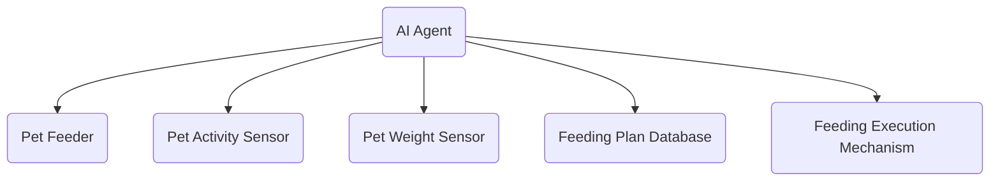
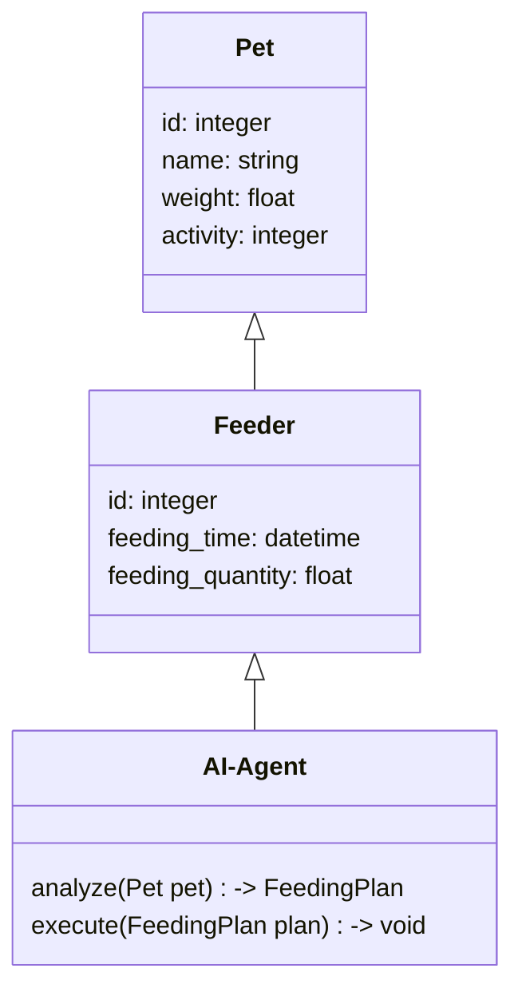
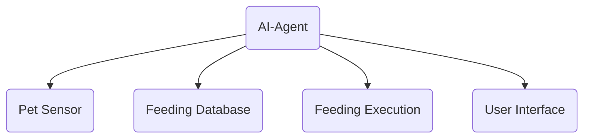
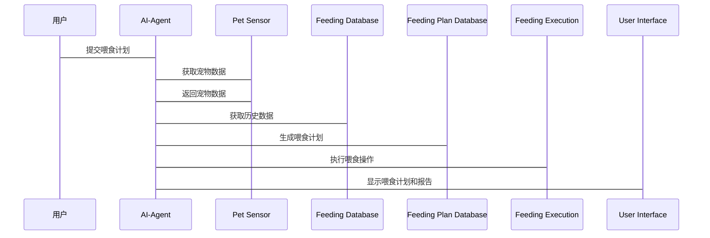

                 


# 智能宠物喂食器：AI Agent的宠物饮食管理

> 关键词：智能宠物喂食器，AI Agent，物联网，宠物健康管理，智能设备

> 摘要：本文探讨了智能宠物喂食器在AI Agent技术下的宠物饮食管理应用，详细分析了AI Agent在宠物喂食管理中的原理、算法、系统架构及实现方案。通过实际案例分析，展示了如何利用AI Agent实现智能化、个性化的宠物喂食管理，并提出了系统设计的最佳实践和未来发展方向。

---

# 第一章: 智能宠物喂食器概述

## 1.1 智能宠物喂食器的背景与意义

### 1.1.1 传统宠物喂食器的局限性

传统宠物喂食器通常基于简单的定时器或手动操作，存在以下问题：

- **喂食时间固定**：无法根据宠物的活动量、健康状况动态调整喂食量。
- **缺乏数据支持**：无法记录宠物的饮食习惯、体重变化等数据，难以提供科学的喂食建议。
- **功能单一**：无法与其他智能设备联动，无法实现远程控制。

### 1.1.2 AI Agent在宠物喂食管理中的作用

AI Agent（人工智能代理）是一种能够感知环境、自主决策、执行任务的智能实体。在宠物喂食管理中，AI Agent可以实现以下功能：

- **智能感知**：通过传感器获取宠物的活动数据、体重变化等信息。
- **数据分析**：基于历史数据和当前数据，分析宠物的健康状况和饮食需求。
- **自主决策**：根据分析结果，动态调整喂食计划。
- **远程控制**：通过物联网技术实现远程喂食操作。

### 1.1.3 智能宠物喂食器的市场前景与用户需求

随着宠物经济的兴起和人们对宠物健康的关注增加，智能宠物喂食器市场潜力巨大。用户需求主要集中在以下方面：

- **智能化**：用户希望喂食器能够自动调整喂食量和时间。
- **数据化**：用户希望获取宠物的饮食数据和健康报告。
- **远程控制**：用户希望可以通过手机APP远程操作喂食器。

## 1.2 智能宠物喂食器的核心概念与组成

### 1.2.1 宠物喂食管理系统的组成

智能宠物喂食器系统通常由以下部分组成：

- **传感器**：用于采集宠物的活动数据、体重等信息。
- **AI算法**：用于分析数据并生成喂食建议。
- **执行机构**：负责实际的喂食操作，如打开食盆、投喂食物。
- **物联网通信模块**：用于远程控制和数据传输。

### 1.2.2 AI Agent在宠物喂食管理中的核心作用

AI Agent在宠物喂食管理中扮演着“智能大脑”的角色，负责以下任务：

- **数据采集**：通过传感器获取宠物的活动数据和健康指标。
- **数据处理**：分析宠物的饮食需求和健康状况。
- **决策制定**：根据分析结果，生成喂食计划。
- **执行控制**：通过执行机构实现喂食操作。

### 1.2.3 系统的边界与外延

智能宠物喂食器系统的边界包括：

- **输入边界**：宠物的活动数据、用户输入的喂食计划。
- **输出边界**：喂食操作、健康报告。

系统的外延包括与智能音箱、智能门禁等其他智能家居设备的联动。

---

# 第二章: AI Agent的核心概念与原理

## 2.1 AI Agent的原理与实现

### 2.1.1 AI Agent的定义与分类

AI Agent是一种能够感知环境、自主决策、执行任务的智能实体。根据实现方式，AI Agent可以分为以下两类：

- **基于规则的AI Agent**：通过预定义的规则进行决策，适用于任务简单、环境确定的场景。
- **基于模型的AI Agent**：通过构建环境模型进行推理和决策，适用于任务复杂、环境不确定的场景。

### 2.1.2 基于规则的AI Agent与基于模型的AI Agent对比

| 属性 | 基于规则的AI Agent | 基于模型的AI Agent |
|------|------------------|------------------|
| 决策方式 | 预定义规则       | 动态模型推理     |
| 灵活性 | 低               | 高               |
| 复杂性 | 低               | 高               |

### 2.1.3 AI Agent的实体关系图



---

## 2.2 AI Agent的数学模型与公式

### 2.2.1 基于规则的AI Agent决策模型

基于规则的AI Agent通过预定义的规则进行决策，例如：

$$
\text{if } (\text{时间} = \text{早餐时间}) \rightarrow \text{执行喂食操作}
$$

### 2.2.2 基于模型的AI Agent决策模型

基于模型的AI Agent通过构建环境模型进行推理，例如：

$$
\text{if } (\text{宠物活动量} > \text{阈值}) \rightarrow \text{减少喂食量}
$$

---

# 第三章: 系统分析与架构设计

## 3.1 系统功能设计

### 3.1.1 领域模型



### 3.1.2 系统架构设计



### 3.1.3 接口设计

系统主要接口包括：

- **传感器接口**：用于获取宠物的活动数据和体重数据。
- **数据库接口**：用于存储喂食计划和历史数据。
- **用户接口**：用于显示喂食计划和健康报告。

### 3.1.4 系统交互流程图



---

# 第四章: 项目实战

## 4.1 环境安装与配置

### 4.1.1 安装Python与相关库

```bash
pip install numpy
pip install pandas
pip install matplotlib
pip install scikit-learn
```

### 4.1.2 安装物联网通信模块

```bash
pip install pyserial
pip install paho-mqtt
```

## 4.2 系统核心实现

### 4.2.1 AI Agent的核心代码

```python
class AI-Agent:
    def __init__(self, sensor, database, execution):
        self.sensor = sensor
        self.database = database
        self.execution = execution

    def analyze(self, pet_id):
        # 获取宠物数据
        pet = self.sensor.get_pet_data(pet_id)
        # 获取历史数据
        history = self.database.get_feeding_history(pet_id)
        # 生成喂食计划
        plan = self._generate_feeding_plan(pet, history)
        return plan

    def _generate_feeding_plan(self, pet, history):
        # 简单实现：根据宠物活动量调整喂食量
        if pet.activity > 100:
            return {'feeding_time': datetime.now(), 'feeding_quantity': 50}
        else:
            return {'feeding_time': datetime.now(), 'feeding_quantity': 30}
```

### 4.2.2 系统流程图


### 4.2.3 算法实现与优化

通过机器学习算法（如随机森林、支持向量机）优化喂食计划的生成，例如：

$$
\text{预测喂食量} = \alpha \times \text{活动量} + \beta \times \text{体重} + \gamma \times \text{时间}
$$

其中，$\alpha$、$\beta$、$\gamma$是通过训练得到的系数。

---

# 第五章: 最佳实践与小结

## 5.1 设计注意事项

- **数据隐私**：确保宠物数据的安全性，避免被恶意利用。
- **系统稳定性**：确保系统在断网或传感器故障时仍能正常运行。
- **用户体验**：设计简洁直观的用户界面，方便用户操作和查看报告。

## 5.2 未来扩展方向

- **多宠物支持**：支持多个宠物的喂食管理。
- **健康监测**：集成更多传感器，监测宠物的健康指标（如体温、心率）。
- **远程医疗**：与宠物医院联动，提供远程医疗建议。

---

# 作者：AI天才研究院/AI Genius Institute & 禅与计算机程序设计艺术 /Zen And The Art of Computer Programming

