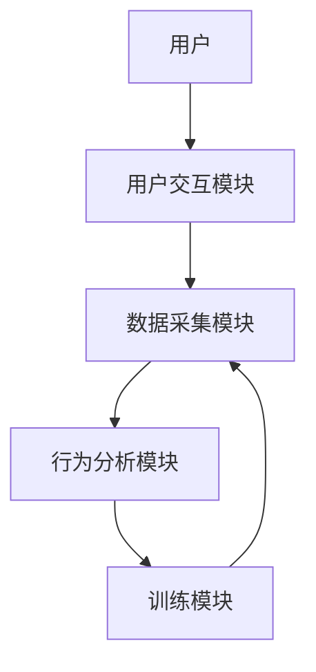
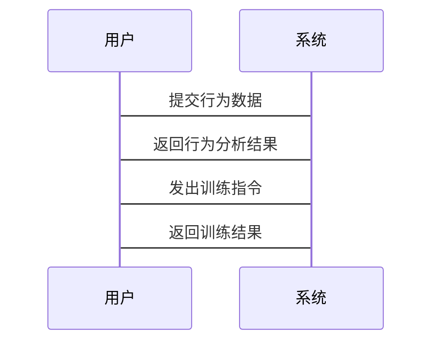

                 


# 智能宠物屋：AI Agent的宠物行为分析与训练

> 关键词：智能宠物屋，AI Agent，宠物行为分析，机器学习，深度学习，强化学习

> 摘要：本文详细探讨了AI Agent在智能宠物屋中的应用，分析宠物行为并进行训练。文章从背景介绍、核心概念、算法原理、系统架构、项目实战等多个方面展开，结合实际案例，深入解析了如何利用AI技术实现智能宠物行为管理。

---

## 第一部分: 背景介绍

### 第1章: AI Agent与智能宠物屋的背景

#### 1.1 AI Agent的基本概念
- **定义**：AI Agent（智能代理）是指能够感知环境、做出决策并执行动作的智能系统。  
- **特点**：自主性、反应性、目标导向、社交能力。  
- **应用领域**：智能家居、自动驾驶、机器人、宠物行为管理等。

#### 1.2 智能宠物屋的背景与意义
- **背景**：随着宠物数量的增加，宠物行为管理的需求日益增长。传统方法依赖人工观察，效率低且主观性强。  
- **意义**：AI Agent通过自动化分析和训练，提高宠物行为管理的效率和科学性。  
- **目标**：构建一个基于AI的智能宠物屋，实现对宠物行为的实时分析和智能训练。

#### 1.3 AI Agent在宠物行为分析中的应用前景
- **数据驱动**：通过传感器和摄像头采集宠物行为数据，利用AI技术进行分析。  
- **实时反馈**：AI Agent能够实时识别宠物行为并给出反馈，帮助宠物养成良好习惯。  
- **个性化训练**：根据宠物的个性和行为特点，定制专属的训练计划。

---

## 第二部分: AI Agent的核心概念与原理

### 第2章: AI Agent的核心概念

#### 2.1 AI Agent的核心组成
- **感知模块**：通过摄像头、麦克风等设备采集宠物的行为数据。  
- **决策模块**：基于感知数据，利用机器学习算法做出决策。  
- **执行模块**：根据决策结果，通过智能设备（如喂食器、玩具）执行操作。

#### 2.2 宠物行为分析的关键术语
| 关键术语 | 定义 |
|----------|------|
| 行为数据 | 宠物的动作、声音、位置等信息 |
| 特征提取 | 从行为数据中提取有用的特征 |
| 行为分类 | 根据特征对宠物行为进行分类 |
| 强化学习 | 基于奖励机制训练宠物行为 |

#### 2.3 ER实体关系图
```mermaid
er
  entity 宠物 {
    key: 宠物ID
    attributes: 名字, 类型, 年龄
  }
  entity 行为数据 {
    key: 数据ID
    attributes: 时间戳, 行为类型, 特征向量
  }
  entity AI Agent {
    key: AgentID
    attributes: 状态, 决策规则
  }
  relationship R1: 宠物 -> 行为数据
  relationship R2: AI Agent -> 行为数据
```

---

### 第3章: AI Agent的核心原理

#### 3.1 感知模块的工作原理
- **数据采集**：通过摄像头、麦克风等设备采集宠物的行为数据。  
- **数据预处理**：对采集的数据进行清洗、归一化处理。  
- **特征提取**：使用深度学习模型（如CNN、RNN）提取行为特征。

#### 3.2 决策模块的算法选择
- **传统机器学习**：如支持向量机（SVM）、随机森林（Random Forest）用于分类任务。  
- **深度学习**：如卷积神经网络（CNN）用于图像分类，循环神经网络（RNN）用于序列数据处理。  
- **强化学习**：如Q-learning用于训练宠物行为的奖励机制。

#### 3.3 执行模块的实现
- **动作执行**：根据决策结果，驱动智能设备（如喂食器、玩具）执行相应动作。  
- **反馈机制**：收集宠物的反馈，优化AI Agent的决策模型。

---

## 第三部分: 算法原理与实现

### 第4章: 数据采集与特征提取

#### 4.1 数据采集方法
- **图像采集**：使用摄像头采集宠物的图像数据。  
- **声音采集**：使用麦克风采集宠物的声音数据。  
- **传感器采集**：使用加速度传感器采集宠物的运动数据。

#### 4.2 特征提取算法
- **图像特征提取**：使用预训练的深度学习模型（如ResNet、VGG）提取图像特征。  
- **声音特征提取**：使用梅尔频谱、MFCC等方法提取声音特征。  
- **传感器特征提取**：对运动数据进行时间序列分析，提取特征向量。

#### 4.3 基于深度学习的特征提取
- **模型选择**：使用预训练的ResNet-50模型提取图像特征。  
- **代码实现**：
  ```python
  import torch
  from torchvision import models, transforms

  # 加载预训练模型
  model = models.resnet50(pretrained=True)
  # 定义数据变换
  transform = transforms.Compose([
      transforms.Resize(256),
      transforms.ToTensor(),
      transforms.Normalize(mean=[0.485, 0.456, 0.406], std=[0.229, 0.224, 0.225])
  ])
  # 提取特征
  def extract_feature(img_path):
      img = Image.open(img_path)
      img_tensor = transform(img)
      with torch.no_grad():
          feature = model(img_tensor.unsqueeze(0)).numpy()
      return feature
  ```

---

### 第5章: 行为识别与分类

#### 5.1 基于传统机器学习的行为分类
- **算法选择**：支持向量机（SVM）和随机森林（Random Forest）。  
- **流程**：
  1. 数据预处理与特征提取。  
  2. 数据分割：训练集、验证集、测试集。  
  3. 模型训练与调参。  
  4. 模型评估：准确率、召回率、F1分数。  

#### 5.2 基于深度学习的行为识别
- **模型选择**：使用预训练的ResNet、Inception等模型进行微调。  
- **流程**：
  1. 数据增强与扩展。  
  2. 模型微调：冻结预训练模型的参数，只训练最后一层。  
  3. 模型评估与优化。  

#### 5.3 基于强化学习的训练方法
- **算法选择**：Q-learning和深度强化学习（DQN）。  
- **流程**：
  1. 状态定义：宠物行为的当前状态。  
  2. 动作选择：AI Agent选择的动作（如奖励、惩罚）。  
  3. 奖励机制：根据宠物行为的结果给予奖励或惩罚。  
  4. 模型更新：根据奖励更新Q值表或神经网络参数。  

---

## 第四部分: 系统架构与设计

### 第6章: 系统功能设计

#### 6.1 功能模块划分
| 模块名称 | 功能描述 |
|----------|----------|
| 数据采集模块 | 采集宠物的行为数据 |
| 行为分析模块 | 对行为数据进行分类和识别 |
| 训练模块 | 基于强化学习训练宠物行为 |
| 用户交互模块 | 提供用户界面与AI Agent交互 |

#### 6.2 系统架构设计


---

### 第7章: 系统接口与交互设计

#### 7.1 系统接口设计
- **数据接口**：定义API接口，实现数据的上传和下载。  
- **行为分析接口**：提供API用于调用行为分析功能。  
- **用户交互接口**：设计友好的用户界面，方便用户与系统交互。  

#### 7.2 交互流程设计


---

## 第五部分: 项目实战与案例分析

### 第8章: 环境搭建与代码实现

#### 8.1 环境安装
- **Python环境**：建议使用Anaconda。  
- **依赖库安装**：`pip install torch torchvision numpy scikit-learn`  

#### 8.2 核心代码实现
- **数据采集模块**：使用OpenCV和PyAudio实现图像和声音采集。  
- **行为分析模块**：基于预训练模型进行行为分类。  
- **训练模块**：实现强化学习算法，训练宠物行为。  

#### 8.3 实际案例分析
- **案例1**：训练宠物定点如厕。  
- **案例2**：训练宠物定点进食。  

---

## 第六部分: 总结与展望

### 第9章: 总结

#### 9.1 最佳实践
- **数据质量**：确保数据的多样性和代表性。  
- **模型选择**：根据任务需求选择合适的算法。  
- **系统优化**：注重系统的可扩展性和可维护性。  

#### 9.2 小结
本文详细介绍了AI Agent在智能宠物屋中的应用，从理论到实践，全面解析了宠物行为分析与训练的过程。通过实际案例分析，展示了AI技术在宠物行为管理中的巨大潜力。

#### 9.3 注意事项
- **数据隐私**：确保宠物数据的安全性。  
- **伦理问题**：在训练过程中避免对宠物造成不适。  

#### 9.4 拓展阅读
- 推荐阅读《深度学习》（Deep Learning, Ian Goodfellow等著）和《强化学习》（Reinforcement Learning, Richard S. Sutton等著）。

---

## 作者：AI天才研究院 & 禅与计算机程序设计艺术

本文由AI天才研究院（AI Genius Institute）与“禅与计算机程序设计艺术”（Zen And The Art of Computer Programming）联合出品。我们致力于探索人工智能与计算机科学的前沿技术，并通过技术博客的形式与全球读者分享知识与经验。

