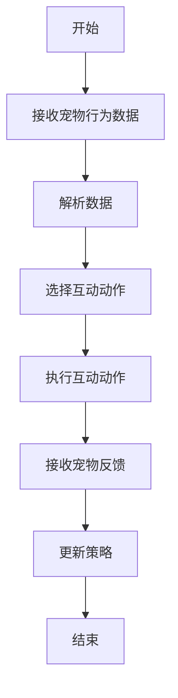
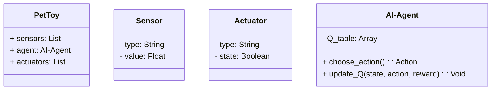
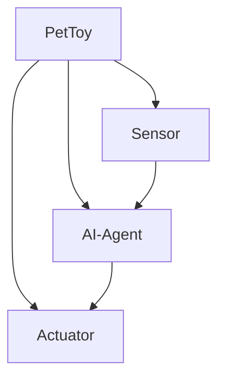
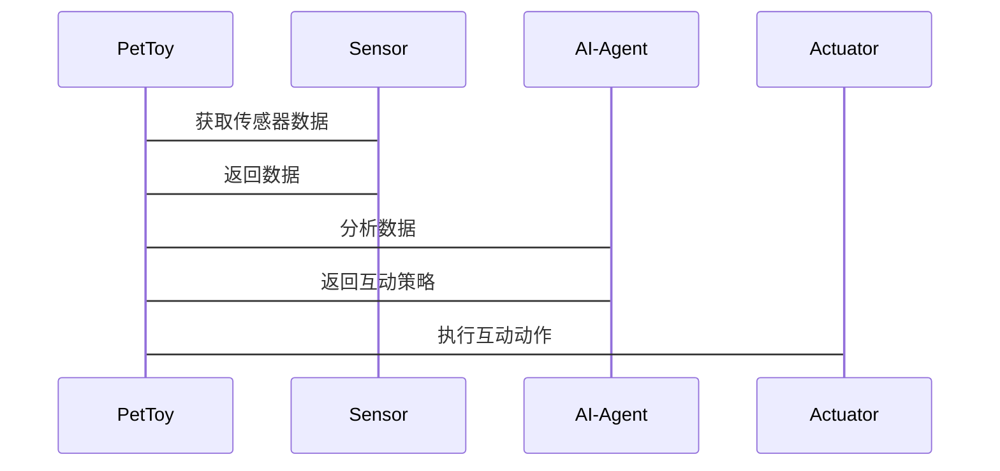

                 


# 智能宠物玩具：AI Agent的互动模式自适应

## 关键词：智能宠物玩具，AI Agent，互动模式，自适应，强化学习

## 摘要：本文深入探讨了AI Agent在智能宠物玩具中的应用，重点分析了互动模式的自适应机制。通过强化学习算法，AI Agent能够根据宠物的行为和偏好实时调整互动策略，从而提升用户体验。文章从背景、概念、算法、系统架构到项目实战，全面解析了智能宠物玩具的实现过程，为开发者和用户提供深刻的洞察。

---

# 第一部分: 智能宠物玩具与AI Agent概述

## 第1章: 智能宠物玩具与AI Agent的背景介绍

### 1.1 问题背景与描述
#### 1.1.1 智能宠物玩具的发展现状
随着科技的进步，宠物玩具逐渐从简单的机械装置向智能化方向发展。现代宠物主人对互动性和个性化的需求日益增加，传统宠物玩具的功能单一，无法满足现代宠物的需求。智能宠物玩具的出现，为宠物提供了更丰富、更有趣的互动体验。

#### 1.1.2 用户需求与痛点分析
宠物主人希望宠物玩具能够提供持续的互动，同时能够根据宠物的行为和情绪调整互动方式。然而，传统宠物玩具无法感知宠物的行为，也无法做出相应的反馈。这导致宠物在互动过程中容易感到无聊，影响用户体验。

#### 1.1.3 传统宠物玩具的局限性
传统宠物玩具功能单一，无法与宠物进行有效互动。它们无法感知宠物的行为，也无法根据宠物的情绪调整互动策略。此外，传统宠物玩具无法记录宠物的行为数据，无法为宠物主人提供个性化的建议。

### 1.2 问题解决与边界
#### 1.2.1 AI Agent在智能宠物玩具中的作用
AI Agent（人工智能代理）通过感知宠物的行为和环境，实时调整互动策略，为宠物提供个性化的互动体验。AI Agent能够根据宠物的行为数据，学习宠物的偏好和习惯，从而优化互动模式。

#### 1.2.2 自适应互动的核心目标
自适应互动的核心目标是通过AI Agent实时调整互动策略，确保宠物在互动过程中保持兴趣和愉悦感。AI Agent需要能够识别宠物的情绪和行为，动态调整互动的频率、强度和类型。

#### 1.2.3 解决方案的边界与外延
解决方案的边界包括宠物玩具的硬件设计和AI Agent的软件实现。外延则包括宠物行为数据的采集、分析和应用。AI Agent需要与宠物玩具的硬件部分协同工作，确保数据的实时采集和处理。

### 1.3 核心概念与组成
#### 1.3.1 智能宠物玩具的定义
智能宠物玩具是一种结合了人工智能技术的宠物玩具，能够通过传感器和AI算法感知宠物的行为，并根据行为数据调整互动策略。

#### 1.3.2 AI Agent的核心要素
AI Agent的核心要素包括感知模块、决策模块和执行模块。感知模块负责采集宠物的行为数据，决策模块根据数据调整互动策略，执行模块通过硬件执行互动动作。

#### 1.3.3 互动模式的自适应机制
自适应互动模式的核心机制是通过AI Agent的学习和优化，动态调整互动策略。AI Agent需要能够根据宠物的行为数据，实时调整互动的频率、强度和类型，确保宠物在互动过程中保持兴趣和愉悦感。

---

## 第2章: AI Agent的核心概念与联系

### 2.1 核心概念原理
#### 2.1.1 AI Agent的基本原理
AI Agent通过感知环境和用户行为，实时调整自身的行动策略。在智能宠物玩具中，AI Agent需要感知宠物的行为和环境，调整互动策略，以提高用户体验。

#### 2.1.2 自适应互动的核心机制
自适应互动的核心机制是通过AI Agent的学习和优化，动态调整互动策略。AI Agent需要能够根据宠物的行为数据，实时调整互动的频率、强度和类型，确保宠物在互动过程中保持兴趣和愉悦感。

#### 2.1.3 智能宠物玩具的交互模型
智能宠物玩具的交互模型包括感知、决策和执行三个阶段。感知阶段通过传感器采集宠物的行为数据，决策阶段通过AI算法调整互动策略，执行阶段通过硬件执行互动动作。

### 2.2 概念属性特征对比
#### 2.2.1 不同互动模式的特征对比
- 传统互动模式：功能单一，无法根据宠物行为调整互动策略。
- AI Agent驱动的互动模式：能够根据宠物行为实时调整互动策略，提供个性化的互动体验。

#### 2.2.2 AI Agent与传统宠物玩具的对比
- AI Agent能够感知宠物的行为和环境，实时调整互动策略。
- 传统宠物玩具无法感知宠物的行为，无法调整互动策略。

#### 2.2.3 自适应互动的核心属性
- 实时性：AI Agent需要能够实时感知宠物的行为，实时调整互动策略。
- 个性化：AI Agent需要能够根据宠物的行为和偏好，提供个性化的互动体验。
- 可扩展性：AI Agent需要能够根据宠物的行为数据，不断优化互动策略。

### 2.3 ER实体关系图
```mermaid
er
  actor: 宠物主人
  agent: AI Agent
  toy: 智能宠物玩具
  action: 互动行为
  relation: 属于
  relation: 包含
  relation: 实现
```

---

## 第3章: AI Agent的算法原理

### 3.1 算法原理概述
#### 3.1.1 强化学习的基本原理
强化学习是一种通过试错方法来学习策略的算法。AI Agent通过与环境互动，逐步优化策略，以获得最大化的累计奖励。

#### 3.1.2 自适应互动的核心算法
在智能宠物玩具中，强化学习算法被用于优化互动策略。AI Agent通过感知宠物的行为，调整互动动作，以获得宠物的积极反馈。

#### 3.1.3 算法的数学模型
强化学习的核心数学模型包括状态、动作、奖励和策略。状态表示当前环境的状况，动作表示AI Agent的行动，奖励表示宠物对互动动作的反馈，策略表示AI Agent选择动作的概率分布。

### 3.2 算法流程图


### 3.3 算法实现代码
```python
import numpy as np

class AI-Agent:
    def __init__(self, state_space, action_space):
        self.state_space = state_space
        self.action_space = action_space
        self.Q = np.zeros((state_space, action_space))

    def choose_action(self, state, epsilon=0.1):
        if np.random.random() < epsilon:
            return np.random.randint(self.action_space)
        else:
            return np.argmax(self.Q[state, :])

    def update_Q(self, state, action, reward):
        self.Q[state, action] = self.Q[state, action] * 0.9 + reward

# 示例使用
agent = AI-Agent(5, 3)
action = agent.choose_action(2)
agent.update_Q(2, action, reward)
```

### 3.4 算法的数学模型
强化学习的数学模型可以用以下公式表示：
$$ Q(s, a) = Q(s, a) * \alpha + \alpha * r $$

其中：
- \( Q(s, a) \) 表示状态 \( s \) 下动作 \( a \) 的价值。
- \( \alpha \) 是学习率。
- \( r \) 是奖励值。

---

## 第4章: 系统分析与架构设计

### 4.1 系统分析
#### 4.1.1 问题场景介绍
智能宠物玩具需要通过AI Agent实时感知宠物的行为，动态调整互动策略。系统需要处理大量的传感器数据，并实时更新互动策略。

#### 4.1.2 系统功能设计
系统需要具备以下功能：
- 感知宠物的行为数据。
- 实时分析数据，调整互动策略。
- 执行互动动作。
- 记录和分析宠物的行为数据，优化互动策略。

### 4.2 系统架构设计
#### 4.2.1 领域模型类图


#### 4.2.2 系统架构图


#### 4.2.3 系统接口设计
- 输入接口：传感器数据输入。
- 输出接口：互动动作执行。
- 数据接口：行为数据记录和分析。

#### 4.2.4 系统交互序列图


---

## 第5章: 项目实战

### 5.1 环境安装
#### 5.1.1 开发环境
- Python 3.8+
- numpy库
- mermaid图生成工具

### 5.2 核心代码实现
#### 5.2.1 AI-Agent类实现
```python
class AI-Agent:
    def __init__(self, state_space, action_space):
        self.state_space = state_space
        self.action_space = action_space
        self.Q = np.zeros((state_space, action_space))

    def choose_action(self, state, epsilon=0.1):
        if np.random.random() < epsilon:
            return np.random.randint(self.action_space)
        else:
            return np.argmax(self.Q[state, :])

    def update_Q(self, state, action, reward):
        self.Q[state, action] = self.Q[state, action] * 0.9 + reward
```

#### 5.2.2 系统交互实现
```python
class PetToy:
    def __init__(self, agent):
        self.agent = agent
        self.sensors = []
        self actuators = []

    def add_sensor(self, sensor):
        self.sensors.append(sensor)

    def add_actuator(self, actuator):
        self.actuators.append(actuator)

    def interact(self):
        for sensor in self.sensors:
            data = sensor.get_data()
            action = self.agent.choose_action(data)
            self.agent.update_Q(data, action, reward)
            self.actuators[action].execute()
```

### 5.3 代码解读与分析
#### 5.3.1 AI-Agent类
- `__init__`方法初始化Q表。
- `choose_action`方法根据当前状态选择动作。
- `update_Q`方法更新Q表。

#### 5.3.2 PetToy类
- `__init__`方法初始化宠物玩具。
- `add_sensor`方法添加传感器。
- `add_actuator`方法添加执行器。
- `interact`方法实现与宠物的互动。

### 5.4 实际案例分析
通过实际案例分析，展示AI Agent如何根据宠物的行为数据，动态调整互动策略。例如，当宠物表现出兴趣时，AI Agent会增加互动的频率和强度；当宠物表现出厌烦时，AI Agent会减少互动的频率或改变互动类型。

### 5.5 项目小结
本项目通过AI Agent实现智能宠物玩具的自适应互动模式，能够根据宠物的行为数据实时调整互动策略，为宠物提供个性化的互动体验。

---

## 第6章: 最佳实践与总结

### 6.1 小结
本文详细介绍了AI Agent在智能宠物玩具中的应用，重点分析了自适应互动的实现过程。通过强化学习算法，AI Agent能够根据宠物的行为数据实时调整互动策略，为宠物提供个性化的互动体验。

### 6.2 注意事项
在实际应用中，需要注意以下几点：
- 数据采集的准确性。
- 算法的实时性和效率。
- 系统的稳定性和安全性。

### 6.3 拓展阅读
- 加强学习在机器人控制中的应用。
- 多智能体系统在复杂环境中的应用。
- 个性化推荐系统的设计与实现。

---

## 作者：AI天才研究院/AI Genius Institute & 禅与计算机程序设计艺术 /Zen And The Art of Computer Programming

---

**本文是《智能宠物玩具：AI Agent的互动模式自适应》的部分内容，更多详细内容请参考完整书籍。**

