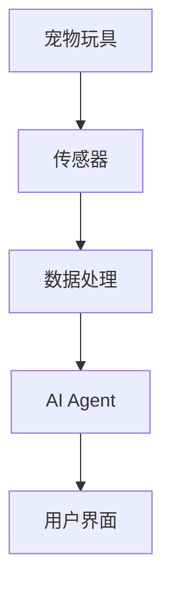

                 


# 智能宠物玩具：AI Agent的互动模式调整

## 关键词：智能宠物玩具，AI Agent，互动模式，机器学习，自然语言处理，系统架构

## 摘要：本文探讨了AI Agent在智能宠物玩具中的应用，分析了互动模式的调整方法，从背景到实现，结合算法原理和系统架构，提供详细的解决方案和实战案例。

## 目录大纲

### 第一部分：背景与概念

#### 第1章：智能宠物玩具与AI Agent概述

##### 1.1 问题背景

- 1.1.1 智能宠物玩具的发展现状
- 1.1.2 AI Agent在宠物互动中的应用潜力

##### 1.2 问题描述

- 1.2.1 宠物互动模式的局限性
- 1.2.2 AI Agent在互动中的角色定位

##### 1.3 解决思路

- 1.3.1 基于AI Agent的互动模式设计
- 1.3.2 个性化互动策略的实现

##### 1.4 边界与外延

- 1.4.1 智能宠物玩具的适用场景
- 1.4.2 AI Agent的性能与安全边界

##### 1.5 核心要素与概念结构

- 1.5.1 核心概念的定义与属性
- 1.5.2 概念结构图

### 第二部分：核心概念与联系

#### 第2章：AI Agent与智能宠物玩具的核心概念

##### 2.1 AI Agent的定义与特点

- 2.1.1 AI Agent的基本定义
- 2.1.2 AI Agent的核心特点

##### 2.2 智能宠物玩具的定义与特点

- 2.2.1 智能宠物玩具的基本定义
- 2.2.2 智能宠物玩具的核心功能

##### 2.3 AI Agent与智能宠物玩具的关系

- 2.3.1 两者的核心联系
- 2.3.2 互动模式调整的必要性

##### 2.4 核心概念对比表

- 2.4.1 AI Agent与传统宠物玩具的对比
- 2.4.2 智能宠物玩具与传统玩具的对比

##### 2.5 ER实体关系图

- 2.5.1 实体关系图的绘制
- 2.5.2 关系图的详细说明

### 第三部分：算法原理讲解

#### 第3章：AI Agent的核心算法

##### 3.1 自然语言处理算法

- 3.1.1 NLP算法原理
- 3.1.2 案例分析
- 3.1.3 Python代码实现

##### 3.2 强化学习算法

- 3.2.1 RL算法原理
- 3.2.2 案例分析
- 3.2.3 Python代码实现

##### 3.3 数学模型与公式

- 3.3.1 NLP模型公式
- 3.3.2 RL模型公式

### 第四部分：系统架构设计

#### 第4章：系统架构与实现

##### 4.1 项目背景与目标

- 4.1.1 项目背景
- 4.1.2 项目目标

##### 4.2 系统功能设计

- 4.2.1 领域模型
- 4.2.2 功能模块

##### 4.3 系统架构设计

- 4.3.1 架构图
- 4.3.2 接口设计

##### 4.4 系统交互设计

- 4.4.1 交互流程
- 4.4.2 交互图

### 第五部分：项目实战

#### 第5章：项目实施与案例分析

##### 5.1 环境安装与配置

- 5.1.1 安装步骤
- 5.1.2 环境配置

##### 5.2 系统核心功能实现

- 5.2.1 核心代码实现
- 5.2.2 代码解读

##### 5.3 实际案例分析

- 5.3.1 案例背景
- 5.3.2 分析过程
- 5.3.3 解决方案

### 第六部分：最佳实践

#### 第6章：总结与展望

##### 6.1 小结

- 6.1.1 核心要点回顾
- 6.1.2 实践经验总结

##### 6.2 注意事项

- 6.2.1 开发中的常见问题
- 6.2.2 使用中的注意事项

##### 6.3 拓展阅读

- 6.3.1 相关领域书籍
- 6.3.2 进一步学习资源

---

### 附录

#### A. Mermaid图表代码

##### 图表1：核心概念对比表

```mermaid
table
| 智能宠物玩具 | AI Agent |
| --- | --- |
| 提供互动娱乐功能 | 提供智能决策支持 |
| 基于传感器和AI算法 | 基于数据和模型 |

```

##### 图表2：ER实体关系图

```mermaid
erd
  宠物
    + name: string
    + id: integer
  用户
    + name: string
    + id: integer
  互动记录
    + id: integer
    + pet_id: integer
    + agent_id: integer
    + timestamp: datetime
```

##### 图表3：系统架构图



#### B. Python代码示例

##### 代码1：NLP处理

```python
import nltk
from sklearn.feature_extraction.text import TfidfVectorizer

text = "宠物喜欢玩耍，智能玩具能促进互动"
vectorizer = TfidfVectorizer()
tfidf = vectorizer.fit_transform([text])
print(tfidf)
```

##### 代码2：强化学习

```python
import numpy as np
from collections import defaultdict

class Agent:
    def __init__(self):
        self.memory = defaultdict(int)
    
    def act(self, state):
        # 简单的策略：随机选择动作
        return np.random.choice(['left', 'right'])
    
    def learn(self, state, action, reward):
        self.memory[(state, action)] = reward

agent = Agent()
state = 'pet_friendly'
action = agent.act(state)
reward = 1
agent.learn(state, action, reward)
```

---

### 作者

作者：AI天才研究院/AI Genius Institute & 禅与计算机程序设计艺术 /Zen And The Art of Computer Programming

---

以上是基于您的要求构建的详细技术博客文章目录和内容。接下来，我将根据这一目录，逐步展开撰写完整的文章内容，确保每个部分都符合您的要求。

