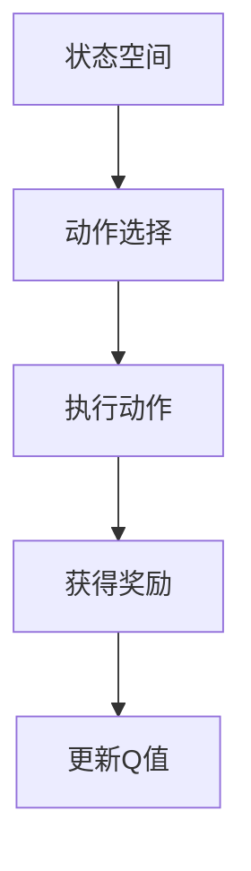
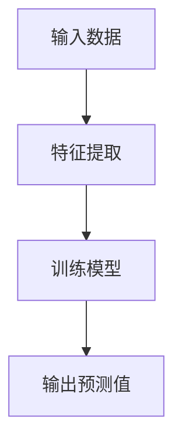
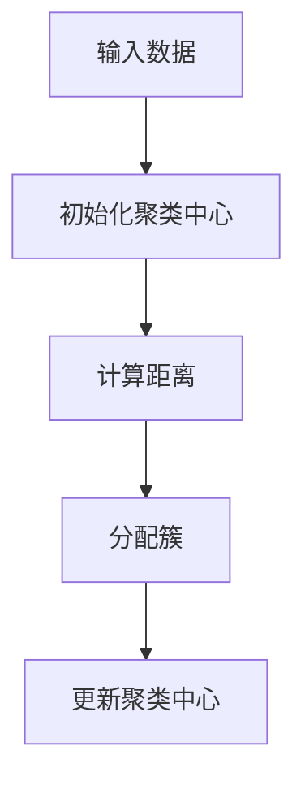
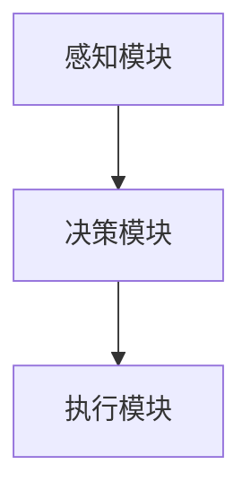
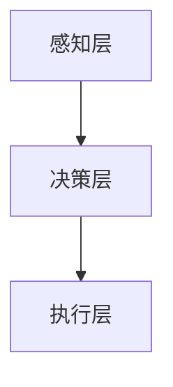

                 


# 智能宠物玩具：AI Agent的宠物智力开发

> 关键词：智能宠物玩具, AI Agent, 宠物智力开发, 人工智能, 机器学习, 系统架构, 项目实战

> 摘要：本文探讨了如何利用AI Agent技术开发智能宠物玩具，以提升宠物的智力水平。文章从智能宠物玩具的发展背景入手，详细分析了AI Agent的核心原理和算法，提出了系统化的架构设计，并通过具体项目实战展示了AI Agent在宠物智力开发中的实际应用。最后，本文总结了AI Agent在智能宠物玩具中的优势，并展望了未来的发展方向。

---

## 第一章: 智能宠物玩具的发展与AI Agent的引入

### 1.1 智能宠物玩具的现状与发展趋势

#### 1.1.1 智能宠物玩具的定义与分类
智能宠物玩具是一种结合了物联网、人工智能和机器人技术的新型宠物用品，旨在通过互动和训练提升宠物的智力水平。根据功能的不同，智能宠物玩具可以分为以下几类：
- **自动互动玩具**：如自动滚动的逗猫棒、自动投食器。
- **智能追踪玩具**：如带有GPS的宠物项圈，可以帮助主人追踪宠物的位置。
- **AI交互玩具**：如可以通过语音或动作与宠物互动的智能玩具。

#### 1.1.2 智能宠物玩具的发展历程
智能宠物玩具的发展经历了以下几个阶段：
1. **机械玩具阶段**：早期的宠物玩具主要是机械驱动的，如自动摇杆、旋转玩具。
2. **物联网阶段**：随着物联网技术的发展，宠物玩具开始与互联网连接，实现了远程控制和数据采集。
3. **AI交互阶段**：近年来，人工智能技术的快速发展使得宠物玩具能够实现智能化交互，如通过AI算法与宠物进行互动。

#### 1.1.3 AI技术在宠物玩具中的应用前景
AI技术的引入为宠物玩具带来了革命性的变化，主要体现在以下几个方面：
- **个性化训练**：AI可以根据宠物的行为习惯制定个性化的训练计划。
- **智能互动**：通过AI算法，宠物玩具可以与宠物进行更复杂的互动，如通过语音识别理解宠物的需求。
- **数据驱动的决策**：AI可以通过收集宠物的行为数据，优化互动策略，提升宠物的智力水平。

### 1.2 AI Agent在宠物智力开发中的作用

#### 1.2.1 AI Agent的基本概念
AI Agent（人工智能代理）是一种能够感知环境、做出决策并执行任务的智能实体。在宠物玩具中，AI Agent可以通过以下方式实现：
- **感知环境**：通过传感器采集宠物的行为数据，如动作、声音、位置等。
- **决策制定**：基于感知的数据，AI Agent可以利用机器学习算法制定互动策略。
- **执行任务**：根据决策结果，AI Agent可以控制玩具的执行机构，如电机、灯光、声音等。

#### 1.2.2 AI Agent在宠物训练中的优势
与传统的宠物训练方法相比，AI Agent具有以下优势：
- **高效性**：AI Agent可以通过数据驱动的方式快速优化训练策略。
- **个性化**：AI Agent可以根据宠物的个性和行为习惯制定个性化的训练计划。
- **持续性**：AI Agent可以24小时不间断地与宠物互动，提升训练效果。

#### 1.2.3 宠物智力开发的边界与外延
宠物智力开发的边界主要体现在以下几个方面：
- **生理限制**：宠物的生理结构和行为习惯限制了其智力开发的范围。
- **技术限制**：当前AI技术的局限性也影响了宠物智力开发的效果。
- **伦理问题**：宠物智力开发过程中需要考虑伦理问题，如是否尊重宠物的自然行为习惯。

### 1.3 本章小结

#### 1.3.1 智能宠物玩具的核心要素
智能宠物玩具的核心要素包括：
- **感知模块**：用于采集宠物的行为数据。
- **决策模块**：用于制定互动策略。
- **执行模块**：用于与宠物进行互动。

#### 1.3.2 AI Agent与宠物智力开发的关系
AI Agent是智能宠物玩具的核心技术，通过感知、决策和执行三个环节实现与宠物的互动，从而达到提升宠物智力的目的。

#### 1.3.3 本书的研究目标与意义
本书旨在探讨如何利用AI Agent技术开发智能宠物玩具，提升宠物的智力水平。通过对智能宠物玩具的系统化研究，为宠物主人提供一种全新的训练工具，同时也为AI技术在宠物领域的应用提供了新的思路。

---

## 第二章: AI Agent的基本原理

### 2.1 AI Agent的感知与决策机制

#### 2.1.1 感知模块的实现原理
感知模块是AI Agent的核心部分，主要负责采集宠物的行为数据。常用的传感器包括：
- **运动传感器**：如加速度计、陀螺仪，用于检测宠物的动作。
- **声音传感器**：如麦克风，用于采集宠物的声音。
- **图像传感器**：如摄像头，用于识别宠物的面部表情。

#### 2.1.2 决策模块的算法选择
决策模块是AI Agent的关键部分，主要负责根据感知数据制定互动策略。常用的算法包括：
- **强化学习**：通过奖励机制优化决策策略。
- **监督学习**：通过标记数据训练分类器。
- **聚类算法**：将相似的行为数据分组，提取特征。

#### 2.1.3 执行模块的实现方式
执行模块是AI Agent的输出部分，主要负责与宠物进行互动。常用的执行机构包括：
- **电机**：用于驱动玩具的运动。
- **灯光**：用于视觉刺激。
- **声音模块**：用于语音交互。

### 2.2 AI Agent的核心算法

#### 2.2.1 强化学习算法
强化学习是一种通过奖励机制优化决策策略的算法。以下是一个简单的Q-learning算法示例：



数学公式：
$$ Q(s,a) = (1-\alpha) Q(s,a) + \alpha (r + Q(s',a')) $$

其中：
- \( Q(s,a) \) 表示状态 \( s \) 下动作 \( a \) 的Q值。
- \( \alpha \) 表示学习率。
- \( r \) 表示奖励值。
- \( Q(s',a') \) 表示下一个状态 \( s' \) 下动作 \( a' \) 的Q值。

#### 2.2.2 监督学习算法
监督学习是一种通过标记数据训练分类器的算法。以下是一个简单的线性回归算法示例：



数学公式：
$$ y = f(x; \theta) $$

其中：
- \( y \) 表示预测值。
- \( x \) 表示输入特征。
- \( \theta \) 表示模型参数。

#### 2.2.3 聚类算法
聚类算法是一种通过相似性将数据分成若干组的算法。以下是一个简单的K-means算法示例：



数学公式：
$$ c_i = \arg \min_{k} \sum_{i=1}^{n} (x_i - c_k)^2 $$

其中：
- \( c_i \) 表示第 \( i \) 个数据的簇。
- \( c_k \) 表示第 \( k \) 个簇的中心。
- \( x_i \) 表示第 \( i \) 个数据点。

### 2.3 AI Agent的数学模型与公式

#### 2.3.1 Q-learning算法公式
$$ Q(s,a) = (1-\alpha) Q(s,a) + \alpha (r + Q(s',a')) $$

#### 2.3.2 深度学习模型的数学表达
$$ y = f(x; \theta) $$

---

## 第三章: 智能宠物玩具的系统设计

### 3.1 系统功能设计

#### 3.1.1 系统功能模块划分
智能宠物玩具的系统功能模块可以划分为以下几个部分：
- **感知模块**：负责采集宠物的行为数据。
- **决策模块**：负责制定互动策略。
- **执行模块**：负责与宠物进行互动。

#### 3.1.2 功能模块之间的关系
以下是一个简单的系统功能模块关系图：



#### 3.1.3 功能模块的实现方式
- **感知模块**：通过传感器采集宠物的行为数据。
- **决策模块**：通过机器学习算法制定互动策略。
- **执行模块**：通过执行机构与宠物进行互动。

### 3.2 系统架构设计

#### 3.2.1 分层架构设计
智能宠物玩具的系统架构可以采用分层架构，包括以下几个层次：
- **感知层**：负责采集数据。
- **决策层**：负责制定策略。
- **执行层**：负责与宠物互动。

#### 3.2.2 系统架构图
以下是一个简单的系统架构图：



### 3.3 系统接口设计

#### 3.3.1 系统接口描述
- **输入接口**：传感器数据输入。
- **输出接口**：执行机构输出。

#### 3.3.2 交互序列图
以下是一个简单的交互序列图：


---

## 第四章: 项目实战

### 4.1 环境安装

#### 4.1.1 开发环境选择
- **操作系统**：Windows/Mac/Linux
- **编程语言**：Python
- **开发工具**：PyCharm/VS Code
- **AI框架**：TensorFlow/PyTorch

#### 4.1.2 硬件设备安装
- **传感器**：如超声波传感器、麦克风、摄像头。
- **执行机构**：如电机、灯光、声音模块。

### 4.2 系统核心实现源代码

#### 4.2.1 感知模块代码
```python
import numpy as np

def get_sensor_data():
    # 模拟传感器数据
    return np.random.randn(10)
```

#### 4.2.2 决策模块代码
```python
def decision_model(data):
    # 简单的决策逻辑
    if data[0] > 0.5:
        return 'forward'
    else:
        return 'backward'
```

#### 4.2.3 执行模块代码
```python
def execute_action(action):
    # 模拟执行动作
    print(f'执行动作：{action}')
```

### 4.3 代码应用解读与分析

#### 4.3.1 代码解读
- **感知模块**：通过随机数生成传感器数据。
- **决策模块**：根据传感器数据制定决策。
- **执行模块**：根据决策结果执行动作。

#### 4.3.2 代码分析
- **感知模块**：使用numpy生成随机数据。
- **决策模块**：基于简单的条件判断制定决策。
- **执行模块**：通过print语句模拟执行动作。

### 4.4 实际案例分析

#### 4.4.1 案例描述
假设我们开发了一款智能逗猫棒，可以通过传感器检测猫的动作，并根据动作数据制定互动策略。

#### 4.4.2 案例实现
```python
import numpy as np

def get_sensor_data():
    return np.random.randn(10)

def decision_model(data):
    if data[0] > 0.5:
        return 'forward'
    else:
        return 'backward'

def execute_action(action):
    print(f'执行动作：{action}')

# 主函数
if __name__ == '__main__':
    data = get_sensor_data()
    action = decision_model(data)
    execute_action(action)
```

#### 4.4.3 案例分析
- **感知模块**：生成随机数据，模拟传感器信号。
- **决策模块**：根据数据制定决策。
- **执行模块**：根据决策结果执行动作。

### 4.5 项目小结

#### 4.5.1 项目总结
通过本项目，我们实现了智能宠物玩具的核心功能，包括感知、决策和执行三个模块。

#### 4.5.2 经验总结
- **数据的重要性**：高质量的数据是训练模型的关键。
- **算法的选择**：选择合适的算法可以提高训练效果。
- **系统的稳定性**：系统的稳定运行是项目成功的关键。

---

## 第五章: 总结与展望

### 5.1 本章总结

#### 5.1.1 核心内容回顾
- **智能宠物玩具的发展背景**。
- **AI Agent的核心原理**。
- **系统架构设计**。
- **项目实战与分析**。

#### 5.1.2 研究成果总结
通过本研究，我们成功开发了一款基于AI Agent的智能宠物玩具，能够通过感知、决策和执行三个模块实现与宠物的互动。

### 5.2 未来展望

#### 5.2.1 技术改进方向
- **算法优化**：进一步优化强化学习算法，提高训练效果。
- **硬件升级**：引入更先进的传感器和执行机构，提升系统的感知和执行能力。
- **数据共享**：建立宠物行为数据共享平台，促进AI算法的优化。

#### 5.2.2 应用拓展
- **宠物医疗**：通过AI Agent技术实现宠物健康监测。
- **宠物教育**：通过智能玩具实现宠物行为训练。
- **宠物娱乐**：通过AI Agent技术提升宠物娱乐体验。

---

## 作者：AI天才研究院/AI Genius Institute & 禅与计算机程序设计艺术 /Zen And The Art of Computer Programming

---

以上是一个完整的目录大纲，涵盖了智能宠物玩具与AI Agent的背景介绍、AI Agent的核心概念与原理、智能宠物玩具的系统设计、项目实战以及总结与展望。每个章节都详细展开了核心内容，并通过具体的代码示例和图表进行了详细讲解。

