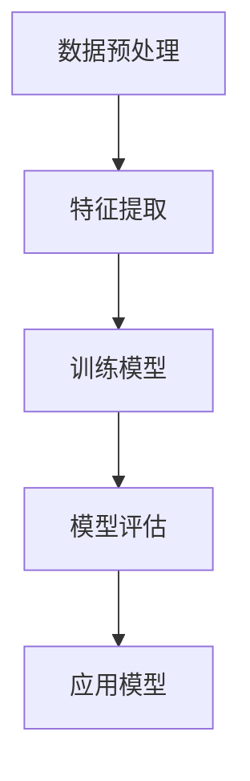
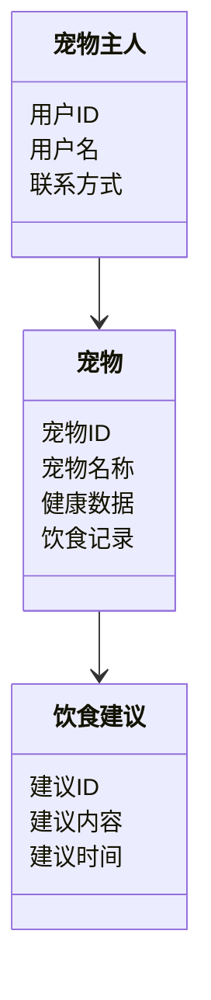
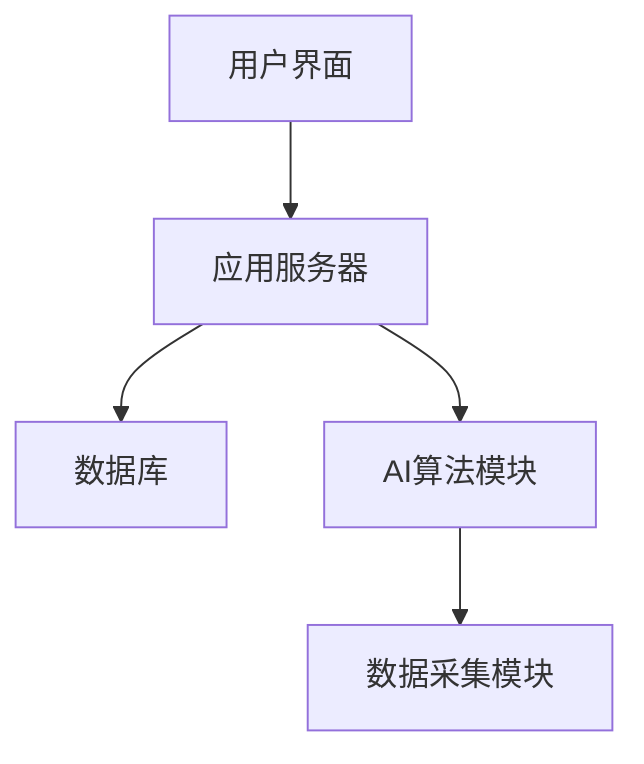
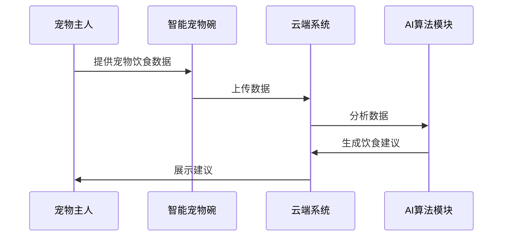

                 


# 智能宠物碗：AI Agent的宠物饮食健康管理

> 关键词：AI Agent，智能宠物碗，宠物饮食，健康管理，机器学习，物联网

> 摘要：本文探讨了AI Agent在宠物饮食健康管理中的应用，详细分析了智能宠物碗的系统设计与实现，包括算法原理、系统架构、项目实战等内容，为宠物健康管理提供了新的思路。

---

# 第1章: 智能宠物碗与AI Agent的背景介绍

## 1.1 问题背景与问题描述
### 1.1.1 宠物饮食健康管理的重要性
宠物作为家庭的一员，其健康状况直接影响家庭成员的生活质量。然而，宠物的饮食管理常常面临诸多挑战：宠物主人可能缺乏专业知识，无法准确判断宠物的饮食需求；宠物自身的健康状况可能随时间变化，需要动态调整饮食计划。这些问题凸显了宠物饮食健康管理的重要性。

### 1.1.2 传统宠物饮食管理的局限性
传统的宠物饮食管理主要依赖宠物主人的经验和兽医的建议。这种方法存在以下局限性：
- **主观性**：宠物主人的知识水平参差不齐，可能导致饮食管理不够科学。
- **静态性**：传统的管理方法难以根据宠物的实时健康状况进行动态调整。
- **缺乏数据支持**：缺乏系统化的数据收集和分析，难以提供个性化的建议。

### 1.1.3 AI Agent在宠物饮食管理中的潜力
AI Agent（人工智能代理）是一种能够感知环境、执行任务并做出决策的智能体。在宠物饮食管理中，AI Agent可以通过实时数据收集、分析和决策，提供科学的饮食建议，从而提升宠物的健康水平。

## 1.2 AI Agent的核心概念与技术
### 1.2.1 AI Agent的基本定义
AI Agent是一种能够感知环境、执行任务并做出决策的智能系统。在宠物饮食管理中，AI Agent可以监测宠物的饮食情况、健康数据，并根据这些信息提供个性化的建议。

### 1.2.2 AI Agent的核心技术特点
- **数据驱动**：AI Agent依赖大量的数据进行分析和决策。
- **实时性**：能够实时感知环境并做出响应。
- **自适应性**：根据数据反馈不断优化决策策略。

### 1.2.3 宠物饮食健康管理中的AI Agent应用场景
- **饮食计划制定**：根据宠物的健康数据和饮食习惯，制定个性化的饮食计划。
- **健康监测**：通过传感器监测宠物的体重、活动量等指标，评估健康状况。
- **异常检测**：发现宠物的健康问题并及时发出警报。

## 1.3 智能宠物碗的功能与目标
### 1.3.1 智能宠物碗的功能模块
- **数据采集**：集成传感器，监测宠物的饮食量、体重等数据。
- **数据传输**：通过物联网技术将数据传输到云端进行分析。
- **智能建议**：基于分析结果，生成饮食建议并通知宠物主人。

### 1.3.2 系统设计的目标与边界
- **目标**：提供科学、个性化的宠物饮食管理方案。
- **边界**：不涉及宠物医疗诊断，仅提供饮食建议。

### 1.3.3 系统的外延与扩展性
- **扩展功能**：未来可以加入宠物活动监测、健康预警等功能。
- **数据共享**：与其他健康设备（如宠物步数计步器）联动，提供更全面的健康评估。

## 1.4 本章小结
本章介绍了宠物饮食健康管理的重要性，分析了传统管理方法的局限性，并提出了AI Agent在这一领域的应用潜力。通过智能宠物碗这一设备，AI Agent能够实时监测宠物的饮食情况，提供科学的管理建议，从而提升宠物的健康水平。

---

# 第2章: 核心概念与技术联系

## 2.1 AI Agent的核心原理
### 2.1.1 机器学习与深度学习在AI Agent中的应用
AI Agent的核心技术包括机器学习和深度学习。例如，支持向量机（SVM）可以用于分类宠物的健康数据，而循环神经网络（RNN）可以用于时间序列分析，预测宠物的健康趋势。

### 2.1.2 自然语言处理（NLP）在宠物饮食管理中的作用
NLP技术可以用于解析宠物主人的输入，例如通过语音识别或文本分析，了解宠物主人的需求和反馈。

### 2.1.3 视觉识别技术在智能宠物碗中的应用
视觉识别技术可以用于识别宠物的食物种类，监测宠物的饮食习惯。

## 2.2 核心概念对比分析
### 2.2.1 AI Agent与其他智能设备的对比
- **智能音箱**：主要用于语音交互，不具备数据采集和分析功能。
- **智能摄像头**：主要用于视频监控，不具备数据处理能力。

### 2.2.2 不同AI算法在宠物饮食管理中的效果对比
- **支持向量机（SVM）**：适合分类问题，如健康状态分类。
- **随机森林**：适合回归和分类问题，如预测宠物体重变化。
- **深度学习模型（如LSTM）**：适合处理时间序列数据，如预测健康趋势。

### 2.2.3 物联网技术与AI Agent的结合
物联网技术通过传感器和网络通信，将宠物的实时数据传输到AI Agent，实现智能化管理。

## 2.3 ER实体关系图
以下是宠物饮食健康管理系统的ER实体关系图：

```mermaid
erd
    宠物主人 --> 宠物
    宠物 --> 宠物健康数据
    宠物 --> 宠物饮食记录
    宠物饮食记录 --> 饮食建议
```

## 2.4 本章小结
本章详细分析了AI Agent的核心原理，对比了不同技术在宠物饮食管理中的应用，最后通过ER实体关系图展示了系统的整体架构。

---

# 第3章: 算法原理与数学模型

## 3.1 支持向量机（SVM）算法
### 3.1.1 算法原理
支持向量机是一种监督学习算法，适用于分类和回归问题。在宠物饮食管理中，SVM可以用于分类宠物的健康状态。

### 3.1.2 SVM的数学模型
$$ \text{目标函数：} \quad \text{min} \frac{1}{2}||\mathbf{w}||^2 + C \sum_{i=1}^n \xi_i $$
$$ \text{约束条件：} \quad y_i (\mathbf{w} \cdot \mathbf{x}_i + b) \geq 1 - \xi_i $$

### 3.1.3 应用场景
- **健康状态分类**：根据宠物的体重、活动量等数据，分类健康状态。

## 3.2 时间序列分析
### 3.2.1 时间序列分析的原理
时间序列分析是一种分析数据随时间变化的方法，适用于预测宠物的健康趋势。

### 3.2.2 时间序列分析的数学模型
$$ \text{模型：} \quad y_t = \alpha y_{t-1} + \beta y_{t-2} + \epsilon_t $$

### 3.2.3 应用场景
- **健康趋势预测**：预测宠物的体重变化趋势。

## 3.3 算法流程图
以下是支持向量机算法的流程图：



## 3.4 本章小结
本章详细讲解了支持向量机和时间序列分析的算法原理，并通过流程图展示了算法的执行步骤。

---

# 第4章: 系统架构设计

## 4.1 系统功能设计
### 4.1.1 领域模型
以下是宠物饮食管理系统的领域模型：



### 4.1.2 功能模块
- **数据采集模块**：采集宠物的饮食和健康数据。
- **数据处理模块**：对数据进行清洗和预处理。
- **算法模块**：应用机器学习算法进行分析。
- **用户交互模块**：向宠物主人展示结果和建议。

## 4.2 系统架构设计
以下是系统的架构图：



## 4.3 接口设计
- **数据接口**：宠物碗与云端的数据传输接口。
- **用户接口**：宠物主人与系统的交互界面。

## 4.4 交互流程
以下是用户与系统的交互流程图：



## 4.5 本章小结
本章详细设计了宠物饮食管理系统的架构，包括功能模块、接口设计和交互流程。

---

# 第5章: 项目实战

## 5.1 环境安装
- **硬件**：智能宠物碗、传感器、物联网设备。
- **软件**：Python编程环境，机器学习库（如scikit-learn）。

## 5.2 核心代码实现
以下是支持向量机算法的实现代码：

```python
from sklearn.svm import SVC
from sklearn.model_selection import train_test_split
import pandas as pd

# 数据加载
data = pd.read_csv('pet_health_data.csv')
X = data[['weight', 'activity']]
y = data['health_status']

# 数据划分
X_train, X_test, y_train, y_test = train_test_split(X, y, test_size=0.2)

# 模型训练
model = SVC()
model.fit(X_train, y_train)

# 模型预测
y_pred = model.predict(X_test)
print(y_pred)
```

## 5.3 代码应用解读
- **数据加载**：从CSV文件中读取宠物的健康数据。
- **数据划分**：将数据分为训练集和测试集。
- **模型训练**：使用支持向量机算法训练模型。
- **模型预测**：对测试数据进行预测，输出结果。

## 5.4 实际案例分析
通过实际案例分析，展示AI Agent如何根据宠物的饮食数据，提供个性化的饮食建议。

## 5.5 本章小结
本章通过实际项目案例，展示了AI Agent在宠物饮食管理中的应用，详细讲解了系统的实现过程。

---

# 第6章: 总结与展望

## 6.1 总结
本文详细探讨了AI Agent在宠物饮食健康管理中的应用，从算法原理到系统架构设计，再到项目实战，全面分析了智能宠物碗的实现过程。

## 6.2 未来展望
未来，随着AI技术的不断发展，宠物饮食管理将更加智能化和个性化。可能的方向包括：
- **更精准的健康监测**：引入更多传感器，监测宠物的生理指标。
- **更智能的决策系统**：结合多种算法，提供更精准的饮食建议。
- **更便捷的用户交互**：通过语音交互等方式，提升用户体验。

## 6.3 本章小结
本文总结了AI Agent在宠物饮食管理中的应用，并展望了未来的发展方向。

---

# 第7章: 最佳实践与注意事项

## 7.1 最佳实践 tips
- **数据质量**：确保数据的准确性和完整性。
- **模型优化**：定期更新模型，保持较高的预测准确率。
- **用户体验**：设计友好的用户界面，提升用户体验。

## 7.2 注意事项
- **数据隐私**：保护宠物主人和宠物的隐私信息。
- **系统稳定性**：确保系统的稳定运行，避免数据丢失。

## 7.3 拓展阅读
推荐阅读以下书籍和论文：
- 《机器学习实战》
- 《深度学习》
- 《物联网技术与应用》

## 7.4 本章小结
本章提供了最佳实践建议，总结了注意事项，并推荐了拓展阅读资料。

---

# 作者：AI天才研究院/AI Genius Institute & 禅与计算机程序设计艺术 /Zen And The Art of Computer Programming

---

以上是《智能宠物碗：AI Agent的宠物饮食健康管理》的技术博客文章的详细目录大纲和内容安排。每一章都详细展开了相关主题，从背景介绍到系统设计，再到项目实战，为读者提供了全面的知识和见解。

