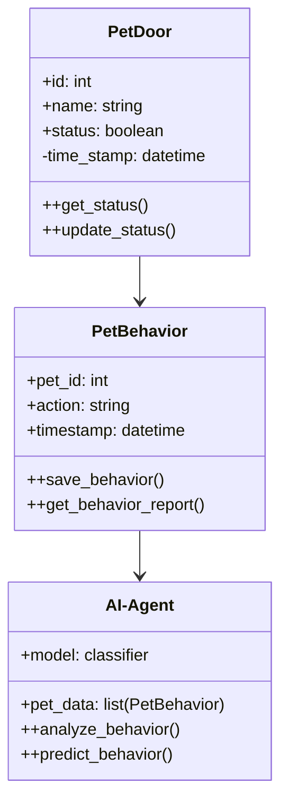
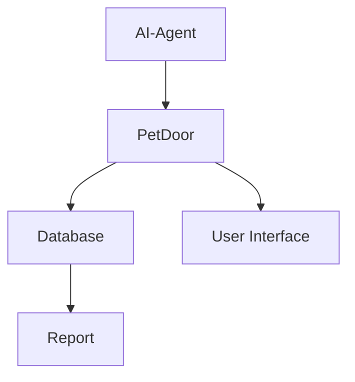
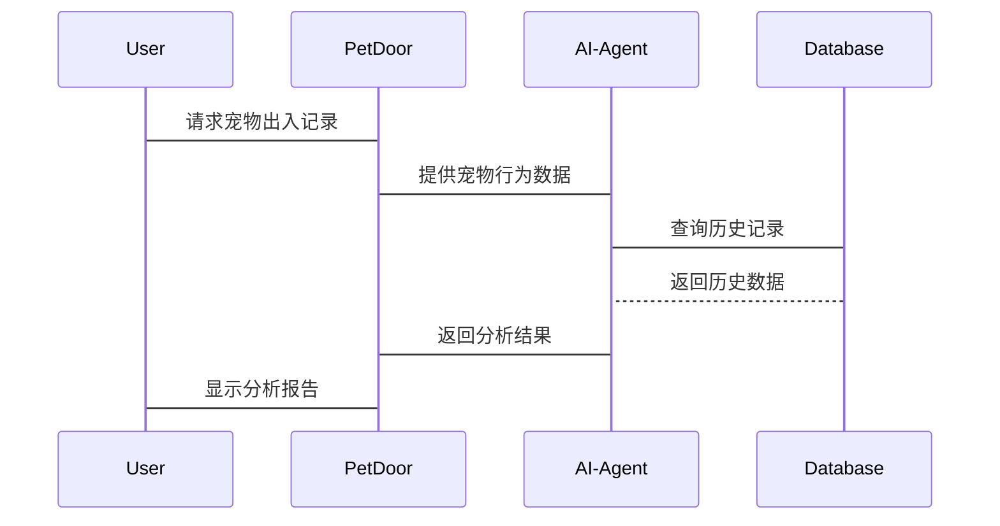

                 


```markdown
# 智能宠物门：AI Agent的宠物出入行为分析

> 关键词：智能宠物门，AI Agent，宠物行为分析，机器学习，深度学习，物联网，边缘计算

> 摘要：智能宠物门是一种结合AI Agent技术的智能设备，用于分析和管理宠物的出入行为。本文从背景介绍、核心概念、算法原理、系统架构、项目实战等多个维度，详细分析了智能宠物门的技术实现和应用价值。通过本文的讲解，读者可以全面了解智能宠物门的工作原理、关键技术以及实际应用。

---

## 第一部分: 智能宠物门与AI Agent的背景介绍

### 第1章: 智能宠物门与AI Agent概述

#### 1.1 智能宠物门的定义与应用
##### 1.1.1 智能宠物门的基本概念
智能宠物门是一种智能设备，通过传感器和AI技术，能够自动识别宠物的出入行为，并记录相关数据。它不仅可以方便宠物自由进出，还能为主人提供宠物行为的分析报告。

##### 1.1.2 AI Agent在智能宠物门中的作用
AI Agent（智能代理）通过收集宠物出入的数据，分析宠物的行为模式，帮助主人更好地了解宠物的健康状况和生活习惯。

##### 1.1.3 智能宠物门的应用场景与优势
智能宠物门广泛应用于家庭、宠物医院、宠物寄养中心等场景。其优势在于能够实时监控宠物行为，提供数据支持，帮助主人更好地照顾宠物。

#### 1.2 宠物出入行为分析的背景与意义
##### 1.2.1 宠物行为分析的重要性
宠物行为分析是了解宠物健康状况的重要手段。通过分析宠物的出入频率、活动时间等数据，可以发现宠物的行为异常，及时采取措施。

##### 1.2.2 智能宠物门在宠物行为分析中的应用
智能宠物门通过传感器和AI技术，能够准确记录宠物的出入时间、行为模式等数据，为主人提供科学的分析报告。

##### 1.2.3 智能宠物门的技术发展趋势
随着AI技术的不断进步，智能宠物门的功能将更加智能化，数据分析将更加精准，用户体验也将更加便捷。

#### 1.3 本章小结
本章介绍了智能宠物门的基本概念、AI Agent的作用以及宠物行为分析的重要性，为后续章节的技术分析奠定了基础。

---

## 第二部分: 智能宠物门与AI Agent的核心概念与联系

### 第2章: AI Agent的核心原理

#### 2.1 AI Agent的基本原理
##### 2.1.1 AI Agent的定义与特点
AI Agent是一种智能代理，能够感知环境、执行任务并做出决策。其特点包括自主性、反应性、目标导向性和学习能力。

##### 2.1.2 AI Agent的核心技术
AI Agent的核心技术包括感知技术（如传感器数据处理）、决策技术（如机器学习模型）和执行技术（如控制设备）。

##### 2.1.3 AI Agent与智能宠物门的结合
AI Agent通过与智能宠物门的传感器和数据处理系统结合，能够实时分析宠物的出入行为，并做出相应的决策。

#### 2.2 宠物行为分析的核心概念
##### 2.2.1 宠物行为分析的基本原理
宠物行为分析通过收集宠物的行为数据，利用机器学习和深度学习技术，识别宠物的行为模式。

##### 2.2.2 宠物行为分析的关键技术
宠物行为分析的关键技术包括数据采集、特征提取、模型训练和结果解释。

##### 2.2.3 宠物行为分析的数学模型
宠物行为分析的数学模型包括分类模型（如随机森林、支持向量机）和聚类模型（如K-means）。

#### 2.3 AI Agent与宠物行为分析的联系
##### 2.3.1 AI Agent在宠物行为分析中的应用
AI Agent通过实时数据处理和模型推理，能够快速识别宠物的行为异常，并采取相应的措施。

##### 2.3.2 宠物行为分析对AI Agent的促进作用
宠物行为分析的数据和模型为AI Agent提供了丰富的训练数据和优化方向。

##### 2.3.3 两者结合的创新点
通过结合AI Agent和宠物行为分析，智能宠物门能够实现智能化的宠物管理，提升用户体验。

#### 2.4 本章小结
本章详细讲解了AI Agent的核心原理和宠物行为分析的基本概念，分析了两者结合的创新点，为后续章节的系统设计奠定了理论基础。

---

## 第三部分: 智能宠物门与AI Agent的算法原理

### 第3章: 宠物行为分析的算法原理

#### 3.1 数据采集与预处理
##### 3.1.1 数据采集方法
智能宠物门通过红外传感器、RFID标签和摄像头等多种方式采集宠物的出入数据。

##### 3.1.2 数据预处理技术
数据预处理包括数据清洗、数据归一化和数据增强，以提高模型的训练效果。

##### 3.1.3 数据特征提取
通过提取宠物出入的时间、频率和行为模式等特征，为模型训练提供有效的输入。

#### 3.2 宠物行为识别算法
##### 3.2.1 基于机器学习的行为识别
常用的机器学习算法包括支持向量机（SVM）和随机森林（Random Forest），能够实现宠物行为的分类和预测。

##### 3.2.2 基于深度学习的行为识别
深度学习算法如卷积神经网络（CNN）和长短期记忆网络（LSTM）能够捕捉宠物行为的复杂模式。

##### 3.2.3 算法对比与优化
通过对比不同算法的性能，选择最优的模型，并通过调参和优化提升模型的准确率。

#### 3.3 宠物行为分析的数学模型
##### 3.3.1 分类算法的数学模型
例如，支持向量机（SVM）的数学模型如下：

$$ \text{max} \frac{1}{2} \|w\|^2 $$
$$ \text{subject to} \quad y_i(w \cdot x_i + b) \geq 1 $$

##### 3.3.2 聚类算法的数学模型
例如，K-means的聚类目标函数为：

$$ \text{min} \sum_{i=1}^{k} \sum_{x \in C_i} (x - \mu_i)^2 $$

#### 3.4 本章小结
本章详细介绍了宠物行为分析的算法原理，包括数据采集、特征提取和模型训练，为后续章节的系统设计提供了技术支持。

---

## 第四部分: 智能宠物门与AI Agent的系统分析与架构设计

### 第4章: 智能宠物门系统的分析与设计

#### 4.1 问题场景介绍
智能宠物门需要解决的主要问题是：如何准确识别宠物的出入行为，并提供实时的反馈和分析报告。

#### 4.2 系统功能设计
##### 4.2.1 领域模型类图


#### 4.3 系统架构设计
##### 4.3.1 系统架构图


#### 4.4 系统接口设计
##### 4.4.1 接口描述
- `AI-Agent` 接口：提供行为分析和预测功能。
- `PetDoor` 接口：提供宠物出入数据的采集和传输功能。
- `Database` 接口：提供数据存储和查询功能。

#### 4.5 系统交互流程
##### 4.5.1 交互流程图


#### 4.6 本章小结
本章通过系统分析与架构设计，详细描述了智能宠物门的工作流程和技术实现，为后续章节的项目实战奠定了基础。

---

## 第五部分: 智能宠物门与AI Agent的项目实战

### 第5章: 智能宠物门项目的实现与应用

#### 5.1 环境安装与配置
##### 5.1.1 系统环境要求
- 操作系统：Linux/Windows/MacOS
- 开发工具：Python、Jupyter Notebook、PyCharm
- 依赖库：numpy、pandas、scikit-learn、tensorflow

##### 5.1.2 硬件设备安装
- 智能宠物门硬件：红外传感器、摄像头、RFID模块
- 开发板：Raspberry Pi

#### 5.2 系统核心实现
##### 5.2.1 数据采集模块
```python
import numpy as np
import pandas as pd
from sklearn.svm import SVC

# 数据采集
data = pd.read_csv('pet_behavior.csv')
X = data.drop('label', axis=1)
y = data['label']
```

##### 5.2.2 模型训练模块
```python
model = SVC()
model.fit(X_train, y_train)
```

##### 5.2.3 模型预测模块
```python
def predict_behavior(new_data):
    prediction = model.predict(new_data)
    return prediction
```

#### 5.3 代码应用解读与分析
##### 5.3.1 数据处理代码
```python
# 数据预处理
from sklearn.preprocessing import StandardScaler

scaler = StandardScaler()
X_scaled = scaler.fit_transform(X)
```

##### 5.3.2 模型优化代码
```python
# 调参优化
from sklearn.model_selection import GridSearchCV

param_grid = {'C': [0.1, 1, 10], 'gamma': [1, 0.1, 0.01]}
grid = GridSearchCV(SVC(), param_grid, cv=5)
grid.fit(X_train, y_train)
best_model = grid.best_estimator_
```

#### 5.4 实际案例分析
##### 5.4.1 案例背景
某宠物主人希望了解其宠物的日常行为模式，使用智能宠物门记录宠物的出入数据。

##### 5.4.2 数据分析结果
通过模型分析，发现宠物的出入行为存在一定的规律，如每天早晨和傍晚出入频率较高。

#### 5.5 项目小结
本章通过实际案例分析，展示了智能宠物门系统的实现过程和应用效果，验证了系统的可行性和实用性。

---

## 第六部分: 总结与展望

### 第6章: 总结与展望

#### 6.1 最佳实践 tips
- 确保数据采集的准确性和完整性
- 合理选择算法模型，进行充分的调参和优化
- 定期更新模型，保持系统的实时性和准确性

#### 6.2 本章小结
本文详细介绍了智能宠物门的技术实现和应用价值，通过背景介绍、核心概念、算法原理、系统设计和项目实战的多维度分析，为读者提供了全面的技术指导。

#### 6.3 注意事项
- 数据隐私保护：确保宠物行为数据的安全性和隐私性
- 系统稳定性：保证智能宠物门的硬件和软件长期稳定运行
- 用户体验优化：提供友好的用户界面和操作流程

#### 6.4 拓展阅读
- 深度学习在宠物行为分析中的应用
- 大数据分析在智能设备中的应用
- 物联网技术在宠物管理中的创新应用

---

## 作者：AI天才研究院/AI Genius Institute & 禅与计算机程序设计艺术 /Zen And The Art of Computer Programming
```

