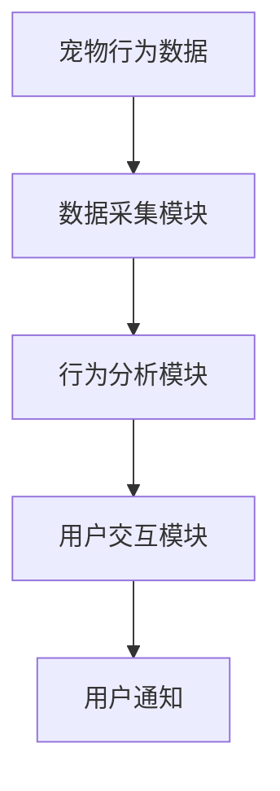
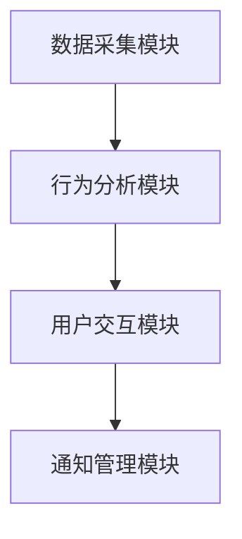
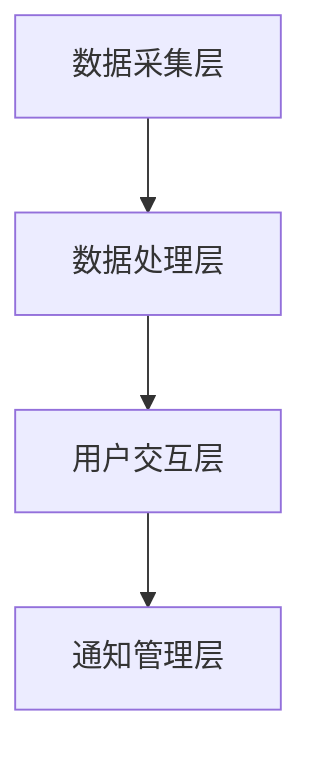
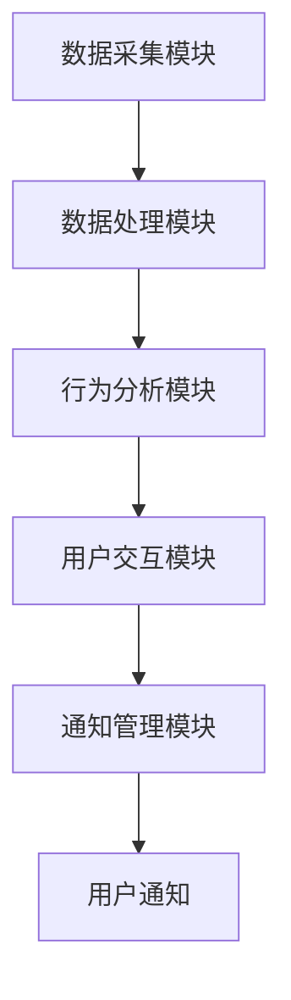

                 

# 智能宠物门：AI Agent的宠物行为分析与管理

## 关键词：
智能宠物门，AI Agent，宠物行为分析，行为管理，智能系统设计

## 摘要：
随着人工智能技术的快速发展，宠物行为分析与管理逐渐成为智能家庭的重要组成部分。智能宠物门作为一种创新的智能设备，利用AI Agent技术对宠物行为进行实时分析和管理，为宠物主人提供了便捷和高效的服务。本文将从智能宠物门的概念、技术原理、系统设计、项目实战到实际应用案例，全面探讨如何通过AI Agent实现宠物行为的智能化管理。

---

## 第一部分：智能宠物门：AI Agent的宠物行为分析与管理概述

## 第1章：引言

### 1.1 智能宠物门的概念与意义
智能宠物门是一种结合了物联网和人工智能技术的智能设备，能够通过传感器和摄像头采集宠物的行为数据，并利用AI算法进行分析和管理。这种设备不仅能够识别宠物的日常行为，还能在异常情况下及时通知宠物主人，确保宠物的安全和健康。

#### 1.1.1 智能宠物门的定义
智能宠物门是一种智能设备，安装在宠物出入的家庭门口，能够通过传感器、摄像头和AI算法实时监测和分析宠物的行为，提供智能化的管理和通知功能。

#### 1.1.2 智能宠物门的应用场景
智能宠物门的应用场景包括家庭宠物管理、宠物健康管理、宠物行为研究等。通过智能宠物门，宠物主人可以实时了解宠物的活动情况，及时发现异常行为，并采取相应的措施。

#### 1.1.3 智能宠物门的技术价值与社会意义
智能宠物门的开发和应用不仅推动了人工智能技术在家庭领域的应用，还提高了宠物主人的生活质量，为宠物的健康和安全提供了有力保障。

### 1.2 本书的目标与结构
本书旨在通过详细讲解智能宠物门的技术原理和系统设计，帮助读者理解如何利用AI Agent技术实现宠物行为的智能化管理。书中将涵盖智能宠物门的概念、技术基础、算法原理、系统设计、项目实战和应用案例等内容。

---

## 第二部分：智能宠物门的背景与技术基础

## 第2章：AI Agent与宠物行为分析的背景

### 2.1 AI Agent的基本概念
AI Agent（人工智能代理）是一种能够感知环境、自主决策并执行任务的智能实体。它能够通过传感器获取环境信息，并根据预设的目标和规则进行推理和行动。

#### 2.1.1 什么是AI Agent
AI Agent是一种能够执行智能任务的实体，能够通过感知环境、处理信息和自主决策来完成特定目标。AI Agent可以是软件程序，也可以是硬件设备，广泛应用于自动驾驶、智能助手、智能安防等领域。

#### 2.1.2 AI Agent的核心功能与特点
AI Agent的核心功能包括感知、推理、决策和执行。其特点包括智能性、自主性、反应性和社会性。

#### 2.1.3 AI Agent在宠物行为分析中的作用
AI Agent在宠物行为分析中起到了关键作用，能够通过传感器和摄像头采集宠物的行为数据，并利用机器学习算法进行分析和识别。

### 2.2 宠物行为分析的背景与需求
宠物行为分析是指通过对宠物的行为数据进行采集、处理和分析，了解宠物的行为模式和健康状况。随着宠物在家庭中的地位越来越重要，宠物行为分析的需求也日益增长。

#### 2.2.1 宠物行为分析的定义
宠物行为分析是指通过技术手段对宠物的行为进行采集、处理和分析，以了解宠物的行为模式和健康状况。

#### 2.2.2 宠物行为分析的常见场景
宠物行为分析的常见场景包括宠物日常活动监测、异常行为识别、宠物健康管理等。

#### 2.2.3 宠物行为分析的挑战与解决方案
宠物行为分析的挑战包括数据采集的准确性、行为识别的复杂性以及隐私保护等问题。通过结合AI Agent和物联网技术，可以有效解决这些挑战。

### 2.3 智能宠物门的技术现状与挑战
智能宠物门作为一种新兴的智能设备，目前还处于发展阶段。其技术现状包括传感器技术、AI算法和物联网通信等方面。未来的发展方向包括提高数据采集精度、优化AI算法和增强设备的智能化水平。

---

## 第三部分：智能宠物门的核心概念与技术原理

## 第3章：智能宠物门的核心概念与技术原理

### 3.1 智能宠物门的系统架构
智能宠物门的系统架构包括硬件部分和软件部分。硬件部分包括传感器、摄像头和通信模块，软件部分包括数据采集、行为分析和用户交互模块。

#### 3.1.1 智能宠物门的系统架构
智能宠物门的系统架构可以分为以下几个部分：
1. 传感器模块：用于采集宠物的行为数据，如动作、声音、温度等。
2. 数据采集模块：负责将传感器采集的数据进行预处理和存储。
3. 行为分析模块：利用AI算法对宠物的行为数据进行分析和识别。
4. 用户交互模块：通过手机APP或网页界面与用户进行交互，提供实时通知和管理功能。

#### 3.1.2 智能宠物门的核心功能模块
智能宠物门的核心功能模块包括：
1. 数据采集模块：负责采集宠物的行为数据。
2. 行为分析模块：对宠物的行为数据进行分析和识别。
3. 用户交互模块：与用户进行交互，提供实时通知和管理功能。

#### 3.1.3 智能宠物门的系统架构图

### 3.2 宠物行为数据分析与处理
宠物行为数据分析与处理是智能宠物门的核心任务之一。通过对宠物行为数据的分析，可以识别宠物的日常行为和异常行为。

#### 3.2.1 宠物行为数据的特征分析
宠物行为数据的特征包括实时性、多样性、关联性等。实时性是指宠物行为数据需要及时采集和处理；多样性是指宠物的行为种类繁多；关联性是指宠物的不同行为之间可能存在关联。

#### 3.2.2 宠物行为数据的预处理
宠物行为数据的预处理包括数据清洗、数据转换和数据归一化等步骤。数据清洗是指去除噪声和异常数据；数据转换是指将原始数据转换为适合分析的形式；数据归一化是指将数据标准化处理。

#### 3.2.3 宠物行为数据的存储与管理
宠物行为数据的存储与管理需要考虑数据的存储结构和数据的访问效率。常用的数据存储方式包括关系型数据库和非关系型数据库。

### 3.3 AI Agent在宠物行为分析中的算法原理
AI Agent在宠物行为分析中的算法原理包括数据采集、特征提取、行为识别和异常检测等步骤。

#### 3.3.1 数据采集与特征提取
数据采集是通过传感器和摄像头获取宠物的行为数据。特征提取是指从原始数据中提取有助于行为识别的特征。

#### 3.3.2 行为识别算法
行为识别算法是通过机器学习或深度学习算法对宠物的行为数据进行分类和识别。常用的算法包括K近邻算法（KNN）、支持向量机（SVM）和卷积神经网络（CNN）等。

#### 3.3.3 异常检测算法
异常检测算法用于识别宠物的异常行为，如突发疾病、外伤等。常用的异常检测算法包括基于统计的方法、基于机器学习的方法和基于深度学习的方法。

#### 3.3.4 行为分析算法的实现步骤
行为分析算法的实现步骤包括数据预处理、特征提取、模型训练和模型部署等。

---

## 第四部分：智能宠物门的系统分析与架构设计

## 第4章：智能宠物门的系统分析与架构设计

### 4.1 系统功能设计
智能宠物门的系统功能设计包括数据采集、行为分析、用户交互和通知管理等功能。

#### 4.1.1 系统功能模块
智能宠物门的系统功能模块包括：
1. 数据采集模块：负责采集宠物的行为数据。
2. 行为分析模块：对宠物的行为数据进行分析和识别。
3. 用户交互模块：与用户进行交互，提供实时通知和管理功能。
4. 通知管理模块：在检测到异常行为时，向用户发送通知。

#### 4.1.2 系统功能模块的交互关系

### 4.2 系统架构设计
智能宠物门的系统架构设计包括分层架构和微服务架构两种方式。

#### 4.2.1 分层架构设计
分层架构将系统划分为数据采集层、数据处理层和用户交互层。每一层负责不同的功能，层之间通过接口进行交互。

#### 4.2.2 微服务架构设计
微服务架构将系统功能划分为多个独立的服务，每个服务负责不同的功能模块。服务之间通过API进行交互。

#### 4.2.3 系统架构设计图

### 4.3 系统接口设计
系统接口设计包括数据接口和用户接口两部分。

#### 4.3.1 数据接口设计
数据接口用于系统内部各模块之间的数据传输和交互。常用的数据接口协议包括REST和WebSocket。

#### 4.3.2 用户接口设计
用户接口是用户与系统进行交互的界面，包括手机APP和网页界面。用户可以通过界面查看宠物的行为数据和管理宠物的行为。

### 4.4 系统交互流程设计
系统交互流程设计包括数据采集、数据处理、行为分析和用户通知等步骤。

#### 4.4.1 数据采集流程
数据采集流程包括传感器采集数据、数据预处理和数据存储。

#### 4.4.2 行为分析流程
行为分析流程包括特征提取、模型训练和行为识别。

#### 4.4.3 用户通知流程
用户通知流程包括检测到异常行为、触发通知和发送通知。

#### 4.4.4 系统交互流程图

---

## 第五部分：智能宠物门的项目实战

## 第5章：智能宠物门的项目实战

### 5.1 项目环境搭建
项目环境搭建包括硬件设备和软件环境的安装。

#### 5.1.1 硬件设备安装
硬件设备安装包括传感器、摄像头和通信模块的安装和配置。

#### 5.1.2 软件环境安装
软件环境安装包括操作系统、开发工具和相关库的安装。

### 5.2 系统核心实现
系统核心实现包括数据采集、行为分析和用户交互模块的实现。

#### 5.2.1 数据采集模块的实现
数据采集模块的实现包括传感器数据的采集和预处理。

#### 5.2.2 行为分析模块的实现
行为分析模块的实现包括特征提取、模型训练和行为识别。

#### 5.2.3 用户交互模块的实现
用户交互模块的实现包括手机APP和网页界面的设计与实现。

### 5.3 项目实战案例分析
项目实战案例分析包括实际应用场景的案例分析和系统实现的效果展示。

#### 5.3.1 实际应用场景
实际应用场景包括家庭宠物管理、宠物健康管理、宠物行为研究等。

#### 5.3.2 系统实现效果
系统实现效果包括宠物行为的实时监测、异常行为的及时通知和宠物行为数据的可视化展示。

### 5.4 项目小结
项目小结包括项目实现的关键点、经验总结和未来改进方向。

---

## 第六部分：智能宠物门的应用案例与总结展望

## 第6章：智能宠物门的应用案例与总结展望

### 6.1 应用案例分析
应用案例分析包括家庭宠物管理、宠物健康管理、宠物行为研究等不同场景下的应用案例。

#### 6.1.1 家庭宠物管理
家庭宠物管理包括宠物日常活动的监测和异常行为的通知。

#### 6.1.2 宠物健康管理
宠物健康管理包括宠物健康状况的监测和异常行为的识别。

#### 6.1.3 宠物行为研究
宠物行为研究包括宠物行为模式的分析和行为特征的提取。

### 6.2 总结与展望
总结与展望部分总结了本书的主要内容和成果，并展望了智能宠物门技术的未来发展。

#### 6.2.1 总结
总结了智能宠物门的技术原理、系统设计和实际应用。

#### 6.2.2 展望
展望了智能宠物门技术的发展方向和未来应用潜力。

---

## 作者：AI天才研究院/AI Genius Institute & 禅与计算机程序设计艺术 /Zen And The Art of Computer Programming

---

以上是《智能宠物门：AI Agent的宠物行为分析与管理》的详细目录和部分章节内容。

