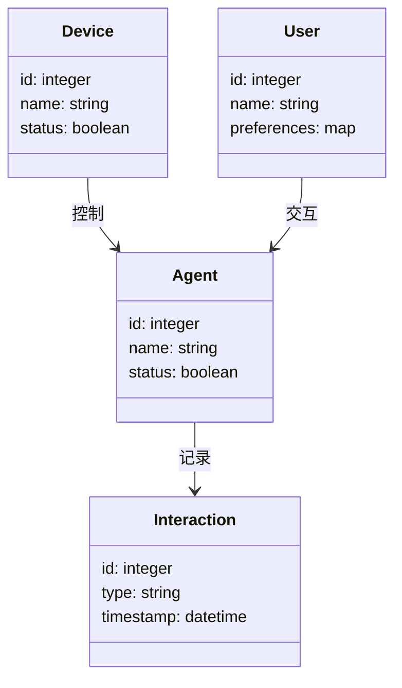
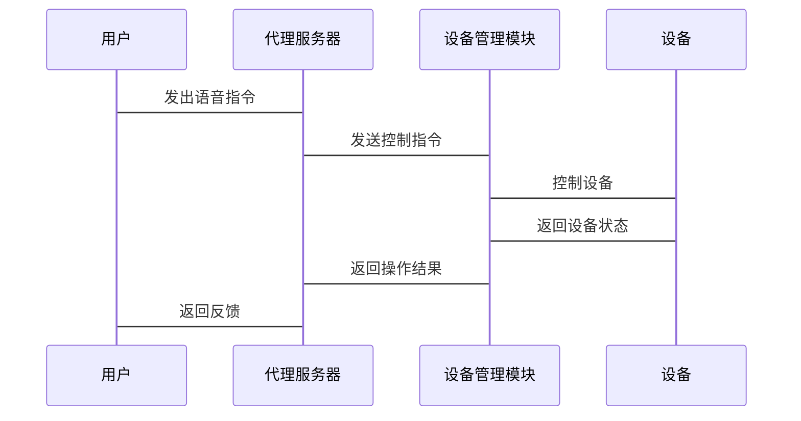

                 


# 智能家居AI Agent：打造智能生活管家

> 关键词：智能家居，AI Agent，人工智能，自然语言处理，系统架构，任务规划

> 摘要：本文将深入探讨智能家居AI Agent的核心概念、技术实现和系统设计。通过分析智能家居AI Agent的背景与需求，揭示其核心原理与算法实现。结合实际案例，详细讲解智能家居AI Agent的系统架构设计与项目实战。最后，总结智能家居AI Agent的发展趋势与未来展望。

---

# 第一部分：智能家居AI Agent背景与概念

# 第1章：智能家居AI Agent概述

## 1.1 智能家居AI Agent的概念与背景

### 1.1.1 智能家居的定义与现状
智能家居是指通过物联网（IoT）技术将家庭中的设备（如灯光、空调、安防设备等）连接到一个统一的系统中，实现智能化的控制与管理。智能家居的现状包括以下几个方面：
- **设备互联**：通过Wi-Fi、蓝牙、ZigBee等协议实现设备间的互联。
- **自动化控制**：通过传感器和自动化控制系统实现设备的智能控制。
- **用户需求多样化**：不同用户对智能家居的功能需求差异较大，需要更加个性化的解决方案。

### 1.1.2 AI Agent的核心概念与特点
AI Agent（智能代理）是一种能够感知环境、自主决策并执行任务的智能系统。其核心特点包括：
- **自主性**：能够在没有人工干预的情况下自主完成任务。
- **反应性**：能够实时感知环境变化并做出相应的反应。
- **学习能力**：通过机器学习算法不断优化自身的决策能力。

### 1.1.3 智能家居AI Agent的应用价值
智能家居AI Agent能够为用户提供以下价值：
- **提升生活便利性**：通过自动化控制设备，提升用户的日常生活便利性。
- **降低能耗**：通过智能优化设备运行状态，降低能源消耗。
- **提高安全性**：通过智能监控与报警系统，提升家庭安全性。

## 1.2 智能家居AI Agent的背景与需求

### 1.2.1 智能家居的发展历程
智能家居的概念最早可以追溯到20世纪90年代，随着物联网技术的发展，智能家居逐渐从概念走向实际应用。近年来，随着人工智能技术的快速发展，智能家居AI Agent逐渐成为智能家居的核心技术。

### 1.2.2 用户需求与痛点分析
智能家居的用户需求主要集中在以下几个方面：
- **设备控制的便捷性**：用户希望能够通过语音、手机APP等多种方式便捷地控制设备。
- **设备兼容性**：不同品牌和类型的设备需要能够互联互通。
- **个性化需求**：用户希望系统能够根据自己的生活习惯提供个性化的服务。

智能家居的痛点主要表现在：
- **设备兼容性差**：不同品牌和类型的设备之间难以实现无缝连接。
- **系统稳定性不足**：智能家居系统的稳定性较差，容易出现故障。
- **安全性问题**：智能家居系统存在安全隐患，容易被黑客攻击。

### 1.2.3 AI技术在智能家居中的作用
AI技术在智能家居中的作用主要体现在以下几个方面：
- **设备控制的智能化**：通过AI技术实现设备的智能控制。
- **用户行为分析**：通过AI技术分析用户的习惯，提供个性化的服务。
- **系统优化**：通过AI技术优化系统的运行效率，提升系统的稳定性。

## 1.3 智能家居AI Agent的边界与外延

### 1.3.1 智能家居的边界定义
智能家居的边界主要体现在以下几个方面：
- **设备范围**：智能家居设备包括灯光、空调、安防设备等。
- **控制范围**：智能家居系统可以控制设备的开关、运行模式等。
- **服务范围**：智能家居系统可以提供设备控制、环境监控、报警等多种服务。

### 1.3.2 AI Agent的功能范围
AI Agent的功能范围包括以下几个方面：
- **设备控制**：通过AI技术实现设备的智能控制。
- **用户行为分析**：通过AI技术分析用户的习惯，提供个性化的服务。
- **任务执行**：通过AI技术实现任务的自动执行。

### 1.3.3 智能家居与AI Agent的交互方式
智能家居与AI Agent的交互方式主要体现在以下几个方面：
- **语音交互**：通过语音助手实现设备的控制。
- **手机APP交互**：通过手机APP实现设备的控制和系统设置。
- **智能面板交互**：通过智能面板实现设备的控制和状态监控。

## 1.4 智能家居AI Agent的核心要素

### 1.4.1 设备连接与控制
设备连接与控制是智能家居AI Agent的核心要素之一，主要包括以下几个方面：
- **设备连接**：通过物联网技术实现设备之间的互联。
- **设备控制**：通过AI技术实现设备的智能控制。

### 1.4.2 用户需求识别与解析
用户需求识别与解析是智能家居AI Agent的核心要素之一，主要包括以下几个方面：
- **需求识别**：通过自然语言处理技术识别用户的意图。
- **需求解析**：通过解析用户的意图实现任务的自动执行。

### 1.4.3 任务执行与反馈
任务执行与反馈是智能家居AI Agent的核心要素之一，主要包括以下几个方面：
- **任务执行**：通过AI技术实现任务的自动执行。
- **反馈机制**：通过反馈机制实现系统的优化与改进。

## 1.5 本章小结
本章主要介绍了智能家居AI Agent的概念、背景、需求和核心要素。通过分析智能家居AI Agent的背景与需求，揭示了其核心原理与算法实现。接下来的章节将深入探讨智能家居AI Agent的核心原理与算法实现。

---

# 第2章：智能家居AI Agent的核心原理

## 2.1 AI Agent的技术基础

### 2.1.1 自然语言处理（NLP）原理
自然语言处理（NLP）是AI Agent实现用户意图识别的核心技术之一。NLP的主要原理包括以下几个方面：
- **文本分词**：将用户输入的文本分割成词语或短语。
- **句法分析**：分析文本的语法结构，理解句子的含义。
- **语义理解**：通过理解文本的语义实现用户意图的识别。

### 2.1.2 机器学习与深度学习
机器学习与深度学习是AI Agent实现任务规划与执行的核心技术之一。机器学习的主要原理包括以下几个方面：
- **监督学习**：通过标注数据进行模型训练，实现任务的分类或回归。
- **无监督学习**：通过未标注数据进行模型训练，实现数据的聚类或降维。
- **深度学习**：通过多层神经网络实现数据的特征提取与模型训练。

### 2.1.3 知识图谱与语义理解
知识图谱是AI Agent实现语义理解的重要技术之一。知识图谱的主要原理包括以下几个方面：
- **知识表示**：通过图结构表示知识，实现知识的组织与管理。
- **知识推理**：通过推理算法实现知识的推理与应用。
- **知识融合**：通过融合多源知识实现知识的综合应用。

## 2.2 智能家居AI Agent的系统架构

### 2.2.1 分层架构设计
智能家居AI Agent的系统架构可以分为以下几个层次：
- **感知层**：通过传感器和设备采集环境数据。
- **网络层**：通过物联网技术实现设备之间的数据传输。
- **计算层**：通过计算设备实现数据的处理与分析。
- **应用层**：通过应用软件实现设备的控制与管理。

### 2.2.2 组件间的关系与协作
智能家居AI Agent的组件间的关系与协作主要体现在以下几个方面：
- **设备管理模块**：负责设备的连接与控制。
- **用户交互模块**：负责与用户的交互，实现用户意图的识别。
- **任务执行模块**：负责任务的规划与执行。
- **反馈模块**：负责反馈任务执行的结果，实现系统的优化与改进。

### 2.2.3 数据流与信息处理流程
智能家居AI Agent的数据流与信息处理流程主要体现在以下几个方面：
- **数据采集**：通过传感器和设备采集环境数据。
- **数据传输**：通过物联网技术实现数据的传输。
- **数据处理**：通过计算设备实现数据的处理与分析。
- **任务执行**：通过任务执行模块实现任务的自动执行。
- **结果反馈**：通过反馈模块实现结果的反馈与系统的优化。

## 2.3 AI Agent的设计原则

### 2.3.1 用户隐私与数据安全
用户隐私与数据安全是智能家居AI Agent设计中的重要原则之一。主要体现在以下几个方面：
- **数据加密**：通过加密技术保护用户数据的安全。
- **访问控制**：通过访问控制技术实现数据的安全访问。
- **隐私保护**：通过隐私保护技术实现用户隐私的保护。

### 2.3.2 系统可扩展性与灵活性
系统可扩展性与灵活性是智能家居AI Agent设计中的重要原则之一。主要体现在以下几个方面：
- **模块化设计**：通过模块化设计实现系统的可扩展性。
- **插件化设计**：通过插件化设计实现系统的灵活性。
- **接口标准化**：通过标准化接口实现系统的扩展性。

### 2.3.3 人机交互的自然性与便捷性
人机交互的自然性与便捷性是智能家居AI Agent设计中的重要原则之一。主要体现在以下几个方面：
- **自然语言交互**：通过自然语言处理技术实现人机交互的自然性。
- **多模态交互**：通过多模态技术实现人机交互的便捷性。
- **个性化交互**：通过个性化交互技术实现人机交互的定制化。

## 2.4 智能家居AI Agent的交互方式

### 2.4.1 声控交互
声控交互是智能家居AI Agent的主要交互方式之一，主要体现在以下几个方面：
- **语音识别**：通过语音识别技术实现用户的语音输入。
- **语音合成**：通过语音合成技术实现系统的语音输出。
- **语音控制**：通过语音控制技术实现设备的智能控制。

### 2.4.2 视觉交互
视觉交互是智能家居AI Agent的另一种交互方式，主要体现在以下几个方面：
- **图像识别**：通过图像识别技术实现用户的图像输入。
- **视觉反馈**：通过视觉反馈技术实现系统的视觉输出。
- **手势控制**：通过手势识别技术实现设备的智能控制。

### 2.4.3 多模态交互
多模态交互是智能家居AI Agent的高级交互方式，主要体现在以下几个方面：
- **多模态识别**：通过多模态技术实现用户多种输入方式的识别。
- **多模态反馈**：通过多模态技术实现系统的多种输出方式的反馈。
- **个性化交互**：通过多模态技术实现用户个性化的交互需求。

## 2.5 本章小结
本章主要介绍了智能家居AI Agent的核心原理与系统架构。通过分析智能家居AI Agent的技术基础与设计原则，揭示了其核心原理与系统架构。接下来的章节将深入探讨智能家居AI Agent的算法原理与系统设计。

---

# 第3章：智能家居AI Agent的算法实现

## 3.1 自然语言处理（NLP）算法

### 3.1.1 分词算法
分词算法是自然语言处理（NLP）的核心算法之一，主要体现在以下几个方面：
- **基于规则的分词算法**：通过预定义的规则实现文本的分词。
- **基于统计的分词算法**：通过统计语言模型实现文本的分词。
- **深度学习分词算法**：通过深度学习模型实现文本的分词。

### 3.1.2 语法分析与语义理解
语法分析与语义理解是自然语言处理（NLP）的重要算法之一，主要体现在以下几个方面：
- **语法分析**：通过语法树实现文本的语法分析。
- **语义理解**：通过语义网络实现文本的语义理解。
- **深度学习语义理解**：通过深度学习模型实现文本的语义理解。

### 3.1.3 基于深度学习的NLP模型
基于深度学习的NLP模型是当前自然语言处理领域的主流算法之一，主要体现在以下几个方面：
- **循环神经网络（RNN）**：通过循环神经网络实现文本的序列建模。
- **卷积神经网络（CNN）**：通过卷积神经网络实现文本的局部特征提取。
- ** transformer模型**：通过 transformer模型实现文本的全局特征提取。

## 3.2 任务规划与执行算法

### 3.2.1 基于规则的规划算法
基于规则的规划算法是任务规划与执行的核心算法之一，主要体现在以下几个方面：
- **预定义规则**：通过预定义规则实现任务的规划。
- **规则优先级**：通过规则优先级实现任务的执行顺序。
- **规则冲突处理**：通过规则冲突处理实现任务的优先级调整。

### 3.2.2 基于强化学习的规划算法
基于强化学习的规划算法是任务规划与执行的高级算法之一，主要体现在以下几个方面：
- **强化学习模型**：通过强化学习模型实现任务的规划与执行。
- **奖励机制**：通过奖励机制实现任务的优化与改进。
- **策略优化**：通过策略优化实现任务的高效执行。

### 3.2.3 多目标优化算法
多目标优化算法是任务规划与执行的优化算法之一，主要体现在以下几个方面：
- **多目标优化模型**：通过多目标优化模型实现任务的优化与平衡。
- ** Pareto最优解**：通过 Pareto最优解实现任务的最优执行。
- **动态优化**：通过动态优化实现任务的实时优化与调整。

## 3.3 用户意图识别算法

### 3.3.1 基于统计的意图识别
基于统计的意图识别是用户意图识别的核心算法之一，主要体现在以下几个方面：
- **统计模型**：通过统计模型实现用户意图的识别。
- **特征提取**：通过特征提取实现用户意图的分析。
- **分类算法**：通过分类算法实现用户意图的分类。

### 3.3.2 基于深度学习的意图识别
基于深度学习的意图识别是用户意图识别的高级算法之一，主要体现在以下几个方面：
- **深度学习模型**：通过深度学习模型实现用户意图的识别。
- **端到端模型**：通过端到端模型实现用户意图的直接识别。
- **自适应模型**：通过自适应模型实现用户意图的动态识别。

### 3.3.3 模型训练与优化
模型训练与优化是用户意图识别的重要环节之一，主要体现在以下几个方面：
- **数据预处理**：通过数据预处理实现数据的清洗与标准化。
- **模型训练**：通过模型训练实现模型的参数优化。
- **模型评估**：通过模型评估实现模型的性能优化。

## 3.4 本章小结
本章主要介绍了智能家居AI Agent的算法实现，包括自然语言处理（NLP）算法、任务规划与执行算法以及用户意图识别算法。通过分析这些算法的原理与实现，揭示了智能家居AI Agent的核心技术与实现方法。

---

# 第4章：智能家居AI Agent的系统分析与架构设计

## 4.1 问题场景介绍
智能家居AI Agent的系统分析与架构设计主要针对以下问题场景：
- **设备兼容性问题**：不同品牌和类型的设备之间难以实现无缝连接。
- **系统稳定性问题**：智能家居系统的稳定性较差，容易出现故障。
- **安全性问题**：智能家居系统存在安全隐患，容易被黑客攻击。

## 4.2 项目介绍

### 4.2.1 项目目标
本项目的目标是通过智能家居AI Agent实现设备的智能控制与管理，提升用户的生活便利性与安全性。

### 4.2.2 项目范围
本项目的主要范围包括设备连接与控制、用户需求识别与解析、任务执行与反馈等方面。

## 4.3 系统功能设计

### 4.3.1 领域模型（Mermaid类图）


### 4.3.2 系统架构（Mermaid架构图）


### 4.3.3 系统接口设计
系统接口设计主要包括以下几个方面：
- **设备接口**：设备通过物联网协议与系统进行通信。
- **用户接口**：用户通过语音、手机APP等多种方式与系统进行交互。
- **代理接口**：代理服务器通过API与设备管理模块进行通信。

### 4.3.4 系统交互（Mermaid序列图）


## 4.4 本章小结
本章主要介绍了智能家居AI Agent的系统分析与架构设计。通过分析问题场景，设计了系统的功能模块与架构，明确了系统的接口与交互流程。

---

# 第5章：智能家居AI Agent的项目实战

## 5.1 环境安装

### 5.1.1 安装Python环境
```bash
# 安装Python
sudo apt-get install python3 python3-pip
```

### 5.1.2 安装必要的Python库
```bash
# 安装必要的Python库
pip install numpy
pip install pandas
pip install scikit-learn
pip install transformers
```

## 5.2 系统核心实现源代码

### 5.2.1 设备管理模块
```python
class DeviceManager:
    def __init__(self):
        self.devices = {}

    def add_device(self, device_id, device_type):
        # 添加设备
        self.devices[device_id] = {'type': device_type, 'status': False}

    def control_device(self, device_id, status):
        # 控制设备
        if device_id in self.devices:
            self.devices[device_id]['status'] = status
            return True
        return False

    def get_device_status(self, device_id):
        # 获取设备状态
        return self.devices.get(device_id, {}).get('status', False)
```

### 5.2.2 用户交互模块
```python
class UserManager:
    def __init__(self):
        self.users = {}

    def add_user(self, user_id, name):
        # 添加用户
        self.users[user_id] = {'name': name, 'preferences': {}}

    def get_user_preference(self, user_id, preference_key):
        # 获取用户偏好
        return self.users.get(user_id, {}).get('preferences', {}).get(preference_key, None)

    def update_user_preference(self, user_id, preference_key, value):
        # 更新用户偏好
        if user_id in self.users:
            self.users[user_id]['preferences'][preference_key] = value
            return True
        return False
```

### 5.2.3 代理模块
```python
class Agent:
    def __init__(self, device_manager, user_manager):
        self.device_manager = device_manager
        self.user_manager = user_manager

    def process_command(self, user_id, command):
        # 处理命令
        user = self.user_manager.get_user(user_id)
        if not user:
            return "用户不存在"

        device_id = self.extract_device_id(command)
        if not device_id:
            return "无法识别设备"

        status = self.extract_status(command)
        if status is None:
            return "无法识别状态"

        if self.device_manager.control_device(device_id, status):
            return "设备控制成功"
        else:
            return "设备控制失败"

    def extract_device_id(self, command):
        # 提取设备ID
        # 具体实现根据自然语言处理技术
        pass

    def extract_status(self, command):
        # 提取状态
        # 具体实现根据自然语言处理技术
        pass
```

## 5.3 代码应用解读与分析

### 5.3.1 设备管理模块分析
设备管理模块的主要功能包括设备的添加、控制与状态查询。通过设备管理模块，可以实现设备的智能控制与管理。

### 5.3.2 用户交互模块分析
用户交互模块的主要功能包括用户的添加、偏好设置与交互。通过用户交互模块，可以实现用户的个性化需求与交互。

### 5.3.3 代理模块分析
代理模块的主要功能包括命令的处理与设备的控制。通过代理模块，可以实现用户的命令处理与设备的智能控制。

## 5.4 实际案例分析

### 5.4.1 案例描述
假设用户发出语音指令："关闭客厅的灯光"，代理模块需要通过自然语言处理技术识别用户的意图，然后通过设备管理模块实现灯光的关闭。

### 5.4.2 案例实现
```python
agent = Agent(DeviceManager(), UserManager())
agent.process_command(1, "关闭客厅的灯光")
```

### 5.4.3 案例分析
通过上述案例，可以看出智能家居AI Agent的核心功能包括用户的意图识别、设备的智能控制与任务的执行。通过系统的协作，可以实现用户的个性化需求与智能化管理。

## 5.5 本章小结
本章主要介绍了智能家居AI Agent的项目实战，包括环境安装、系统核心实现源代码、代码应用解读与分析以及实际案例分析。通过实际案例的分析与实现，进一步验证了系统的可行性与实用性。

---

# 第6章：智能家居AI Agent的总结与展望

## 6.1 本章总结
智能家居AI Agent作为一种新兴的技术，其应用前景广阔。通过本文的分析与实现，我们深入探讨了智能家居AI Agent的核心概念、技术实现与系统设计。通过系统的协作，可以实现用户的个性化需求与智能化管理。

## 6.2 未来发展趋势
智能家居AI Agent的未来发展趋势主要体现在以下几个方面：
- **智能化提升**：通过人工智能技术的进一步发展，智能家居AI Agent的智能化水平将不断提高。
- **多模态交互**：通过多模态技术的发展，智能家居AI Agent的交互方式将更加多样化与便捷化。
- **安全性增强**：通过安全技术的不断优化，智能家居AI Agent的安全性将不断提升。

## 6.3 展望
随着人工智能技术的不断发展，智能家居AI Agent的应用前景将更加广阔。未来，智能家居AI Agent将更加智能化、便捷化与安全化，为用户提供更加优质的服务。

---

# 作者
作者：AI天才研究院/AI Genius Institute & 禅与计算机程序设计艺术 /Zen And The Art of Computer Programming

