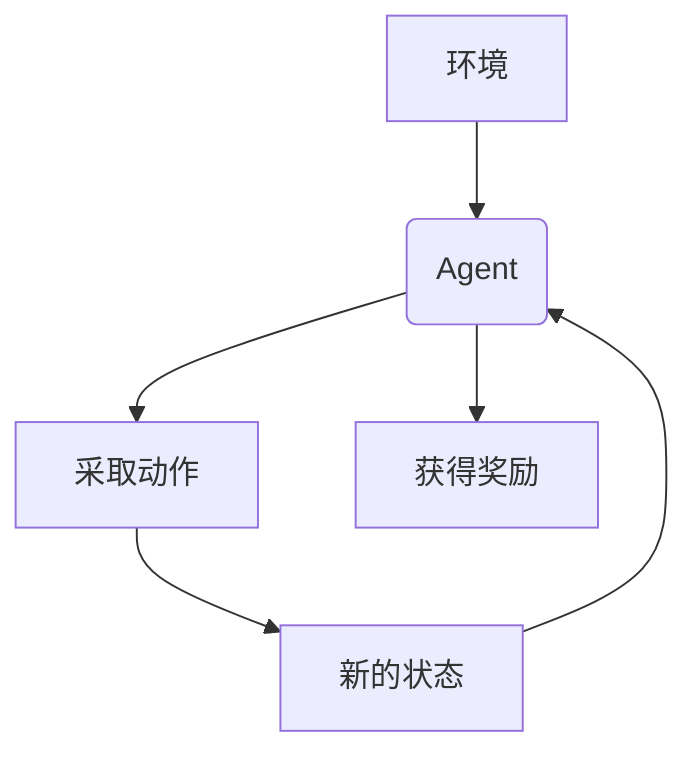
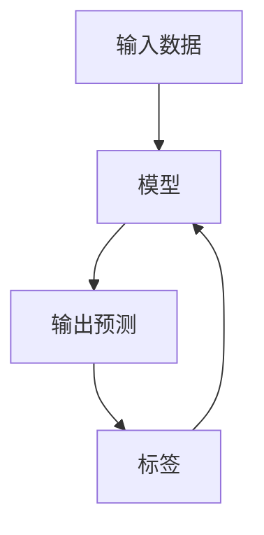
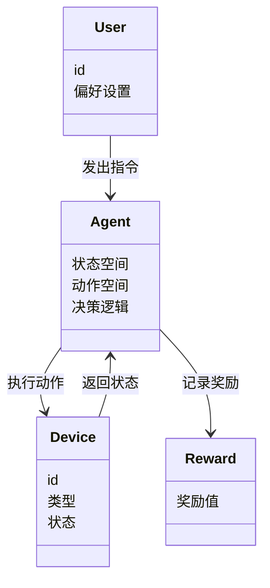
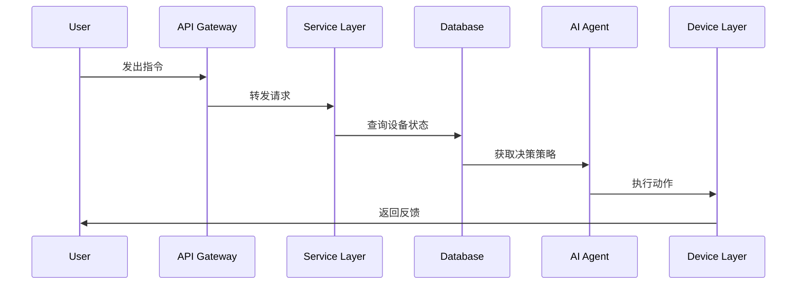

                 


# 智能家居中的AI Agent控制中心

## 关键词：
智能家居, AI Agent, 控制中心, 人工智能, 设备管理, 智能交互

## 摘要：
智能家居中的AI Agent控制中心是一个集成化的管理平台，利用人工智能技术实现对家庭设备的智能控制和优化管理。本文详细探讨了AI Agent在智能家居中的作用，分析了其核心概念、算法原理、系统架构以及实际应用场景。通过案例分析和代码实现，展示了如何构建一个高效的AI Agent控制中心，为智能家居的未来发展提供了理论和实践指导。

---

# 第一部分: 智能家居中的AI Agent控制中心概述

## 第1章: 智能家居与AI Agent的背景介绍

### 1.1 智能家居的发展历程
智能家居的概念起源于20世纪90年代，随着物联网技术的发展，智能家居逐渐从概念走向实际应用。智能家居的发展经历了以下几个阶段：

1. **单点控制阶段**：每个设备独立连接到互联网，通过手机APP进行远程控制。
2. **自动化阶段**：设备之间通过智能中枢进行联动，例如灯光和空调可以根据用户的习惯自动开启或关闭。
3. **智能化阶段**：引入AI技术，设备能够学习用户的行为模式，提供更个性化的服务。

智能家居的核心特点包括：设备互联、自动化控制、智能化决策和用户友好性。当前智能家居市场主要由智能音箱、智能灯光、智能安防等设备组成，市场规模持续增长。

### 1.2 AI Agent的基本概念与作用
AI Agent是一种智能体，能够在特定环境中感知信息并采取行动以实现目标。AI Agent在智能家居中的作用主要体现在以下几个方面：

1. **设备控制**：AI Agent通过接收用户的指令或感知环境信息，控制智能家居设备的运行状态。
2. **数据处理**：AI Agent能够分析设备的运行数据和用户的行为数据，优化设备的使用效率。
3. **智能交互**：AI Agent通过自然语言处理技术，实现与用户的智能对话，提供更便捷的交互体验。

---

## 第2章: 智能家居中的AI Agent控制中心

### 2.1 智能家居控制中心的定义与功能
智能家居控制中心是一个集成化的管理平台，负责协调和控制智能家居设备的运行。其主要功能包括：

1. **设备管理**：对智能家居设备进行注册、配置和状态监控。
2. **指令解析**：接收用户的指令并将其转化为设备可执行的操作。
3. **决策控制**：基于环境数据和用户习惯，制定最优的设备控制策略。
4. **数据存储**：存储设备运行数据和用户行为数据，为后续优化提供依据。

### 2.2 AI Agent在控制中心中的角色与作用
AI Agent在智能家居控制中心中扮演核心角色，主要负责以下任务：

1. **状态感知**：通过传感器获取环境信息，例如温度、湿度、光照等。
2. **决策制定**：基于感知到的状态信息和用户偏好，制定设备控制策略。
3. **指令执行**：将决策结果转化为具体的设备控制指令，例如调节灯光亮度或开启空调。

---

## 第3章: AI Agent控制中心的核心概念与联系

### 3.1 AI Agent控制中心的核心概念
AI Agent控制中心的核心概念包括状态空间、动作空间、观察与决策过程以及奖励机制。

1. **状态空间**：指系统在某一时刻的所有可能状态的集合。例如，智能家居中的状态可以是设备的运行状态、环境参数等。
2. **动作空间**：指系统能够执行的所有动作的集合。例如，AI Agent可以控制设备的开关、调节设备的参数等。
3. **观察与决策过程**：AI Agent通过观察环境信息和系统状态，做出决策并执行动作。
4. **奖励机制**：用于评估AI Agent的决策是否符合预期目标。例如，当AI Agent成功调节室内温度到目标值时，会获得正向奖励。

### 3.2 核心概念的属性对比
以下是核心概念的属性对比表：

| 概念       | 描述                                                                 |
|------------|----------------------------------------------------------------------|
| 状态空间    | 系统所有可能的状态集合                                               |
| 动作空间    | 系统能够执行的所有动作集合                                           |
| 观察        | AI Agent感知环境信息的途径                                           |
| 决策        | AI Agent基于观察做出的选择                                           |
| 奖励机制    | 评估AI Agent决策是否符合目标的机制                                   |

### 3.3 ER实体关系图
以下是AI Agent控制中心的ER实体关系图：

```mermaid
er
    Actor: 用户
    Agent: AI Agent
    Device: 智能设备
    Action: 动作
    State: 状态
    Reward: 奖励
    Actor --> Agent: 发出指令
    Agent --> Action: 执行动作
    Action --> Device: 影响设备状态
    Device --> State: 返回状态
    Agent --> Reward: 收到奖励
```

---

## 第4章: AI Agent控制中心的算法原理

### 4.1 强化学习算法
强化学习是一种通过试错机制来优化决策的算法。AI Agent通过与环境的交互，学习最优策略。以下是强化学习的流程图：



以下是强化学习的数学模型：

$$
Q(s, a) = Q(s, a) + \alpha (r + \gamma \max Q(s', a') - Q(s, a))
$$

其中，$Q$ 表示价值函数，$s$ 表示状态，$a$ 表示动作，$\alpha$ 表示学习率，$\gamma$ 表示折扣因子。

### 4.2 监督学习算法
监督学习是一种基于样本数据进行训练的算法。AI Agent通过监督学习算法，可以学习如何根据输入数据做出正确的决策。以下是监督学习的流程图：



以下是监督学习的数学模型：

$$
\text{损失函数} = \frac{1}{n} \sum_{i=1}^{n} (y_i - \hat{y}_i)^2
$$

其中，$y_i$ 表示真实标签，$\hat{y}_i$ 表示预测值。

---

## 第5章: 系统分析与架构设计方案

### 5.1 问题场景介绍
智能家居控制中心需要处理多个设备之间的协同工作，同时需要考虑用户的个性化需求和环境变化。例如，当用户离开家时，系统需要自动关闭灯光和空调，同时记录用户的习惯以优化未来的控制策略。

### 5.2 系统功能设计
以下是系统功能设计的类图：



### 5.3 系统架构设计
以下是系统架构设计的架构图：


### 5.4 系统接口设计
以下是系统接口设计的序列图：



---

## 第6章: 项目实战

### 6.1 环境安装
要实现AI Agent控制中心，首先需要安装以下环境：

1. **Python 3.8+**
2. **TensorFlow库**
3. **Flask框架**
4. **其他依赖库**

### 6.2 核心功能实现
以下是AI Agent的核心功能实现代码：

```python
class AI-Agent:
    def __init__(self):
        self.states = []
        self.actions = []
        self.rewards = []
    
    def perceive(self):
        # 获取环境信息
        pass
    
    def decide(self):
        # 制定决策策略
        pass
    
    def act(self):
        # 执行动作
        pass
```

### 6.3 实际案例分析
以下是一个实际案例的分析：

假设用户希望在晚上10点自动关闭所有灯光，AI Agent可以根据用户的指令和设备状态，制定相应的控制策略。

### 6.4 代码应用解读与分析
以下是代码的解读与分析：

1. **AI Agent类**：负责感知环境、制定决策和执行动作。
2. **状态感知**：通过传感器获取环境信息。
3. **决策制定**：基于感知到的信息，制定最优的控制策略。
4. **动作执行**：将决策结果转化为具体的设备控制指令。

---

## 第7章: 最佳实践与小结

### 7.1 最佳实践
1. **数据隐私保护**：确保用户的隐私数据不会被泄露。
2. **系统可扩展性**：设计时考虑未来的扩展需求。
3. **用户体验优化**：不断优化系统的交互设计，提升用户体验。

### 7.2 注意事项
1. **算法选择**：根据实际需求选择合适的算法。
2. **系统安全性**：确保系统的安全性，防止黑客攻击。
3. **数据存储**：合理设计数据存储结构，确保数据的完整性和一致性。

### 7.3 未来展望
随着AI技术的不断发展，智能家居中的AI Agent控制中心将更加智能化和个性化。未来的研究方向包括：强化学习的优化、多设备协同工作的优化以及用户隐私保护等。

---

## 作者：AI天才研究院/AI Genius Institute & 禅与计算机程序设计艺术 /Zen And The Art of Computer Programming

