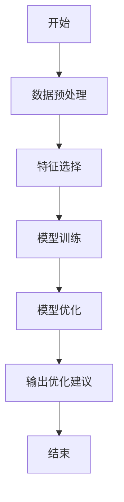
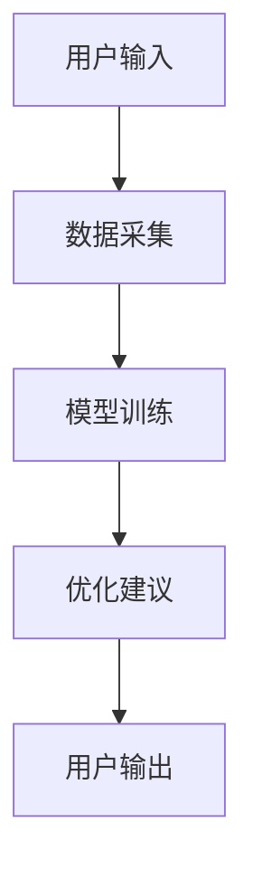

                 


# 智能家族信托规划与税务优化助手

> 关键词：智能家族信托，税务优化，人工智能，机器学习，算法原理，系统架构

> 摘要：本文探讨了智能家族信托在税务优化中的应用，结合AI技术，分析了其核心概念、算法原理、系统架构，并通过实际案例展示了其在税务优化中的优势。

---

# 第一部分: 智能家族信托规划与税务优化概述

## 第1章: 智能家族信托的基本概念

### 1.1 家族信托的定义与特点

#### 1.1.1 家族信托的定义
家族信托是一种法律结构，允许个人或家庭将资产转移给受托人，以实现资产保护、财富传承和税务优化等目标。

#### 1.1.2 智能家族信托的核心特点
- **智能性**：利用AI技术进行自动化决策和优化。
- **高效性**：通过算法快速分析和调整信托结构。
- **隐私性**：确保家族资产的安全和隐私。

### 1.2 税务优化的重要性

#### 1.2.1 税务优化的目标
- 最小化税务负担。
- 避免税务风险。
- 优化资产配置。

#### 1.2.2 税务优化的核心原则
- 合规性：确保所有操作符合法律法规。
- 效益性：最大化税务节省。
- 可持续性：长期稳定的税务优化策略。

### 1.3 智能家族信托的优势

#### 1.3.1 AI技术的应用
- 数据分析：通过AI分析历史税务数据，预测未来趋势。
- 自动化决策：AI算法自动调整信托结构，优化税务负担。

#### 1.3.2 高效性
- 快速响应：AI算法能够快速处理大量数据，提供实时优化建议。
- 准确性：通过机器学习模型提高决策的准确性。

---

## 第2章: 智能家族信托与税务优化的关系

### 2.1 税务优化的原理

#### 2.1.1 税务结构分析
- 资产转移的税务影响。
- 不同税务类型的优化策略。

#### 2.1.2 AI技术在税务优化中的作用
- 数据挖掘：从大量数据中提取有用信息。
- 模型构建：建立数学模型，模拟不同情况下的税务负担。

### 2.2 AI算法在智能家族信托中的应用

#### 2.2.1 机器学习算法
- 线性回归：预测税务负担。
- 支持向量机（SVM）：分类税务风险。

#### 2.2.2 算法流程图


### 2.3 系统架构设计

#### 2.3.1 系统模块
- 数据采集模块：收集税务数据。
- 模型训练模块：训练AI模型。
- 优化建议模块：生成优化建议。

#### 2.3.2 系统架构图


---

## 第3章: AI算法在税务优化中的应用

### 3.1 机器学习算法的原理

#### 3.1.1 线性回归
- 公式：$$ y = \beta_0 + \beta_1 x + \epsilon $$
- 应用：预测税务负担。

#### 3.1.2 支持向量机（SVM）
- 原理：通过划分数据点，实现分类。
- 应用：分类税务风险。

### 3.2 数学模型的建立

#### 3.2.1 优化模型
- 目标函数：$$ \text{最小化} \sum (w_i \cdot x_i) $$
- 约束条件：$$ w_i \geq 0 $$

#### 3.2.2 模型实现
```python
import numpy as np
from sklearn import svm

# 数据准备
X = np.array([[x1, x2], ...])
y = np.array([y1, y2, ...])

# 模型训练
model = svm.SVC()
model.fit(X, y)

# 预测
print(model.predict([[new_x1, new_x2]]))
```

---

## 第4章: 系统分析与架构设计

### 4.1 问题场景介绍

#### 4.1.1 问题描述
- 家族信托的税务优化需要考虑多种因素，如资产类型、税务政策变化等。

#### 4.1.2 解决方案
- 利用AI技术实时监控税务政策变化，提供动态优化建议。

### 4.2 系统功能设计

#### 4.2.1 功能模块
- 数据采集：收集税务数据。
- 模型训练：训练AI模型。
- 优化建议：生成优化建议。

#### 4.2.2 功能流程图


---

## 第5章: 项目实战

### 5.1 环境安装

#### 5.1.1 安装Python
```bash
python --version
pip install numpy scikit-learn
```

### 5.2 核心实现

#### 5.2.1 数据预处理
```python
import pandas as pd
data = pd.read_csv('tax_data.csv')
data.head()
```

#### 5.2.2 模型训练
```python
from sklearn.model_selection import train_test_split
X_train, X_test, y_train, y_test = train_test_split(data.drop('tax', axis=1), data['tax'])
model.fit(X_train, y_train)
```

### 5.3 实际案例分析

#### 5.3.1 案例背景
- 家族信托资产：1000万美元。
- 税务政策变化：税率调整。

#### 5.3.2 模型优化
- 输入数据：资产分布、税率变化。
- 输出结果：优化建议。

---

## 第6章: 最佳实践与小结

### 6.1 小结
智能家族信托结合AI技术，能够高效优化税务结构，提高资产保值能力。

### 6.2 注意事项
- 确保数据隐私和合规性。
- 定期更新模型，适应政策变化。

### 6.3 拓展阅读
- 推荐阅读《机器学习实战》和《税务优化策略》。

---

# 作者：AI天才研究院 & 禅与计算机程序设计艺术

---

# 结语

通过以上分析，智能家族信托规划与税务优化助手能够有效结合AI技术，为用户提供高效的税务优化解决方案。希望本文能为读者提供有价值的见解和指导。

