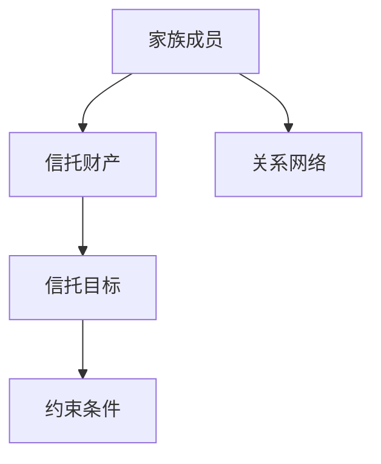
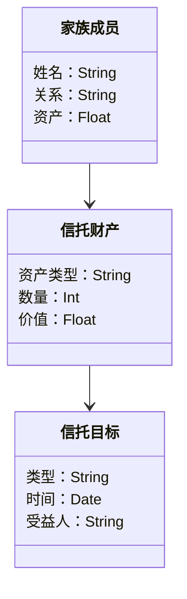
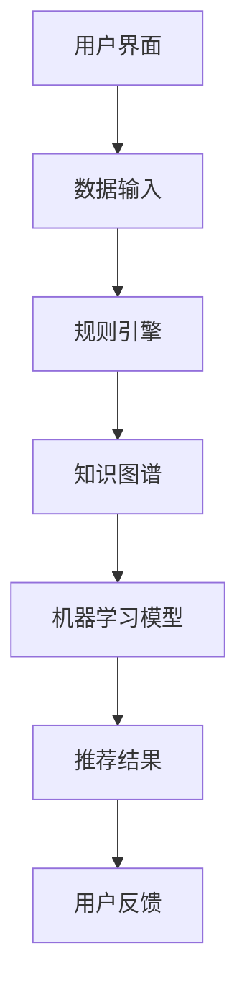
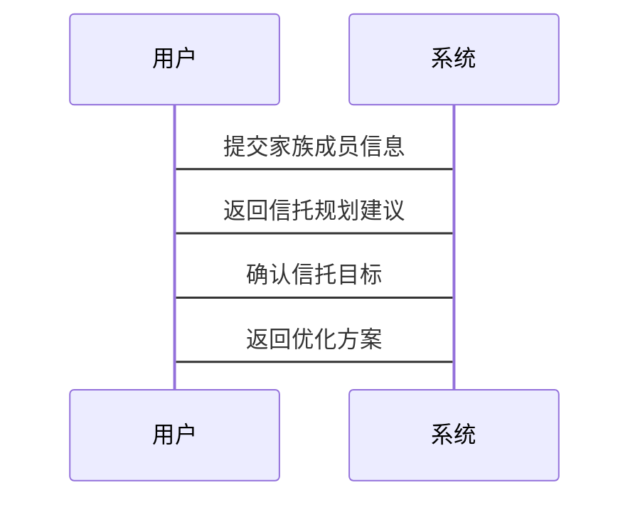

                 


# 智能家族信托规划助手

> 关键词：智能家族信托，人工智能，知识图谱，规则引擎，算法推荐，系统架构

> 摘要：智能家族信托规划助手是一种基于人工智能技术的智能助手，旨在优化和个性化家族信托的规划过程。本文将深入探讨智能家族信托的核心概念、算法原理、系统架构以及实际应用，通过具体的案例分析，展示如何利用AI技术提升家族信托的规划效率和准确性。

---

## 第一部分: 智能家族信托规划助手概述

### 第1章: 家族信托的基本概念与智能规划的必要性

#### 1.1 家族信托的基本概念

##### 1.1.1 信托的基本定义
信托是一种法律结构，允许个人或机构（委托人）将资产转移给他人（受托人），以管理这些资产并为受益人提供利益。信托的核心在于将资产的所有权与控制权分离。

##### 1.1.2 家族信托的定义与特点
家族信托是为特定家族设计的信托，通常用于财富传承、资产保护、税务优化和家族治理。其特点包括：
- **长期性**：信托通常设定长期目标，确保家族财富的稳定传承。
- **灵活性**：可以根据家族需求定制信托条款。
- **隐私性**：信托的细节通常不公开，保护家族隐私。

##### 1.1.3 家族信托的核心功能与作用
- 财富传承：确保家族财富在代际之间的合法转移。
- 资产保护：防止家族资产因离婚、债务等问题受损。
- 税务优化：通过合理的信托结构降低税务负担。
- 家族治理：通过信托条款规范家族成员的行为和责任。

#### 1.2 智能家族信托规划的必要性

##### 1.2.1 传统家族信托的局限性
- **复杂性**：传统信托规划需要手动分析大量数据，耗时且容易出错。
- **个性化不足**：传统方法难以满足每个家族的个性化需求。
- **动态调整困难**：市场变化或家族情况变化时，信托调整成本高。

##### 1.2.2 智能化规划的优势
- **高效性**：利用AI技术快速分析和生成信托规划方案。
- **个性化**：根据家族的实时数据提供定制化建议。
- **动态调整**：实时监控市场变化和家族需求，自动优化信托方案。

##### 1.2.3 智能家族信托的未来发展趋势
随着AI和大数据技术的不断发展，智能家族信托将更加智能化和个性化，能够实时响应家族需求，提供最优的信托规划方案。

#### 1.3 人工智能在家族信托规划中的应用

##### 1.3.1 AI技术在财富管理中的作用
- 数据分析：通过AI分析家族成员的财务状况、资产分布和税务信息。
- 模型构建：利用机器学习算法构建信托规划模型，预测最优方案。
- 自动化推荐：基于历史数据和实时信息，自动化生成信托规划建议。

##### 1.3.2 智能家族信托规划的实现方式
- **知识图谱**：构建家族成员和信托目标的知识网络，用于智能推理。
- **规则引擎**：根据信托法规和家族需求，设计规则驱动的推荐系统。
- **数据驱动优化**：通过机器学习算法优化信托方案，提升效率和准确性。

##### 1.3.3 AI算法在信托规划中的具体应用
- 使用协同过滤算法推荐信托产品。
- 基于深度学习的自然语言处理技术分析信托合同。
- 利用强化学习优化信托投资组合。

---

## 第2章: 智能家族信托规划的核心概念与联系

### 2.1 家族信托规划的核心要素

#### 2.1.1 家族成员关系
- **关系网络**：家族成员之间的关系（如父子、兄弟、配偶等）是信托规划的基础。
- **社交网络**：家族成员的社交关系可能影响信托的设立和执行。

#### 2.1.2 财产类型与分布
- **资产种类**：包括金融资产（股票、债券）、不动产、企业股权等。
- **资产分布**：资产在不同地区的分布可能影响税务规划和管理复杂性。

#### 2.1.3 信托目标与约束条件
- **目标设定**：如财富传承、资产保护、税务优化等。
- **约束条件**：如受益人范围、信托期限、分配规则等。

### 2.2 智能家族信托规划的逻辑框架

#### 2.2.1 知识图谱构建
- **知识图谱**：通过图结构表示家族成员、资产、信托目标之间的关系。
- **构建算法**：使用图嵌入算法（如Word2Vec）构建家族关系的向量表示。

#### 2.2.2 规则引擎设计
- **规则引擎**：基于信托法规和家族需求，设计规则驱动的推荐系统。
- **规则优先级**：根据规则的重要性排序，确保推荐结果的合理性。

#### 2.2.3 数据驱动的优化策略
- **数据驱动优化**：通过机器学习模型优化信托方案，提升效率和准确性。
- **反馈机制**：根据用户反馈调整模型参数，持续优化推荐结果。

### 2.3 核心概念的ER实体关系图



---

## 第3章: 智能家族信托规划的算法原理

### 3.1 基于知识图谱的家族信托规划

#### 3.1.1 知识图谱构建算法
- **算法原理**：通过爬取家族成员和信托目标的关系数据，构建知识图谱。
- **代码示例**：
  ```python
  import networkx as nx
  G = nx.DiGraph()
  G.add_edge("父亲", "子女", label="继承人")
  G.add_edge("子女", "配偶", label="受益人")
  ```
- **数学模型**：
  $$\text{相似度}(u, v) = \frac{\sum_{k=1}^{n} w_k \cdot f_k(u, v)}{\sum_{k=1}^{n} w_k}$$
  其中，$w_k$ 是特征$k$的权重，$f_k(u, v)$ 是特征$k$的相似度计算函数。

#### 3.1.2 基于图的最短路径算法
- **算法描述**：通过计算家族成员之间的最短路径，确定信托财产的最佳分配路径。
- **代码示例**：
  ```python
  import networkx as nx
  shortest_path = nx.shortest_path(G, source="父亲", target="子女")
  ```

#### 3.1.3 知识图谱的优化与更新
- **优化策略**：定期更新知识图谱，确保数据的准确性和及时性。
- **数学模型**：
  $$\text{更新规则} = \arg\max_{r} \sum_{i=1}^{n} w_i \cdot r_i$$
  其中，$r_i$ 是规则$i$的权重，$w_i$ 是规则的重要性。

### 3.2 基于规则引擎的信托规划推荐

#### 3.2.1 规则引擎的工作原理
- **规则引擎**：通过预设的规则和条件，生成信托规划建议。
- **代码示例**：
  ```python
  def recommend_trust_plan(member_info):
      if member_info['age'] < 18:
          return "未成年人信托"
      elif member_info['income'] > 1000000:
          return "高收入信托"
      else:
          return "普通信托"
  ```

#### 3.2.2 规则的优先级与冲突解决
- **优先级排序**：根据规则的重要性排序，确保推荐结果的合理性。
- **冲突解决**：通过加权投票或协商机制解决规则冲突。

#### 3.2.3 基于规则的推荐算法实现
- **实现步骤**：
  1. 收集家族成员信息。
  2. 根据规则生成推荐方案。
  3. 优化推荐结果。

### 3.3 基于机器学习的优化策略

#### 3.3.1 机器学习模型的训练与优化
- **模型选择**：根据数据特征选择合适的机器学习模型（如决策树、随机森林）。
- **代码示例**：
  ```python
  from sklearn.ensemble import RandomForestClassifier
  model = RandomForestClassifier(n_estimators=100)
  model.fit(X_train, y_train)
  ```

#### 3.3.2 基于反馈的优化策略
- **反馈机制**：根据用户的反馈调整模型参数，提升推荐准确率。
- **数学模型**：
  $$\text{损失函数} = \sum_{i=1}^{n} (y_i - \hat{y}_i)^2$$
  其中，$y_i$ 是真实标签，$\hat{y}_i$ 是模型预测值。

---

## 第4章: 智能家族信托规划助手的系统分析与架构设计

### 4.1 系统功能设计

#### 4.1.1 领域模型


#### 4.1.2 系统架构设计


### 4.2 系统接口设计

#### 4.2.1 API接口
- **输入接口**：接收家族成员信息、资产分布和信托目标。
- **输出接口**：返回信托规划建议和优化方案。

#### 4.2.2 数据接口
- **数据源**：包括家族成员数据库、资产数据库和信托法规库。
- **数据处理**：通过数据清洗和特征提取，准备模型输入数据。

### 4.3 系统交互设计

#### 4.3.1 交互流程
1. 用户输入家族成员信息和资产分布。
2. 系统分析数据并生成信托目标。
3. 用户确认信托目标并提交。
4. 系统生成信托规划建议并展示。

#### 4.3.2 序列图


---

## 第5章: 智能家族信托规划助手的项目实战

### 5.1 环境安装

#### 5.1.1 安装Python
```bash
python --version
pip install --upgrade pip
```

#### 5.1.2 安装依赖库
```bash
pip install networkx matplotlib scikit-learn
```

### 5.2 核心代码实现

#### 5.2.1 知识图谱构建
```python
import networkx as nx
G = nx.DiGraph()
G.add_edge("父亲", "子女", label="继承人")
G.add_edge("子女", "配偶", label="受益人")
```

#### 5.2.2 规则引擎实现
```python
def recommend_trust_plan(member_info):
    if member_info['age'] < 18:
        return "未成年人信托"
    elif member_info['income'] > 1000000:
        return "高收入信托"
    else:
        return "普通信托"
```

### 5.3 案例分析与代码解读

#### 5.3.1 案例背景
假设一个家族有两位子女，分别有不同的资产和收入水平。

#### 5.3.2 代码实现
```python
members = [
    {"name": "子女1", "age": 30, "income": 800000},
    {"name": "子女2", "age": 25, "income": 600000}
]

for member in members:
    print(recommend_trust_plan(member))
```

#### 5.3.3 结果分析
- 子女1：高收入信托
- 子女2：普通信托

---

## 第6章: 智能家族信托规划助手的最佳实践

### 6.1 小结
智能家族信托规划助手通过结合AI技术和家族信托的核心要素，能够高效、准确地生成信托规划方案，帮助家族实现财富传承和资产保护的目标。

### 6.2 注意事项
- 数据隐私：确保家族成员和资产信息的安全性。
- 法规遵守：遵循相关法律法规，确保信托规划的合法性。
- 模型优化：定期更新模型参数，提升推荐准确率。

### 6.3 拓展阅读
- 《智能财富管理：AI与金融的结合》
- 《知识图谱在金融领域的应用》

---

## 作者：AI天才研究院/AI Genius Institute & 禅与计算机程序设计艺术 /Zen And The Art of Computer Programming

---

这篇文章详细介绍了智能家族信托规划助手的核心概念、算法原理和系统架构，通过实际案例分析展示了如何利用AI技术提升家族信托的规划效率和准确性。

