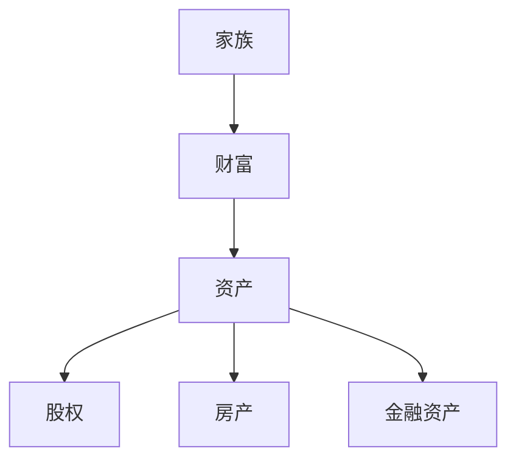
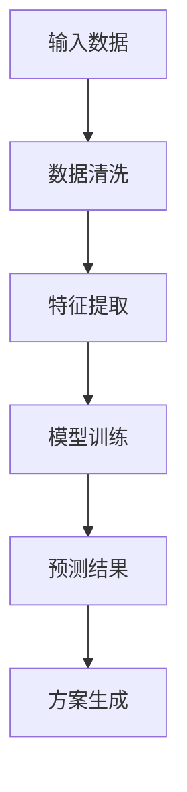
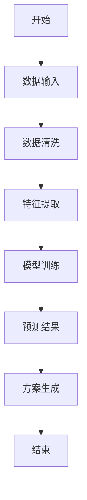
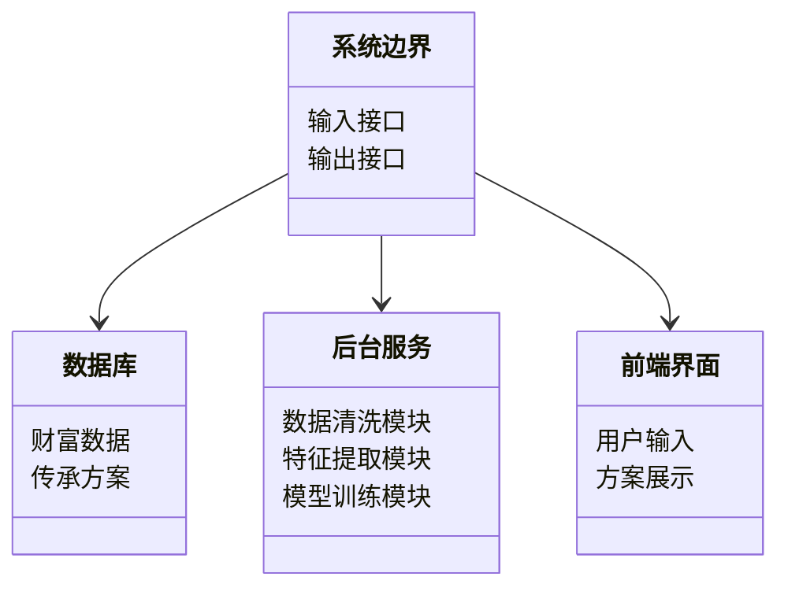
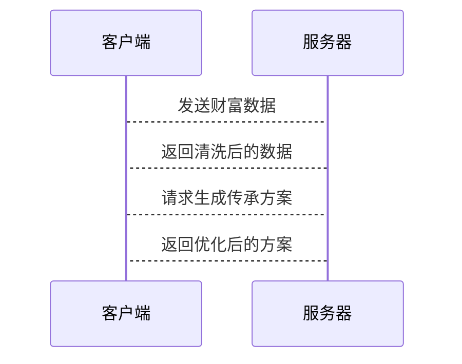

                 


# 智能家族财富传承规划助手

## 关键词：智能家族财富传承，规划助手，人工智能，财富管理，数字化传承

## 摘要：  
本文探讨了智能家族财富传承规划助手的背景、核心概念、算法原理、系统架构及其实现。通过分析家族财富传承的背景与挑战，结合人工智能技术，提出了一种智能化的财富传承规划方案，并通过数学模型和算法流程图详细阐述了其实现过程。文章还提供了系统架构设计、项目实战案例和代码实现，为读者提供全面的技术指导。

---

# 第一部分：智能家族财富传承规划助手的背景与核心概念

## 第1章：智能家族财富传承规划的背景与问题分析

### 1.1 家族财富传承的背景与挑战

#### 1.1.1 家族财富传承的历史演变
家族财富传承是人类社会的重要现象，经历了从简单的财产分配到复杂的资产配置的演变。随着社会的发展，家族财富不仅包括实物资产，还涉及金融资产、知识产权等多样化的财产形式。现代家族财富传承需要考虑的因素包括税务优化、资产保值、风险分散等。

#### 1.1.2 当代家族财富传承的主要问题
在当代社会，家族财富传承面临以下主要问题：
1. **复杂性增加**：随着资产种类的多样化，财富传承的复杂性显著增加。
2. **税务优化的难度**：不同国家和地区的税务政策差异使得税务优化变得复杂。
3. **风险管理不足**：传统传承方式难以应对市场波动、经济危机等外部风险。
4. **信息不对称**：家族成员之间可能存在的信息不对称影响传承的公平性和效率。

#### 1.1.3 数字化与智能化对财富传承的影响
数字化和智能化技术的快速发展为家族财富传承带来了新的机遇和挑战。智能技术可以帮助家族更好地管理和规划财富，通过数据分析和算法优化，实现财富传承的智能化和精准化。

### 1.2 智能家族财富传承规划的定义与目标

#### 1.2.1 智能家族财富传承规划的核心概念
智能家族财富传承规划是一种结合人工智能技术的财富管理解决方案，旨在通过智能化的分析和优化，为家族提供个性化的财富传承策略。其核心在于利用大数据分析、机器学习等技术，帮助家族实现财富的保值、增值和风险控制。

#### 1.2.2 智能家族财富传承规划的目标与价值
智能家族财富传承规划的目标包括：
1. **最大化财富价值**：通过智能化的资产配置和税务优化，实现财富的保值和增值。
2. **风险最小化**：利用智能算法预测和规避潜在风险，确保财富传承的安全性。
3. **公平与透明**：通过智能化的分配方案，确保财富传承的公平性和透明性。
4. **个性化服务**：根据家族的特殊需求，提供定制化的传承方案。

#### 1.2.3 智能家族财富传承规划的边界与外延
智能家族财富传承规划的边界包括：
1. **服务范围**：主要针对高净值家族，提供定制化服务。
2. **技术范围**：主要依赖人工智能、大数据分析等技术。
3. **法律与税务**：需要结合相关法律法规和税务政策。

其外延则包括家族企业传承、慈善事业规划、跨国财富传承等更广泛的应用场景。

---

## 第2章：智能家族财富传承规划的核心概念与联系

### 2.1 核心概念的原理与属性

#### 2.1.1 家族财富分析的原理
家族财富分析是智能传承规划的基础，其原理包括：
1. **数据收集**：收集家族的资产、负债、收入、支出等数据。
2. **数据分析**：通过数据分析识别财富结构中的关键问题。
3. **风险评估**：评估财富传承过程中可能面临的风险。

#### 2.1.2 财富传承规划的属性特征对比表
以下是财富传承规划的几个关键属性及其特征对比：

| 属性 | 特征 |
|------|------|
| 安全性 | 高风险控制、法律合规性 |
| 终身性 | 跨代生命周期、长期性 |
| 个性化 | 定制化方案、家族特殊需求 |
| 可持续性 | 资产保值增值、风险分散 |

#### 2.1.3 智能算法的核心要素
智能算法的核心要素包括：
1. **数据驱动**：基于大量数据的分析和学习。
2. **机器学习**：利用监督学习、无监督学习等算法进行预测和优化。
3. **动态调整**：根据市场变化和家族需求实时调整传承方案。

### 2.2 实体关系图与流程图

#### 2.2.1 家族财富传承的ER实体关系图


#### 2.2.2 智能规划的流程图


---

## 第3章：智能家族财富传承规划的算法原理

### 3.1 算法原理的数学模型

#### 3.1.1 财富分析的数学模型
财富分析的数学模型如下：
$$ W = \sum_{i=1}^{n} w_i \times a_i $$
其中，$W$ 表示家族财富总值，$w_i$ 表示各资产的权重，$a_i$ 表示各资产的价值。

#### 3.1.2 传承规划的优化模型
传承规划的优化模型如下：
$$ \text{Maximize } Z = \sum_{j=1}^{m} z_j \times p_j $$
$$ \text{subject to } \sum_{j=1}^{m} p_j \leq 1 $$
其中，$Z$ 表示规划的总价值，$z_j$ 表示各规划方案的权重，$p_j$ 表示各规划方案的执行概率。

### 3.2 算法流程图



### 3.3 算法实现代码

```python
import pandas as pd
from sklearn.linear_model import LinearRegression
from sklearn.metrics import accuracy_score

# 数据加载
data = pd.read_csv('wealth.csv')

# 特征提取
X = data[['资产', '负债', '收入', '支出']]
y = data['风险评分']

# 模型训练
model = LinearRegression()
model.fit(X, y)

# 预测结果
y_pred = model.predict(X)

# 方案生成
方案 = pd.DataFrame({
    '资产': X['资产'],
    '预测风险评分': y_pred
})
```

---

## 第4章：系统分析与架构设计

### 4.1 问题场景介绍
本系统旨在为高净值家族提供智能化的财富传承规划服务，通过数据分析和算法优化，帮助家族实现财富的保值和增值。

### 4.2 系统功能设计
系统功能包括：
1. **数据输入与清洗**：用户输入家族财富数据，系统自动清洗数据。
2. **特征提取与建模**：提取关键特征，建立财富传承模型。
3. **预测与优化**：基于模型预测结果，生成传承方案并进行优化。
4. **方案输出**：输出个性化财富传承方案。

### 4.3 系统架构设计



### 4.4 系统接口设计



---

## 第5章：项目实战

### 5.1 环境安装
项目需要以下环境：
1. **Python 3.8+**
2. **Pandas、Scikit-learn 等库**

### 5.2 核心代码实现

```python
import pandas as pd
from sklearn.ensemble import RandomForestRegressor
from sklearn.metrics import mean_squared_error

# 数据加载
data = pd.read_csv('wealth.csv')

# 特征选择
features = ['资产', '负债', '收入', '支出']
target = '风险评分'

# 训练集和测试集划分
from sklearn.model_selection import train_test_split
X_train, X_test, y_train, y_test = train_test_split(data[features], data[target], test_size=0.2, random_state=42)

# 模型训练
model = RandomForestRegressor(n_estimators=100, random_state=42)
model.fit(X_train, y_train)

# 模型预测
y_pred = model.predict(X_test)

# 模型评估
mse = mean_squared_error(y_test, y_pred)
print(f'均方误差：{mse}')
```

### 5.3 案例分析
以一个高净值家族为例，假设其资产包括房地产、金融资产和股权。通过模型预测，系统生成最优的传承方案，包括资产分配、税务优化和风险管理等。

---

## 第6章：总结与展望

### 6.1 小结
智能家族财富传承规划助手通过结合人工智能技术，为家族财富传承提供了智能化的解决方案。本文详细阐述了其背景、核心概念、算法原理、系统架构及其实现。

### 6.2 注意事项
1. 数据隐私保护：确保家族数据的安全性。
2. 法律合规性：传承方案需符合相关法律法规。
3. 模型的可解释性：确保模型的透明性和可解释性。

### 6.3 未来展望
未来，智能家族财富传承规划助手可以进一步结合区块链技术，实现财富传承的全程透明和不可篡改。同时，随着人工智能技术的进步，模型的预测精度和个性化程度将进一步提高。

---

## 作者：AI天才研究院/AI Genius Institute & 禅与计算机程序设计艺术/Zen And The Art of Computer Programming

---

这篇文章全面介绍了智能家族财富传承规划助手的背景、核心概念、算法原理、系统架构及其实现，为读者提供了从理论到实践的详细指导。

