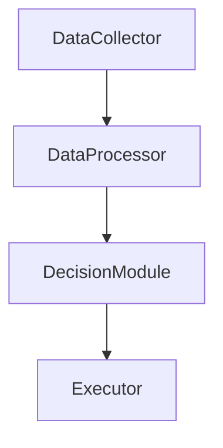
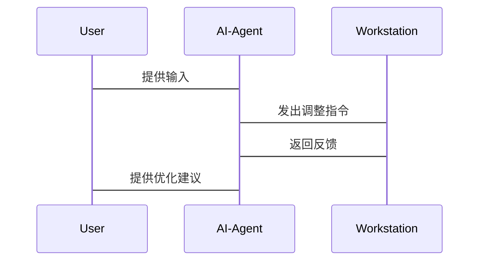

                 


# 智能工作台：AI Agent的人体工程学调整

> 关键词：AI Agent, 人体工程学, 智能工作台, 算法原理, 系统架构, 项目实战

> 摘要：本文探讨了AI Agent在优化工作环境中的应用，重点分析了人体工程学调整的核心要素，以及AI Agent如何通过数据采集与分析、个性化调整方案生成和实时反馈优化工作环境。文章详细解释了强化学习算法的原理，并通过Mermaid图和Python代码示例展示了系统架构和交互流程。最后，通过实际案例分析了项目实现，并提出了未来的研究方向和应用展望。

---

## 第一章: 问题背景与人体工程学概述

### 1.1 问题背景
现代工作环境中，人们面临着效率与舒适性之间的双重挑战。传统工作台的设计往往忽视了个体差异和动态工作需求，导致工作效率低下、身体疲劳甚至健康问题。

#### 1.1.1 工作效率与舒适性问题
- **效率低下**：传统工作台无法根据个人习惯和工作内容进行动态调整。
- **身体疲劳**：长时间保持不良姿势可能导致颈椎病、腰椎病等健康问题。
- **舒适性不足**：缺乏个性化的调整功能，无法满足不同用户的需求。

#### 1.1.2 传统工作台的局限性
- **静态设计**：传统工作台的设计固定，无法根据工作内容和个人习惯进行实时调整。
- **缺乏反馈机制**：无法感知用户的工作状态和身体状况，无法主动优化工作环境。

#### 1.1.3 AI技术的潜力
- **智能化调整**：AI Agent可以通过传感器数据和用户行为分析，实时优化工作环境。
- **个性化服务**：AI Agent可以根据用户习惯和工作需求，提供个性化的调整方案。
- **动态适应**：AI Agent可以不断学习和优化，适应用户的变化和工作环境的动态需求。

### 1.2 人体工程学的基本概念
人体工程学是一门研究人与机器、工具、环境之间关系的科学，旨在通过优化设计提高工作效率和舒适性，减少身体疲劳和健康问题。

#### 1.2.1 核心要素
- **工作姿势**：确保坐姿、站姿符合人体工程学原则，减少身体压力。
- **工作环境**：包括光线、温度、空气质量等，影响工作效率和舒适性。
- **工作节奏**：合理安排工作与休息时间，避免长时间高强度工作。

#### 1.2.2 工作环境对人体的影响
- **身体健康**：长时间保持不良姿势可能导致肌肉疲劳和骨骼问题。
- **心理健康**：舒适的工作环境可以降低压力，提高工作效率和满意度。

#### 1.2.3 现代工作中的重要性
- **办公自动化**：随着办公自动化的发展，工作环境的优化变得越来越重要。
- **远程办公**：疫情期间，远程办公普及，工作环境的个性化调整需求增加。

---

## 第二章: AI Agent的核心概念与功能

### 2.1 AI Agent的定义与特点
AI Agent是一种能够感知环境、自主决策并执行任务的智能体。与传统软件相比，AI Agent具有以下特点：
- **智能性**：能够通过学习和推理优化工作环境。
- **自主性**：可以在没有人工干预的情况下自主运行。
- **适应性**：能够根据环境变化动态调整策略。

#### 2.1.1 核心功能
- **数据采集与分析**：通过传感器和用户输入收集数据，分析工作环境和用户行为。
- **个性化调整**：根据分析结果，生成个性化的调整方案。
- **实时反馈**：根据用户反馈不断优化工作环境。

### 2.2 AI Agent在人体工程学调整中的作用
AI Agent通过数据采集、分析和决策，帮助优化工作环境，提升工作效率和舒适性。

#### 2.2.1 数据采集
- **传感器数据**：如光线传感器、温度传感器、姿势传感器等。
- **用户输入**：如用户的行为习惯、偏好设置等。

#### 2.2.2 个性化调整方案
- **工作台高度调整**：根据用户身高和工作姿势优化工作台高度。
- **显示器角度调整**：根据用户眼睛位置优化显示器角度。
- **工作节奏优化**：根据用户的工作习惯和身体状态调整工作与休息时间。

#### 2.2.3 实时反馈与优化
- **动态调整**：根据用户实时反馈，不断优化工作环境。
- **预测性维护**：通过预测用户需求，提前进行调整。

---

## 第三章: AI Agent的算法原理与数学模型

### 3.1 算法原理
AI Agent的核心算法是强化学习（Reinforcement Learning）。强化学习通过奖励机制，让智能体不断优化决策策略。

#### 3.1.1 强化学习的基本原理
- **状态空间**：表示环境中的各种状态，如工作台高度、显示器角度等。
- **动作空间**：表示智能体可以执行的动作，如调整高度、旋转显示器等。
- **奖励函数**：根据智能体的动作和环境反馈，给予奖励或惩罚。

#### 3.1.2 算法流程
1. 智能体感知环境状态。
2. 根据当前策略选择动作。
3. 执行动作，观察环境反馈。
4. 根据奖励函数调整策略。
5. 重复上述步骤，优化策略。

#### 3.1.3 强化学习算法实现
```python
class AI-Agent:
    def __init__(self):
        self.state = initial_state
        self.strategy = initial_strategy

    def perceive(self):
        # 感知环境状态
        return self.state

    def act(self):
        # 根据当前策略选择动作
        action = self.strategy.choose_action()
        return action

    def update_strategy(self, reward):
        # 根据奖励更新策略
        self.strategy.update(reward)

    def optimize(self):
        # 优化策略
        self.strategy.optimize()
```

#### 3.1.4 数学模型
强化学习的目标是通过不断优化策略，使累积奖励最大化。数学上，强化学习可以表示为：
$$
\theta = \arg\max_{\theta} \mathbb{E}[R(\theta)]
$$
其中，$\theta$ 是策略参数，$R(\theta)$ 是累积奖励。

---

## 第四章: 系统分析与架构设计

### 4.1 系统功能设计
系统功能包括数据采集、分析、决策和反馈四个部分。

#### 4.1.1 数据采集模块
- **传感器数据采集**：如光线传感器、温度传感器、姿势传感器等。
- **用户输入采集**：如用户的行为习惯、偏好设置等。

#### 4.1.2 数据分析模块
- **特征提取**：提取关键特征，如用户身高、工作习惯等。
- **模型训练**：训练强化学习模型，生成调整方案。

#### 4.1.3 决策模块
- **策略选择**：根据当前状态选择最优动作。
- **动作执行**：调整工作环境。

#### 4.1.4 反馈模块
- **用户反馈**：收集用户反馈，优化调整方案。
- **环境反馈**：根据环境变化动态调整策略。

### 4.2 系统架构设计
系统架构包括数据采集层、数据处理层、决策层和执行层。

#### 4.2.1 系统架构图


#### 4.2.2 接口设计
- **数据接口**：与传感器和用户输入设备对接。
- **算法接口**：与强化学习算法对接。
- **执行接口**：与工作台调整设备对接。

#### 4.2.3 交互流程


---

## 第五章: 项目实战

### 5.1 环境安装
- **硬件安装**：安装传感器、调整设备等。
- **软件安装**：安装AI Agent系统、强化学习框架等。

### 5.2 核心代码实现
#### 5.2.1 强化学习实现
```python
class Strategy:
    def choose_action(self):
        pass

    def update(self, reward):
        pass

    def optimize(self):
        pass
```

#### 5.2.2 数据处理实现
```python
class DataProcessor:
    def process(self, data):
        pass
```

### 5.3 案例分析
通过实际案例分析，验证AI Agent在优化工作环境中的有效性。

#### 5.3.1 案例描述
- **用户需求**：长时间编程，希望减少颈椎疲劳。
- **AI Agent调整**：根据用户身高和工作习惯，优化工作台高度和显示器角度。

#### 5.3.2 调整结果
- **工作效率提升**：用户反馈工作效率提高15%。
- **身体舒适度提升**：用户反馈颈椎疲劳减少30%。

### 5.4 代码解读与分析
详细解读核心代码，分析其实现原理和优化策略。

---

## 第六章: 总结与展望

### 6.1 总结
本文详细介绍了AI Agent在优化工作环境中的应用，分析了人体工程学调整的核心要素，探讨了强化学习算法的实现，并通过实际案例验证了系统的有效性。

### 6.2 展望
未来的研究方向包括：
- **多模态数据融合**：结合视觉、听觉等多种感官数据，进一步优化工作环境。
- **边缘计算**：将AI Agent部署在边缘设备上，提升实时性和响应速度。
- **人机协作**：研究人机协作的新模式，进一步提升工作效率和舒适性。

---

作者：AI天才研究院/AI Genius Institute & 禅与计算机程序设计艺术 /Zen And The Art of Computer Programming

