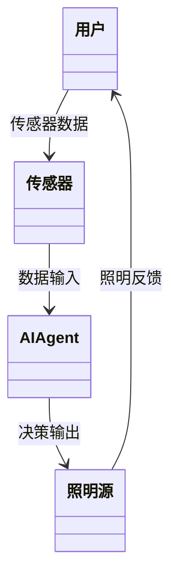
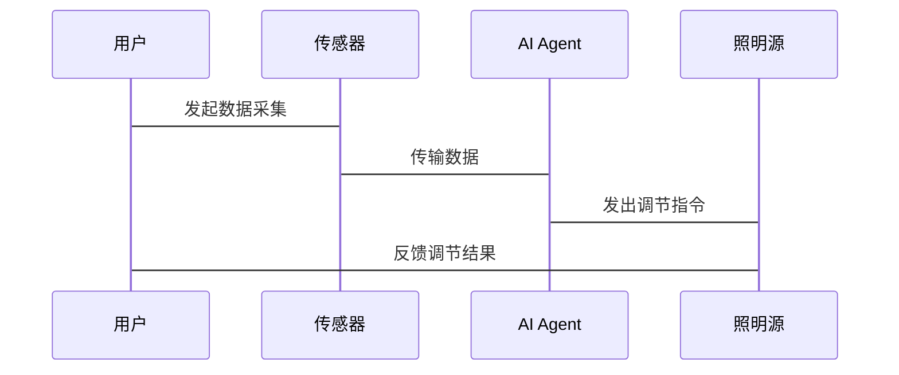
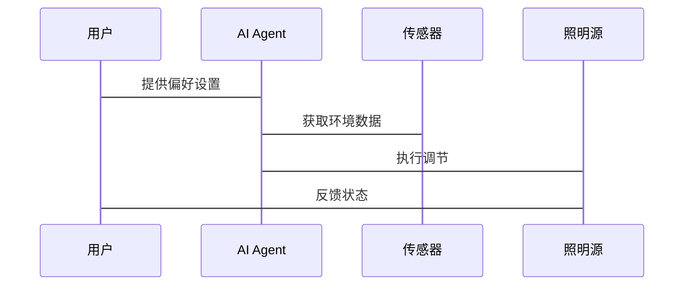

                 


# 智能工作灯：AI Agent的照明优化系统

## 关键词：智能工作灯, AI Agent, 照明优化, 系统设计, 算法原理

## 摘要：本文探讨了AI Agent在智能工作灯中的应用，通过系统设计和算法实现，优化照明系统，提升用户体验和能效。

---

# 第1章: 智能工作灯与AI Agent的背景与问题分析

## 1.1 智能工作灯的背景与现状
### 1.1.1 传统照明系统的局限性
传统照明系统存在能耗高、智能化程度低的问题，难以满足现代用户对舒适性和节能性的双重需求。

### 1.1.2 智能化照明的发展趋势
随着物联网和人工智能技术的发展，智能化照明逐渐成为趋势，用户对个性化和自动化的需求日益增加。

### 1.1.3 AI技术在照明系统中的应用潜力
AI技术可以通过数据分析和优化算法，显著提升照明系统的效率和用户体验。

## 1.2 问题背景与需求分析
### 1.2.1 照明系统优化的核心问题
照明系统的优化需要解决能耗高、亮度调节不智能、用户体验差等问题。

### 1.2.2 用户对智能照明的实际需求
用户希望照明系统能够根据环境光线、时间和个人偏好自动调节，提供舒适、安全、节能的照明体验。

### 1.2.3 现有解决方案的不足
现有方案大多局限于简单的亮度调节，缺乏智能化的决策能力和个性化服务。

## 1.3 AI Agent在智能工作灯中的作用
### 1.3.1 AI Agent的基本概念
AI Agent是一种能够感知环境、执行任务并做出决策的智能实体，能够帮助智能工作灯实现智能化管理。

### 1.3.2 AI Agent在智能工作灯中的应用场景
AI Agent可以用于环境光线检测、用户行为分析、能耗优化等场景，提升照明系统的智能化水平。

### 1.3.3 AI Agent与智能工作灯的结合优势
通过AI Agent，智能工作灯能够实现动态调节、智能决策和个性化服务，显著提升用户体验和能效。

## 1.4 本章小结
本章介绍了智能工作灯和AI Agent的基本概念，分析了照明系统优化的核心问题，并探讨了AI Agent在智能工作灯中的重要作用。

---

# 第2章: AI Agent与智能工作灯的核心概念与联系

## 2.1 AI Agent的定义与核心原理
### 2.1.1 AI Agent的定义
AI Agent是一种具备感知、决策和执行能力的智能实体，能够根据环境信息自主完成任务。

### 2.1.2 AI Agent的核心原理
AI Agent通过感知环境、分析数据、制定决策并执行操作，实现对智能工作灯的优化控制。

### 2.1.3 AI Agent与智能工作灯的结合方式
AI Agent与智能工作灯通过数据交互和系统集成实现协同工作，AI Agent负责决策和优化，智能工作灯负责执行和反馈。

## 2.2 智能工作灯的系统架构
### 2.2.1 智能工作灯的基本组成
智能工作灯通常由传感器模块、控制模块、光源模块和通信模块组成。

### 2.2.2 系统中各模块的功能与交互
传感器模块负责采集环境数据，控制模块基于AI Agent的决策进行调节，光源模块执行具体的照明任务，通信模块负责数据传输。

### 2.2.3 系统的边界与外延
智能工作灯系统不仅包括硬件部分，还包括云端数据处理和用户交互界面，形成一个完整的智能化系统。

## 2.3 AI Agent与智能工作灯的关系
### 2.3.1 AI Agent在智能工作灯中的角色
AI Agent作为系统的智能核心，负责数据处理、决策制定和优化控制。

### 2.3.2 AI Agent与智能工作灯的协同工作模式
AI Agent通过分析环境数据和用户需求，制定最优的照明方案，并通过智能工作灯执行。

### 2.3.3 AI Agent对智能工作灯优化的具体表现
AI Agent能够实现动态调节、能耗优化和个性化服务，显著提升系统的智能化水平。

## 2.4 核心概念对比与ER实体关系图
### 2.4.1 核心概念对比表格
| 比较维度 | AI Agent | 智能工作灯 |
|----------|-----------|------------|
| 功能     | 数据处理、决策制定 | 照明执行、数据反馈 |
| 作用     | 智能化核心 | 硬件执行 |
| 交互     | 接收数据、输出决策 | 接收决策、反馈数据 |

### 2.4.2 ER实体关系图
```mermaid
erd
  title 实体关系图
  user
  sensor
  light_source
  ai_agent
  user --(配置偏好)--> ai_agent
  sensor --(数据输入)--> ai_agent
  ai_agent --(决策输出)--> light_source
```

---

# 第3章: AI Agent与智能工作灯的算法原理

## 3.1 AI Agent的核心算法
### 3.1.1 基于强化学习的优化算法
通过强化学习，AI Agent能够在动态环境中不断优化照明策略。

### 3.1.2 基于规则的决策算法
根据预设规则和环境数据，AI Agent进行快速决策。

### 3.1.3 组合优化算法
结合强化学习和规则算法，实现全局最优的照明方案。

## 3.2 照明优化的数学模型
### 3.2.1 照明强度计算公式
$$ I = k \cdot (1 - e^{-t/\tau}) $$

### 3.2.2 能耗优化模型
$$ E = \int_{0}^{T} I(t) \cdot \eta(t) \, dt $$

## 3.3 算法实现步骤
### 3.3.1 数据采集与预处理
通过传感器采集环境数据，进行噪声消除和特征提取。

### 3.3.2 算法选择与实现
选择适合的算法，如强化学习或规则算法，进行系统优化。

### 3.3.3 系统测试与优化
通过实验验证算法效果，进行参数调整和性能优化。

## 3.4 本章小结
本章详细介绍了AI Agent的核心算法和照明优化的数学模型，并给出了算法实现的步骤和注意事项。

---

# 第4章: 智能工作灯与AI Agent的系统分析与架构设计

## 4.1 项目背景与目标
本项目旨在通过AI Agent优化智能工作灯的照明系统，实现动态调节和能耗优化。

## 4.2 系统功能设计
### 4.2.1 功能需求分析
系统需要实现环境监测、智能调节、用户交互和能耗统计等功能。

### 4.2.2 领域模型设计


## 4.3 系统架构设计
### 4.3.1 系统架构图


### 4.3.2 模块交互设计


## 4.4 接口设计与交互流程
### 4.4.1 接口设计
系统需要定义清晰的数据接口和通信协议，确保模块之间的高效交互。

### 4.4.2 交互流程图


## 4.5 本章小结
本章详细分析了系统的架构设计和模块交互，为后续的系统实现奠定了基础。

---

# 第5章: 智能工作灯与AI Agent的项目实战

## 5.1 项目环境安装
### 5.1.1 安装Python与相关库
安装Python 3.8以上版本，安装TensorFlow、Keras、numpy等库。

### 5.1.2 安装硬件设备
配置传感器模块和智能照明源，确保硬件与系统的兼容性。

## 5.2 系统核心代码实现
### 5.2.1 AI Agent核心代码
```python
class AI_Agent:
    def __init__(self):
        self.sensors = []
        self actuators = []
    
    def collect_data(self):
        # 收集传感器数据
        pass
    
    def decide(self, data):
        # 根据数据做出决策
        pass
    
    def actuate(self, decision):
        # 执行决策
        pass
```

### 5.2.2 照明系统实现代码
```python
class Lighting_System:
    def __init__(self, sensors, actuators):
        self.sensors = sensors
        self.actuators = actuators
    
    def adjust_lighting(self, desired_brightness):
        # 调整照明亮度
        pass
```

## 5.3 代码功能分析与优化
### 5.3.1 代码功能分析
详细分析各个模块的功能和交互，确保代码逻辑清晰。

### 5.3.2 优化建议
根据实际运行情况，优化算法和系统架构，提升性能和用户体验。

## 5.4 实际案例分析
### 5.4.1 案例背景
描述一个典型的应用场景，如办公室智能照明系统。

### 5.4.2 案例实现
详细说明系统在该场景下的实现过程和优化策略。

## 5.5 项目总结
总结项目实施的经验和教训，提出改进建议和未来发展方向。

---

# 第6章: 总结与展望

## 6.1 本章总结
本文详细探讨了AI Agent在智能工作灯中的应用，通过系统设计和算法实现，优化了照明系统，显著提升了用户体验和能效。

## 6.2 未来展望
未来可以进一步研究AI Agent的边缘计算能力，结合深度学习技术，提升系统的智能化水平和响应速度。

---

# 作者：AI天才研究院/AI Genius Institute & 禅与计算机程序设计艺术 /Zen And The Art of Computer Programming

---

以上是一个详细的目录大纲和内容框架，您可以根据需要进一步扩展每个部分的内容。

