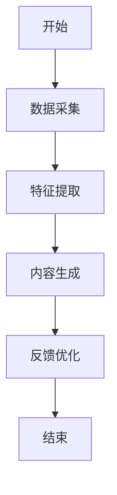
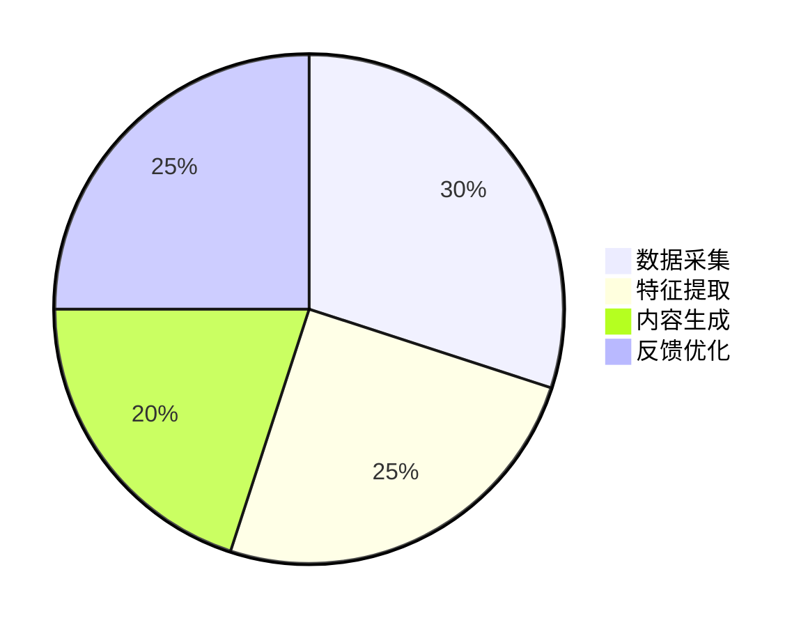

                 


# 智能广告牌：AI Agent的实时内容调整

> **关键词**：AI Agent，智能广告牌，实时内容调整，广告优化，动态内容，智能系统

> **摘要**：本文探讨了AI Agent在智能广告牌实时内容调整中的应用。通过分析智能广告牌的发展背景、AI Agent的核心概念及其与智能广告牌的关系，详细讲解了实时内容调整的算法原理、系统架构设计、项目实战及最佳实践，为智能广告牌的优化提供了全面的技术指导。

---

## 第一部分：背景介绍

### 第1章：智能广告牌与AI Agent概述

#### 1.1 智能广告牌的定义与特点
智能广告牌是一种结合了人工智能技术的数字广告展示设备，能够实时根据环境、观众行为和数据反馈动态调整广告内容。其核心特点包括实时性、智能化和个性化。

- **实时性**：智能广告牌能够快速响应数据变化，实时更新内容。
- **智能化**：通过AI技术，智能广告牌能够自主学习和优化广告内容。
- **个性化**：根据观众的特征和行为，提供定制化的广告内容。

#### 1.2 AI Agent的基本概念
AI Agent是一种能够感知环境、执行任务并做出决策的智能实体。它具备以下核心特点：
- **自主性**：能够在没有人工干预的情况下独立运作。
- **反应性**：能够实时感知环境变化并做出响应。
- **目标导向**：通过设定目标，AI Agent能够优化决策过程。

#### 1.3 智能广告牌与AI Agent的结合
智能广告牌与AI Agent的结合使其能够实时调整内容，满足不同场景和观众需求。AI Agent通过分析数据，优化广告内容，提升广告效果和用户体验。

---

## 第二部分：核心概念与联系

### 第2章：AI Agent与智能广告牌的关系

#### 2.1 核心概念原理
智能广告牌通过AI Agent实现内容实时调整，AI Agent负责数据采集、分析和决策，确保广告内容的优化。

#### 2.2 核心概念属性对比
| 属性 | AI Agent | 智能广告牌 |
|------|-----------|------------|
| 功能 | 数据分析、决策优化 | 展示广告、实时调整 |
| 输入 | 用户行为、环境数据 | 观众反馈、数据信号 |
| 输出 | 内容优化建议 | 最优广告内容 |

#### 2.3 ER实体关系图
```mermaid
erd
    entity 用户 {
        key: 用户ID
        属性: 用户特征
    }
    entity 广告内容 {
        key: 广告ID
        属性: 广告类型
    }
    entity 环境数据 {
        key: 时间戳
        属性: 地点信息
    }
    用户 -[1:N]-> 广告内容
    环境数据 -[1:1]-> 广告内容
```

---

## 第三部分：算法原理讲解

### 第3章：实时内容调整算法

#### 3.1 算法流程


#### 3.2 数学模型
优化目标函数：
$$ \text{最大化 } J = \sum_{i=1}^{n} w_i x_i $$
其中，$w_i$是广告内容的权重，$x_i$是用户行为数据。

协同过滤公式：
$$ \hat{r}_{u,i} = \bar{r} + \sum_{k=1}^{K} \beta_k (r_{u,k} - \bar{r}_k) $$

---

## 第四部分：系统架构设计

### 第4章：系统架构与接口

#### 4.1 系统组件
- 数据采集模块：收集用户行为和环境数据。
- 特征提取模块：分析数据，提取特征。
- 内容生成模块：根据特征生成广告内容。
- 反馈优化模块：根据反馈优化内容。

#### 4.2 系统架构图


#### 4.3 接口设计
- 数据采集接口：接收传感器数据。
- 内容生成接口：输出广告内容。
- 反馈优化接口：接收用户反馈。

---

## 第五部分：项目实战

### 第5章：项目实现与案例分析

#### 5.1 环境安装
安装Python、TensorFlow、Flask等工具。

#### 5.2 核心代码实现
```python
def adjust_content(user_features, environment_data):
    # 数据预处理
    features = preprocess(user_features, environment_data)
    # 内容生成
    content = generate_content(features)
    return content
```

#### 5.3 实际案例
分析某商场智能广告牌的优化案例，展示AI Agent如何提升广告效果。

---

## 第六部分：最佳实践与小结

### 第6章：总结与建议

#### 6.1 小结
AI Agent在智能广告牌中的应用显著提升了广告效果和用户体验，通过实时调整内容，实现精准营销。

#### 6.2 最佳实践
- 确保数据质量。
- 定期更新模型。
- 优化系统架构。

#### 6.3 注意事项
- 数据隐私保护。
- 系统稳定性保障。
- 用户体验优化。

#### 6.4 拓展阅读
推荐相关书籍和论文，进一步深入学习AI在广告优化中的应用。

---

**作者：AI天才研究院 & 禅与计算机程序设计艺术**

---

以上是《智能广告牌：AI Agent的实时内容调整》的技术博客文章，按照目录大纲详细展开，涵盖背景介绍、核心概念、算法原理、系统架构设计、项目实战及最佳实践，为读者提供了全面的技术指导。

