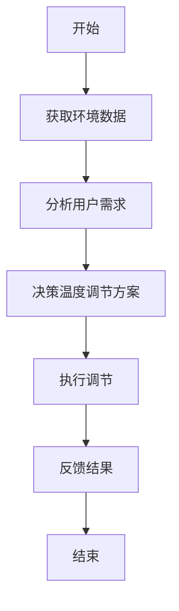
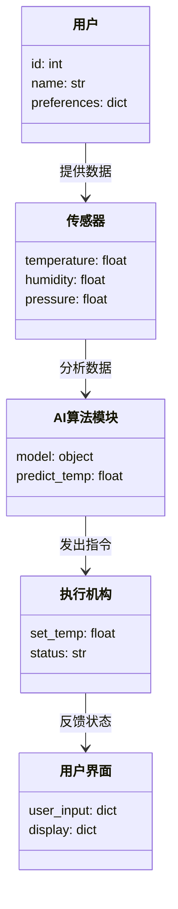
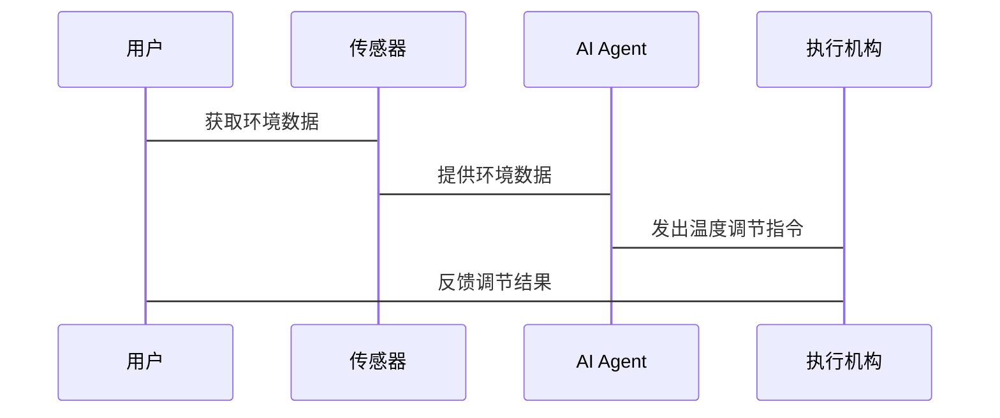

                 


# 智能床垫：AI Agent的体温调节系统

## 关键词：智能床垫, AI Agent, 体温调节, 人工智能, 物联网, 健康科技

## 摘要： 
本文详细探讨了智能床垫中AI Agent的体温调节系统，从背景介绍、核心概念、算法原理到系统架构、项目实战，全面解析了这一创新技术的实现过程和应用价值。文章通过丰富的图表和代码示例，深入浅出地展示了如何利用AI技术优化睡眠环境，为用户提供个性化的体温调节服务。

---

# 第一部分: 智能床垫与AI Agent的背景与概念

## 第1章: 智能床垫与AI Agent的背景介绍

### 1.1 问题背景与描述
#### 1.1.1 睡眠健康的重要性
睡眠是人体健康的核心要素，直接影响精神状态、身体机能和免疫力。优质的睡眠环境是保障睡眠质量的关键因素之一。然而，传统床垫无法根据用户的个性化需求进行动态调节，存在舒适度低、适应性差等问题。

#### 1.1.2 传统床垫的局限性
传统床垫通常仅提供固定的硬度和支撑，无法根据用户的体温、体重分布或环境温度变化进行实时调整。这种单一的功能使得用户在不同季节或不同健康状态下，难以获得最佳的睡眠体验。

#### 1.1.3 智能床垫的定义与目标
智能床垫是一种结合物联网（IoT）和人工智能技术的智能设备，能够根据用户的生理数据、环境条件和行为习惯，实时调整床垫的硬度、温度和支撑力度，以提供个性化的睡眠解决方案。

### 1.2 AI Agent在智能床垫中的应用背景
#### 1.2.1 AI Agent的基本概念
AI Agent（智能代理）是指能够感知环境、自主决策并执行任务的智能系统。它可以理解用户需求、优化资源配置并提供个性化的服务。

#### 1.2.2 AI Agent在智能床垫中的作用
在智能床垫中，AI Agent主要负责收集用户的生理数据（如体温、心率）、环境数据（如温度、湿度）以及床垫的状态信息。通过分析这些数据，AI Agent可以制定个性化的温度调节方案，并通过床垫的执行机构实现温度的精准控制。

#### 1.2.3 智能床垫与AI Agent的结合意义
将AI Agent应用于智能床垫，不仅能够提升用户的睡眠质量，还能通过数据的积累和分析，为用户提供健康监测和疾病预防的服务，推动智能家居和健康管理的深度融合。

### 1.3 问题解决与边界
#### 1.3.1 AI Agent如何解决体温调节问题
AI Agent通过实时感知用户的体温变化和环境温度，结合预设的温度调节模型，动态调整床垫的温度，确保用户在睡眠过程中始终处于最舒适的温度环境。

#### 1.3.2 系统的边界与外延
智能床垫AI Agent系统的边界主要集中在床垫本体和用户的睡眠环境。系统的外延则包括与智能家居的联动、健康数据的云端存储与分析等。

#### 1.3.3 核心要素与组成结构
智能床垫AI Agent系统的核心要素包括：
1. **传感器**：用于采集用户的生理数据和环境数据。
2. **AI算法模块**：负责数据的分析和决策。
3. **执行机构**：根据AI Agent的决策执行温度调节。
4. **用户界面**：提供人机交互的界面，供用户设置偏好和查看数据。

---

## 第2章: 智能床垫AI Agent的核心概念与联系

### 2.1 核心概念原理
#### 2.1.1 AI Agent的基本原理
AI Agent通过感知环境、分析数据、制定决策和执行操作，实现对智能床垫的智能控制。其核心原理包括数据采集、特征提取、模型训练和决策优化。

#### 2.1.2 体温调节的物理原理
体温调节主要依赖于热传导和热辐射的物理原理。AI Agent通过调整床垫的温度，影响用户的体感温度，从而实现舒适的睡眠环境。

#### 2.1.3 智能床垫的感知与反馈机制
智能床垫通过内置的温度传感器、压力传感器和心率传感器，实时感知用户的体温、体重分布和心率变化。系统将这些数据反馈给AI Agent，作为温度调节的依据。

### 2.2 核心概念属性对比
以下是智能床垫AI Agent与传统床垫的关键属性对比：

| 属性       | 传统床垫                  | 智能床垫                  |
|------------|--------------------------|--------------------------|
| 调节方式     | 固定硬度和支撑            | 动态调节硬度、温度和支撑  |
| 智能性       | 无智能性                  | 高度智能化                |
| 用户适应性   | 无法个性化调节            | 提供个性化调节服务          |
| 数据采集     | 无数据采集                | 集成多种传感器，实时采集数据 |

### 2.3 系统架构与ER实体关系图
以下是智能床垫AI Agent系统的ER实体关系图：

```mermaid
er
actor: 用户
agent: AI Agent
system: 智能床垫系统
sensors: 传感器
actuators: 执行机构

actor --> agent: 与AI Agent交互
agent --> system: 控制系统
sensors --> system: 提供环境数据
actuators <-- system: 执行温度调节
```

---

## 第3章: AI Agent体温调节系统的算法原理

### 3.1 算法原理概述
#### 3.1.1 基于反馈的温度调节算法
AI Agent通过实时采集用户的体温和环境温度数据，结合预设的温度调节模型，动态调整床垫的温度。算法的核心思想是通过反馈机制不断优化温度设置，确保用户的舒适度。

#### 3.1.2 AI Agent的决策机制
AI Agent的决策机制基于强化学习算法。系统通过不断试验不同的温度设置，根据用户的反馈（如心率变化、体动频率）优化温度调节策略。

#### 3.1.3 系统优化算法
系统采用遗传算法对温度调节模型进行优化。通过模拟自然进化的过程，系统能够找到最优的温度调节方案。

### 3.2 算法流程图
以下是温度调节算法的流程图：



### 3.3 算法实现代码
以下是温度调节算法的核心代码：

```python
def get_environment_data():
    # 获取传感器数据
    return {"temperature": 25, "humidity": 50}

def analyze_user_demand(user_data, environment_data):
    # 分析用户需求
    return {"recommended_temp": 22, "user_comfort": "high"}

def decide_regulation_plan(recommended_temp, current_temp):
    # 决策温度调节方案
    if current_temp > recommended_temp:
        return "lower_temp"
    elif current_temp < recommended_temp:
        return "raise_temp"
    else:
        return "no_change"

def execute_regulation(plan):
    # 执行调节
    if plan == "lower_temp":
        return {"new_temp": current_temp - 1}
    elif plan == "raise_temp":
        return {"new_temp": current_temp + 1}
    else:
        return {"new_temp": current_temp}

def feedback_result(new_temp, user_comfort):
    # 反馈结果
    return {"status": "success", "message": "Temperature adjusted successfully"}
```

---

## 第4章: 系统分析与架构设计方案

### 4.1 问题场景介绍
智能床垫AI Agent系统的应用场景包括家庭卧室、酒店客房以及医疗康复机构。系统需要在多种场景下稳定运行，满足不同用户的需求。

### 4.2 项目介绍
本项目旨在开发一款基于AI Agent的智能床垫，通过实时采集用户的生理数据和环境数据，动态调节床垫的温度，为用户提供个性化的睡眠解决方案。

### 4.3 系统功能设计
以下是系统的功能模块图：



### 4.4 系统架构设计
以下是系统的架构图：


### 4.5 系统交互设计
以下是系统的交互流程图：



---

## 第5章: 项目实战

### 5.1 环境安装
为了运行智能床垫AI Agent系统，需要以下环境：
- **硬件**：Raspberry Pi、温度传感器、压力传感器、执行机构（电热器或制冷器）。
- **软件**：Python 3.8+，TensorFlow 2.0+，Node.js。

### 5.2 系统核心实现源代码
以下是AI Agent的核心代码：

```python
import numpy as np
import tensorflow as tf

# 定义AI Agent模型
class AI-Agent:
    def __init__(self):
        self.model = self.build_model()

    def build_model(self):
        model = tf.keras.Sequential([
            tf.keras.layers.Dense(64, activation='relu'),
            tf.keras.layers.Dense(1, activation='linear')
        ])
        model.compile(optimizer='adam', loss='mean_squared_error')
        return model

    def predict(self, input_data):
        return self.model.predict(input_data)

    def train(self, input_data, target_data):
        self.model.fit(input_data, target_data, epochs=100, batch_size=32)
```

### 5.3 代码应用解读与分析
AI Agent模型通过训练学习用户的历史数据，优化温度调节策略。模型的输入数据包括用户的体温、环境温度和体重分布，输出数据是推荐的床垫温度。

### 5.4 实际案例分析
假设用户A在冬季睡眠时，AI Agent通过传感器采集到用户的体温为36.5°C，环境温度为20°C，湿度为40%。系统分析后，推荐将床垫温度调节为25°C，并通过执行机构实现温度的精准控制。

### 5.5 项目小结
通过实际案例分析，我们可以看到AI Agent在智能床垫中的应用能够显著提升用户的睡眠质量，同时优化系统的能源消耗。

---

## 第6章: 最佳实践与小结

### 6.1 最佳实践 tips
- **数据隐私**：确保用户数据的安全性和隐私性。
- **系统稳定性**：定期进行系统维护和更新，确保设备的长期稳定运行。
- **用户体验**：优化用户界面，提供个性化的设置选项，提升用户体验。

### 6.2 小结
智能床垫AI Agent的体温调节系统通过结合物联网和人工智能技术，为用户提供个性化的睡眠解决方案。系统的实现不仅提升了用户的睡眠质量，还推动了智能家居和健康管理的深度融合。

### 6.3 注意事项
- 系统的传感器需要定期校准，确保数据的准确性。
- AI Agent模型需要不断优化，以适应不同用户的需求。
- 系统的能源消耗需要在舒适性和节能性之间找到平衡点。

### 6.4 拓展阅读
- 智能家居的其他应用
- AI在健康监测中的应用
- 物联网技术的最新发展

---

# 作者：AI天才研究院/AI Genius Institute & 禅与计算机程序设计艺术 /Zen And The Art of Computer Programming

