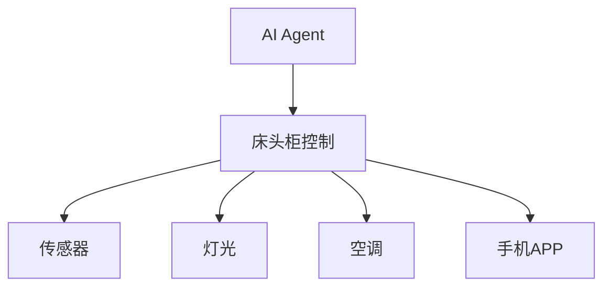
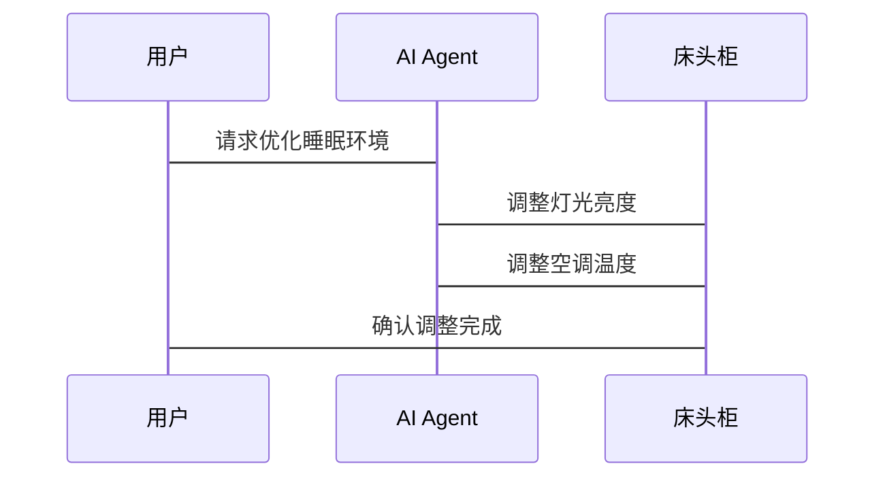

                 


# 智能床头柜：AI Agent的睡眠环境优化

> 关键词：智能床头柜，AI Agent，睡眠环境优化，智能家居，物联网，健康睡眠，人工智能

> 摘要：本文深入探讨了智能床头柜在睡眠环境优化中的应用，结合AI Agent的核心原理和算法实现，详细分析了其在智能家居中的角色和功能。通过系统架构设计和项目实战，展示了如何利用AI技术提升睡眠质量，并提供了最佳实践和未来发展方向。

---

# 第一部分: 智能床头柜与AI Agent概述

## 第1章: 智能床头柜的概念与背景

### 1.1 智能床头柜的定义与特点

智能床头柜是一种结合了人工智能（AI）技术和物联网（IoT）的智能家具，能够通过传感器和AI算法感知用户的睡眠状态，并自动调节环境参数以优化睡眠质量。与传统床头柜相比，智能床头柜具有以下特点：

- **智能化**：集成多种传感器，能够实时监测用户的睡眠数据。
- **自动化**：通过AI算法自动调整灯光、温度、湿度等环境参数。
- **联网能力**：支持与智能家居设备联动，实现无缝衔接。

### 1.2 AI Agent的基本概念

AI Agent（人工智能代理）是一种能够感知环境、执行任务并做出决策的智能实体。在智能床头柜中，AI Agent的核心功能包括：

- **感知**：通过传感器收集用户的睡眠数据。
- **决策**：基于收集的数据，分析用户的睡眠质量并做出优化决策。
- **执行**：通过控制灯光、空调等设备，执行优化睡眠环境的任务。

### 1.3 睡眠环境优化的重要性

睡眠质量直接影响到人体的健康和生活质量。智能床头柜通过优化睡眠环境，能够有效改善用户的睡眠质量，进而提升整体健康水平。

- **健康效益**：长期优化睡眠环境有助于预防失眠、焦虑等睡眠相关问题。
- **生活质量**：良好的睡眠质量能够提高工作效率和生活质量。
- **个性化需求**：不同用户对睡眠环境的需求不同，智能床头柜能够提供个性化的解决方案。

### 1.4 本章小结

本章主要介绍了智能床头柜的概念、AI Agent的基本原理以及睡眠环境优化的重要性。智能床头柜通过AI技术能够实现睡眠环境的智能化优化，为用户提供更健康、更舒适的睡眠体验。

---

# 第二部分: AI Agent的核心原理与技术

## 第2章: AI Agent的基本原理

### 2.1 AI Agent的核心算法

AI Agent的核心算法主要分为强化学习（Reinforcement Learning）和监督学习（Supervised Learning）。

- **强化学习**：通过试错机制，AI Agent能够逐步优化睡眠环境。例如，Q-learning算法是一种常用的强化学习算法，其数学公式如下：

  $$ Q(s, a) = r + \gamma \cdot \max_{a'} Q(s', a') $$

  其中，$s$是当前状态，$a$是当前动作，$r$是奖励，$\gamma$是折扣因子。

- **监督学习**：通过训练数据，AI Agent能够学习如何优化睡眠环境。例如，线性回归模型的损失函数如下：

  $$ L = \frac{1}{2m} \sum_{i=1}^{m} (y_i - \hat{y}_i)^2 $$

  其中，$y_i$是真实值，$\hat{y}_i$是预测值，$m$是样本数量。

### 2.2 AI Agent的感知与决策

AI Agent的感知与决策过程包括以下几个步骤：

1. **感知**：通过传感器收集用户的睡眠数据，例如心率、呼吸频率、体动次数等。
2. **分析**：基于收集的数据，分析用户的睡眠质量。例如，通过分析用户的体动次数，判断用户的睡眠深度。
3. **决策**：根据分析结果，决策如何优化睡眠环境。例如，如果用户的浅眠时间较长，AI Agent可能会降低房间的光线强度以帮助用户进入深度睡眠。

### 2.3 AI Agent的通信机制

AI Agent的通信机制主要分为本地通信和远程通信。

- **本地通信**：通过蓝牙或Wi-Fi与床头柜的其他设备进行通信。
- **远程通信**：通过云端与智能家居中枢进行通信，实现与智能灯、空调等设备的联动。

---

## 第3章: AI Agent的数学模型与算法实现

### 3.1 强化学习算法的数学模型

Q-learning算法是一种常用的强化学习算法，其数学模型如下：

$$ Q(s, a) = r + \gamma \cdot \max_{a'} Q(s', a') $$

其中：
- $s$：当前状态
- $a$：当前动作
- $r$：奖励
- $\gamma$：折扣因子
- $s'$：下一个状态

### 3.2 监督学习算法的数学模型

线性回归模型的损失函数如下：

$$ L = \frac{1}{2m} \sum_{i=1}^{m} (y_i - \hat{y}_i)^2 $$

其中：
- $y_i$：真实值
- $\hat{y}_i$：预测值
- $m$：样本数量

### 3.3 算法实现的代码示例

#### Q-learning算法的Python实现

```python
import numpy as np

class QLearning:
    def __init__(self, state_space, action_space, gamma=0.99):
        self.state_space = state_space
        self.action_space = action_space
        self.gamma = gamma
        self.q_table = np.zeros((state_space, action_space))
    
    def choose_action(self, state, epsilon=0.1):
        if np.random.random() < epsilon:
            return np.random.randint(self.action_space)
        else:
            return np.argmax(self.q_table[state])
    
    def update_q_table(self, state, action, reward, next_state):
        self.q_table[state, action] = reward + self.gamma * np.max(self.q_table[next_state])
```

#### 神经网络模型的TensorFlow实现

```python
import tensorflow as tf

model = tf.keras.Sequential([
    tf.keras.layers.Dense(64, activation='relu'),
    tf.keras.layers.Dense(1, activation='sigmoid')
])

model.compile(optimizer='adam', loss='binary_crossentropy', metrics=['accuracy'])
```

---

## 第4章: AI Agent与睡眠环境优化的结合

### 4.1 睡眠环境优化的数学模型

睡眠质量的评价指标包括：

- 睡眠时间
- 睡眠深度
- 睡眠连续性
- 睡眠周期

### 4.2 睡眠优化的实现步骤

1. **数据采集**：通过传感器采集用户的睡眠数据。
2. **数据分析**：分析用户的睡眠质量。
3. **环境优化**：根据分析结果，调整睡眠环境的参数。

---

# 第三部分: 系统分析与架构设计方案

## 第5章: 系统架构设计

### 5.1 系统功能设计

智能床头柜的系统功能包括：

- 睡眠监测
- 环境调节
- 数据分析
- 人机交互

### 5.2 系统架构图



---

## 第6章: 系统交互设计

### 6.1 交互流程图



---

# 第四部分: 项目实战

## 第7章: 项目实战

### 7.1 环境搭建

- **硬件**：床头柜、传感器、灯光、空调。
- **软件**：Python、TensorFlow、Mermaid。

### 7.2 核心实现

#### 传感器数据采集

```python
import serial

ser = serial.Serial('COM3', 9600)
data = ser.readline().decode().strip()
```

#### AI算法实现

```python
from qlearning import QLearning

agent = QLearning(state_space=4, action_space=3)
action = agent.choose_action(state=0)
agent.update_q_table(state=0, action=action, reward=1, next_state=1)
```

---

## 第8章: 项目小结

通过项目实战，我们实现了智能床头柜的睡眠环境优化功能。通过传感器数据采集、AI算法实现和系统交互设计，展示了如何利用AI技术提升睡眠质量。

---

# 第五部分: 最佳实践与未来展望

## 第9章: 最佳实践

### 9.1 使用建议

- **数据隐私**：确保用户的睡眠数据得到妥善保护。
- **设备兼容性**：确保智能床头柜能够与各种智能家居设备兼容。
- **用户体验**：优化人机交互界面，提升用户体验。

### 9.2 技术建议

- **算法优化**：进一步优化AI算法，提升睡眠环境优化的准确率。
- **硬件升级**：引入更先进的传感器，提升数据采集的精度。

## 第10章: 未来展望

随着AI技术的不断发展，智能床头柜将在睡眠环境优化领域发挥更大的作用。未来，我们可以期待更智能化、更个性化的睡眠优化解决方案。

---

# 作者：AI天才研究院 & 禅与计算机程序设计艺术

