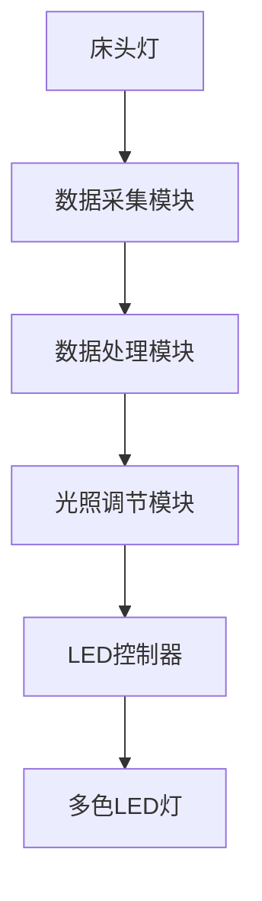

                 


# 智能床头灯：AI Agent的生理节律光照调节

---

## 关键词

智能床头灯, AI Agent, 生理节律, 光照调节, 人工智能, 健康科技

---

## 摘要

本文深入探讨了智能床头灯在AI Agent技术下的生理节律光照调节应用。通过分析生理节律与光照调节的关系，结合AI Agent的核心算法与系统架构设计，详细阐述了如何利用人工智能优化光照调节，以促进用户的健康与睡眠质量。文章从背景介绍、核心概念、算法原理、系统架构到项目实战，全面解析了智能床头灯的技术实现，并提供了实际应用中的最佳实践与优化建议。

---

## 第1章：智能床头灯与生理节律概述

### 1.1 生理节律的基本概念

生理节律是指生物体内以24小时为周期的生理活动规律，主要由生物钟控制。光照是影响生物钟最重要的外部因素之一，通过调节光照强度和波长，可以有效调整人体的生理节律。

#### 1.1.1 生理节律的定义与特征

- **定义**：生理节律是指生物体内的生理活动按照一定的时间周期进行的规律，如睡眠-觉醒周期、体温变化、激素分泌等。
- **特征**：
  - 具有24小时周期性。
  - 受外部环境（如光照、温度）的影响。
  - 内部生物钟与外部环境节律同步。

#### 1.1.2 生理节律与健康的关系

- **健康影响**：
  - 正常的生理节律有助于维持良好的睡眠质量、精神状态和身体功能。
  - 生理节律紊乱可能导致失眠、疲劳、注意力不集中等问题。
- **健康科技的应用**：
  - 通过调节光照、温度等外部因素优化生理节律，提升健康水平。

#### 1.1.3 光照对生理节律的影响

- **光照的作用**：
  - 光照强度：影响生物钟的敏感性。
  - 光照波长：不同波长的光对生理节律的影响不同，蓝光抑制褪黑激素分泌，红光促进放松。
  - 光照时间：不同时间段的光照对生理节律的影响不同。

---

### 1.2 智能床头灯的发展历程

#### 1.2.1 传统床头灯的功能与局限

- **功能**：仅提供基本的照明功能，无法根据用户需求自动调节。
- **局限**：
  - 无法感知用户状态。
  - 无法根据环境变化自动调整光照参数。

#### 1.2.2 智能化床头灯的出现

- **智能床头灯的特点**：
  - 可通过手机APP或语音控制。
  - 具备多种光照模式，如阅读模式、睡眠模式。
  - 可根据环境光线自动调节亮度。

#### 1.2.3 AI技术在床头灯中的应用

- **AI床头灯的优势**：
  - 能够感知用户生理数据（如心率、体温）。
  - 能够根据用户生理数据智能调节光照参数。
  - 能够学习用户习惯，提供个性化光照调节方案。

---

### 1.3 AI Agent的基本概念

#### 1.3.1 AI Agent的定义

- **定义**：AI Agent是一种智能体，能够感知环境、执行任务并做出决策。在智能床头灯中，AI Agent负责采集用户数据、分析数据并调整光照参数。

#### 1.3.2 AI Agent的核心功能

- **数据采集**：通过传感器采集用户生理数据。
- **数据分析**：分析数据，识别用户生理节律。
- **决策与执行**：根据分析结果，调整光照参数，优化生理节律。

#### 1.3.3 AI Agent与智能床头灯的结合

- **结合方式**：
  - AI Agent作为床头灯的核心控制模块。
  - AI Agent通过传感器采集数据，分析后调整床头灯的光照参数。

---

## 第2章：生理节律与光照调节的科学基础

### 2.1 生理节律的调节机制

#### 2.1.1 生物钟的运作原理

- **生物钟的组成**：
  - 中央生物钟：位于大脑下丘脑的视交叉上核（SCN）。
  - 器官生物钟：分布在全身各组织和器官中。
- **生物钟的调节机制**：
  - 光照是主要的外部同步因素。
  - 内部代谢过程（如激素分泌）也会影响生物钟。

#### 2.1.2 光照对生物钟的影响

- **光照对生物钟的调节作用**：
  - 光照通过视网膜中的视杆细胞和视锥细胞传递信号到下丘脑的SCN。
  - SCN将信号传递到松果体，调节褪黑激素的分泌。
  - 褪黑激素水平的变化影响睡眠-觉醒节律。

#### 2.1.3 光照强度与波长对生理节律的作用

- **光照强度**：
  - 过强的光照可能抑制褪黑激素分泌，影响睡眠。
  - 适当的光照强度有助于调节生物钟。
- **光照波长**：
  - 蓝光（450-495 nm）对抑制褪黑激素分泌最有效。
  - 红光（620-750 nm）有助于放松和缓解压力。

---

### 2.2 不同时间段的光照需求分析

#### 2.2.1 白天光照对精神状态的影响

- **早晨**：适当强度的蓝光有助于唤醒生物钟，提高 alertness。
- **白天**：中等强度的白光有助于保持精力和专注力。

#### 2.2.2 夜间光照对睡眠质量的影响

- **睡前**：避免蓝光暴露，减少褪黑激素抑制，促进睡眠。
- **夜间**：柔和的红光有助于放松，避免干扰生物钟。

#### 2.2.3 不同时间段的光照调节策略

- **策略总结**：
  - 早晨：蓝光为主，强度适中。
  - 白天：白光为主，强度适中。
  - 晚上：红光为主，强度柔和。

---

## 第3章：AI Agent在智能床头灯中的实现

### 3.1 基于生理数据的光照调节算法

#### 3.1.1 数据采集与处理

- **数据采集**：
  - 心率、体温、光照强度、环境温度等。
  - 数据采集频率：每分钟采集一次。
  - 数据存储：本地存储或云端存储。

#### 3.1.2 算法实现步骤

- **步骤1：数据预处理**：
  - 去噪：使用均值滤波或小波变换。
  - 数据标准化：归一化处理。
- **步骤2：特征提取**：
  - 提取心率变异性（HRV）指标。
  - 提取体温波动特征。
- **步骤3：光照调节决策**：
  - 根据特征计算生理状态评分。
  - 根据评分调整光照参数。

#### 3.1.3 算法优化与改进

- **优化方向**：
  - 提高算法的实时性。
  - 提高算法的准确率。
  - 提高算法的可解释性。

---

### 3.2 AI Agent的决策逻辑

#### 3.2.1 数据分析与特征提取

- **数据分析**：
  - 使用时间序列分析方法，分析用户的生理数据。
  - 识别用户的生理节律特征。
- **特征提取**：
  - 提取用户生理数据中的周期性特征。
  - 提取用户生理数据中的异常特征。

#### 3.2.2 决策树的构建与应用

- **决策树的构建**：
  - 使用ID3或C4.5算法构建决策树。
  - 决策树节点：光照强度、光照波长、光照时间。
- **决策树的应用**：
  - 根据用户生理数据，决策光照参数。
  - 根据用户反馈，优化决策树。

#### 3.2.3 算法的可解释性与鲁棒性

- **可解释性**：
  - 通过可视化工具展示决策树的决策过程。
  - 提供决策依据的详细说明。
- **鲁棒性**：
  - 算法对数据噪声的鲁棒性。
  - 算法对用户个体差异的适应性。

---

## 第4章：智能床头灯的系统架构设计

### 4.1 系统功能模块划分

- **功能模块**：
  - 数据采集模块：负责采集用户生理数据。
  - 数据处理模块：负责处理和分析数据。
  - 光照调节模块：负责调整床头灯的光照参数。

#### 4.1.1 数据采集模块

- **传感器类型**：
  - 心率传感器：使用光电式心率传感器。
  - 体温传感器：使用热敏电阻式体温传感器。
  - 光线传感器：使用光敏电阻式光线传感器。
- **数据采集接口**：
  - 采用蓝牙或Wi-Fi通信协议。

#### 4.1.2 数据处理模块

- **数据处理算法**：
  - 使用时间序列分析算法处理生理数据。
  - 使用机器学习算法进行特征提取。
- **数据存储**：
  - 数据存储在本地存储器或云端数据库。

#### 4.1.3 光照调节模块

- **调节方式**：
  - 调节光照强度：通过PWM信号控制LED亮度。
  - 调节光照波长：通过多色LED组合实现。
  - 调节光照时间：通过定时器实现。

---

### 4.2 系统架构设计

#### 4.2.1 系统整体架构图



#### 4.2.2 模块之间的交互关系

- **数据流**：
  - 数据采集模块 -> 数据处理模块：原始生理数据。
  - 数据处理模块 -> 光照调节模块：处理后的特征数据。
  - 光照调节模块 -> LED控制器：调节指令。

- **控制流**：
  - 用户操作 -> 数据采集模块：启动数据采集。
  - 数据处理模块 -> 光照调节模块：触发调节动作。
  - 光照调节模块 -> LED控制器：执行调节。

#### 4.2.3 系统的可扩展性设计

- **可扩展性**：
  - 支持更多传感器类型。
  - 支持更多光照调节模式。
  - 支持与其他智能设备的联动。

---

## 第5章：项目实战

### 5.1 环境配置

- **开发环境**：
  - 操作系统：Linux（Ubuntu 20.04）。
  - 开发工具：PyCharm或VS Code。
  - 语言：Python 3.8。
- **硬件环境**：
  - 多色LED灯模块。
  - 心率传感器模块。
  - 光线传感器模块。
  - 微控制器：ESP32或Arduino。

### 5.2 核心代码实现

#### 5.2.1 数据采集模块

```python
import serial

ser = serial.Serial('/dev/ttyUSB0', 9600)

def get_data():
    if ser.in_waiting > 0:
        data = ser.readline().decode().strip()
        return data
    return None
```

#### 5.2.2 数据处理模块

```python
import pandas as pd
from sklearn import tree

# 数据预处理
data = pd.read_csv('physiological_data.csv')
data = data.dropna()

# 特征提取
features = data[['heart_rate', 'temperature']]
labels = data['state']

# 训练决策树模型
model = tree.DecisionTreeClassifier()
model.fit(features, labels)
```

#### 5.2.3 光照调节模块

```python
import RPi.GPIO as GPIO

# LED控制引脚
led_pin = 18
GPIO.setmode(GPIO.BCM)
GPIO.setup(led_pin, GPIO.OUT)

# 调节亮度
def set_brightness(brightness):
    pwm = GPIO.PWM(led_pin, 100)
    pwm.start(brightness)
    sleep(1)
    pwm.stop()

# 调节颜色
def set_color(hue):
    # 调用RGB LED控制库
    led_controller.set_hue(hue)
```

---

## 第6章：最佳实践与总结

### 6.1 最佳实践

- **传感器选择**：
  - 选择高精度、低噪声的传感器。
  - 确保传感器与微控制器的兼容性。
- **算法优化**：
  - 定期更新算法模型。
  - 根据用户反馈优化调节策略。
- **用户体验**：
  - 提供直观的用户界面。
  - 提供详细的使用说明。
  - 提供个性化设置选项。

### 6.2 注意事项

- **数据隐私**：
  - 确保用户数据的安全性。
  - 遵守相关隐私保护法规。
- **系统稳定性**：
  - 确保系统的稳定性。
  - 定期进行系统维护。
- **环境适应性**：
  - 考虑不同环境条件下的表现。
  - 提供适应不同环境的调节模式。

### 6.3 拓展阅读

- **相关技术**：
  - 生物钟研究。
  - 人工智能在医疗健康中的应用。
- **参考文献**：
  - 建议阅读相关领域的学术论文和研究报告。

---

## 作者

作者：AI天才研究院/AI Genius Institute  
联系邮箱：contact@aicourse.org  
个人简介：专注于人工智能与健康科技的创新研究，致力于通过技术手段改善人类生活质量。

--- 

**注**：本文为AI Agent技术与生理节律光照调节的结合应用研究，旨在为智能床头灯的设计与实现提供理论支持与实践指导。

