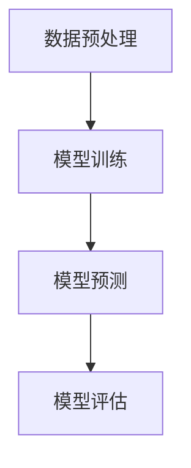
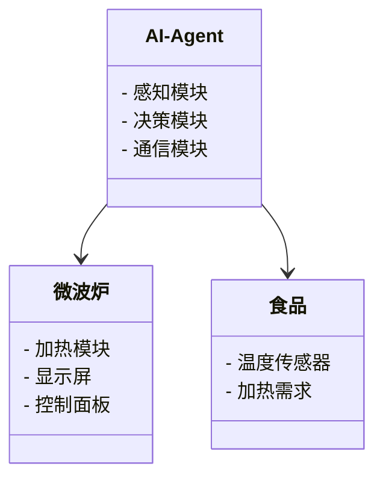
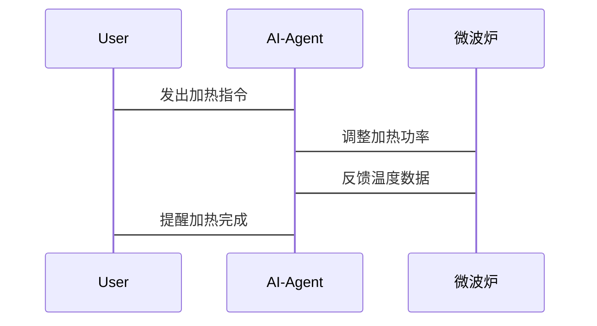
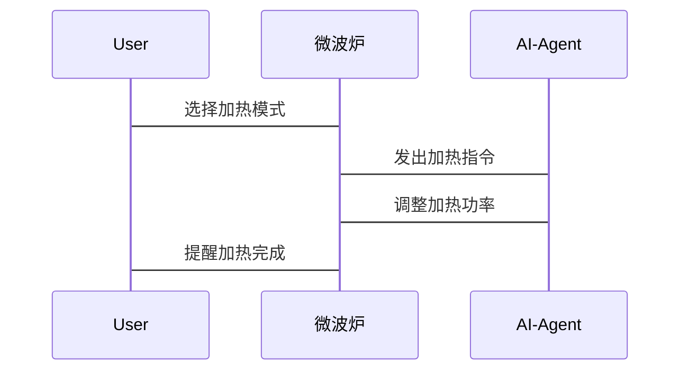

                 


# 智能微波炉：AI Agent的食品安全监控系统

## 关键词：智能微波炉，AI Agent，食品安全，监控系统，机器学习，算法原理，系统架构

## 摘要：
本文探讨了AI Agent在智能微波炉中的应用，特别是在食品安全监控系统中的作用。通过详细分析AI Agent的核心原理、算法实现、系统架构设计以及实际项目案例，本文展示了如何利用AI技术提升微波炉的智能化水平，确保食品加热过程的安全与高效。文章内容涵盖背景介绍、核心概念、算法原理、系统设计、项目实战及最佳实践，为读者提供了全面的技术解读。

---

# 第1章: 智能微波炉与AI Agent的背景介绍

## 1.1 智能微波炉的背景与现状
### 1.1.1 微波炉的发展历程
微波炉作为一种家用电器，自20世纪40年代发明以来，经历了从简单加热工具到智能化设备的演变。早期的微波炉仅具备基本的加热功能，而现代微波炉已集成了多种智能化功能，如自动调节功率、定时加热和语音控制等。

### 1.1.2 智能化技术在厨房设备中的应用
随着物联网（IoT）和人工智能（AI）技术的快速发展，智能化技术逐渐渗透到厨房设备中。智能微波炉作为其中的重要代表，通过AI技术实现更智能的食品加热和安全监控。

### 1.1.3 智能微波炉的市场现状与趋势
当前，智能微波炉市场呈现快速增长态势。消费者对食品加热的安全性、便捷性和智能化需求日益增加，推动了智能微波炉的技术创新和市场扩展。

---

## 1.2 AI Agent的核心概念
### 1.2.1 AI Agent的基本定义
AI Agent（智能代理）是指能够感知环境、自主决策并执行任务的智能实体。在智能微波炉中，AI Agent负责接收用户的指令、监控加热过程并实时调整加热参数。

### 1.2.2 AI Agent的主要特点
- **自主性**：AI Agent能够自主感知环境并做出决策，无需人工干预。
- **反应性**：能够实时响应环境变化并调整行为。
- **学习能力**：通过机器学习算法不断优化自身的决策能力。

### 1.2.3 AI Agent与传统微波炉的对比
| 特性         | 传统微波炉         | 智能微波炉中的AI Agent |
|--------------|--------------------|--------------------------|
| 感知能力     | 无                 | 具备环境感知能力         |
| 决策能力     | 无                 | 具备自主决策能力         |
| 学习能力     | 无                 | 具备机器学习能力         |

---

## 1.3 食品安全监控系统的重要性
### 1.3.1 食品安全问题的现状
食品安全问题一直是全球关注的焦点。食品在加热过程中可能因温度控制不当而导致变质或安全隐患，尤其是对于婴儿食品和特殊食材。

### 1.3.2 微波炉在食品加热中的潜在风险
微波炉加热过程中，温度分布不均可能导致食品部分过热或未充分加热，从而引发食品安全问题。

### 1.3.3 食品安全监控的必要性
通过AI Agent实时监控加热过程，可以有效避免因温度异常导致的食品安全问题，确保食品加热的均匀性和安全性。

---

## 1.4 本章小结
本章介绍了智能微波炉的发展背景、AI Agent的核心概念及其在食品安全监控中的重要性。通过对比传统微波炉与智能微波炉，明确了AI Agent在提升食品加热安全性和智能化水平中的关键作用。

---

# 第2章: AI Agent的核心原理

## 2.1 AI Agent的基本原理
### 2.1.1 AI Agent的感知与决策机制
AI Agent通过传感器感知环境信息（如温度、湿度），结合预设的目标和规则，利用机器学习算法进行决策。

### 2.1.2 AI Agent的自主性与适应性
AI Agent能够根据环境变化自主调整行为，具有较强的适应性。例如，在微波炉加热过程中，AI Agent可以根据食品类型动态调整加热功率。

### 2.1.3 AI Agent的通信与协作
AI Agent可以与其他设备或系统（如智能家居中枢）通信，实现协同工作。例如，AI Agent可以通过物联网与智能家居系统联动，实时调整加热参数。

---

## 2.2 AI Agent在食品安全监控中的应用
### 2.2.1 AI Agent的实时监测功能
AI Agent可以实时监测微波炉内的温度分布，确保食品加热均匀。

### 2.2.2 AI Agent的智能识别与预警
AI Agent能够识别异常温度波动并发出预警，避免因温度过高或过低导致的食品安全问题。

### 2.2.3 AI Agent的数据分析能力
AI Agent可以分析历史加热数据，优化加热策略，提高加热效率和食品质量。

---

## 2.3 AI Agent的核心概念对比表
| 特性         | 传统传感器         | AI Agent                 |
|--------------|--------------------|--------------------------|
| 感知能力     | 单一感知           | 具备多维感知能力         |
| 决策能力     | 无                 | 具备自主决策能力         |
| 学习能力     | 无                 | 具备机器学习能力         |

---

## 2.4 AI Agent的ER实体关系图
```mermaid
erd
  entity AI-Agent
    - 感知模块
    - 决策模块
    - 通信模块
  entity 微波炉
    - 加热模块
    - 显示屏
    - 控制面板
  entity 食品
    - 温度传感器
    - 加热需求
```

---

## 2.5 本章小结
本章详细阐述了AI Agent的核心原理及其在食品安全监控中的应用。通过对比传统传感器和AI Agent，明确了AI Agent在智能化食品加热中的独特优势。

---

# 第3章: AI Agent的算法原理与数学模型

## 3.1 AI Agent的核心算法
### 3.1.1 分类算法的定义
分类算法是一种 supervised learning 技术，通过训练数据分类器，对新数据进行分类预测。

### 3.1.2 分类算法的流程
1. 数据预处理：清洗和归一化数据。
2. 模型训练：利用训练数据训练分类器。
3. 模型预测：对新数据进行分类预测。
4. 模型评估：评估模型的准确率和召回率。

---

## 3.2 分类算法的数学模型
### 3.2.1 分类算法的数学公式
$$ \text{损失函数} = \sum_{i=1}^{n} (y_i - \hat{y}_i)^2 $$

其中，$y_i$ 是真实标签，$\hat{y}_i$ 是预测标签。

### 3.2.2 分类算法的数学推导
以支持向量机（SVM）为例，其优化目标为：
$$ \min_{w,b,\xi} \frac{1}{2}w^Tw + C\sum_{i=1}^{n}\xi_i $$
$$ \text{约束条件：} \quad y_i(w \cdot x_i + b) \geq 1 - \xi_i, \quad \xi_i \geq 0 $$

---

## 3.3 分类算法的Python实现
```python
import numpy as np
from sklearn import svm

# 数据预处理
X = np.array([[...], [...]])  # 特征数据
y = np.array([...])            # 标签数据

# 模型训练
model = svm.SVC()
model.fit(X, y)

# 模型预测
new_data = np.array([[...], [...]])
prediction = model.predict(new_data)
```

---

## 3.4 分类算法的Mermaid流程图


---

## 3.5 本章小结
本章详细介绍了AI Agent的核心算法及其数学模型。通过Python代码和Mermaid流程图，展示了分类算法在智能微波炉中的具体实现。

---

# 第4章: 智能微波炉系统的分析与设计

## 4.1 智能微波炉系统架构设计
### 4.1.1 系统架构概述
智能微波炉系统采用分层架构，包括感知层、决策层和执行层。

### 4.1.2 系统架构图


---

## 4.2 系统功能设计
### 4.2.1 系统功能模块
- **感知模块**：实时监测微波炉内的温度和湿度。
- **决策模块**：根据感知数据调整加热功率。
- **通信模块**：与智能家居系统联动。

### 4.2.2 系统功能流程图


---

## 4.3 系统接口设计
### 4.3.1 系统接口定义
- 用户接口：通过触摸屏或语音指令与系统交互。
- 硬件接口：与温度传感器和加热模块连接。
- 软件接口：与智能家居系统通信。

### 4.3.2 接口交互流程


---

## 4.4 本章小结
本章详细分析了智能微波炉系统的架构设计和功能模块，通过Mermaid图展示了系统的整体结构和交互流程。

---

# 第5章: 项目实战——智能微波炉的实现

## 5.1 环境安装
### 5.1.1 系统环境
- 操作系统：Windows/Mac/Linux
- 开发工具：Python 3.8+
- 依赖库：TensorFlow, scikit-learn, matplotlib

---

## 5.2 核心代码实现
### 5.2.1 数据预处理
```python
import numpy as np
from sklearn import preprocessing

# 数据归一化
X_normalized = preprocessing.minmax_scale(X, feature_range=(0, 1))
```

### 5.2.2 模型训练
```python
from sklearn.svm import SVC

# 训练SVM模型
model = SVC()
model.fit(X_normalized, y)
```

### 5.2.3 实时监控
```python
import time

# 实时监控温度
while True:
    current_temp = get_temperature()
    prediction = model.predict([[current_temp]])
    print(f"当前温度：{current_temp}，预测结果：{prediction}")
    time.sleep(1)
```

---

## 5.3 代码解读与分析
### 5.3.1 数据预处理
数据预处理是确保模型准确性的关键步骤，包括归一化和标准化。

### 5.3.2 模型训练
选择合适的算法（如SVM）进行模型训练，并通过交叉验证优化模型参数。

### 5.3.3 实时监控
通过实时采集温度数据并进行预测，AI Agent能够动态调整加热功率，确保食品加热的均匀性和安全性。

---

## 5.4 实际案例分析
### 5.4.1 案例背景
假设用户需要加热一锅鸡汤，目标温度为100°C。

### 5.4.2 加热过程监控
AI Agent实时监测微波炉内的温度，动态调整加热功率，确保温度稳定在目标范围内。

### 5.4.3 加热结果分析
通过模型预测，AI Agent确保了鸡汤的均匀加热，避免了局部过热或未加热的情况。

---

## 5.5 项目小结
本章通过实际案例展示了智能微波炉的实现过程，从环境安装到代码实现，详细讲解了AI Agent在食品安全监控中的具体应用。

---

# 第6章: 最佳实践与注意事项

## 6.1 最佳实践
### 6.1.1 数据质量的重要性
确保训练数据的多样性和代表性，避免数据偏差。

### 6.1.2 算法选择的策略
根据具体场景选择合适的算法，如分类问题选择SVM或随机森林。

### 6.1.3 系统维护的建议
定期更新模型参数，确保系统的稳定性和准确性。

---

## 6.2 注意事项
### 6.2.1 硬件与软件的兼容性
确保微波炉硬件与AI Agent软件的兼容性，避免接口冲突。

### 6.2.2 数据隐私问题
在采集和处理用户数据时，需严格遵守数据隐私保护法规。

### 6.2.3 系统的可扩展性
设计时预留扩展接口，方便未来功能的升级和优化。

---

## 6.3 拓展阅读
- 推荐阅读《机器学习实战》（《Hands-On Machine Learning with Scikit-Learn and TensorFlow》）
- 参考智能家居领域的最新研究成果

---

## 作者：AI天才研究院/AI Genius Institute & 禅与计算机程序设计艺术 /Zen And The Art of Computer Programming

---

通过以上章节的详细讲解，本文系统地介绍了AI Agent在智能微波炉中的应用，从理论到实践，为读者提供了全面的技术解读。

