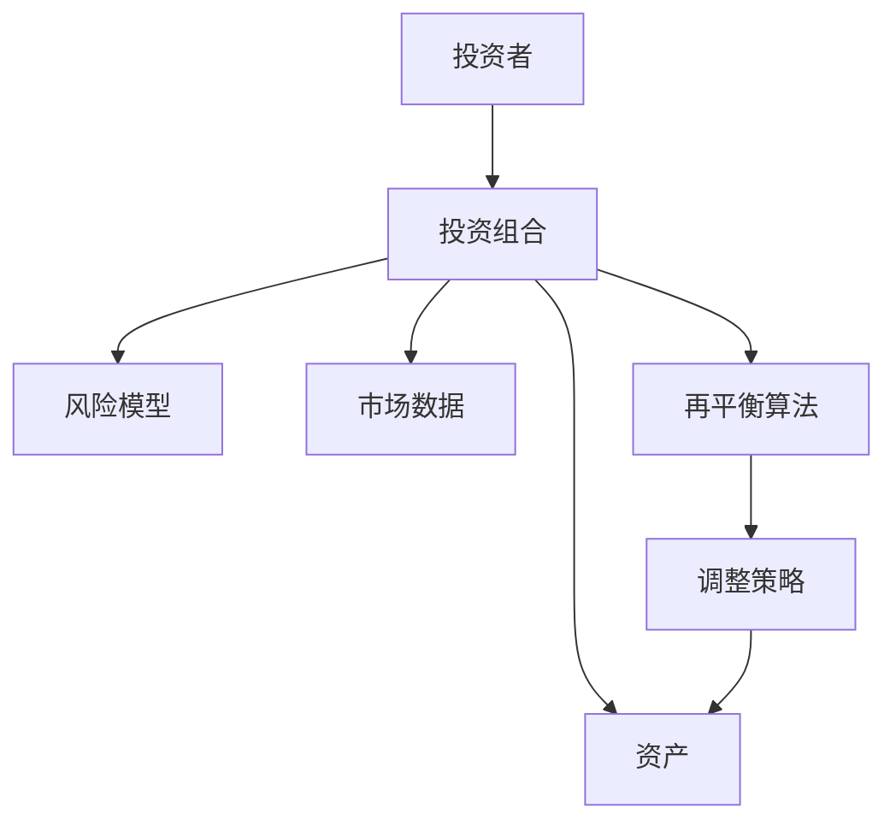
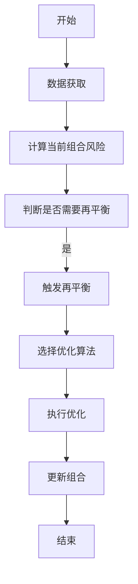
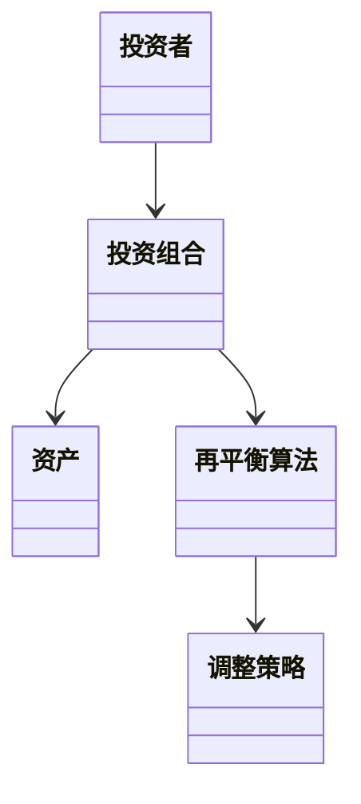
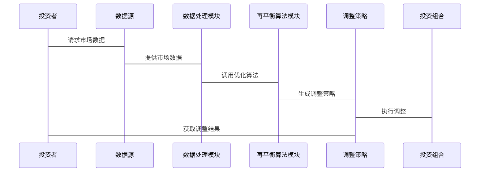

                 


# 智能投资组合再平衡技术

> **关键词：** 投资组合，智能再平衡，优化算法，风险管理，金融技术  
> **摘要：** 本文探讨了智能投资组合再平衡技术的核心概念、算法原理、系统架构及实际应用。通过分析传统与智能再平衡的对比，详细讲解了基于数学优化和机器学习的算法，结合系统设计和项目实战，展示了如何利用智能技术优化投资组合，降低风险和成本。

---

# 第1章: 智能投资组合再平衡的背景与意义

## 1.1 投资组合再平衡的定义与背景

### 1.1.1 投资组合的基本概念
投资组合是指将资金分配到不同资产（如股票、债券、基金等）上的策略，旨在通过多元化配置降低风险并提高收益。投资组合的价值会随市场波动而变化，因此需要定期调整以维持预期的资产配置比例。

### 1.1.2 再平衡的必要性与目的
再平衡是指定期调整投资组合，使其恢复到预定的目标配置。传统再平衡方法基于固定的时间间隔或阈值进行调整，但这种方法存在效率低、成本高等问题。随着人工智能和大数据技术的发展，智能再平衡应运而生。

### 1.1.3 智能再平衡的兴起与发展趋势
智能再平衡利用算法优化投资组合的配置，通过实时数据分析和预测模型，实现动态调整。其优势在于减少交易成本、降低风险、提高收益，成为现代金融技术的重要组成部分。

## 1.2 智能投资组合再平衡的核心概念

### 1.2.1 智能再平衡的定义
智能再平衡是通过算法优化模型，实时分析市场数据和投资者需求，动态调整投资组合的配置。

### 1.2.2 传统再平衡与智能再平衡的对比
| 特性 | 传统再平衡 | 智能再平衡 |
|------|------------|------------|
| 触发条件 | 时间或阈值 | 数据驱动实时调整 |
| 调整频率 | 定期 | 动态 |
| 成本 | 较高 | 较低 |

### 1.2.3 智能再平衡的核心要素与边界
核心要素包括市场数据、目标配置、优化算法；边界条件是交易成本、风险承受能力、市场流动性。

## 1.3 本章小结
本章介绍了智能再平衡的背景、定义和与传统方法的对比，强调了智能技术在提升投资效率中的作用。

---

# 第2章: 智能投资组合再平衡的核心概念与联系

## 2.1 核心概念原理

### 2.1.1 投资组合优化的数学模型
目标函数：最大化收益或最小化风险。  
约束条件：资产比例、风险承受能力等。

### 2.1.2 再平衡的触发条件与策略
市场波动、资产价格变化、投资者目标调整等。

### 2.1.3 智能再平衡的算法框架
数据采集、模型预测、策略生成、执行调整。

## 2.2 核心概念属性对比表

| 属性 | 传统再平衡 | 智能再平衡 |
|------|------------|------------|
| 数据依赖 | 低 | 高 |
| 调整精度 | 粗放 | 精准 |
| 响应速度 | �迟缓 | 实时 |

## 2.3 实体关系图（ER图）



## 2.4 本章小结
本章通过数学模型和实体关系图，展示了智能再平衡的核心概念和系统架构。

---

# 第3章: 智能投资组合再平衡的算法原理

## 3.1 基于均值-方差模型的优化算法

### 3.1.1 均值-方差模型的数学公式
$$\text{目标函数: } \min \sigma^2 \text{ 在 } \mu \text{ 固定}$$

### 3.1.2 约束条件与优化目标
目标：最小化组合的方差；约束：资产权重之和为1。

### 3.1.3 拉格朗日乘数法的应用
通过拉格朗日乘数引入约束条件，求解最优解。

## 3.2 基于机器学习的再平衡算法

### 3.2.1 基于回归模型的预测
使用回归模型预测资产收益，优化配置比例。

### 3.2.2 基于聚类算法的风险评估
通过聚类分析识别风险较高的资产，进行调整。

### 3.2.3 基于强化学习的动态调整
利用强化学习模型，动态优化投资组合。

## 3.3 算法流程图



## 3.4 算法实现代码

```python
import numpy as np
from scipy.optimize import minimize

def portfolio_optimization(returns, weights):
    # 定义目标函数
    def objective(weights):
        return np.dot(weights.T, np.dot(returns, weights))
    # 约束条件
    constraints = [{'type': 'eq', 'fun': lambda x: sum(x) - 1}]
    # 优化
    result = minimize(objective, weights, method='SLSQP', constraints=constraints)
    return result.x

# 示例
returns = np.array([0.1, 0.2, 0.15])
weights = np.array([1/3, 1/3, 1/3])
optimized_weights = portfolio_optimization(returns, weights)
print(optimized_weights)
```

## 3.5 本章小结
本章详细讲解了基于均值-方差模型和机器学习的优化算法，并通过代码实现展示了算法的可行性。

---

# 第4章: 智能投资组合再平衡系统的架构设计

## 4.1 系统功能设计

### 4.1.1 领域模型（mermaid 类图）



### 4.1.2 系统架构设计（mermaid 架构图）

```mermaid
archiecture
    数据源 --> 数据处理模块 --> 再平衡算法模块 --> 调整策略 --> 投资组合
```

### 4.1.3 系统接口设计
API接口：数据获取、算法调用、策略执行。

## 4.2 系统交互设计（mermaid 序列图）



## 4.3 本章小结
本章设计了智能再平衡系统的架构，包括功能模块、接口设计和交互流程。

---

# 第5章: 智能投资组合再平衡技术的项目实战

## 5.1 项目环境安装

```bash
pip install numpy scipy matplotlib
```

## 5.2 核心实现代码

```python
import numpy as np
from scipy.optimize import minimize

def portfolio_optimization(returns, weights):
    def objective(weights):
        return np.dot(weights.T, np.dot(returns, weights))
    constraints = [{'type': 'eq', 'fun': lambda x: sum(x) - 1}]
    result = minimize(objective, weights, method='SLSQP', constraints=constraints)
    return result.x

# 示例数据
returns = np.array([0.1, 0.2, 0.15])
weights = np.array([1/3, 1/3, 1/3])

optimized_weights = portfolio_optimization(returns, weights)
print("优化后的权重：", optimized_weights)
```

## 5.3 实际案例分析

### 5.3.1 案例背景
假设投资者有三个资产，预期收益率分别为10%、20%、15%。

### 5.3.2 优化过程
调用优化算法，计算出最优权重。

### 5.3.3 结果分析
优化后的权重可能更倾向于高收益资产。

## 5.4 本章小结
本章通过实际案例展示了智能再平衡技术的应用，验证了其有效性。

---

# 第6章: 智能投资组合再平衡的最佳实践与小结

## 6.1 最佳实践 tips

1. **数据质量**：确保数据准确性和实时性。
2. **算法选择**：根据需求选择合适的优化算法。
3. **风险管理**：设置合理的风险边界。

## 6.2 小结
智能再平衡技术通过算法优化投资组合，降低了风险和成本，是现代金融技术的重要应用。

---

# 作者

**作者：AI天才研究院/AI Genius Institute & 禅与计算机程序设计艺术 /Zen And The Art of Computer Programming**

---

**备注：** 如果需要进一步修改或补充，请随时告知！

