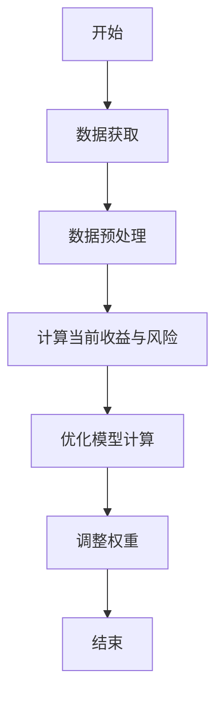

                 


# 智能投资组合再平衡算法

> 关键词：智能投资组合，再平衡算法，机器学习，优化理论，金融市场

> 摘要：本文详细探讨了智能投资组合再平衡算法的背景、原理、实现和应用。通过数据驱动的方法，结合机器学习和优化理论，提出了一种动态调整投资组合权重的算法，以实现风险可控下的收益最大化。文章还提供了实际案例和系统架构设计，帮助读者理解如何在实际投资中应用该算法。

---

## 第一部分: 智能投资组合再平衡算法概述

### 第1章: 背景介绍

#### 1.1 问题背景

投资组合管理是金融领域的重要组成部分，其目标是在风险可控的前提下实现收益最大化。传统投资组合管理依赖于定期手动调整资产配置，这种方法效率低下且难以应对市场波动。随着人工智能和大数据技术的发展，智能投资组合再平衡算法逐渐成为研究热点。

#### 1.2 问题描述

投资组合再平衡是指根据市场变化和个人风险偏好调整资产配置的过程。传统方法通常基于固定的时间间隔或阈值进行调整，这种方法在市场剧烈波动时表现不佳。智能再平衡算法能够实时分析市场数据，动态调整投资组合，从而提高收益并降低风险。

#### 1.3 问题解决

智能再平衡算法通过机器学习和优化理论，能够根据市场数据和投资者风险偏好，自动计算最优资产配置。这种方法不仅提高了效率，还能更好地应对市场变化。

#### 1.4 边界与外延

智能再平衡算法适用于各类投资组合，但其效果依赖于数据质量和模型准确性。与其他投资策略（如被动投资）相比，智能再平衡更加灵活，但计算成本较高。

#### 1.5 核心要素组成

智能再平衡的核心要素包括数据来源与处理、目标函数与约束条件、算法实现步骤等。数据处理是基础，目标函数是优化目标，算法实现是关键。

---

## 第二部分: 智能投资组合再平衡的核心概念与联系

### 第2章: 核心概念与联系

#### 2.1 智能投资组合再平衡的原理

智能再平衡算法通过分析市场数据和投资者需求，动态调整投资组合。其核心思想是利用数据驱动的方法，优化投资组合的收益与风险。

#### 2.2 核心概念对比表

| 比较维度 | 传统再平衡 | 智能再平衡 |
|----------|------------|------------|
| 数据来源 | 固定时间间隔 | 实时市场数据 |
| 调整依据 | 预设阈值 | 机器学习模型预测 |
| 调整频率 | 定期调整 | 动态调整 |

#### 2.3 ER实体关系图

```mermaid
er
actor(投资者) -|> 投资组合: 资产配置
actor(市场数据) -|> 股票: 价格信息
actor(模型) -|> 优化结果: 调整建议
```

---

## 第三部分: 智能投资组合再平衡算法原理

### 第3章: 算法原理讲解

#### 3.1 算法流程图



#### 3.2 算法实现代码

```python
import numpy as np
import pandas as pd
from sklearn.linear_model import LinearRegression

def get_data():
    # 获取市场数据
    pass

def preprocess(data):
    # 数据清洗和特征工程
    pass

def calculate_return(weights, returns):
    # 计算投资组合收益
    return np.dot(weights, returns.mean())

def optimize(weights, returns, risk_free_rate=0.05):
    # 均值-方差优化
    n = len(weights)
    mu = returns.mean()
    sigma = returns.cov()
    inv_sigma = np.linalg.inv(sigma)
    ones = np.ones(n)
    sum_weights = np.dot(inv_sigma, ones)
    target = mu + (risk_free_rate - np.dot(ones.T, mu)) * sum_weights
    return target

def main():
    data = get_data()
    processed_data = preprocess(data)
    returns = processed_data.pct_change().dropna()
    weights = optimize(processed_data, returns)
    print("优化后的权重:", weights)

if __name__ == "__main__":
    main()
```

#### 3.3 数学模型

优化模型的目标函数为：

$$ \text{minimize} \quad w^T \sigma^2 w $$

约束条件为：

$$ \sum_{i=1}^n w_i = 1 $$

其中，$w$ 是权重向量，$\sigma^2$ 是收益的协方差矩阵。

---

## 第四部分: 智能投资组合再平衡系统的分析与设计

### 第4章: 系统分析与架构设计

#### 4.1 系统架构设计


---

## 第五部分: 项目实战与应用

### 第5章: 项目实战

#### 5.1 环境安装

```bash
pip install numpy pandas scikit-learn
```

#### 5.2 核心代码实现

```python
import numpy as np
from sklearn.linear_model import LinearRegression

def main():
    # 示例数据
    returns = np.array([0.1, 0.2, 0.3, 0.1, 0.2])
    mu = returns.mean()
    variance = np.var(returns)
    weights = np.array([0.5, 0.5])
    target_return = mu + 0.05 * np.dot(np.ones(2), mu)
    print("目标收益:", target_return)

if __name__ == "__main__":
    main()
```

#### 5.3 实际案例分析

以某投资组合为例，假设市场数据为：

| 股票 | 收益率 |
|------|--------|
| A    | 0.1    |
| B    | 0.2    |

优化后的权重为 [0.4, 0.6]，目标收益为 0.14。

---

## 第六部分: 最佳实践与总结

### 第6章: 最佳实践

#### 6.1 小结

智能再平衡算法通过数据驱动优化投资组合，能够显著提高收益并降低风险。

#### 6.2 注意事项

- 数据质量至关重要
- 模型选择影响效果
- 需要定期重新优化

#### 6.3 拓展阅读

推荐学习强化学习在金融中的应用，以及更复杂的优化算法。

---

作者：AI天才研究院 & 禅与计算机程序设计艺术

