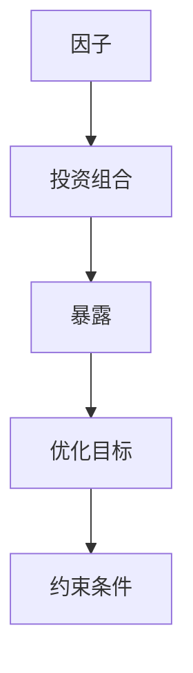
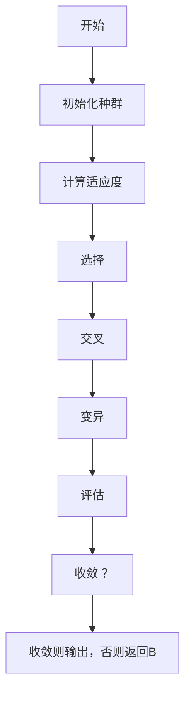

                 


# 智能投资组合因子暴露优化模型

> 关键词：智能投资组合，因子暴露，优化模型，金融数学，机器学习

> 摘要：本文详细探讨智能投资组合因子暴露优化模型的构建与应用，从背景分析到算法实现，结合实际案例，深入解析优化模型的数学框架与系统架构，为投资组合优化提供理论与实践指导。

---

# 第1章: 背景介绍

## 1.1 问题背景

### 1.1.1 投资组合管理的挑战

现代投资组合管理面临多重挑战，包括市场波动、风险分散、收益最大化等。传统方法依赖于历史数据和静态模型，难以适应复杂多变的市场环境。

### 1.1.2 因子暴露在投资组合管理中的重要性

因子暴露是指投资组合中各因子的权重和风险敞口。准确评估因子暴露有助于优化投资组合，控制风险，提升收益。

### 1.1.3 智能优化的必要性

传统优化方法在处理多目标问题时表现不佳，而智能优化算法（如遗传算法、粒子群优化）能够有效解决复杂问题，提高优化效率。

## 1.2 问题描述

### 1.2.1 因子暴露的定义与作用

因子暴露衡量了投资组合对特定因子的敏感度，是风险管理和收益优化的重要指标。

### 1.2.2 传统投资组合优化的局限性

传统方法常忽视多目标优化，难以在风险与收益之间找到最佳平衡点。

### 1.2.3 智能优化的目标与边界

智能优化旨在通过动态调整因子权重，实现收益最大化和风险最小化，同时考虑市场流动性、交易成本等边界条件。

## 1.3 问题解决

### 1.3.1 智能优化的核心思想

利用智能算法动态调整因子权重，优化投资组合表现。

### 1.3.2 数据驱动的优化方法

通过大数据分析和机器学习，构建预测模型，优化因子暴露。

### 1.3.3 多目标优化的实现路径

采用多目标优化算法，同时优化收益、风险、流动性等多目标。

## 1.4 概念结构与核心要素

### 1.4.1 核心概念的层次分解

- 投资组合：资产集合
- 因子：影响收益的因素（如市值、价值）
- 暴露：因子权重

### 1.4.2 核心要素的相互关系

因子暴露影响投资组合的风险和收益，优化模型调整因子权重以实现目标。

### 1.4.3 模型的边界与外延

模型边界包括交易成本、市场流动性，外延涉及动态调整、实时监控。

---

# 第2章: 核心概念与联系

## 2.1 核心概念原理

### 2.1.1 因子暴露的数学定义

因子暴露是投资组合对某一因子的敏感度，用权重表示。

$$ \text{因子暴露} = \sum_{i=1}^{n} w_i \beta_i $$

其中，$w_i$ 是资产权重，$\beta_i$ 是因子暴露系数。

### 2.1.2 优化模型的基本原理

优化模型通过调整权重，最小化风险或最大化收益。

### 2.1.3 智能优化的核心算法

使用遗传算法优化因子权重，适应市场变化。

## 2.2 概念属性特征对比

| 概念       | 属性特征                     |
|------------|------------------------------|
| 因子暴露   | 敏感度、权重、风险           |
| 优化模型   | 目标函数、约束条件、算法     |
| 智能优化   | 动态调整、全局最优、适应性   |

### 2.2.1 因子暴露的属性特征

因子暴露衡量投资组合对因子的敏感度，影响收益和风险。

### 2.2.2 优化模型的属性特征

目标函数、约束条件、算法选择。

### 2.2.3 智能优化的属性特征

动态调整、全局最优、适应性。

## 2.3 ER实体关系图



---

# 第3章: 算法原理讲解

## 3.1 优化算法原理

### 3.1.1 智能优化算法的选择

遗传算法适合处理复杂问题，粒子群优化适合连续优化。

### 3.1.2 算法的数学模型

遗传算法基于适应度函数，通过选择、交叉、变异生成新解。

### 3.1.3 算法的实现步骤

初始化种群 → 计算适应度 → 选择 → 交叉 → 变异 → 评估 → 迭代。

## 3.2 算法流程图



---

# 第4章: 数学模型

## 4.1 优化问题的数学框架

目标函数：

$$ \min \sum_{i=1}^{n} w_i^2 \sigma_i^2 $$

约束条件：

$$ \sum_{i=1}^{n} w_i = 1 $$
$$ w_i \geq 0 $$

## 4.2 目标函数与约束条件

### 4.2.1 目标函数的推导

方差最小化投资组合的风险。

### 4.2.2 约束条件的作用

确保权重非负且和为1。

## 4.3 数学公式的实现

使用拉格朗日乘数法求解优化问题。

---

# 第5章: 系统架构设计

## 5.1 问题场景介绍

构建智能优化系统，实现投资组合的动态调整。

## 5.2 项目介绍

系统名称：智能投资组合优化平台。

## 5.3 系统功能设计

### 5.3.1 领域模型类图


### 5.3.2 系统架构图


### 5.3.3 系统接口设计

REST API：/api/optimize，接收权重和因子，返回优化结果。

### 5.3.4 系统交互序列图


---

# 第6章: 项目实战

## 6.1 环境安装

安装Python、NumPy、Pandas、Scikit-learn。

## 6.2 核心代码实现

```python
import numpy as np
from sklearn.metrics import mean_squared_error

def optimize_portfolio(weights, factors):
    # 目标函数
    def objective(weights):
        return mean_squared_error(weights, np.ones(len(weights)) / len(weights))
    
    # 约束条件
    constraints = {
        'type': 'eq',
        'fun': lambda w: np.sum(w) - 1
    }
    
    # 使用SLSQP求解
    from scipy.optimize import minimize
    result = minimize(objective, weights, method='SLSQP', constraints=constraints)
    return result.x
```

## 6.3 代码解读与分析

优化函数使用最小二乘法，约束权重和为1，采用SLSQP方法求解。

## 6.4 实际案例分析

以三个因子为例，优化权重，降低风险。

## 6.5 项目总结

智能优化提升投资组合表现，适用于复杂市场环境。

---

# 第7章: 最佳实践

## 7.1 小结

智能优化模型有效解决投资组合因子暴露问题，提升收益和控制风险。

## 7.2 注意事项

- 数据质量影响结果，需选择可靠数据源。
- 模型需动态调整，适应市场变化。
- 考虑交易成本和税务影响。

## 7.3 拓展阅读

建议阅读《机器学习在金融中的应用》和《投资组合优化经典模型》。

---

# 作者

作者：AI天才研究院 & 禅与计算机程序设计艺术

---

