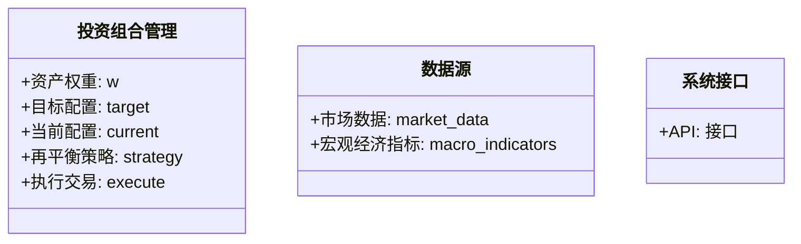
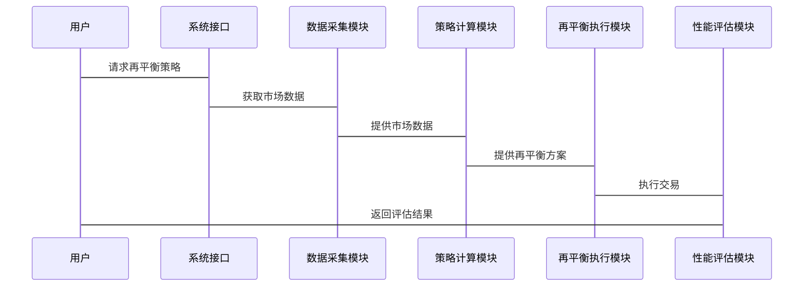

                 


# 智能投资组合多周期再平衡策略

> 关键词：投资组合优化、多周期再平衡、动态规划、机器学习、金融算法、风险管理

> 摘要：本文详细探讨了智能投资组合多周期再平衡策略的设计与实现。从投资组合管理的基本概念出发，分析了多周期再平衡策略的优化模型和算法实现，结合实际案例展示了系统架构设计与项目实战。文章内容涵盖背景介绍、核心概念、算法原理、系统架构、项目实战及最佳实践，旨在为投资组合管理者和算法开发者提供深度的技术参考。

---

## 第1章: 投资组合与再平衡概述

### 1.1 投资组合管理的基本概念

#### 1.1.1 投资组合的定义与目标

投资组合是指将资金分配到不同资产类别（如股票、债券、 commodities等）中的一种组合方式。其目标是在给定的风险水平下实现收益最大化，或者在给定收益水平下实现风险最小化。

$$ \text{收益} = \sum_{i=1}^n w_i r_i $$
$$ \text{风险} = \sqrt{\sum_{i=1}^n \sum_{j=1}^n w_i w_j \sigma_i \sigma_j} $$

其中，\( w_i \) 是第 \( i \) 个资产的权重，\( r_i \) 是第 \( i \) 个资产的收益率，\( \sigma_i \) 是第 \( i \) 个资产的收益率标准差。

#### 1.1.2 再平衡的概念与作用

再平衡是指定期调整投资组合的资产权重，使其保持与目标资产配置一致的过程。再平衡的作用包括：

1. 维持目标资产比例
2. 降低风险敞口
3. 抓住市场机会

#### 1.1.3 多周期投资策略的背景

多周期投资策略是指在不同时间周期（如日、周、月、季度）内进行资产配置和再平衡的策略。其背景包括：

- 市场环境的动态变化
- 不同周期资产表现的差异性
- 投资者风险偏好的变化

### 1.2 智能投资组合的核心要素

#### 1.2.1 数据驱动的投资决策

智能投资组合依赖于大量市场数据（如价格、成交量、收益率等）和宏观经济指标（如GDP、利率、通胀等）进行决策。

#### 1.2.2 多周期资产配置的必要性

多周期资产配置可以更好地捕捉不同市场环境下的投资机会，同时分散风险。

#### 1.2.3 再平衡策略的优化方向

优化方向包括：

- 最小化再平衡成本
- 降低风险敞口
- 提升收益稳定性

### 1.3 智能投资组合的数学模型

#### 1.3.1 投资组合优化的数学表达

$$ \text{目标函数：} \quad \min_w \frac{1}{2} w^T \Sigma w $$
$$ \text{约束条件：} \quad \sum_{i=1}^n w_i = 1 $$

其中，\( \Sigma \) 是资产的协方差矩阵，\( w \) 是资产权重向量。

#### 1.3.2 再平衡策略的优化目标

$$ \text{收益最大化：} \quad \max_w \mu^T w $$
$$ \text{风险最小化：} \quad \min_w w^T \Sigma w $$

### 1.4 本章小结

本章介绍了投资组合管理和再平衡的基本概念，分析了多周期投资策略的背景，提出了智能投资组合的核心要素和数学模型。

---

## 第2章: 多周期再平衡策略的设计与实现

### 2.1 多周期投资的逻辑

#### 2.1.1 不同周期的资产表现差异

不同周期内资产的表现差异显著，例如股票在长周期内表现较好，而债券在短周期内表现较为稳定。

#### 2.1.2 多周期配置的优势与挑战

优势包括分散风险和捕捉不同周期的投资机会，挑战包括复杂性和较高的交易成本。

#### 2.1.3 再平衡的周期选择策略

再平衡的周期选择应基于市场环境、资产表现和投资者风险偏好。

### 2.2 多周期再平衡的优化模型

#### 2.2.1 时间窗口的划分与选择

时间窗口的划分应考虑市场周期性、资产波动性和投资者交易习惯。

#### 2.2.2 资产权重的动态调整

动态调整权重应基于市场变化和投资目标。

#### 2.2.3 再平衡成本的最小化

再平衡成本包括交易费用、滑点和税收等。

### 2.3 策略设计的关键要素

#### 2.3.1 资产类别选择

选择具有互补性的资产类别可以降低风险。

#### 2.3.2 风险承受能力的评估

风险承受能力应基于投资者的财务状况和心理承受能力。

#### 2.3.3 市场环境的动态适应

市场环境的变化需要及时调整再平衡策略。

---

## 第3章: 多周期再平衡的算法实现

### 3.1 基于动态规划的优化算法

#### 3.1.1 动态规划的基本原理

动态规划是一种解决多阶段决策问题的优化方法，适用于多周期再平衡策略的设计。

#### 3.1.2 多周期再平衡的动态规划模型

模型包括状态定义、状态转移和目标函数。

#### 3.1.3 算法实现的步骤与流程

步骤包括初始化、状态转移、目标函数优化等。

### 3.2 基于机器学习的优化算法

#### 3.2.1 机器学习在投资组合优化中的应用

机器学习可以用于预测资产收益和风险。

#### 3.2.2 基于回归模型的权重预测

回归模型可以预测资产权重的变化。

#### 3.2.3 基于强化学习的再平衡策略

强化学习可以通过试错优化再平衡策略。

### 3.3 算法的比较与选择

#### 3.3.1 动态规划与机器学习算法的优缺点

动态规划适用于明确的阶段划分，机器学习适用于复杂非线性关系。

#### 3.3.2 算法性能的评估指标

包括收益、风险、交易成本等。

#### 3.3.3 算法选择的场景分析

根据市场环境和投资目标选择合适算法。

---

## 第4章: 智能投资组合系统的架构与实现

### 4.1 系统功能模块划分

#### 4.1.1 数据采集模块

负责采集市场数据和宏观经济指标。

#### 4.1.2 策略计算模块

负责计算资产权重和再平衡方案。

#### 4.1.3 再平衡执行模块

负责执行再平衡操作。

#### 4.1.4 性能评估模块

负责评估投资组合的收益和风险。

### 4.2 系统架构设计

#### 4.2.1 领域模型



#### 4.2.2 系统架构

```mermaid
container 系统架构 {
    数据采集模块 --> 数据源
    策略计算模块 --> 数据源
    再平衡执行模块 --> 数据源
    性能评估模块 --> 数据源
}
```

### 4.3 系统交互设计

#### 4.3.1 系统交互流程



---

## 第5章: 项目实战与案例分析

### 5.1 环境安装

#### 5.1.1 数据源配置

安装必要的数据采集工具和接口。

#### 5.1.2 开发环境配置

安装Python、Pandas、NumPy、Scikit-learn等库。

### 5.2 系统核心实现

#### 5.2.1 算法实现

```python
import numpy as np
import pandas as pd

def rebalance(weights, returns, target_weights):
    # 计算当前组合的风险和收益
    current_risk = np.sqrt(weights.T @ returns.cov())
    current_return = weights.T @ returns.mean()
    
    # 动态调整权重
    adjusted_weights = target_weights
    adjusted_risk = np.sqrt(adjusted_weights.T @ returns.cov())
    adjusted_return = adjusted_weights.T @ returns.mean()
    
    return adjusted_weights, adjusted_risk, adjusted_return
```

#### 5.2.2 系统实现

```python
class PortfolioManager:
    def __init__(self, data_source):
        self.data_source = data_source
        self.target_weights = None
        self.current_weights = None
        self.returns = None
    
    def calculate_rebalance(self):
        # 计算再平衡方案
        self.current_weights = self.data_source.get_weights()
        self.returns = self.data_source.get_returns()
        self.target_weights = self.data_source.get_target_weights()
        
        adjusted_weights, adjusted_risk, adjusted_return = rebalance(self.current_weights, self.returns, self.target_weights)
        
        return adjusted_weights, adjusted_risk, adjusted_return
```

### 5.3 案例分析

#### 5.3.1 数据准备

```python
returns = pd.DataFrame({
    '股票': [0.02, 0.01, -0.01, 0.03],
    '债券': [0.01, 0.02, 0.01, 0.005],
    '黄金': [-0.01, 0.03, 0.02, 0.01]
})
```

#### 5.3.2 再平衡计算

```python
target_weights = pd.Series({'股票': 0.6, '债券': 0.3, '黄金': 0.1})
portfolio = PortfolioManager(data_source)
adjusted_weights, risk, return_ = portfolio.calculate_rebalance()
print(f"调整后权重：{adjusted_weights}")
print(f"调整后风险：{risk}")
print(f"调整后收益：{return_}")
```

### 5.4 性能评估

#### 5.4.1 收益与风险评估

绘制收益-风险曲线。

#### 5.4.2 策略稳定性分析

分析不同市场环境下的策略表现。

---

## 第6章: 总结与展望

### 6.1 总结

智能投资组合多周期再平衡策略通过动态调整资产权重，能够在不同市场环境下实现收益与风险的优化。本文从理论到实践，详细探讨了策略设计、算法实现和系统架构。

### 6.2 展望

未来研究方向包括：

1. 更复杂的多周期再平衡模型
2. 更高效的风险管理方法
3. 更智能的算法优化技术

---

## 作者：AI天才研究院/AI Genius Institute & 禅与计算机程序设计艺术 /Zen And The Art of Computer Programming

---

感谢您的阅读！希望本文能为智能投资组合的优化与实践提供有价值的参考与启发。

