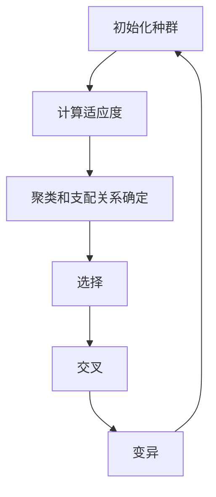
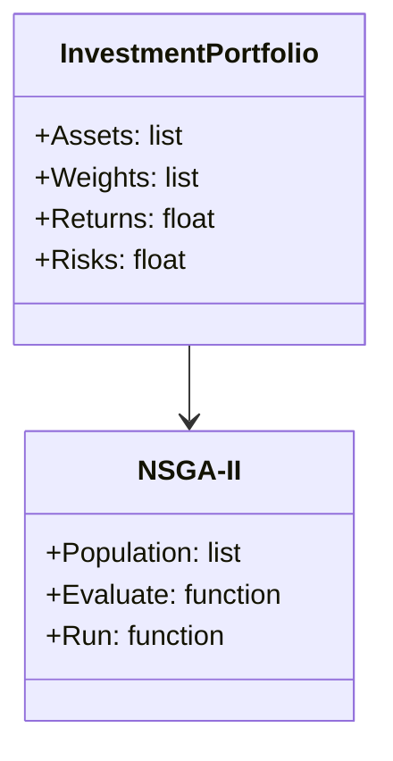

                 


# 智能投资组合多目标优化模型

> 关键词：智能投资组合优化、多目标优化、NSGA-II算法、投资组合优化、智能优化算法

> 摘要：本文详细探讨智能投资组合多目标优化模型的核心概念、算法原理、系统架构及实战应用。通过背景介绍、核心概念对比、算法实现、系统设计和项目案例分析，全面解析多目标优化在投资组合中的应用，为读者提供理论与实践相结合的深度解析。

---

## 第一部分: 智能投资组合多目标优化模型概述

### 第1章: 多目标优化的背景与问题描述

#### 1.1 多目标优化的背景

投资组合优化是金融领域的重要问题，传统单目标优化方法难以应对复杂的投资环境。多目标优化通过同时优化多个目标（如收益、风险、流动性等）提供更全面的解决方案。智能优化算法（如遗传算法、粒子群优化）在处理复杂问题中表现出色，为多目标优化提供了新的思路。

#### 1.2 多目标优化的核心概念

投资组合优化的核心在于平衡多个目标，如最大化收益、最小化风险等。多目标优化需找到 Pareto 最优解集，这些解在某些目标上无法进一步优化而不影响其他目标。

#### 1.3 智能投资组合优化的边界与外延

智能优化方法结合多目标优化，扩展了传统方法的应用范围。边界包括数据输入、约束条件和目标函数，外延则涉及动态优化、实时调整等高级应用。

### 第2章: 多目标优化与智能投资组合优化的核心联系

#### 2.1 多目标优化的核心原理

多目标优化通过 Pareto 前沿概念，找到一组最优解，每个解在不同目标间达到平衡。智能算法（如 NSGA-II）有效处理多目标问题，避免陷入局部最优。

#### 2.2 智能投资组合优化的核心概念

智能优化算法引入随机性和全局搜索能力，解决传统方法的局限性。多目标优化在投资组合中具体体现为优化多个目标，如收益与风险的平衡。

#### 2.3 对比分析

| 方法 | 优点 | 缺点 |
|------|------|------|
| 单目标优化 | 解法简单 | 忽略其他目标 |
| 多目标优化 | 全面解集 | 解集较大，需筛选 |
| 智能优化 | 全局搜索 | 计算复杂 |

### 第3章: 多目标优化算法的原理与实现

#### 3.1 NSGA-II 算法原理

NSGA-II 通过遗传操作（选择、交叉、变异）优化种群，计算适应度并基于 Pareto 前沿排序，确保多样性。

#### 3.2 NSGA-II 实现步骤



代码实现：

```python
import numpy as np
from nsga import NSGA-II

def evaluate(population):
    # 计算收益和风险
    returns = population.dot(returns_matrix)
    risks = population.dot(risks_matrix)
    return (-returns, -risks)

population = np.random.permutation(n_assets)
algorithm = NSGA-II(evaluate, population_size=100)
optimal_portfolios = algorithm.run()
```

### 第4章: 系统分析与架构设计

#### 4.1 问题场景

投资者需在风险和收益间平衡，优化投资组合。

#### 4.2 系统功能设计



#### 4.3 系统架构


### 第5章: 项目实战

#### 5.1 环境安装

安装所需库，如numpy和nsga-II库。

#### 5.2 核心代码实现

```python
import numpy as np
from nsga import NSGA-II

# 假设资产数量
n_assets = 5

# 假设收益和风险矩阵
returns_matrix = np.array([[0.1, 0.15, 0.12, 0.08, 0.2]])
risks_matrix = np.array([[0.2, 0.1, 0.15, 0.25, 0.1]])

def evaluate(population):
    # 计算每个组合的收益和风险
    returns = np.dot(population, returns_matrix.T)
    risks = np.dot(population, risks_matrix.T)
    return (-returns, -risks)

# 初始化种群
population = np.random.permutation(n_assets)
population = population.reshape(-1, n_assets)

# 运行NSGA-II算法
algorithm = NSGA-II(evaluate, population_size=100, elite_ratio=0.1)
optimal_portfolios = algorithm.run(iterations=50)

# 分析最优解
optimal_portfolios = np.array(optimal_portfolios)
print("Optimal Portfolio Weights:", optimal_portfolios)
```

#### 5.3 案例分析

假设投资组合中包含5种资产，算法找到多个Pareto最优解，投资者可选择不同风险收益平衡的组合。

---

## 第二部分: 最佳实践与总结

### 6.1 最佳实践

选择优化算法时考虑问题复杂度，设置合理的约束条件，根据市场变化调整模型。

### 6.2 小结

智能投资组合多目标优化结合多目标优化与智能算法，解决传统方法的局限，提供更优解。

### 6.3 注意事项

计算复杂度高，需优化算法性能，数据质量影响结果，需谨慎处理。

### 6.4 拓展阅读

推荐学习多目标优化理论、智能算法及其在金融中的应用。

---

## 作者信息

作者：AI天才研究院 & 禅与计算机程序设计艺术

---

通过以上内容，读者可系统理解智能投资组合多目标优化模型的构建与应用，从理论到实践全面掌握相关知识。

