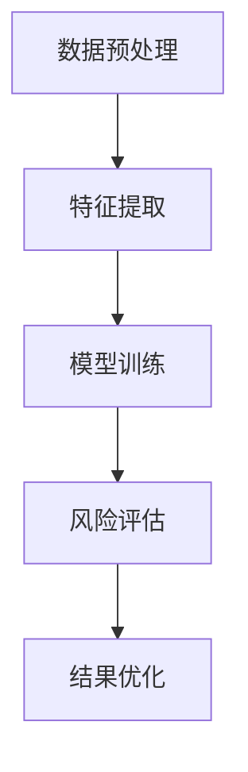
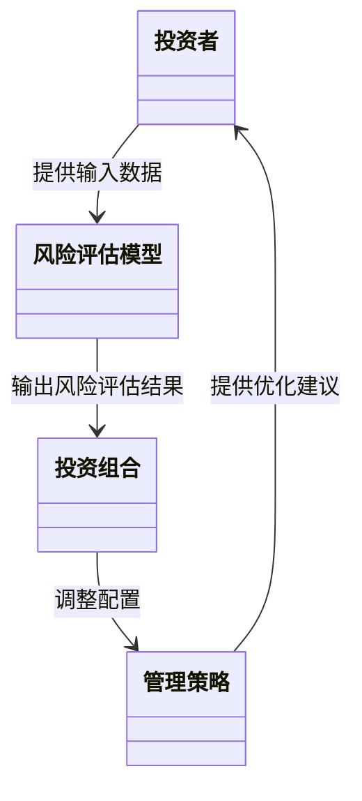
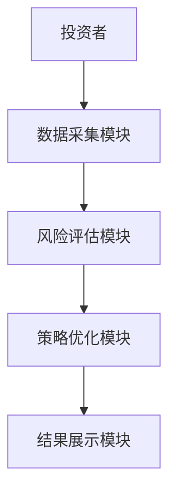
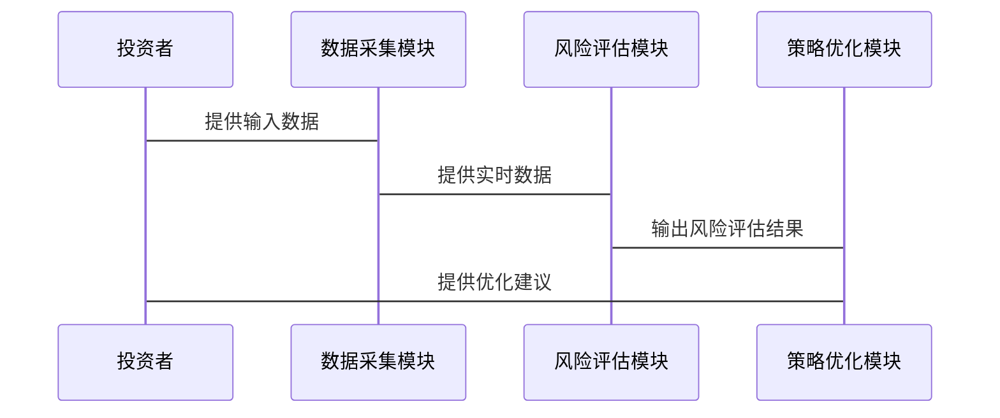

                 


# 智能投资组合尾部风险管理

## 关键词：智能投资组合，尾部风险管理，人工智能，金融风险管理，投资组合优化

## 摘要：  
本文探讨了在智能投资组合管理中如何有效应对尾部风险。通过结合人工智能技术和金融风险管理理论，提出了尾部风险管理的核心概念、算法原理、系统架构及实战案例，为投资组合优化提供了新的思路。

---

## 第1章: 智能投资组合尾部风险管理概述

### 1.1 投资组合管理的基本概念

#### 1.1.1 投资组合的定义与作用  
投资组合是指将资金分配到不同金融资产（如股票、债券、基金等）中，以分散风险、优化收益的过程。其核心作用在于通过多样化配置降低单一资产的风险。

#### 1.1.2 尾部风险的定义与特征  
尾部风险是指在概率分布曲线的“尾部”发生的低概率、高影响的极端事件。这类事件可能对投资组合造成巨大损失，如市场崩盘或“黑天鹅”事件。

#### 1.1.3 尾部风险管理的重要性  
尾部风险通常不可预测，但其影响巨大。有效的尾部风险管理能够保护投资组合免受极端损失，确保长期稳健的投资回报。

### 1.2 智能投资组合管理的背景

#### 1.2.1 传统投资组合管理的局限性  
传统方法依赖历史数据和线性模型，难以捕捉复杂市场环境中的非线性关系，且对尾部风险的处理较为有限。

#### 1.2.2 AI技术在金融领域的应用趋势  
人工智能技术（如机器学习、深度学习）在金融领域的广泛应用，使得投资组合管理更加智能化和精准化。

#### 1.2.3 尾部风险管理的智能化需求  
通过AI技术，可以实时监控市场动态，识别潜在风险点，并快速调整投资策略，有效应对尾部风险。

### 1.3 本书的核心目标与内容框架

#### 1.3.1 本书的核心目标  
通过结合AI技术和金融理论，提出一种基于智能算法的尾部风险管理方法，优化投资组合的稳健性。

#### 1.3.2 内容框架概述  
文章分为背景介绍、核心概念、算法原理、系统架构、项目实战和最佳实践等部分，全面覆盖尾部风险管理的理论与实践。

#### 1.3.3 读者对象与预期收获  
适合金融从业者、投资经理、AI工程师及相关领域的研究者阅读，帮助读者掌握智能投资组合管理的核心技术与实践方法。

### 1.4 本章小结  
本章介绍了投资组合管理的基本概念、尾部风险的定义与特征，以及智能投资组合管理的背景和目标。

---

## 第2章: 尾部风险管理的核心概念与联系

### 2.1 尾部风险管理的核心概念

#### 2.1.1 尾部风险的数学定义  
尾部风险可以用概率论中的分布尾部来描述。例如，考虑一个随机变量$X$，其概率密度函数在远处的尾部区域（如$|X-\mu| > 3\sigma$）表示极端事件的发生概率。

#### 2.1.2 尾部风险的分类与特征  
尾部风险可以分为市场风险、信用风险和流动性风险等。其特征包括低概率、高影响和难以预测。

#### 2.1.3 尾部风险与投资组合的关系  
尾部风险直接影响投资组合的收益和风险。通过优化投资组合结构，可以有效降低尾部风险的影响。

### 2.2 尾部风险管理的核心要素

#### 2.2.1 数据来源与特征  
尾部风险管理需要多源、实时、高质量的数据，包括市场数据、宏观经济指标等。

#### 2.2.2 风险评估模型  
常用的风险评估指标包括VaR（Value at Risk）和CVaR（Conditional Value at Risk）。

#### 2.2.3 管理策略与优化目标  
管理策略包括调整资产配置、分散投资和使用衍生工具等。优化目标是在风险可控的前提下，最大化投资回报。

### 2.3 尾部风险管理的核心原理

#### 2.3.1 尾部风险的数学模型  
尾部风险的数学模型通常基于概率分布函数，如柯西分布、幂律分布等。

#### 2.3.2 尾部风险与投资组合优化的关系  
通过构建优化模型，可以在考虑尾部风险的情况下，找到最优资产配置。

#### 2.3.3 尾部风险管理的系统架构  
尾部风险管理需要整合数据采集、模型计算和策略执行等模块，形成完整的系统架构。

### 2.4 尾部风险管理的核心要素对比表

| 要素 | 特征 | 重要性 |
|------|------|--------|
| 数据来源 | 多样性、实时性 | 高 |
| 风险评估模型 | 准确性、可解释性 | 高 |
| 管理策略 | 灵活性、可执行性 | 高 |

### 2.5 尾部风险管理的ER实体关系图

```mermaid
erDiagram
    投资者 --> 风险评估模型 : 提供输入数据
    管理机构 --> 风险评估模型 : 审批模型
    市场数据源 --> 风险评估模型 : 提供实时数据
    风险评估模型 --> 投资组合 : 输出风险评估结果
    投资组合 --> 管理策略 : 调整配置
    管理策略 --> 投资者 : 提供优化建议
```

### 2.6 本章小结  
本章详细介绍了尾部风险管理的核心概念、要素和系统架构，为后续内容奠定了基础。

---

## 第3章: 尾部风险管理的算法原理

### 3.1 尾部风险评估的数学模型

#### 3.1.1 VaR模型  
VaR（Value at Risk）是一种常用的风险度量方法，用于估计投资组合在一定置信水平下的最大损失。

#### 3.1.2 CVaR模型  
CVaR（Conditional Value at Risk）是对VaR的补充，用于估计在VaR超过一定水平时的平均损失。

#### 3.1.3 尾部风险的分布模型  
尾部风险通常采用幂律分布或柯西分布进行建模，以捕捉极端事件的发生概率。

### 3.2 基于机器学习的风险评估算法

#### 3.2.1 算法流程  
数据预处理 → 特征提取 → 模型训练 → 风险评估 → 结果优化。

#### 3.2.2 算法流程图



#### 3.2.3 Python实现示例

```python
import numpy as np
from sklearn.ensemble import IsolationForest

# 示例数据
X = np.random.randn(1000, 2)
outliers = np.random.uniform(low=-4, high=-3, size=(50, 2))
X = np.concatenate((X, outliers))

# 异常检测模型训练
model = IsolationForest(contamination=0.05)
model.fit(X)

# 风险评估
scores = model.decision_function(X)
```

### 3.3 算法原理的数学模型

#### 3.3.1 VaR模型公式  
$$ VaR_{\alpha}(X) = \min\{x | P(X \leq x) \geq \alpha\} $$

#### 3.3.2 CVaR模型公式  
$$ CVaR_{\alpha}(X) = \frac{1}{1-\alpha} \int_{\alpha}^{1} x dF(x) $$

### 3.4 算法实现的步骤

#### 3.4.1 数据预处理  
对原始数据进行清洗、归一化等处理，确保模型输入的规范性。

#### 3.4.2 特征提取  
从多源数据中提取关键特征，如波动率、相关系数等。

#### 3.4.3 模型训练  
使用机器学习算法（如Isolation Forest）训练风险评估模型。

#### 3.4.4 风险评估  
根据模型输出结果，评估投资组合的尾部风险。

#### 3.4.5 结果优化  
结合风险评估结果，调整投资组合配置，降低尾部风险。

### 3.5 本章小结  
本章详细讲解了尾部风险评估的数学模型和基于机器学习的算法原理，为后续系统实现提供了理论基础。

---

## 第4章: 尾部风险管理的系统架构

### 4.1 系统分析与设计

#### 4.1.1 问题场景介绍  
系统需要实时监控市场动态，评估投资组合的尾部风险，并提供优化建议。

#### 4.1.2 系统功能需求  
数据采集、风险评估、策略优化、结果展示。

#### 4.1.3 领域模型类图



### 4.2 系统架构设计

#### 4.2.1 系统架构图



#### 4.2.2 系统接口设计  
系统需要与市场数据源、交易系统等进行交互，确保数据的实时性和准确性。

#### 4.2.3 系统交互序列图



### 4.3 本章小结  
本章从系统架构的角度，详细描述了尾部风险管理系统的组成和交互流程。

---

## 第5章: 尾部风险管理的项目实战

### 5.1 环境安装与配置

#### 5.1.1 环境要求  
安装Python、NumPy、Scikit-learn等依赖库。

#### 5.1.2 代码示例

```python
import numpy as np
from sklearn.ensemble import IsolationForest

# 示例数据
X = np.random.randn(1000, 2)
outliers = np.random.uniform(low=-4, high=-3, size=(50, 2))
X = np.concatenate((X, outliers))

# 异常检测模型训练
model = IsolationForest(contamination=0.05)
model.fit(X)

# 风险评估
scores = model.decision_function(X)
```

### 5.2 核心代码实现

#### 5.2.1 风险评估模块  
实现基于Isolation Forest的异常检测，识别尾部风险点。

#### 5.2.2 策略优化模块  
根据风险评估结果，调整资产配置，降低尾部风险。

### 5.3 代码解读与分析

#### 5.3.1 风险评估模块  
使用Isolation Forest算法检测异常点，识别尾部风险。

#### 5.3.2 策略优化模块  
根据风险评估结果，优化投资组合配置，降低整体风险。

### 5.4 案例分析

#### 5.4.1 案例背景  
假设一个投资组合包含股票、债券和基金，需要在市场波动加剧时降低尾部风险。

#### 5.4.2 案例分析  
通过模型评估，识别潜在的极端风险点，调整资产配置，降低整体风险。

### 5.5 本章小结  
本章通过实际案例，展示了如何通过代码实现尾部风险管理，并优化投资组合配置。

---

## 第6章: 尾部风险管理的最佳实践

### 6.1 小结

#### 6.1.1 核心内容回顾  
总结尾部风险管理的核心概念、算法原理和系统架构。

### 6.2 注意事项

#### 6.2.1 数据质量的重要性  
确保数据的准确性和实时性，是尾部风险管理的关键。

#### 6.2.2 模型的可解释性  
复杂的模型可能导致决策不透明，需注重模型的可解释性。

### 6.3 拓展阅读

#### 6.3.1 推荐书籍  
《风险管理与金融创新》、《机器学习实战》。

#### 6.3.2 推荐文章  
关于尾部风险管理的最新研究和实践应用。

### 6.4 本章小结  
本章总结了尾部风险管理的最佳实践，并提供了进一步学习的方向。

---

## 作者：AI天才研究院 & 禅与计算机程序设计艺术

---

以上是《智能投资组合尾部风险管理》的完整目录大纲和文章正文内容，希望对您有所帮助！

