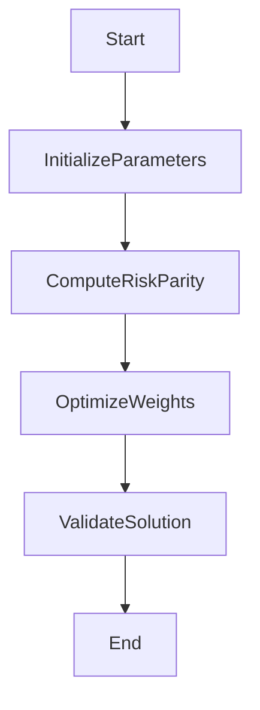

                 


# 智能投资组合风险平价策略优化

## 关键词：
- 智能投资组合
- 风险平价策略
- 投资组合优化
- 算法原理
- 数学模型

## 摘要：
智能投资组合风险平价策略优化是一种结合金融学与计算机科学的新兴方法，旨在通过智能算法优化投资组合的风险分配，实现风险与收益的最佳平衡。本文从背景介绍、核心概念、算法原理、系统架构、项目实战等方面详细阐述了智能投资组合风险平价策略的优化过程，为投资者提供了理论与实践相结合的指导。

---

## 第一部分: 智能投资组合风险平价策略优化的背景与概念

### 第1章: 投资组合风险平价策略概述

#### 1.1 问题背景与定义
- **问题背景**：随着金融市场波动加剧，投资者需要一种既能分散风险又能最大化收益的策略。传统投资策略往往侧重于单一目标（如最大收益），而忽略了风险的多样性。
- **风险平价策略的定义**：风险平价策略是一种将风险在不同资产类别之间进行均衡分配的方法，以实现投资组合的整体风险最小化。

#### 1.2 风险平价策略的核心要素
- **风险平价的数学模型**：通过优化算法调整资产权重，使得每个资产的风险贡献相等。
- **投资组合优化的目标**：在给定风险水平下最大化收益，或在给定收益下最小化风险。
- **与传统策略的对比**：传统策略可能过度依赖单一资产类别，而风险平价策略则通过分散风险提高整体稳定性。

#### 1.3 应用场景
- **机构投资**：优化大型投资组合的结构。
- **零售投资者**：提供个性化的风险管理工具。
- **不同市场环境**：根据市场变化动态调整策略。

### 第2章: 风险平价策略的核心概念与联系

#### 2.1 核心概念原理
- **风险平价的数学表达式**：通过权重调整，使得各资产的风险贡献相等。
- **投资组合优化的数学模型**：使用均值-方差模型进行优化。

#### 2.2 概念属性特征对比
- **表2-1：风险平价与传统投资策略对比**

| 属性                | 风险平价策略             | 传统均值-方差策略 |
|---------------------|--------------------------|---------------------|
| 目标                | 最小化整体风险           | 最大化收益或最小化风险 |
| 资产权重调整方式    | 风险贡献相等             | 收益最大化          |
| 灵活性              | 高，适应性强             | 较低，依赖模型假设   |

#### 2.3 ER实体关系图


---

## 第二部分: 风险平价策略的算法原理

### 第3章: 风险平价优化算法

#### 3.1 风险平价优化流程


#### 3.2 风险平价优化的数学模型
- **均值-方差优化模型**：
  $$\text{Minimize } \sigma^2 \text{ subject to } \mathbf{w}^T \mathbf{r} = \mu$$
  其中，$\mathbf{w}$是权重向量，$\mathbf{r}$是收益向量，$\mu$是目标收益，$\sigma^2$是风险方差。
- **风险平价优化算法**：
  ```python
  def risk_parity_optimization(returns, target_risk):
      # 初始化权重
      w = np.ones(returns.shape[1]) / returns.shape[1]
      while True:
          # 计算风险贡献
          risk_contribution = w * np.diag(returns.T @ returns @ w.T)
          # 计算差距
          gap = np.sum(np.abs(risk_contribution - target_risk))
          if gap < 1e-8:
              break
          # 更新权重
          w = w / np.sum(w * risk_contribution)
      return w
  ```

---

## 第三部分: 系统分析与架构设计

### 第4章: 系统架构设计方案

#### 4.1 问题场景介绍
- **目标**：设计一个智能投资组合优化系统，实现风险平价策略的自动优化。
- **应用场景**：在线投资平台、机构投资管理系统。

#### 4.2 系统功能设计
- **领域模型**：
  ```mermaid
  classDiagram
      class Asset {
          ID
          Name
          Risk
          Return
      }
      class RiskParityStrategy {
          Parameters
          ComputeRiskContribution()
          OptimizeWeights()
      }
      class InvestmentPortfolio {
          Assets
          Weights
          RiskParityStrategy
          Optimize()
      }
  ```

- **系统架构设计**：
  ```mermaid
  graph LR
      InvestmentPortfolio --> RiskParityStrategy
      RiskParityStrategy --> Database
      Database --> AssetManager
  ```

#### 4.3 接口与交互设计
- **接口设计**：
  ```mermaid
  sequenceDiagram
      User -> InvestmentPortfolio: 请求优化
      InvestmentPortfolio -> RiskParityStrategy: 执行优化算法
      RiskParityStrategy -> Database: 获取资产数据
      RiskParityStrategy -> InvestmentPortfolio: 返回优化结果
      InvestmentPortfolio -> User: 显示结果
  ```

---

## 第四部分: 项目实战与案例分析

### 第5章: 项目实战

#### 5.1 环境安装
- **Python环境**：安装NumPy、Pandas、Scipy、Plotly。
- **代码实现**：
  ```python
  import numpy as np
  import pandas as pd
  from scipy.optimize import minimize
  
  def compute_risk_contribution(w, returns):
      cov = returns.T @ returns
      return w @ cov @ w.T
  
  def risk_parity_objective(w, returns, target_risk):
      rc = compute_risk_contribution(w, returns)
      return np.sum((rc - target_risk)**2)
  
  def optimize_risk_parity(returns, target_risk=1):
      n = returns.shape[1]
      w0 = np.array([1/n]*n)
      res = minimize(risk_parity_objective, w0, args=(returns, target_risk), 
                     method='SLSQP', bounds=[(0,1)]*n, constraints={'type': 'eq', 'fun': lambda w: sum(w) - 1})
      return res.x
  
  if __name__ == '__main__':
      # 示例数据
      returns = np.array([[0.05, 0.03, 0.07],
                           [0.02, 0.04, 0.06],
                           [0.03, 0.05, 0.08]])
      target_risk = 1
      w = optimize_risk_parity(returns, target_risk)
      print("Optimal weights:", w)
  ```

#### 5.2 案例分析
- **案例描述**：假设我们有三个资产，收益率分别为0.05、0.03、0.07，目标风险水平为1。
- **优化结果**：通过运行上述代码，可以得到三个资产的最优权重。

---

## 第五部分: 总结与最佳实践

### 第6章: 总结与注意事项

#### 6.1 总结
- **核心内容**：智能投资组合风险平价策略优化是一种通过算法和数学模型实现投资组合优化的有效方法。
- **应用价值**：在金融市场中具有广泛的应用前景。

#### 6.2 注意事项
- **数据质量**：确保输入数据的准确性和完整性。
- **模型选择**：根据实际情况选择合适的优化算法。
- **风险管理**：定期监控和调整投资组合，以应对市场变化。

#### 6.3 拓展阅读
- 推荐阅读《投资学》、《算法交易》等书籍，深入理解投资组合优化的理论与实践。

---

## 作者：AI天才研究院/AI Genius Institute & 禅与计算机程序设计艺术 /Zen And The Art of Computer Programming

---

**本文通过详细分析智能投资组合风险平价策略的优化过程，结合理论推导和代码实现，为读者提供了一种新的投资思路。希望读者能够通过本文，理解并掌握智能投资组合优化的核心方法，并在实际投资中灵活应用。**

