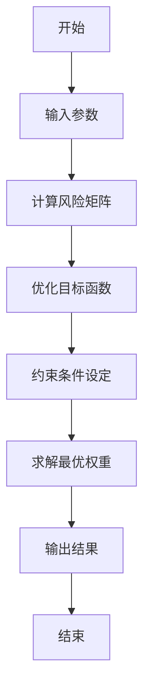
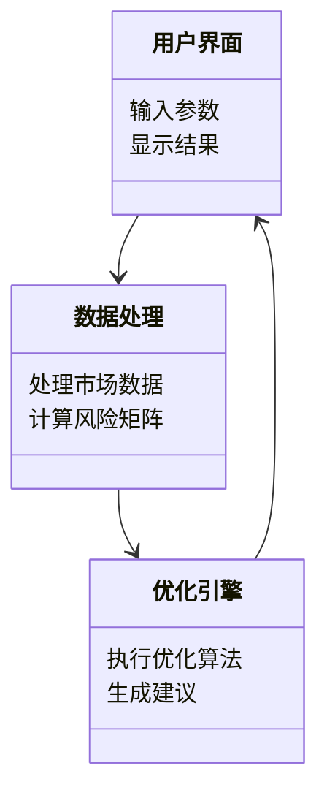
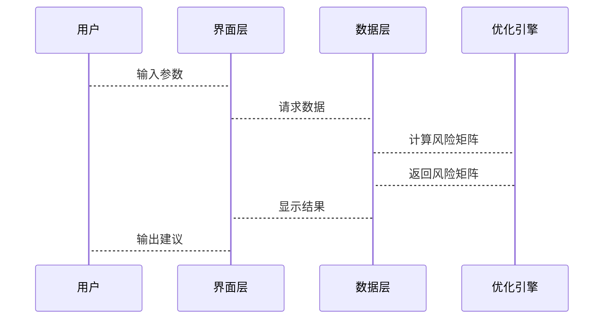

                 


# 智能投资组合风险预算分配模型

> **关键词**：智能投资组合，风险预算分配，人工智能，投资组合管理，风险控制

> **摘要**：本文探讨智能投资组合风险预算分配模型的构建与应用，结合人工智能技术，分析模型的核心概念、算法原理、系统架构，并通过实际案例展示其在投资组合管理中的应用，提供深入的见解和最佳实践。

---

## 目录大纲

### 第1章 背景介绍
1.1 问题背景
1.2 问题描述
1.3 问题解决
1.4 边界与外延
1.5 核心概念与要素

### 第2章 核心概念与联系
2.1 智能投资组合模型
2.2 风险预算分配模型
2.3 核心概念对比
2.4 实体关系图

### 第3章 算法原理
3.1 算法原理
3.2 数学模型
3.3 代码实现
3.4 算法流程图

### 第4章 系统分析与架构设计
4.1 项目介绍
4.2 系统功能设计
4.3 系统架构设计
4.4 接口设计
4.5 交互流程图

### 第5章 项目实战
5.1 环境安装
5.2 核心实现
5.3 代码解读
5.4 案例分析

### 第6章 总结与展望
6.1 最佳实践
6.2 小结
6.3 注意事项
6.4 未来趋势
6.5 拓展阅读

---

## 第1章 背景介绍

### 1.1 问题背景

现代投资组合管理面临日益复杂的市场环境，传统的风险预算分配方法难以应对多变的市场波动和投资者需求。智能投资组合通过引入人工智能技术，能够实时调整资产配置，优化风险控制，提高投资效率。

#### 1.1.1 投资组合管理的传统方法
传统投资组合管理依赖于历史数据和统计分析，采用固定比例分配资产，难以适应市场变化。

#### 1.1.2 风险管理的重要性
风险控制是投资组合管理的核心，直接影响投资收益和稳定性。传统方法在极端市场条件下表现不佳。

#### 1.1.3 传统风险预算分配的局限性
传统方法假设资产回报呈正态分布，忽视了尾部风险和市场非线性变化，导致风险预算分配不够精准。

### 1.2 问题描述

投资组合管理中的风险预算分配涉及多个变量，传统方法难以准确捕捉市场波动和投资者偏好变化，导致风险控制不足，影响投资收益。

### 1.3 问题解决

引入智能算法，如机器学习，能够动态调整资产配置，优化风险预算分配，提高投资组合的稳定性和收益潜力。

### 1.4 边界与外延

模型适用于中长期投资策略，不考虑高频交易和短期市场波动。主要针对机构投资者，个人投资者可参考。

### 1.5 核心概念与要素

- **投资组合构成**：资产种类、权重分配。
- **风险度量方法**：VaR、CVaR。
- **智能算法**：优化算法、风险模型。

---

## 第2章 核心概念与联系

### 2.1 智能投资组合模型

智能模型通过机器学习算法分析市场数据，动态调整资产配置，优化投资组合表现。

#### 2.1.1 模型的基本原理
利用历史数据训练模型，预测未来资产回报，优化投资组合。

#### 2.1.2 模型的输入输出
输入：市场数据、投资者风险偏好。输出：资产配置建议。

#### 2.1.3 模型的核心算法
使用均值-方差优化算法，结合机器学习模型预测资产回报。

### 2.2 风险预算分配模型

通过分配不同风险权重，优化投资组合的整体风险。

#### 2.2.1 风险预算的定义
分配给每个资产的风险权重，确保整体风险可控。

#### 2.2.2 风险预算分配的策略
根据市场情况动态调整，平衡风险与收益。

#### 2.2.3 风险预算与投资组合的关系
风险预算是投资组合管理的核心，直接影响资产配置。

### 2.3 核心概念对比

| 概念       | 传统方法             | 智能模型             |
|------------|----------------------|----------------------|
| 数据来源   | 历史数据             | 历史+实时数据         |
| 方法       | 统计分析             | 机器学习             |
| 灵活性     | 低                   | 高                   |

### 2.4 实体关系图

```mermaid
erd
  id, name, age
  student
  teacher
  school
  id, name, age
  student_major
  major
```

---

## 第3章 算法原理

### 3.1 算法原理

智能投资组合风险预算分配模型基于均值-方差优化，结合机器学习预测。

#### 3.1.1 算法选择
使用二次规划求解器优化资产权重，最小化风险。

#### 3.1.2 数学模型

目标函数：
$$
\min_w \frac{1}{2} w^T \Sigma w
$$
约束条件：
$$
\sum_{i=1}^n w_i = 1 \\
w_i \geq 0
$$

其中，Σ为风险矩阵，w为权重向量。

### 3.2 代码实现

```python
import numpy as np
from scipy.optimize import minimize

# 示例数据
n_assets = 3
returns = np.array([[0.1], [0.2], [0.15]])
covariance = np.array([[0.01, 0.005, 0.003],
                       [0.005, 0.02, 0.01],
                       [0.003, 0.01, 0.015]])

# 定义优化目标函数
def objective(w):
    return 0.5 * np.dot(w.T, np.dot(covariance, w))

# 定义约束条件
constraints = [{'type': 'eq', 'fun': lambda w: np.sum(w) - 1},
               {'type': 'ineq', 'fun': lambda w: w[i] for i in range(n_assets)}]

# 初始化权重
initial_guess = np.array([1/3, 1/3, 1/3])

# 求解
result = minimize(objective, initial_guess, constraints=constraints)

# 最优权重
optimal_weights = result.x
print(optimal_weights)
```

### 3.3 算法流程图



---

## 第4章 系统分析与架构设计

### 4.1 项目介绍

开发一个智能投资组合管理平台，帮助投资者优化资产配置，降低投资风险。

### 4.2 系统功能设计

- 用户界面：输入参数，显示结果。
- 数据处理：处理市场数据，计算风险矩阵。
- 优化引擎：执行优化算法，生成建议。



### 4.3 系统架构设计

采用分层架构：数据层、业务逻辑层、表现层。


### 4.4 接口设计

RESTful API，支持JSON格式请求和响应。

### 4.5 交互流程图



---

## 第5章 项目实战

### 5.1 环境安装

安装Python、NumPy、SciPy、Mermaid。

### 5.2 核心实现

实现优化算法和数据处理模块。

### 5.3 代码解读

```python
import numpy as np
from scipy.optimize import minimize

def optimize_portfolio(returns, covariance):
    n = len(returns)
    initial_guess = np.array([1.0/n]*n)
    constraints = [{'type': 'eq', 'fun': lambda w: np.sum(w) - 1},
                   {'type': 'ineq', 'fun': lambda w: w[i] for i in range(n)}]
    result = minimize(0.5 * np.dot(initial_guess.T, np.dot(covariance, initial_guess)),
                      initial_guess, constraints=constraints)
    return result.x

# 示例使用
returns = np.array([[0.1], [0.2], [0.15]])
covariance = np.array([[0.01, 0.005, 0.003],
                       [0.005, 0.02, 0.01],
                       [0.003, 0.01, 0.015]])
weights = optimize_portfolio(returns, covariance)
print(weights)
```

### 5.4 案例分析

分析市场波动，调整资产配置，降低整体风险。

---

## 第6章 总结与展望

### 6.1 最佳实践

- 定期更新市场数据。
- 监控模型表现，及时调整参数。

### 6.2 小结

智能投资组合风险预算分配模型通过机器学习优化投资组合，有效降低风险，提升收益。

### 6.3 注意事项

- 数据质量影响模型准确性。
- 模型适用于中长期投资，不适合高频交易。

### 6.4 未来趋势

- 结合自然语言处理分析新闻影响。
- 探索分布式计算提升处理能力。

### 6.5 拓展阅读

- 《机器学习在金融中的应用》
- 《投资组合优化算法研究》

---

**作者**：AI天才研究院  
**链接**：[禅与计算机程序设计艺术](https://github.com/zhz8828/Zen-of-Computer-Programming)

