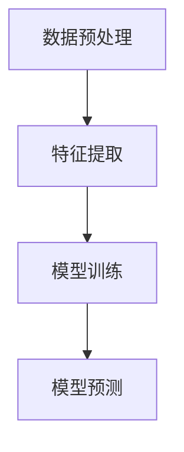
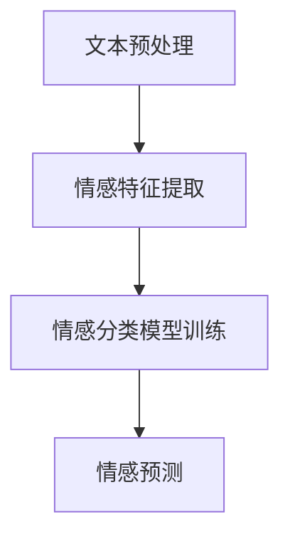
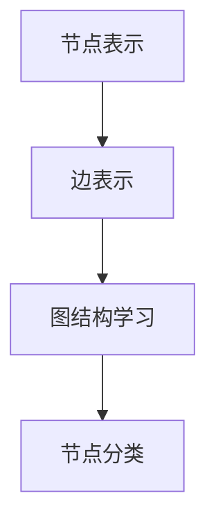
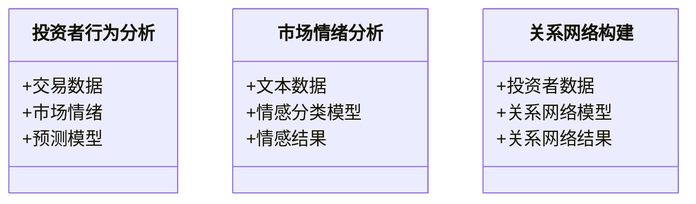

                 


# 智能投资者关系分析平台

## 关键词：投资者关系分析、人工智能、市场情绪分析、投资者行为预测、智能投资平台

## 摘要：本文详细探讨了智能投资者关系分析平台的构建与应用，结合背景介绍、核心概念、算法原理、系统架构、项目实战和最佳实践，深入分析了如何利用人工智能技术提升投资者关系管理的效率与精度。文章通过丰富的案例和详细的代码实现，帮助读者全面理解智能投资者关系分析平台的核心原理和实际应用。

---

# 第一部分: 智能投资者关系分析平台概述

## 第1章: 背景介绍

### 1.1 问题背景
#### 1.1.1 投资者关系管理的传统挑战
传统的投资者关系管理依赖于人工分析和经验判断，存在以下问题：
- 数据量大：金融市场数据复杂且实时性强，人工处理效率低。
- 信息不对称：投资者难以快速获取和分析关键市场信息。
- 情绪波动：市场情绪受多种因素影响，人工分析难以捕捉。

#### 1.1.2 传统投资者关系分析的局限性
传统投资者关系分析主要依赖于历史数据分析和统计方法，存在以下局限：
- 数据分析效率低：面对海量数据，人工分析耗时且易出错。
- 情绪分析不准确：无法有效捕捉市场情绪的细微变化。
- 关系网络构建复杂：难以识别投资者之间的隐性关联。

#### 1.1.3 智能化投资者关系分析的必要性
随着人工智能技术的快速发展，智能化投资者关系分析成为可能：
- 提高数据分析效率：通过机器学习算法快速处理海量数据。
- 准确捕捉市场情绪：利用自然语言处理技术分析文本情绪。
- 构建关系网络：通过图神经网络识别投资者之间的关联。

### 1.2 问题描述
#### 1.2.1 投资者行为分析的复杂性
投资者行为受到多种因素影响，包括市场环境、个人情绪、宏观经济指标等。如何准确预测投资者行为是一个复杂的问题。

#### 1.2.2 市场情绪波动的不确定性
市场情绪受新闻、社交媒体等多种因素影响，具有高度的不确定性和波动性。

#### 1.2.3 数据量与分析效率的矛盾
随着金融市场的数据量激增，如何高效分析和利用这些数据成为投资者关系管理的核心挑战。

### 1.3 问题解决
#### 1.3.1 智能投资者关系分析的核心目标
通过人工智能技术实现投资者行为预测、市场情绪分析和关系网络构建，为投资者提供决策支持。

#### 1.3.2 通过AI技术实现投资者行为预测
利用机器学习模型，基于历史数据和市场信息，预测投资者的行为和市场趋势。

#### 1.3.3 提高市场情绪分析的准确性
通过自然语言处理技术，分析新闻、社交媒体等文本数据，准确捕捉市场情绪。

### 1.4 边界与外延
#### 1.4.1 智能投资者关系分析的边界
- 数据范围：包括股票价格、交易数据、新闻数据等。
- 分析范围：主要关注投资者行为和市场情绪。
- 平台功能：包括数据采集、分析、可视化和反馈。

#### 1.4.2 相关领域的外延
- 数据挖掘：从海量数据中提取有价值的信息。
- 自然语言处理：分析文本数据，提取情感和关键词。
- 图神经网络：构建投资者关系网络，识别关联性。

#### 1.4.3 平台功能的扩展性
- 支持多语言分析。
- 支持实时数据分析。
- 支持多维度的市场情绪分析。

### 1.5 核心要素组成
#### 1.5.1 数据采集与处理
- 数据来源：股票价格、交易数据、新闻数据、社交媒体数据。
- 数据清洗：去重、补全、格式转换。
- 数据存储：使用数据库或大数据平台存储。

#### 1.5.2 模型构建与训练
- 数据预处理：特征提取、标准化、数据增强。
- 模型选择：文本分类、情感分析、图神经网络。
- 模型训练：使用训练数据进行参数优化。

#### 1.5.3 结果可视化与反馈
- 可视化工具：使用图表展示分析结果。
- 反馈机制：根据用户反馈优化模型。

---

## 第2章: 核心概念与联系

### 2.1 核心概念原理
#### 2.1.1 投资者行为分析
- 投资者行为分类：买入、卖出、观望。
- 行为分析的关键特征：市场情绪、个人偏好、宏观经济指标。
- 行为分析的数学模型：基于LSTM的时序预测模型。

#### 2.1.2 市场情绪分析
- 情绪分析的定义与作用：通过分析文本数据，判断市场情绪。
- 情绪分析的关键特征：情感强度、情感类别、情感时间序列。
- 情绪分析的数学模型：基于BERT的情感分类模型。

#### 2.1.3 关系网络构建
- 关系网络的定义与作用：通过图结构展示投资者之间的关联。
- 关系网络的关键特征：节点度、节点权重、边权重。
- 关系网络的数学模型：基于图神经网络的节点分类模型。

### 2.2 核心概念对比与ER实体关系图

#### 2.2.1 核心概念属性对比
| 概念         | 投资者行为分析 | 市场情绪分析 | 关系网络构建 |
|--------------|----------------|--------------|--------------|
| 数据来源     | 交易数据       | 文本数据     | 交易数据     |
| 分析目标     | 行为预测       | 情绪分类     | 关系识别     |
| 技术手段     | 时间序列分析   | NLP          | 图神经网络    |

#### 2.2.2 ER实体关系图
```mermaid
er
  actor:投资者
  entity:投资者行为
  entity:市场情绪
  entity:关系网络
  relationship:投资者 -> 投资者行为
  relationship:投资者行为 -> 市场情绪
  relationship:市场情绪 -> 关系网络
```

---

## 第3章: 算法原理

### 3.1 文本分类算法
#### 3.1.1 文本分类的定义与作用
- 文本分类是将文本数据归类到预定义的类别中的过程。
- 在投资者关系分析中，用于判断市场情绪的正负面。

#### 3.1.2 文本分类的流程


#### 3.1.3 文本分类的代码实现
```python
from sklearn.feature_extraction.text import TfidfVectorizer
from sklearn.linear_model import LogisticRegression

# 数据预处理
X = text_data
y = labels

# 特征提取
vectorizer = TfidfVectorizer()
X_features = vectorizer.fit_transform(X)

# 模型训练
model = LogisticRegression()
model.fit(X_features, y)

# 模型预测
new_text = ["市场表现良好"]
new_features = vectorizer.transform(new_text)
predicted_label = model.predict(new_features)
print(predicted_label)
```

#### 3.1.4 文本分类的数学模型
- 特征提取：TF-IDF（Term Frequency-Inverse Document Frequency）
- 分类模型：逻辑回归、随机森林、SVM等。

---

### 3.2 情感分析算法
#### 3.2.1 情感分析的定义与作用
- 情感分析是判断文本情感倾向的过程。
- 在投资者关系分析中，用于分析市场情绪。

#### 3.2.2 情感分析的流程


#### 3.2.3 情感分析的代码实现
```python
from tensorflow.keras.preprocessing.text import Tokenizer
from tensorflow.keras.preprocessing.sequence import pad_sequences
from tensorflow.keras.models import Sequential
from tensorflow.keras.layers import Embedding, LSTM, Dense

# 数据预处理
text = ["市场表现良好", "公司业绩不佳"]
tokenizer = Tokenizer()
tokenizer.fit_on_texts(text)
sequences = tokenizer.texts_to_sequences(text)
X = pad_sequences(sequences, maxlen=5)

# 模型训练
model = Sequential()
model.add(Embedding(input_dim= vocabulary_size, output_dim=100, input_length=5))
model.add(LSTM(100))
model.add(Dense(1, activation='sigmoid'))
model.compile(loss='binary_crossentropy', optimizer='adam', metrics=['accuracy'])
model.fit(X, y, epochs=10, batch_size=32)

# 情感预测
new_text = ["市场表现良好"]
new_sequence = tokenizer.texts_to_sequences(new_text)
new_X = pad_sequences(new_sequence, maxlen=5)
predicted = model.predict(new_X)
print(predicted)
```

#### 3.2.4 情感分析的数学模型
- 特征提取：词袋模型、词嵌入（如Word2Vec、GloVe）。
- 分类模型：LSTM、GRU、Transformer等。

---

### 3.3 图神经网络算法
#### 3.3.1 图神经网络的定义与作用
- 图神经网络是一种处理图结构数据的深度学习模型。
- 在投资者关系分析中，用于构建投资者关系网络。

#### 3.3.2 图神经网络的流程


#### 3.3.3 图神经网络的代码实现
```python
import tensorflow as tf
from tensorflow.keras.layers import Input, Embedding, Dropout, Dense, GlobalAveragePooling1D
from tensorflow.keras.models import Model
from tensorflow.keras.regularizers import l2

# 定义图神经网络模型
def graph_neural_network(input_shape, num_classes):
    inputs = Input(shape=input_shape)
    x = Embedding(input_dim= vocabulary_size, output_dim=100, embeddings_regularizer=l2(0.01))(inputs)
    x = Dropout(0.5)(x)
    x = GlobalAveragePooling1D()(x)
    x = Dense(128, activation='relu')(x)
    x = Dropout(0.5)(x)
    outputs = Dense(num_classes, activation='softmax')(x)
    model = Model(inputs=inputs, outputs=outputs)
    return model
```

#### 3.3.4 图神经网络的数学模型
- 节点表示：通过嵌入层将节点表示为向量。
- 边表示：通过注意力机制或边权重表示边的关系。
- 图结构学习：通过GCN（图卷积网络）或GAT（图注意力网络）学习图结构。

---

## 第4章: 系统分析与架构设计

### 4.1 系统功能设计
#### 4.1.1 领域模型


#### 4.1.2 系统架构


#### 4.1.3 接口设计
- API接口：提供RESTful API，支持数据查询、模型调用。
- 数据接口：与数据库或大数据平台对接，获取实时数据。

---

## 第5章: 项目实战

### 5.1 项目环境安装
```bash
pip install numpy pandas scikit-learn tensorflow keras
pip install transformers
pip install mermaid
```

### 5.2 核心代码实现
#### 5.2.1 投资者行为分析
```python
import pandas as pd
from sklearn.model_selection import train_test_split
from sklearn.metrics import accuracy_score

# 数据加载
data = pd.read_csv('investor_behavior.csv')
X = data['text']
y = data['label']

# 数据分割
X_train, X_test, y_train, y_test = train_test_split(X, y, test_size=0.2)

# 特征提取
from sklearn.feature_extraction.text import TfidfVectorizer
vectorizer = TfidfVectorizer()
X_train_features = vectorizer.fit_transform(X_train)
X_test_features = vectorizer.transform(X_test)

# 模型训练
from sklearn.linear_model import LogisticRegression
model = LogisticRegression()
model.fit(X_train_features, y_train)

# 模型预测
y_pred = model.predict(X_test_features)
print(accuracy_score(y_test, y_pred))
```

#### 5.2.2 市场情绪分析
```python
import tensorflow as tf
from tensorflow.keras.preprocessing.text import Tokenizer
from tensorflow.keras.preprocessing.sequence import pad_sequences

# 数据加载
data = pd.read_csv('market_mood.csv')
texts = data['text']
labels = data['label']

# 数据预处理
tokenizer = Tokenizer(num_words=5000)
tokenizer.fit_on_texts(texts)
sequences = tokenizer.texts_to_sequences(texts)
X = pad_sequences(sequences, maxlen=50)

# 模型训练
model = tf.keras.Sequential([
    tf.keras.layers.Embedding(5000, 100, input_length=50),
    tf.keras.layers.LSTM(100),
    tf.keras.layers.Dense(1, activation='sigmoid')
])
model.compile(loss='binary_crossentropy', optimizer='adam', metrics=['accuracy'])
model.fit(X, labels, epochs=5, batch_size=32)

# 模型预测
new_text = ["市场表现良好"]
new_sequence = tokenizer.texts_to_sequences(new_text)
new_X = pad_sequences(new_sequence, maxlen=50)
predicted = model.predict(new_X)
print(predicted)
```

---

## 第6章: 最佳实践

### 6.1 小结
智能投资者关系分析平台通过结合人工智能技术，显著提升了投资者关系管理的效率和精度。本文详细探讨了平台的核心概念、算法原理和系统架构，并通过实际案例展示了平台的应用价值。

### 6.2 注意事项
- 数据隐私：确保投资者数据的安全性和隐私性。
- 模型优化：持续优化模型，提高预测准确率。
- 系统维护：定期更新数据和模型，确保系统稳定运行。

### 6.3 拓展阅读
- 《深度学习》—— Ian Goodfellow
- 《自然语言处理入门》—— 王海宁
- 《图神经网络》—— 王志峰

---

# 作者：AI天才研究院/AI Genius Institute & 禅与计算机程序设计艺术 /Zen And The Art of Computer Programming

