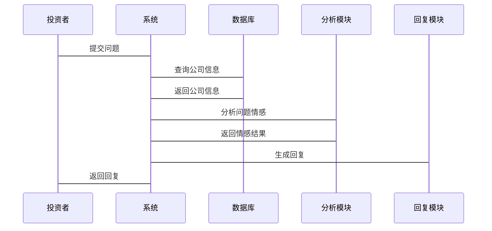

                 


# 智能投资者关系管理平台

> 关键词：智能投资者关系管理，NLP，机器学习，知识图谱，系统架构，项目实战

> 摘要：本文探讨智能投资者关系管理平台的设计与实现，结合NLP、机器学习等技术，构建一个高效、智能的投资者关系管理系统，解决传统管理中的痛点，提升企业与投资者的互动效率。

---

## 第一部分：背景介绍

### 第1章：智能投资者关系管理平台概述

#### 1.1 投资者关系管理的现状与挑战

投资者关系管理（IRM）是企业与投资者之间建立有效沟通的重要环节。然而，传统方式面临以下挑战：

- **数据分散**：投资者通过多种渠道（邮件、电话、社交媒体）与企业互动，数据分散难以统一管理。
- **信息处理复杂**：投资者的问题和反馈涉及大量非结构化数据，手动处理耗时且效率低下。
- **舆情监控困难**：市场环境变化快，及时捕捉投资者情绪和市场舆情至关重要。
- **个性化需求**：投资者需求多样化，传统方式难以提供个性化服务。

#### 1.2 智能投资者关系管理平台的定义

智能投资者关系管理平台通过整合AI技术，自动化处理投资者互动，提供实时反馈和洞察分析。其核心目标是提高管理效率、优化投资者体验，并通过数据分析辅助企业决策。

#### 1.3 平台的核心功能模块

智能投资者关系管理平台主要包含以下功能模块：

- **数据采集与处理**：整合多渠道投资者数据，进行清洗和结构化处理。
- **情感分析与舆情监控**：实时分析投资者情绪，识别市场舆情。
- **知识图谱构建**：建立企业与投资者的知识关联，支持智能问答。
- **自动化沟通**：通过AI生成回复，实现自动化的投资者互动。

---

## 第二部分：核心概念与联系

### 第2章：智能投资者关系管理的关键技术

#### 2.1 自然语言处理（NLP）

NLP在投资者关系管理中的应用包括：

- **文本分类**：识别投资者问题类型（如财务、产品等）。
- **实体识别**：提取公司名称、产品名称等关键信息。
- **情感分析**：判断投资者情绪（正面、负面、中性）。

#### 2.2 机器学习（ML）

机器学习用于：

- **预测模型**：预测投资者行为或市场反应。
- **主题建模**：识别投资者反馈中的主要主题。

#### 2.3 知识图谱构建

知识图谱帮助：

- **关联分析**：建立投资者、公司、产品之间的关联。
- **智能问答**：基于知识图谱提供准确的回答。

#### 2.4 ER实体关系图

ER实体关系图展示了投资者、企业、问题等实体之间的关系：

```mermaid
er
actor Investor {
  id
  name
  email
}
actor Company {
  id
  name
  industry
}
relationship Investor_Company {
  investor_id
  company_id
  interaction_time
}
```

---

## 第三部分：算法原理讲解

### 第3章：情感分析算法

#### 3.1 情感分析的基本原理

情感分析通过分析文本的情感倾向，判断投资者情绪。常用算法包括：

- **基于词袋模型的朴素贝叶斯**：简单高效，适用于数据量较小的情况。
- **基于深度学习的LSTM网络**：适合长文本分析，捕捉上下文信息。

#### 3.2 情感分析的实现流程

1. 数据预处理：分词、去停用词。
2. 特征提取：使用词袋模型或TF-IDF。
3. 模型训练：训练分类器（如SVM、随机森林）。
4. 情感预测：输入文本，输出情感倾向。

#### 3.3 Python代码实现

```python
from sklearn.feature_extraction.text import TfidfVectorizer
from sklearn.svm import SVC

# 数据预处理
corpus = ["投资者对公司很满意", "公司产品存在问题"]
vectorizer = TfidfVectorizer()
X = vectorizer.fit_transform(corpus)

# 模型训练
model = SVC()
model.fit(X, [1, 0])

# 情感预测
test = ["客户服务较差"]
test_vec = vectorizer.transform([test])
print(model.predict(test_vec))  # 输出：0（负面）
```

#### 3.4 数学公式

情感分析中的概率计算公式：

$$ P(y|x) = \frac{P(x|y)P(y)}{P(x)} $$

其中，$y$为情感类别，$x$为文本特征。

---

## 第四部分：系统分析与架构设计方案

### 第4章：系统设计与架构

#### 4.1 问题场景介绍

投资者互动场景：

- 投资者通过邮件、社交媒体等渠道发送问题。
- 系统自动分类、分析并生成回复。

舆情监控场景：

- 监测媒体报道和社交媒体评论，识别负面舆情。

#### 4.2 领域模型设计

领域模型类图：

```mermaid
classDiagram

class Investor {
  <属性>
  id
  name
  email
}

class Company {
  <属性>
  id
  name
  industry
}

class Interaction {
  <属性>
  investor_id
  company_id
  content
  time
}

investor -[1..n]-> Interaction
company -[1..n]-> Interaction
```

#### 4.3 系统架构设计

系统架构图：

```mermaid
rect left{
  上层应用
  |---- 接口层
  |---- 业务逻辑层
}
rect right{
  数据库
  |---- 投资者表
  |---- 公司表
  |---- 互动记录表
}
```

接口设计：

- REST API：提供数据接口，如`/api/investors`。
- Web界面：投资者提交问题，系统自动分类。

交互流程：



---

## 第五部分：项目实战

### 第5章：智能投资者关系管理平台的实现

#### 5.1 环境安装

安装必要的库：

```bash
pip install numpy scikit-learn spacy mermaid4j
python -m spacy download en_core_web_sm
```

#### 5.2 核心功能实现

##### 5.2.1 数据采集与处理

```python
import requests
from bs4 import BeautifulSoup

def fetch_data(url):
    response = requests.get(url)
    soup = BeautifulSoup(response.text, 'html.parser')
    content = soup.find('div', {'class': 'content'}).text
    return content

data = fetch_data('http://example.com/investors')
```

##### 5.2.2 情感分析实现

```python
from sklearn.svm import SVC
from sklearn.feature_extraction.text import TfidfVectorizer

# 训练数据
texts = ["喜欢产品", "服务差"]
y = [1, 0]
vectorizer = TfidfVectorizer()
X = vectorizer.fit_transform(texts)
model = SVC().fit(X, y)

# 预测
test = ["产品很好"]
test_vec = vectorizer.transform([test])
print(model.predict(test_vec))  # 输出：1（正面）
```

##### 5.2.3 知识图谱构建

```python
import networkx as nx

G = nx.Graph()
G.add_node("Company", label="公司")
G.add_node("Product", label="产品")
G.add_edge("Company", "Product", label="生产")
```

#### 5.3 实际案例分析

案例：某公司产品反馈中，投资者情绪多为正面，但部分反馈提到产品质量问题。系统自动分类并生成回复，确认问题并承诺改进。

---

## 第六部分：总结与展望

### 第6章：总结与展望

#### 6.1 总结

智能投资者关系管理平台通过整合NLP、机器学习等技术，显著提升了投资者关系管理的效率和精准度。本文详细讲解了平台的设计、算法实现及系统架构，展示了其在实际中的应用价值。

#### 6.2 未来展望

未来，平台可以进一步优化：

- **增强模型可解释性**：使投资者更容易理解系统决策过程。
- **多语言支持**：应对国际化市场的需求。
- **实时反馈机制**：提升互动实时性。

#### 6.3 最佳实践 Tips

- **数据质量**：确保数据准确性和完整性。
- **模型更新**：定期更新模型，保持其准确性。
- **用户隐私**：严格遵守数据隐私保护法规。

---

## 作者

作者：AI天才研究院  
地址：https://github.com/AI-Genius-Institute  
文章标题：智能投资者关系管理平台  
链接：https://github.com/AI-Genius-Institute/blog/blob/main/intelligent Investor Relation Management Platform.md

--- 

**版权声明：本文遵循 CC BY-SA 4.0 协议，转载请注明出处。**

--- 

**Contact me: hello@ai-genius.com**

