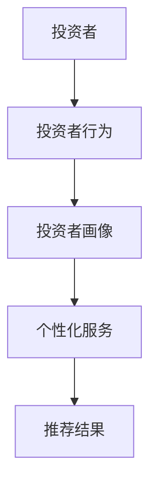
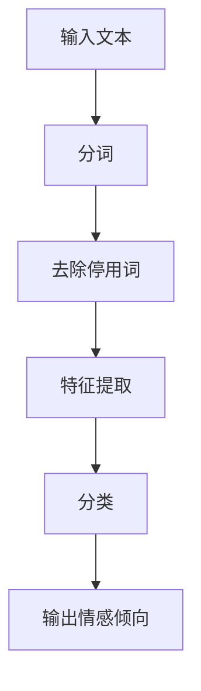
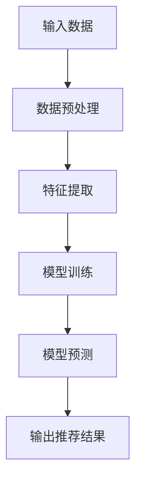
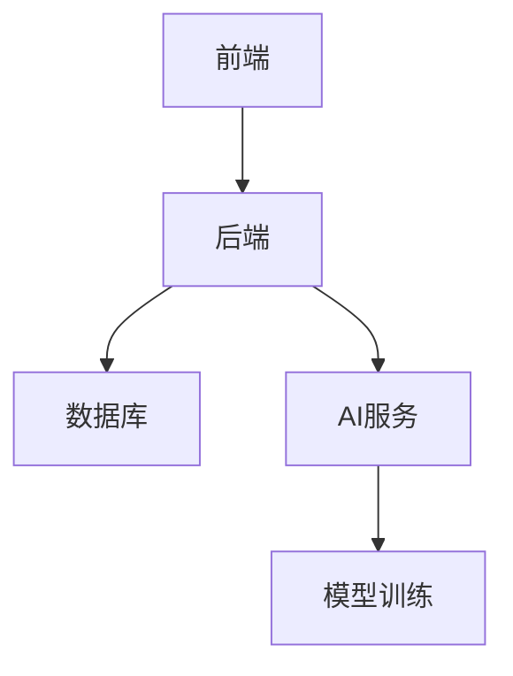
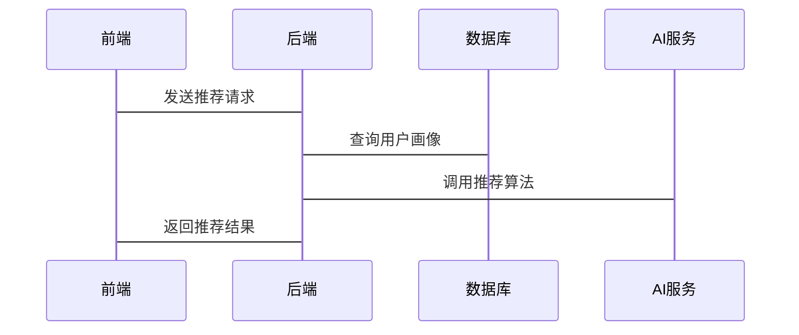

                 


# 智能投资者关系管理系统

> 关键词：智能投资者关系管理，投资者行为分析，舆情分析，个性化服务推荐，自然语言处理，机器学习，系统架构设计

> 摘要：智能投资者关系管理系统是一种基于人工智能技术的投资者服务与管理平台，旨在通过智能化的手段提升投资者关系管理的效率和精准度。本文从背景、概念、算法原理、系统架构设计、项目实战等多方面展开，全面解析智能投资者关系管理系统的构建与应用。

---

## 第一部分: 背景与概念

### 第1章: 背景介绍

#### 1.1 问题背景

##### 1.1.1 投资者关系管理的传统模式
投资者关系管理（Investor Relations Management，IRM）是企业与投资者之间建立有效沟通和管理的重要环节。传统模式主要依赖人工处理，包括定期报告发布、电话沟通、邮件回复等。这种方式效率低、成本高，难以满足投资者日益多样化的需求。

##### 1.1.2 传统模式的局限性
- **信息处理效率低**：人工处理大量投资者咨询和舆情信息，效率低下，容易错漏。
- **个性化服务不足**：传统模式难以针对不同投资者的需求提供个性化的服务。
- **实时性差**：传统模式难以实时响应投资者的需求和市场变化。

##### 1.1.3 智能化转型的必要性
随着人工智能技术的快速发展，智能化投资者关系管理成为必然趋势。通过引入自然语言处理、机器学习等技术，可以实现自动化、智能化的投资者服务。

#### 1.2 问题描述

##### 1.2.1 投资者需求的多样化
投资者群体包括机构投资者、个人投资者、基金投资者等，不同投资者的需求和行为模式存在显著差异。

##### 1.2.2 信息传播的即时性
投资者关系管理需要实时响应市场变化和投资者需求，信息传播的即时性要求系统具备高效的处理能力。

##### 1.2.3 数据处理的复杂性
投资者关系管理涉及大量的非结构化数据，如文本、语音、图像等，数据处理的复杂性对系统提出了更高的要求。

#### 1.3 问题解决

##### 1.3.1 智能投资者关系管理的核心目标
- 提供个性化、智能化的投资者服务。
- 实时响应投资者需求和市场变化。
- 通过数据分析提升投资者关系管理的效率和精准度。

##### 1.3.2 智能化解决方案的提出
引入人工智能技术，构建智能化投资者关系管理系统，实现自动化、智能化的投资者服务。

##### 1.3.3 技术实现路径的初步探讨
- 数据采集与处理。
- 自然语言处理技术的应用。
- 机器学习模型的构建与应用。

#### 1.4 边界与外延

##### 1.4.1 系统功能的边界
智能投资者关系管理系统的核心功能包括投资者行为分析、舆情监控、个性化服务推荐等。

##### 1.4.2 与相关系统的交互
系统需要与企业内部的财务系统、市场分析系统等进行数据交互。

##### 1.4.3 外延应用场景的展望
未来，智能投资者关系管理系统可能扩展至更多的金融场景，如风险管理、投资决策支持等。

#### 1.5 核心要素组成

##### 1.5.1 数据来源的多样性
系统需要整合多种数据源，包括文本数据、语音数据、图像数据等。

##### 1.5.2 分析模型的复杂性
系统需要构建复杂的数据分析模型，包括自然语言处理模型和机器学习模型。

##### 1.5.3 人机交互的友好性
系统需要提供友好的人机交互界面，提升用户体验。

---

## 第二部分: 核心概念与联系

### 第2章: 核心概念原理

#### 2.1 投资者行为分析

##### 2.1.1 行为数据的采集与处理
通过采集投资者的行为数据，如点击、浏览、搜索等，进行数据清洗和特征提取。

##### 2.1.2 用户画像的构建
基于行为数据分析，构建投资者的画像，包括投资偏好、风险承受能力等。

##### 2.1.3 行为预测模型的建立
利用机器学习技术，建立投资者行为预测模型，预测投资者的下一步行为。

#### 2.2 舆情分析与情感计算

##### 2.2.1 文本数据的预处理
对收集到的文本数据进行分词、去停用词等预处理。

##### 2.2.2 情感分析算法的选择
选择适合的算法，如支持向量机（SVM）、随机森林（Random Forest）等，进行情感倾向分析。

##### 2.2.3 舆情预警机制的设计
建立舆情预警机制，实时监控市场舆情，及时发出预警。

#### 2.3 个性化服务推荐

##### 2.3.1 服务推荐的算法原理
基于协同过滤、内容推荐等算法，为投资者推荐个性化服务。

##### 2.3.2 推荐策略的优化
通过A/B测试等方法，优化推荐策略，提升推荐的精准度。

##### 2.3.3 推荐结果的评估
通过指标如准确率、召回率等，评估推荐系统的性能。

#### 2.4 核心概念对比

##### 2.4.1 核心概念的属性特征对比
| 概念          | 输入数据类型 | 输出结果类型 | 主要技术 |
|---------------|--------------|--------------|----------|
| 投资者行为分析 | 行为数据      | 用户画像      | 机器学习 |
| 舆情分析      | 文本数据      | 情感倾向      | 自然语言处理 |
| 个性化推荐    | 用户行为数据  | 推荐服务      | 协同过滤 |

#### 2.5 实体关系图架构



---

## 第三部分: 算法原理

### 第3章: 自然语言处理

#### 3.1 情感分析算法

##### 3.1.1 算法流程图


##### 3.1.2 Python代码示例
```python
import nltk
from nltk.sentiment import SentimentAnalyzer
from nltk.sentiment.util import sentiment_features

text = "The company's performance is excellent."
analyzer = SentimentAnalyzer()
features = sentiment_features(text)
print(analyzer.classify(features))
```

##### 3.1.3 数学模型
情感分析模型可以基于概率论中的贝叶斯定理，通过计算文本中积极词汇和消极词汇的概率，判断文本的情感倾向。

$$ P(positive|text) = \frac{P(text|positive) \cdot P(positive)}{P(text)} $$

---

### 第4章: 机器学习模型

#### 4.1 推荐算法

##### 4.1.1 算法流程图


##### 4.1.2 Python代码示例
```python
from sklearn.neighbors import NearestNeighbors
import numpy as np

X = np.array([[0.1, 0.2], [0.3, 0.4], [0.5, 0.6]])
nbrs = NearestNeighbors(n_neighbors=2).fit(X)
distances, indices = nbrs.kneighbors([0.2, 0.3])
print(indices)
```

##### 4.1.3 数学模型
协同过滤算法可以通过计算用户之间的相似度，推荐相似用户的兴趣项。

$$ sim(i, j) = \frac{\sum_{k=1}^{n} r_{ik} r_{jk}}{\sqrt{\sum_{k=1}^{n} r_{ik}^2} \cdot \sqrt{\sum_{k=1}^{n} r_{jk}^2}}} $$

---

## 第四部分: 系统分析与架构设计

### 第5章: 系统分析

#### 5.1 问题场景介绍

##### 5.1.1 系统功能需求
- 投资者行为分析模块。
- 舆情监控模块。
- 个性化推荐模块。

##### 5.1.2 系统性能需求
- 响应时间小于5秒。
- 支持高并发访问。

#### 5.2 项目介绍

##### 5.2.1 项目目标
构建一个智能化的投资者关系管理系统，提升投资者服务的效率和精准度。

##### 5.2.2 项目范围
- 数据采集与处理。
- 系统功能模块开发。
- 系统测试与优化。

#### 5.3 系统功能设计

##### 5.3.1 领域模型类图


---

### 第6章: 系统架构设计

#### 6.1 系统架构图



#### 6.2 接口设计

##### 6.2.1 API接口定义
- `GET /investors`：获取投资者列表。
- `POST /recommendations`：提交推荐请求。

##### 6.2.2 API交互序列图


---

## 第五部分: 项目实战

### 第7章: 项目实战

#### 7.1 环境安装

##### 7.1.1 安装Python
```bash
python --version
pip install --upgrade pip
```

##### 7.1.2 安装依赖库
```bash
pip install nltk sklearn mermaid4j
```

#### 7.2 系统核心实现

##### 7.2.1 情感分析模块
```python
from nltk.sentiment import SentimentIntensityAnalyzer

sia = SentimentIntensityAnalyzer()
text = "The company's future looks bright."
print(sia.polarity_scores(text))
```

##### 7.2.2 个性化推荐模块
```python
from sklearn.metrics.pairwise import cosine_similarity

user_features = [[0.2, 0.3], [0.4, 0.5]]
similarity_matrix = cosine_similarity(user_features)
print(similarity_matrix)
```

#### 7.3 代码解读与分析

##### 7.3.1 情感分析代码解读
- 使用`SentimentIntensityAnalyzer`对文本进行情感分析。
- 输出情感倾向结果，包括积极、消极和中性。

##### 7.3.2 个性化推荐代码解读
- 使用余弦相似度计算用户特征之间的相似度。
- 输出相似度矩阵，用于推荐结果的生成。

#### 7.4 实际案例分析

##### 7.4.1 案例背景
某科技公司希望通过智能投资者关系管理系统提升投资者服务的效率。

##### 7.4.2 数据分析
- 投资者行为数据：包括点击、浏览、搜索等。
- 舆情数据：包括社交媒体评论、新闻报道等。

##### 7.4.3 实施步骤
1. 数据采集与预处理。
2. 构建用户画像。
3. 实施情感分析和推荐算法。
4. 系统测试与优化。

#### 7.5 项目小结

##### 7.5.1 项目总结
通过项目实战，验证了智能投资者关系管理系统的可行性和有效性。

##### 7.5.2 经验与教训
- 数据质量对系统性能影响显著。
- 算法选择需要结合具体场景。

##### 7.5.3 未来改进方向
- 引入更复杂的机器学习模型。
- 提升系统的实时性和响应速度。

---

## 第六部分: 总结与展望

### 第8章: 总结

#### 8.1 最佳实践 tips
- 数据是核心，确保数据的多样性和高质量。
- 算法选择要结合实际场景，避免过度追求复杂性。
- 系统设计要注重模块化和可扩展性。

#### 8.2 小结
智能投资者关系管理系统通过引入人工智能技术，显著提升了投资者关系管理的效率和精准度。

#### 8.3 注意事项
- 数据隐私保护。
- 系统安全性和稳定性。

#### 8.4 拓展阅读
- 《自然语言处理实战》。
- 《机器学习算法与应用》。

---

作者：AI天才研究院/AI Genius Institute & 禅与计算机程序设计艺术 /Zen And The Art of Computer Programming

