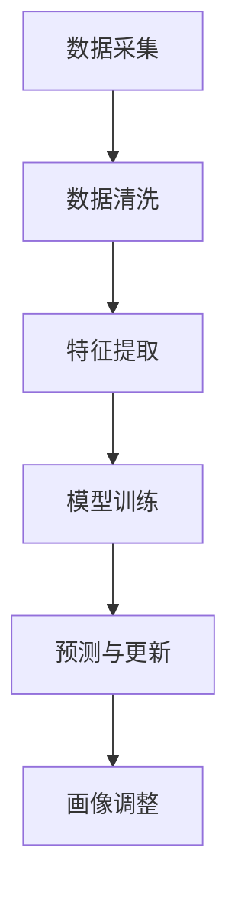
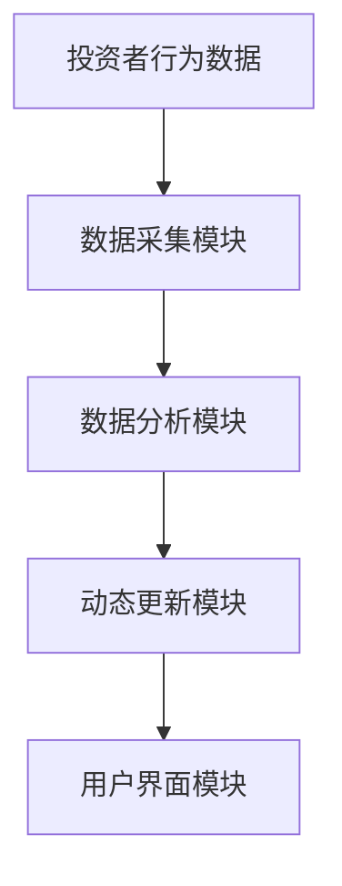

                 


# 智能投资者画像动态更新平台

> 关键词：智能投资者画像，动态更新，大数据分析，机器学习，金融投资

> 摘要：智能投资者画像动态更新平台是一种基于大数据和人工智能技术的投资者行为分析系统。通过对投资者行为数据的实时采集和分析，动态更新投资者画像，为金融机构提供精准的投资者画像和行为预测服务。本文将从背景、原理、架构、实现到应用，详细阐述智能投资者画像动态更新平台的设计与实现过程。

---

## 第一部分: 智能投资者画像动态更新平台背景与目标

### 第1章: 智能投资者画像动态更新平台概述

#### 1.1 问题背景与目标

投资者画像是一种基于投资者行为数据构建的投资者特征描述，广泛应用于金融投资、财富管理和风险管理等领域。传统的投资者画像通常是静态的，基于历史数据构建，无法适应市场环境和投资者行为的变化。随着金融市场的复杂化和投资者行为的多样化，静态投资者画像的局限性日益明显：

- 传统投资者画像无法捕捉投资者行为的动态变化。
- 市场环境的变化（如经济波动、政策调整）会影响投资者行为，静态画像无法反映这些变化。
- 投资者自身的需求和风险偏好也会随着时间和市场变化而调整。

因此，动态更新的智能投资者画像成为一种迫切需求，旨在通过实时采集和分析投资者行为数据，动态更新投资者画像，为金融机构提供更精准的投资者行为预测和投资建议。

#### 1.2 问题描述与解决思路

智能投资者画像动态更新的核心问题在于如何高效、准确地捕捉投资者行为的变化，并基于这些变化动态调整投资者画像。解决这一问题的关键在于：

- **数据采集**：实时采集投资者的行为数据，包括交易行为、市场反应、风险偏好等。
- **数据分析**：利用大数据和人工智能技术，对投资者行为数据进行分析，提取关键特征。
- **动态更新**：基于分析结果，动态调整投资者画像，保持画像的实时性和准确性。

解决思路包括：

- 构建实时数据采集系统，确保投资者行为数据的实时性和完整性。
- 引入机器学习算法，对投资者行为数据进行建模和预测。
- 设计动态更新机制，定期或实时调整投资者画像。

#### 1.3 核心概念与边界

智能投资者画像动态更新平台的核心概念包括：

- **投资者行为数据**：包括投资者的交易记录、市场反应、资产配置、风险偏好等。
- **投资者画像**：基于投资者行为数据构建的投资者特征描述，包括风险偏好、投资风格、资产配置等。
- **动态更新机制**：基于实时数据和分析结果，动态调整投资者画像。

核心要素的组成包括：

- 数据源：投资者交易数据、市场数据、投资者问卷调查等。
- 数据分析：利用大数据和人工智能技术，对投资者行为数据进行分析和建模。
- 动态更新：基于分析结果，动态调整投资者画像。

---

## 第二部分: 智能投资者画像的核心概念与联系

### 第2章: 核心概念与原理

#### 2.1 智能投资者画像的定义与属性

智能投资者画像是一种基于实时数据和人工智能技术构建的投资者特征描述。其主要属性包括：

- **动态性**：投资者画像能够根据实时数据动态调整。
- **精准性**：基于大数据分析和机器学习算法，投资者画像更加精准。
- **可解释性**：投资者画像需要具备可解释性，便于金融机构理解和应用。

#### 2.2 核心概念的对比分析

传统投资者画像与智能投资者画像的对比：

| 对比维度            | 传统投资者画像                 | 智能投资者画像                 |
|---------------------|-------------------------------|-------------------------------|
| 数据来源            | 历史数据                       | 实时数据                       |
| 分析方法            | 统计分析                       | 机器学习、大数据分析           |
| 更新频率            | 定期更新                       | 实时或动态更新                 |
| 应用场景            | 资产配置、风险评估             | 资产配置、风险评估、投资建议   |

#### 2.3 ER实体关系图架构

```mermaid
er
actor: 投资者
portfolio: 资产组合
transaction: 交易记录
risk_assessment: 风险评估
market_data: 市场数据
画像系统: 画像动态更新平台
```

---

## 第三部分: 智能投资者画像动态更新平台的算法原理

### 第3章: 算法原理讲解

#### 3.1 算法选择与流程

智能投资者画像动态更新平台的核心算法包括：

- **聚类分析**：用于投资者行为的分类，识别投资者群体的特征。
- **时间序列分析**：用于分析投资者行为的时间变化，预测未来行为趋势。
- **机器学习模型**：如随机森林、XGBoost等，用于特征提取和行为预测。

#### 3.2 算法流程图



#### 3.3 算法实现

以下是基于聚类分析的投资者行为分类算法的Python实现示例：

```python
from sklearn.cluster import KMeans
from sklearn.preprocessing import StandardScaler
import pandas as pd

# 假设我们有一个投资者行为数据集 df，包含交易行为、资产配置等特征
df = pd.read_csv('investor_behavior.csv')
features = df[['交易频率', '资产配置比例', '风险偏好得分']]

# 数据标准化
scaler = StandardScaler()
features_scaled = scaler.fit_transform(features)

# 聚类分析
kmeans = KMeans(n_clusters=5, random_state=42)
clusters = kmeans.fit_predict(features_scaled)

# 输出聚类结果
print('聚类结果:', clusters)
```

#### 3.4 数学模型与公式

聚类分析的数学模型如下：

$$
\text{目标函数} = \sum_{i=1}^{k} \sum_{j=1}^{n_i} \|x_j - c_i\|^2
$$

其中，$k$ 是聚类数，$n_i$ 是第 $i$ 个聚类中的样本数，$x_j$ 是样本，$c_i$ 是第 $i$ 个聚类的中心。

---

## 第四部分: 智能投资者画像动态更新平台的系统分析与架构设计

### 第4章: 系统分析与架构设计方案

#### 4.1 问题场景介绍

智能投资者画像动态更新平台的应用场景包括：

- 财富管理：为高净值投资者提供定制化的资产配置建议。
- 投资顾问：为投资者提供个性化的投资建议。
- 风险管理：实时监控投资者行为，识别潜在风险。

#### 4.2 系统功能设计

系统功能模块包括：

- **数据采集模块**：实时采集投资者的行为数据。
- **数据分析模块**：对投资者行为数据进行分析和建模。
- **动态更新模块**：基于分析结果，动态更新投资者画像。
- **用户界面模块**：为用户提供直观的画像展示和分析结果。

#### 4.3 系统架构设计

以下是系统的架构图：



---

## 第五部分: 智能投资者画像动态更新平台的项目实战

### 第5章: 项目实战

#### 5.1 环境搭建与数据准备

环境搭建：

```bash
pip install pandas numpy scikit-learn
```

数据准备：

```python
import pandas as pd

# 假设我们有一个投资者行为数据集
df = pd.read_csv('investor_behavior.csv')
print(df.head())
```

#### 5.2 特征工程与模型实现

特征工程：

```python
from sklearn.preprocessing import StandardScaler

features = df[['交易频率', '资产配置比例', '风险偏好得分']]
scaler = StandardScaler()
features_scaled = scaler.fit_transform(features)
```

模型实现：

```python
from sklearn.cluster import KMeans

kmeans = KMeans(n_clusters=5, random_state=42)
clusters = kmeans.fit_predict(features_scaled)
```

#### 5.3 实际案例分析与总结

通过实际案例分析，我们可以看到智能投资者画像动态更新平台在实际应用中的效果。例如，通过实时分析投资者的交易行为和市场反应，动态调整投资者画像，提供更精准的投资建议。

---

## 第六部分: 智能投资者画像动态更新平台的最佳实践与总结

### 第6章: 最佳实践与总结

#### 6.1 总结与反思

智能投资者画像动态更新平台通过实时数据采集和机器学习算法，能够动态更新投资者画像，为金融机构提供更精准的投资者行为分析和投资建议。在实际应用中，需要注意数据隐私和模型可解释性。

#### 6.2 注意事项

- 数据隐私：确保投资者数据的安全和隐私。
- 模型可解释性：确保投资者能够理解画像的更新依据。
- 模型维护：定期更新和优化模型，确保其准确性和稳定性。

#### 6.3 拓展阅读

- 《机器学习实战》
- 《大数据分析与挖掘》
- 《金融风险管理》

---

## 附录

### 附录A: 数据格式与接口说明

- 数据格式：CSV格式，包含投资者行为数据。
- 接口文档：提供RESTful API接口，用于数据采集和画像更新。

### 附录B: 工具推荐

- 数据处理工具：Python、Pandas。
- 可视化工具：Matplotlib、Seaborn。
- 机器学习库：Scikit-learn、XGBoost。

---

作者：AI天才研究院 & 禅与计算机程序设计艺术

