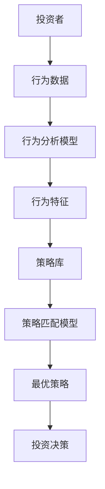
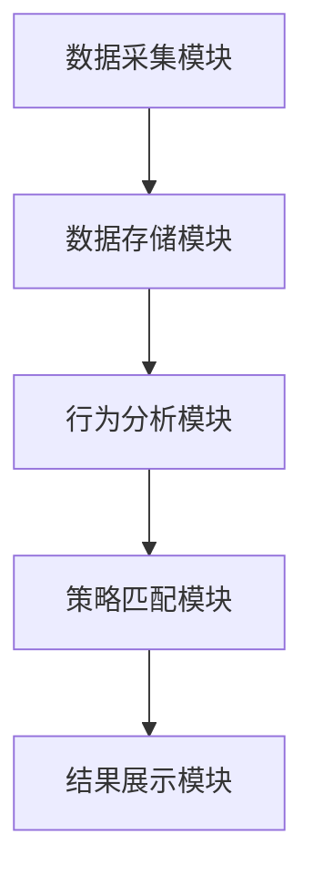
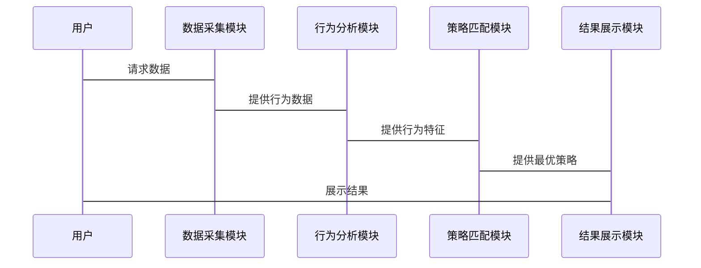

                 


# 智能投资者行为分析与投资策略匹配

## 关键词：
智能投资者行为分析, 投资策略匹配, 机器学习, 系统架构, 项目实战, 金融数据分析

## 摘要：
本文详细探讨智能投资者行为分析与投资策略匹配的核心概念、算法原理、系统架构及项目实战。通过背景介绍、核心概念对比、算法实现、系统设计、案例分析等多维度展开，结合表格、图表和代码示例，全面解析如何利用智能方法分析投资者行为，并根据这些行为制定最优投资策略。文章最后总结了主要知识点，并展望了未来的研究方向。

---

## 第一章: 背景介绍

### 1.1 投资者行为分析的背景与意义
#### 1.1.1 投资者行为分析的背景
- 传统投资分析的局限性
- 数据驱动决策的重要性
- 智能投资者行为分析的兴起

#### 1.1.2 投资者行为分析的意义
- 帮助投资者优化决策
- 为金融机构提供个性化服务
- 提高投资策略的有效性

#### 1.1.3 投资者行为分析的应用场景
- 个人投资者行为分析
- 机构投资者行为分析
- 市场情绪分析

### 1.2 投资策略匹配的重要性
#### 1.2.1 投资策略的基本概念
- 主动投资与被动投资
- 风险偏好与收益目标
- 短期策略与长期策略

#### 1.2.2 投资策略匹配的必要性
- 投资者行为与策略匹配的核心逻辑
- 不匹配带来的风险与机会成本
- 匹配对投资效果的提升作用

#### 1.2.3 投资策略匹配的应用价值
- 提高投资收益
- 减少投资风险
- 提升投资者满意度

### 1.3 智能投资者行为分析的核心概念
#### 1.3.1 智能投资者行为分析的定义
- 数据驱动的投资者行为分析
- 人工智能在投资者行为分析中的应用
- 多维度行为数据的整合与分析

#### 1.3.2 投资者行为分析的关键要素
- 行为数据的采集与处理
- 行为特征的提取与分析
- 行为模式的识别与预测

#### 1.3.3 投资者行为分析的边界与外延
- 数据采集的范围与限制
- 分析模型的适用性与局限性
- 行为分析的动态调整与优化

### 1.4 本章小结
- 本章概述了智能投资者行为分析的背景、意义及其核心概念
- 强调了投资者行为分析与投资策略匹配的重要性
- 为后续章节的展开奠定了基础

---

## 第二章: 核心概念与联系

### 2.1 投资者行为分析的原理与方法
#### 2.1.1 行为数据的采集与处理
- 数据源的多样性和复杂性
- 数据清洗与预处理的方法
- 数据存储与管理的解决方案

#### 2.1.2 行为数据的特征提取
- 基础特征的提取（如交易频率、金额等）
- 高阶特征的提取（如情绪指标、风险偏好等）
- 特征选择与降维技术

#### 2.1.3 行为数据的分析模型
- 统计分析模型（如回归分析）
- 机器学习模型（如聚类分析、分类模型）
- 深度学习模型（如神经网络）

### 2.2 投资策略匹配的机制
#### 2.2.1 投资策略匹配的基本原理
- 策略匹配的标准与规则
- 策略匹配的动态调整
- 策略匹配的效果评估

#### 2.2.2 投资策略匹配的关键步骤
- 确定投资者行为特征
- 分析可选投资策略
- 匹配最优策略并实施

#### 2.2.3 投资策略匹配的实现方法
- 基于规则的匹配方法
- 基于机器学习的匹配方法
- 基于混合模型的匹配方法

### 2.3 投资者行为与投资策略的联系
#### 2.3.1 行为数据对投资策略的影响
- 不同投资者行为对策略选择的影响
- 行为数据如何优化策略匹配
- 行为变化对策略调整的启示

#### 2.3.2 投资策略对投资者行为的反馈
- 策略实施对行为的影响
- 反馈机制的建立与优化
- 行为与策略的动态互动

#### 2.3.3 两者之间的动态平衡
- 短期行为与长期策略的平衡
- 风险偏好与收益目标的平衡
- 个性化需求与策略普适性的平衡

### 2.4 核心概念对比与实体关系图

#### 2.4.1 核心概念对比分析
- 投资者行为分析与传统投资分析的对比
- 智能投资者行为分析与传统行为分析的对比
- 策略匹配与传统投资决策的对比

#### 2.4.2 核心概念的属性特征对比
```markdown
| 核心概念       | 投资者行为分析 | 投资策略匹配 |
|----------------|----------------|--------------|
| 数据来源       | 行为数据       | 策略库       |
| 分析目标       | 行为特征       | 最优策略     |
| 分析方法       | 统计分析、机器学习 | 匹配算法、优化模型 |
| 输出结果       | 行为特征报告   | 策略匹配结果 |
```

#### 2.4.3 实体关系图


### 2.5 本章小结
- 本章详细分析了投资者行为分析与投资策略匹配的核心概念
- 通过对比分析和实体关系图，展示了两者之间的联系与区别
- 为后续算法实现和系统设计提供了理论基础

---

## 第三章: 算法原理

### 3.1 机器学习模型在投资者行为分析中的应用
#### 3.1.1 机器学习模型的选择与优化
- 监督学习、无监督学习与强化学习的适用场景
- 模型选择的依据与优化方法
- 超参数调优与模型评估

#### 3.1.2 机器学习模型的实现步骤
- 数据预处理
- 模型训练
- 模型评估与优化

#### 3.1.3 机器学习模型的代码实现
```python
# 代码示例：基于随机森林的投资者行为分类
from sklearn.ensemble import RandomForestClassifier
from sklearn.metrics import accuracy_score
from sklearn.model_selection import train_test_split

# 假设X为行为特征矩阵，y为行为标签
X_train, X_test, y_train, y_test = train_test_split(X, y, test_size=0.2)

model = RandomForestClassifier(n_estimators=100, random_state=42)
model.fit(X_train, y_train)

y_pred = model.predict(X_test)
print("Accuracy:", accuracy_score(y_test, y_pred))
```

### 3.2 投资策略匹配的算法实现
#### 3.2.1 基于规则的策略匹配算法
- 简单规则的定义与实现
- 规则的优化与复杂化
- 规则的可解释性与局限性

#### 3.2.2 基于机器学习的策略匹配算法
- 聚类算法（如K-means）的应用
- 分类算法（如SVM）的应用
- 回归算法（如线性回归）的应用

#### 3.2.3 基于混合模型的策略匹配算法
- 组合不同算法的优点
- 混合模型的实现步骤
- 混合模型的效果评估

### 3.3 算法的数学模型与公式
#### 3.3.1 机器学习模型的数学表示
- 线性回归模型：$$ y = \beta_0 + \beta_1 x_1 + \beta_2 x_2 + ... + \beta_n x_n + \epsilon $$
- 逻辑回归模型：$$ P(y=1|x) = \frac{1}{1 + e^{- (\beta_0 + \beta_1 x_1 + ... + \beta_n x_n)}} $$
- 随机森林模型：$$ y = \text{多数投票}(\text{决策树预测结果}) $$

#### 3.3.2 策略匹配的优化公式
- 基于目标函数的优化：$$ \min_{\theta} \sum_{i=1}^{N} (y_i - f(x_i, \theta))^2 $$
- 基于约束条件的优化：$$ \text{在约束条件下找到最优策略组合} $$

### 3.4 算法实现的步骤与案例分析
#### 3.4.1 算法实现的步骤
- 数据预处理
- 模型选择与训练
- 模型评估与优化
- 结果分析与可视化

#### 3.4.2 实际案例分析
- 案例背景介绍
- 数据处理与模型选择
- 模型训练与结果分析
- 案例总结与启示

### 3.5 本章小结
- 本章详细讲解了机器学习模型在投资者行为分析中的应用
- 介绍了投资策略匹配的算法实现及其数学模型
- 通过案例分析展示了算法的实际应用与效果

---

## 第四章: 系统分析与架构设计

### 4.1 问题场景介绍
#### 4.1.1 系统目标
- 实现智能投资者行为分析与投资策略匹配
- 提供个性化的投资建议
- 支持大规模数据处理与分析

#### 4.1.2 系统需求
- 数据采集与处理模块
- 行为分析与策略匹配模块
- 结果展示与交互模块

#### 4.1.3 系统限制与挑战
- 数据隐私与安全问题
- 系统性能优化
- 模型的可解释性

### 4.2 系统功能设计
#### 4.2.1 功能模块划分
- 数据采集模块
- 行为分析模块
- 策略匹配模块
- 结果展示模块

#### 4.2.2 功能模块的交互流程
- 数据采集模块接收原始数据
- 行为分析模块处理数据并提取特征
- 策略匹配模块根据特征匹配最优策略
- 结果展示模块呈现分析结果

### 4.3 系统架构设计
#### 4.3.1 系统架构图


#### 4.3.2 关键模块设计
- 数据存储模块：数据库设计与优化
- 行为分析模块：算法实现与优化
- 策略匹配模块：算法实现与结果输出
- 结果展示模块：可视化与用户交互

### 4.4 系统接口设计
#### 4.4.1 系统接口定义
- 数据接口：数据采集与存储的接口
- 分析接口：行为分析模块的调用接口
- 匹配接口：策略匹配模块的调用接口
- 展示接口：结果展示模块的调用接口

#### 4.4.2 接口交互流程
- 用户请求数据采集
- 数据存储模块接收并存储数据
- 行为分析模块调用接口进行分析
- 策略匹配模块调用接口进行匹配
- 结果展示模块展示最终结果

### 4.5 系统交互设计
#### 4.5.1 系统交互流程图


#### 4.5.2 系统交互的优化
- 优化接口调用的效率
- 提高模块之间的通信效率
- 简化用户交互流程

### 4.6 本章小结
- 本章详细分析了系统的架构设计与功能模块
- 通过交互流程图展示了系统各模块之间的协作关系
- 为系统的实现提供了理论基础和技术支持

---

## 第五章: 项目实战

### 5.1 项目环境安装与配置
#### 5.1.1 环境需求
- Python版本要求
- 依赖库安装（如pandas、numpy、scikit-learn、matplotlib等）
- 开发工具配置

#### 5.1.2 数据集获取与预处理
- 数据集来源
- 数据清洗与预处理步骤
- 数据格式转换与存储

### 5.2 系统核心代码实现
#### 5.2.1 数据采集模块
- 数据接口的设计与实现
- 数据采集的代码示例
- 数据存储的实现

#### 5.2.2 行为分析模块
- 行为特征提取的代码示例
- 行为分析模型的实现
- 模型优化与调参

#### 5.2.3 策略匹配模块
- 策略匹配算法的实现
- 策略匹配结果的输出
- 结果分析与可视化

### 5.3 代码实现与应用解读
#### 5.3.1 核心代码实现
```python
# 行为分析模块代码示例
import pandas as pd
from sklearn.ensemble import RandomForestClassifier

# 数据加载
data = pd.read_csv('investor_behavior.csv')

# 数据预处理
X = data.drop(columns=['label'])
y = data['label']

# 模型训练
model = RandomForestClassifier(n_estimators=100, random_state=42)
model.fit(X, y)

# 模型预测
y_pred = model.predict(X)
print("模型预测结果:", y_pred)
```

#### 5.3.2 代码实现的解读
- 数据加载与预处理的步骤
- 模型选择与训练的过程
- 模型预测与结果分析

### 5.4 实际案例分析与效果评估
#### 5.4.1 案例背景介绍
- 案例目标
- 数据来源
- 分析目标

#### 5.4.2 案例分析过程
- 数据预处理
- 模型训练
- 模型预测与结果分析

#### 5.4.3 案例效果评估
- 模型准确率
- 模型召回率
- 模型F1分数

### 5.5 本章小结
- 本章通过实际案例展示了系统的实现过程
- 详细解读了核心代码的实现与应用
- 通过对案例的分析与评估，验证了系统的有效性

---

## 第六章: 总结与展望

### 6.1 总结
#### 6.1.1 核心知识点回顾
- 投资者行为分析的核心概念
- 投资策略匹配的实现方法
- 机器学习模型的应用与优化
- 系统架构设计与实现

#### 6.1.2 项目实战的成果与启示
- 项目的实现成果
- 项目中的经验与教训
- 对未来研究的启发

### 6.2 未来研究方向
#### 6.2.1 智能投资者行为分析的深化研究
- 更高级的机器学习模型的应用
- 多模态数据的分析与利用
- 行为分析的实时性与动态性

#### 6.2.2 投资策略匹配的优化与创新
- 更智能的策略匹配算法
- 基于博弈论的策略优化
- 策略匹配的个性化与定制化

#### 6.2.3 系统架构的优化与扩展
- 系统性能的进一步优化
- 系统功能的扩展与增强
- 系统安全性的提升

### 6.3 最佳实践与注意事项
#### 6.3.1 最佳实践
- 数据处理的规范性
- 模型选择的合理性
- 系统设计的可扩展性

#### 6.3.2 注意事项
- 数据隐私与安全的保护
- 模型的可解释性与透明性
- 系统维护与更新的及时性

### 6.4 本章小结
- 本章总结了全文的核心知识点
- 展望了未来的研究方向
- 提出了最佳实践与注意事项
- 为读者提供了进一步研究的指导

---

## 作者：AI天才研究院/AI Genius Institute & 禅与计算机程序设计艺术/Zen And The Art of Computer Programming

