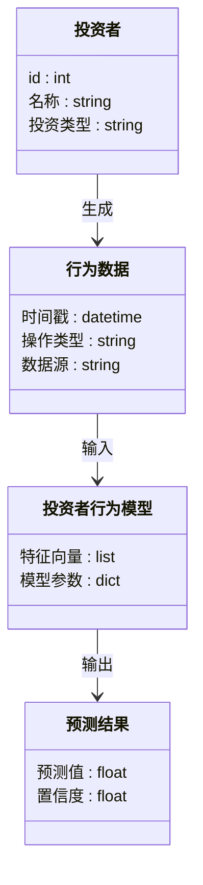

                 


# 目录大纲：《智能投资者行为分析与预测平台》

## 第一部分：背景介绍

### 第1章：智能投资者行为分析与预测平台概述

#### 1.1 问题背景
- 1.1.1 投资者行为分析的重要性
- 1.1.2 当前分析方法的局限性
- 1.1.3 智能化分析的必要性

#### 1.2 问题描述
- 1.2.1 投资者行为的多样性与复杂性
- 1.2.2 数据驱动分析的需求
- 1.2.3 平台构建的目标

#### 1.3 问题解决
- 1.3.1 数据采集与处理方法
- 1.3.2 智能分析技术的应用
- 1.3.3 预测模型的构建

#### 1.4 边界与外延
- 1.4.1 平台的功能边界
- 1.4.2 相关领域的扩展
- 1.4.3 技术实现的范围

#### 1.5 核心要素组成
- 1.5.1 数据源与处理流程
- 1.5.2 分析模型与算法
- 1.5.3 预测结果的呈现方式

---

## 第二部分：核心概念与联系

### 第2章：核心概念与模型构建

#### 2.1 智能投资者行为分析的核心概念
- 2.1.1 行为数据的定义
- 2.1.2 智能分析的关键技术
- 2.1.3 预测模型的类型

#### 2.2 概念模型构建
- 2.2.1 实体识别与关系建模
- 2.2.2 概念模型的层次结构
- 2.2.3 模型的验证与优化

#### 2.3 投资者行为特征分析
- 2.3.1 行为特征的分类
- 2.3.2 特征之间的关系
- 2.3.3 行为模式的识别

#### 2.4 ER实体关系图
```mermaid
erDiagram
    actor 投资者 {
        <属性> id : int
        <属性> 名称 : string
        <属性> 投资类型 : string
    }
    actor 行为数据 {
        <属性> 时间戳 : datetime
        <属性> 操作类型 : string
        <属性> 数据源 : string
    }
    投资者 --> 行为数据 : 生成
    投资者 --> 投资者行为模型 : 输入
    行为数据 --> 投资者行为模型 : 输入
    投资者行为模型 --> 预测结果 : 输出
```

---

## 第三部分：算法原理讲解

### 第3章：算法原理与实现

#### 3.1 数据预处理
- 3.1.1 数据清洗
- 3.1.2 特征提取
- 3.1.3 数据转换

#### 3.2 基于规则的投资者行为分析
- 3.2.1 规则定义
- 3.2.2 规则匹配
- 3.2.3 结果输出

#### 3.3 机器学习模型
- 3.3.1 决策树模型
  - 使用条件：适用于分类问题
  - 优缺点：解释性强，但容易过拟合
- 3.3.2 随机森林模型
  - 使用条件：适用于分类和回归问题
  - 优缺点：计算成本较高，但泛化能力强

#### 3.4 深度学习模型
- 3.4.1 LSTM网络
  - 使用条件：适用于时间序列数据
  - 优缺点：训练时间较长，但能捕捉复杂模式

#### 3.5 算法实现
- 3.5.1 使用Python的scikit-learn库实现决策树模型
- 3.5.2 使用Keras库实现LSTM网络
- 3.5.3 使用H2O库实现随机森林模型

#### 3.6 数学模型与公式
- 决策树模型的分裂标准：基尼指数
  $$ \text{基尼指数} = \sum_{i=1}^{n} p_i (1 - p_i) $$
- LSTM的遗忘门公式：
  $$ f_t = \sigma(W_f \cdot [h_{t-1}, x_t] + b_f) $$

---

## 第四部分：系统分析与架构设计

### 第4章：系统分析与架构设计

#### 4.1 问题场景介绍
- 投资者行为分析的典型场景
- 系统需要解决的问题
- 平台的目标用户

#### 4.2 系统功能设计
- 数据采集模块
- 数据分析模块
- 预测模块
- 结果展示模块

#### 4.3 领域模型构建


#### 4.4 系统架构设计


---

## 第五部分：项目实战

### 第5章：项目实战与实现

#### 5.1 环境安装
- 安装Python
- 安装相关库（scikit-learn, Keras, H2O）

#### 5.2 核心功能实现
- 数据预处理
- 模型训练
- 模型预测
- 结果可视化

#### 5.3 案例分析
- 数据来源：股票交易数据
- 数据处理：清洗和特征提取
- 模型选择：LSTM网络
- 实验结果：预测准确性分析

#### 5.4 代码实现
```python
# LSTM模型实现
from keras.layers import LSTM, Dense
from keras.models import Sequential

model = Sequential()
model.add(LSTM(128, input_shape=(timesteps, features)))
model.add(Dense(1, activation='sigmoid'))
model.compile(loss='binary_crossentropy', optimizer='adam', metrics=['accuracy'])
model.fit(X_train, y_train, epochs=10, batch_size=32)
```

---

## 第六部分：最佳实践与总结

### 第6章：最佳实践与总结

#### 6.1 项目经验总结
- 项目成功之处
- 项目不足之处
- 改进方向

#### 6.2 小结
- 平台的价值
- 技术的局限性
- 未来的改进方向

#### 6.3 注意事项
- 数据质量的重要性
- 模型调参的技巧
- 系统性能优化的建议

---

## 第七部分：拓展阅读与参考文献

### 第7章：拓展阅读与参考文献

#### 7.1 推荐书籍
- 《Python机器学习实战》
- 《深度学习入门：基于Python和Keras》

#### 7.2 推荐论文
- "Long short-term memory networks: A comprehensive overview"
- "XGBoost: A Scalable Tree-Based Algorithm for Data Mining and Analytics"

#### 7.3 工具推荐
- Jupyter Notebook
- TensorFlow
- PyTorch

---

## 作者：AI天才研究院/AI Genius Institute & 禅与计算机程序设计艺术 /Zen And The Art of Computer Programming

