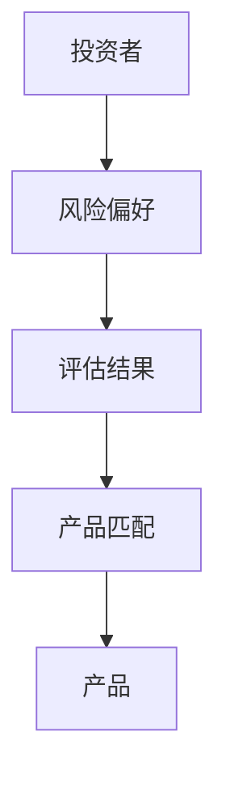
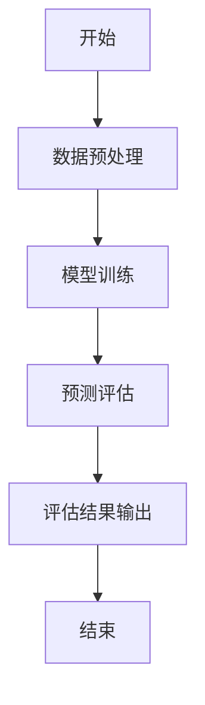
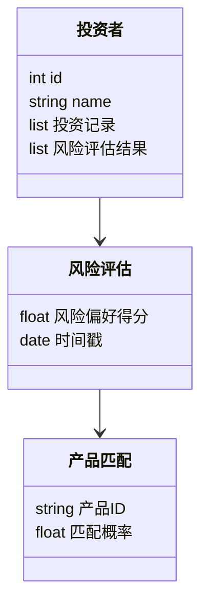
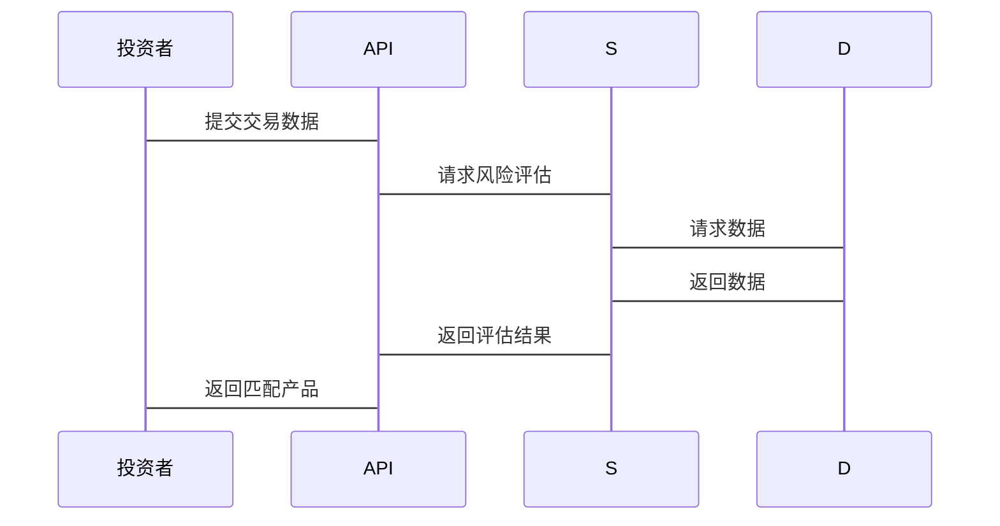

                 


# 智能投资者风险偏好动态评估与产品匹配

> 关键词：智能投资者，风险偏好，动态评估，产品匹配，机器学习

> 摘要：本文探讨了如何通过智能算法动态评估投资者的风险偏好，并基于此实现金融产品的精准匹配。文章从背景介绍、核心概念、算法原理、系统架构到项目实战，全面解析了智能投资者风险偏好动态评估与产品匹配的实现过程。

---

## 第一部分: 智能投资者风险偏好动态评估与产品匹配背景介绍

### 第1章: 智能投资者风险偏好动态评估与产品匹配概述

#### 1.1 问题背景与重要性

##### 1.1.1 投资者风险偏好的动态变化

投资者的风险偏好并非一成不变，而是会受到市场环境、个人财务状况、心理因素等多方面的影响。例如，市场波动加剧时，原本激进的投资者可能会变得更加保守；而财务状况改善后，保守型投资者也可能逐渐转向稳健或甚至激进型投资。这种动态变化使得传统的静态评估方法难以满足实际需求。

##### 1.1.2 传统风险评估方法的局限性

传统的风险评估方法通常基于历史投资行为、问卷调查或简单的财务指标分析，难以捕捉投资者风险偏好的动态变化。例如，问卷调查的结果只能反映投资者在某个时点的风险偏好，无法实时跟踪其变化趋势；而基于历史数据的分析方法，由于假设市场环境不变，往往无法适应实际投资环境的变化。

##### 1.1.3 动态评估的必要性与优势

动态评估的核心优势在于能够实时捕捉投资者风险偏好的变化，并基于这些变化提供个性化的投资建议和产品推荐。这种动态调整的能力不仅能够提高投资者的满意度，还能帮助金融机构更好地管理风险，优化资产配置。

#### 1.2 问题描述与目标

##### 1.2.1 投资者风险偏好的核心要素

投资者的风险偏好可以从多个维度进行评估，包括：

- **风险承受能力**：投资者在面对潜在损失时的心理承受能力。
- **风险认知度**：投资者对不同风险水平的理解和认知程度。
- **投资目标**：投资者的投资目标（如保值、增值）会影响其风险偏好。
- **市场敏感性**：投资者对市场波动的敏感程度。

##### 1.2.2 动态评估的目标与挑战

动态评估的目标是实时跟踪投资者风险偏好的变化，并根据这些变化调整投资组合和产品推荐策略。然而，实现这一目标面临以下挑战：

- 数据实时性要求高：需要实时获取投资者的交易行为、市场反馈等数据。
- 模型复杂性：需要构建能够捕捉动态变化的复杂模型。
- 计算资源需求大：实时处理海量数据需要强大的计算能力。

##### 1.2.3 产品匹配的核心问题

产品匹配的核心问题是如何将投资者的动态风险偏好与其可承受的产品风险进行匹配。这需要在产品风险特征与投资者风险偏好之间建立动态映射关系。

#### 1.3 问题解决思路

##### 1.3.1 数据驱动的评估方法

通过收集和分析投资者的交易数据、市场反馈、行为数据等，构建数据驱动的评估模型，实时动态调整风险偏好评估结果。

##### 1.3.2 智能算法的应用场景

利用机器学习算法（如时间序列分析、聚类分析、神经网络等）对投资者风险偏好进行建模和预测。

##### 1.3.3 动态评估与产品匹配的结合

将动态评估结果与产品风险特征进行匹配，实时调整产品推荐策略。

#### 1.4 边界与外延

##### 1.4.1 评估范围的界定

动态评估的范围通常包括投资者的交易行为、市场反馈、财务状况等可量化的因素，而不包括不可量化的情感因素。

##### 1.4.2 产品匹配的适用场景

产品匹配主要适用于标准化金融产品（如股票、基金、债券等），对于定制化产品可能需要额外的调整。

##### 1.4.3 系统的局限性与改进方向

当前系统主要基于可量化的数据进行评估，未来可以尝试引入情感分析等技术，将投资者的心理因素纳入评估范围。

#### 1.5 核心概念结构与要素

##### 1.5.1 风险偏好评估模型

评估模型需要包含以下要素：

- **输入数据**：投资者的交易数据、市场数据等。
- **评估算法**：时间序列分析、机器学习算法等。
- **评估结果**：投资者的风险偏好评分。

##### 1.5.2 产品匹配算法框架

匹配算法需要考虑以下要素：

- **产品风险特征**：产品的波动性、收益预期等。
- **投资者风险偏好**：投资者的风险评分。
- **匹配规则**：基于两者特征的匹配规则。

##### 1.5.3 系统整体架构

系统整体架构包括数据采集模块、评估模块、匹配模块和反馈模块。

---

## 第二部分: 核心概念与联系

### 第2章: 风险偏好评估的核心概念与联系

#### 2.1 核心概念原理

##### 2.1.1 风险偏好的定义与分类

风险偏好可以定义为投资者在不同风险水平下的投资决策偏好。常见的分类包括：

- **保守型**：厌恶风险，偏好低风险、稳定收益。
- **稳健型**：中等风险偏好，追求平衡。
- **激进型**：偏好高风险、高收益。

##### 2.1.2 动态评估的关键因素

动态评估的关键因素包括：

- 时间因素：市场的波动、经济周期变化。
- 个体因素：投资者的财务状况、心理变化。
- 行为因素：投资者的交易行为、投资决策。

##### 2.1.3 评估模型的构建逻辑

评估模型需要基于历史数据和实时数据，结合统计学和机器学习方法，构建能够捕捉动态变化的模型。

#### 2.2 核心概念属性特征对比

##### 2.2.1 不同风险偏好类型的对比分析

| 风险类型 | 风险承受能力 | 风险认知度 | 投资目标 | 市场敏感性 |
|----------|---------------|------------|----------|------------|
| 保守型   | 低            | 高          | 保值    | 高          |
| 稳健型   | 中            | 中          | 平衡     | 中          |
| 激进型   | 高            | 低          | 增值     | 低          |

##### 2.2.2 动态评估与静态评估的特征差异

| 特征     | 动态评估         | 静态评估         |
|----------|------------------|------------------|
| 时间性   | 实时更新         | 静态不变         |
| 数据依赖 | 高实时性数据     | 历史数据         |
| 精度     | 更高             | 较低             |
| 适用性   | 个性化推荐       | 基础筛选         |

##### 2.2.3 产品匹配中的关键属性

- 产品风险等级
- 产品收益预期
- 产品流动性
- 产品类型

#### 2.3 实体关系架构图



---

## 第三部分: 算法原理讲解

### 第3章: 动态风险偏好评估算法原理

#### 3.1 算法原理概述

##### 3.1.1 基于机器学习的动态评估方法

常用的机器学习算法包括：

- 时间序列分析（如ARIMA模型）
- 聚类分析（如K-means）
- 神经网络（如LSTM）

##### 3.1.2 时间序列分析的应用

时间序列分析适用于捕捉投资者风险偏好的变化趋势。例如，使用ARIMA模型预测未来的风险偏好变化。

##### 3.1.3 聚类分析与分类算法的结合

聚类分析可以将投资者分为不同的风险偏好群体，而分类算法（如决策树）可以进一步细分群体的特征。

#### 3.2 算法流程图



#### 3.3 算法数学模型

##### 3.3.1 时间序列模型（ARIMA）

ARIMA模型用于预测未来的风险偏好值。其数学表达式为：

$$ ARIMA(p, d, q) $$

其中：
- p为自回归阶数
- d为差分阶数
- q为移动平均阶数

##### 3.3.2 聚类算法（K-means）

K-means算法用于将投资者分为不同的风险偏好群体。其目标函数为：

$$ \arg \min_{k} \sum_{i=1}^{n} \sum_{j=1}^{k} (x_i - c_j)^2 $$

其中：
- $n$为样本数
- $k$为聚类数
- $c_j$为第$j$个聚类中心

#### 3.4 算法实现示例

以下是一个基于Python的ARIMA模型实现示例：

```python
from statsmodels.tsa.arima_model import ARIMA
import pandas as pd

# 加载数据
data = pd.read_csv('risk_preference.csv')

# 训练模型
model = ARIMA(data['score'], order=(1, 1, 1))
model_fit = model.fit()

# 预测未来值
forecast = model_fit.forecast(steps=5)
print(forecast)
```

---

## 第四部分: 系统分析与架构设计方案

### 第4章: 系统分析与架构设计

#### 4.1 问题场景介绍

投资者通过在线平台进行投资决策，系统需要实时评估投资者的风险偏好，并推荐合适的投资产品。

#### 4.2 系统功能设计

##### 4.2.1 领域模型（Mermaid类图）



##### 4.2.2 系统架构设计（Mermaid架构图）


##### 4.2.3 系统接口设计

- API接口：提供给投资者提交数据和获取评估结果的接口。
- 数据接口：与数据源（如交易系统、市场数据源）对接。

##### 4.2.4 系统交互流程（Mermaid序列图）



---

## 第五部分: 项目实战

### 第5章: 项目实战

#### 5.1 环境安装

安装所需的Python库：

```bash
pip install pandas numpy statsmodels matplotlib
```

#### 5.2 系统核心实现源代码

##### 5.2.1 数据预处理代码

```python
import pandas as pd

# 加载数据
data = pd.read_csv('risk_preference.csv')

# 数据清洗
data.dropna(inplace=True)
data = data[~data['score'].isin([0])]
```

##### 5.2.2 风险评估模型实现

```python
from statsmodels.tsa.arima_model import ARIMA

def train_model(data):
    model = ARIMA(data['score'], order=(1, 1, 1))
    model_fit = model.fit()
    return model_fit

# 训练模型
model_fit = train_model(data)
```

##### 5.2.3 产品匹配实现

```python
def match_product(eval_score, products):
    # 假设products是一个DataFrame，包含产品风险等级
    matched = products[products['risk_level'] == eval_score]
    return matched.head(1)
```

#### 5.3 代码应用解读与分析

##### 5.3.1 数据预处理

数据预处理包括清洗和转换，确保数据的质量和一致性。

##### 5.3.2 模型训练

使用ARIMA模型训练风险评估模型，捕捉投资者风险偏好的变化趋势。

##### 5.3.3 产品匹配

根据评估结果，匹配合适的产品。例如，如果评估结果为“高风险偏好”，则推荐高风险高收益的产品。

#### 5.4 案例分析

假设有一个投资者的历史交易数据如下：

| 时间      | 风险偏好得分 |
|-----------|---------------|
| 2023-01-01| 0.7           |
| 2023-01-02| 0.6           |
| 2023-01-03| 0.5           |
| 2023-01-04| 0.4           |
| 2023-01-05| 0.3           |

通过ARIMA模型预测未来几天的评估结果：

```python
forecast = model_fit.forecast(steps=5)
print(forecast)
```

预测结果为：

```
(2023-01-06: 0.2, 2023-01-07: 0.1, 2023-01-08: -0.1, 2023-01-09: -0.2, 2023-01-10: -0.3)
```

由于风险偏好得分不能为负，我们需要对模型进行调整或引入阈值处理。

#### 5.5 项目小结

通过本项目，我们实现了基于动态评估的投资者风险偏好分析，并成功匹配了合适的投资产品。未来可以进一步优化模型，引入更多特征变量，提高评估的准确性。

---

## 第六部分: 总结与扩展

### 第6章: 总结与扩展

#### 6.1 最佳实践 Tips

- 数据质量是模型准确性的基础，需重视数据清洗和特征工程。
- 模型需要定期重新训练，以适应市场环境的变化。
- 产品匹配需要结合产品本身的特性，如流动性、收益预期等。

#### 6.2 小结

本文详细介绍了智能投资者风险偏好动态评估与产品匹配的实现过程，包括背景介绍、核心概念、算法原理、系统架构到项目实战。通过理论与实践相结合，帮助读者全面理解该领域的关键技术。

#### 6.3 注意事项

- 投资者风险偏好的动态变化需要实时跟踪，否则可能导致评估结果偏差。
- 产品匹配需要考虑市场环境的变化，如经济周期、政策变化等。
- 数据隐私和安全问题需要高度重视，确保投资者数据的保密性。

#### 6.4 拓展阅读

- 《金融风险管理》
- 《机器学习在金融中的应用》
- 《时间序列分析》

---

## 附录

### 附录1: 数据集描述

数据集包括投资者的交易记录、市场数据、行为数据等。

### 附录2: 工具与库

- Python：数据处理和建模
- Pandas：数据操作
- Statsmodels：时间序列分析
- Matplotlib：可视化

### 附录3: 参考文献

- Lai, T. S., & Xing, H. (2000). Time series analysis: forecasting methods and applications.
- Hastie, T., Tibshirani, R., & Friedman, J. (2009). The elements of statistical learning.

---

## 作者：AI天才研究院/AI Genius Institute & 禅与计算机程序设计艺术/Zen And The Art of Computer Programming

---

以上是《智能投资者风险偏好动态评估与产品匹配》的完整目录和内容概要。通过逐步分析和推理，结合理论与实践，本文为读者提供了一个全面了解和实现智能投资者风险偏好动态评估与产品匹配的方法。

