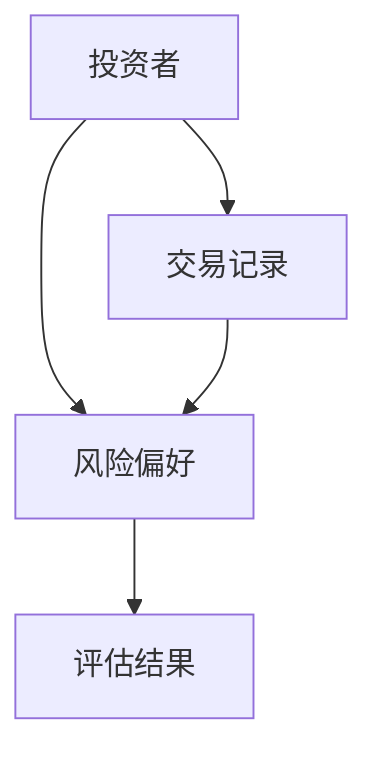
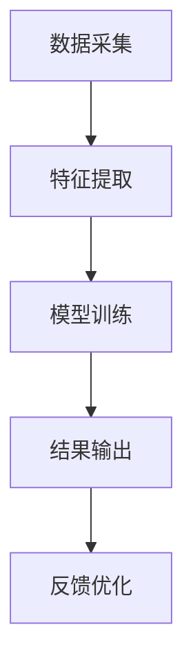
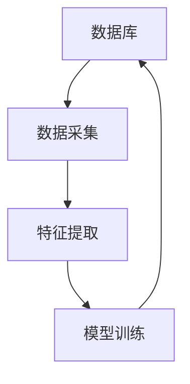

                 


# 智能投资者风险偏好动态评估系统

> 关键词：智能投资者，风险偏好，动态评估，算法原理，系统架构，项目实战

> 摘要：本文系统地探讨了智能投资者风险偏好动态评估系统的构建与实现。从背景介绍、核心概念到算法原理，从系统架构设计到项目实战，全面阐述了该系统的理论基础与技术实现。文章通过详细的技术分析与案例解读，展示了如何利用智能算法与系统架构设计来动态评估投资者的风险偏好，为金融投资领域提供了新的思路与解决方案。

---

## 第1章 背景介绍与问题背景

### 1.1 问题背景

#### 1.1.1 投资者风险偏好的概念与重要性
投资者风险偏好是指投资者在面对不同风险水平的投资项目时，愿意承担风险的程度。这一偏好直接影响其投资决策和资产配置。传统的风险偏好评估通常是静态的，无法适应市场环境的快速变化。

#### 1.1.2 现有风险评估方法的局限性
现有方法多基于静态评估，难以捕捉市场波动和投资者情绪的变化。此外，传统方法通常依赖主观问卷调查，存在信息滞后和准确性不足的问题。

#### 1.1.3 动态评估的必要性与应用场景
动态评估能够实时捕捉投资者行为变化，适用于高频交易、智能投顾、风险预警等多种金融场景，帮助投资者和机构更好地应对市场波动。

### 1.2 问题描述

#### 1.2.1 风险偏好评估的核心问题
如何实时动态地捕捉和评估投资者的风险偏好？如何设计高效的算法来处理海量数据？

#### 1.2.2 动态评估的关键挑战
数据实时性要求高，计算复杂度高，模型更新频繁。

#### 1.2.3 系统目标与功能需求
构建一个能够实时更新投资者风险偏好的系统，支持多维度数据输入，提供动态评估结果。

### 1.3 问题解决与边界

#### 1.3.1 系统设计的核心目标
实现投资者风险偏好的实时评估，提供动态调整的投资建议。

#### 1.3.2 边界与外延
限定于评估投资者风险偏好，不涉及具体的投资决策建议。

#### 1.3.3 核心要素与组成结构
投资者数据输入、特征提取、模型训练、评估结果输出。

### 1.4 本章小结
本章介绍了投资者风险偏好的概念、现有评估方法的局限性，以及动态评估的必要性。明确提出了系统的建设目标和核心要素。

---

## 第2章 核心概念与联系

### 2.1 核心概念与原理

#### 2.1.1 风险偏好的定义与分类
风险偏好分为保守型、平衡型和进取型，不同类型的投资者对应不同的风险承受能力。

#### 2.1.2 动态评估的数学模型
基于时间序列分析和机器学习算法，构建动态评估模型。

#### 2.1.3 系统的核心算法与流程
数据输入 → 特征提取 → 模型训练 → 结果输出。

#### 2.1.4 动态评估的实现流程
使用机器学习算法对投资者行为数据进行建模，实时更新评估结果。

### 2.2 核心概念对比与特征分析

#### 2.2.1 风险偏好与投资行为的关系
风险偏好影响投资行为，而投资行为反过来也能反映风险偏好。

#### 2.2.2 动态评估与静态评估的对比
动态评估能够捕捉短期变化，静态评估适用于长期分析。

#### 2.2.3 不同投资者类型的风险偏好特征
通过统计分析和聚类算法，识别不同类型投资者的风险偏好特征。

#### 2.2.4 风险偏好评估的核心指标
波动率、收益-风险比率、最大回撤等。

#### 2.2.5 风险偏好与市场环境的关系
市场环境变化会影响投资者的风险偏好。

### 2.3 实体关系与系统架构

#### 2.3.1 实体关系图（ER图）


#### 2.3.2 核心实体关系分析
投资者通过交易记录影响其风险偏好评估结果。

---

## 第3章 算法原理与数学模型

### 3.1 动态评估算法原理

#### 3.1.1 动态评估的核心算法
使用时间序列分析和机器学习算法，如LSTM网络。

#### 3.1.2 算法的数学模型
动态评估模型的数学公式：
$$
R(t) = f(x(t), x(t-1), ..., x(t-n))
$$
其中，$R(t)$ 表示时间 $t$ 的风险偏好评估结果，$x(t)$ 表示时间 $t$ 的输入特征。

### 3.2 算法实现与流程

#### 3.2.1 数据预处理
标准化和归一化处理，特征选择。

#### 3.2.2 模型训练
使用深度学习模型进行训练，优化损失函数。

#### 3.2.3 模型评估
通过回测和交叉验证评估模型性能。

### 3.3 数学模型的详细解释

#### 3.3.1 风险偏好评估的公式
$$
R(t) = \alpha \cdot R(t-1) + \beta \cdot x(t)
$$
其中，$\alpha$ 和 $\beta$ 是权重系数。

#### 3.3.2 动态调整的公式
$$
\theta(t) = \theta(t-1) + \gamma \cdot (y(t) - \hat{y}(t))
$$
其中，$\gamma$ 是学习率，$y(t)$ 是真实值，$\hat{y}(t)$ 是预测值。

### 3.4 本章小结
本章详细介绍了动态评估的核心算法和数学模型，展示了如何通过算法实现对投资者风险偏好的实时评估。

---

## 第4章 系统分析与架构设计

### 4.1 系统分析

#### 4.1.1 问题场景介绍
投资者在不同市场环境下的行为变化需要实时捕捉和分析。

#### 4.1.2 系统功能设计
- 数据采集模块：收集投资者行为数据。
- 特征提取模块：提取关键特征。
- 模型训练模块：实时更新评估模型。
- 结果输出模块：提供动态评估结果。

#### 4.1.3 系统架构设计


### 4.2 系统架构设计

#### 4.2.1 系统功能模块
- 数据采集：实时获取投资者行为数据。
- 特征提取：提取影响风险偏好的关键特征。
- 模型训练：训练动态评估模型。
- 结果输出：输出评估结果并提供反馈。

#### 4.2.2 系统架构图


### 4.3 系统接口设计

#### 4.3.1 数据接口
RESTful API：用于数据输入和输出。

#### 4.3.2 模型接口
API：用于模型更新和结果查询。

### 4.4 本章小结
本章详细分析了系统的功能模块和架构设计，展示了如何通过模块化设计实现高效的动态评估。

---

## 第5章 项目实战

### 5.1 环境安装

#### 5.1.1 系统环境
Python 3.8+，TensorFlow 2.0+，Pandas，NumPy。

#### 5.1.2 安装步骤
```bash
pip install numpy pandas tensorflow
```

### 5.2 核心代码实现

#### 5.2.1 数据预处理
```python
import pandas as pd
import numpy as np

def preprocess(data):
    # 标准化处理
    data_norm = (data - data.mean()) / data.std()
    return data_norm
```

#### 5.2.2 模型训练
```python
import tensorflow as tf

def build_model(input_shape):
    model = tf.keras.Sequential()
    model.add(tf.keras.layers.LSTM(64, input_shape=input_shape))
    model.add(tf.keras.layers.Dense(1))
    model.compile(optimizer='adam', loss='mse')
    return model

model = build_model((None, 64))
model.fit(x_train, y_train, epochs=10)
```

#### 5.2.3 模型评估
```python
loss = model.evaluate(x_test, y_test)
print(f"损失: {loss}")
```

### 5.3 代码解读与分析

#### 5.3.1 数据预处理
对输入数据进行标准化处理，确保模型训练的有效性。

#### 5.3.2 模型训练
使用LSTM网络进行时间序列预测，捕捉数据中的时序特征。

#### 5.3.3 模型评估
通过损失函数评估模型性能，优化模型参数。

### 5.4 案例分析与结果展示

#### 5.4.1 数据输入
投资者的交易记录和市场数据。

#### 5.4.2 训练结果
模型输出投资者的风险偏好评估结果。

#### 5.4.3 结果分析
通过评估结果调整投资策略，优化风险控制。

### 5.5 本章小结
本章通过实际项目展示了系统的实现过程，包括环境搭建、代码实现和案例分析。

---

## 第6章 总结与展望

### 6.1 本章总结

#### 6.1.1 核心知识点回顾
系统地介绍了智能投资者风险偏好动态评估系统的构建过程。

#### 6.1.2 系统优势
实时性高，准确性强，适应性强。

### 6.2 未来展望

#### 6.2.1 可能的改进方向
引入更多维度的数据，优化算法模型。

#### 6.2.2 应用前景
在智能投顾、风险管理等领域具有广阔的应用前景。

### 6.3 最佳实践 tips

#### 6.3.1 技术实现
建议使用深度学习算法，结合实时数据流处理技术。

#### 6.3.2 优化建议
定期更新模型，结合市场反馈优化评估策略。

#### 6.3.3 注意事项
确保数据质量和模型的实时性，防范数据偏差。

### 6.4 拓展阅读
推荐阅读相关领域的最新研究论文和技术博客，深入学习动态评估和机器学习的应用。

### 6.5 本章小结
本章总结了系统的建设成果，展望了未来的发展方向，并提供了实践中的注意事项和拓展阅读建议。

---

## 作者：AI天才研究院/AI Genius Institute & 禅与计算机程序设计艺术 /Zen And The Art of Computer Programming

---

通过本文的系统介绍，读者可以全面了解智能投资者风险偏好动态评估系统的构建过程，掌握其实现方法，并为实际应用提供参考。

