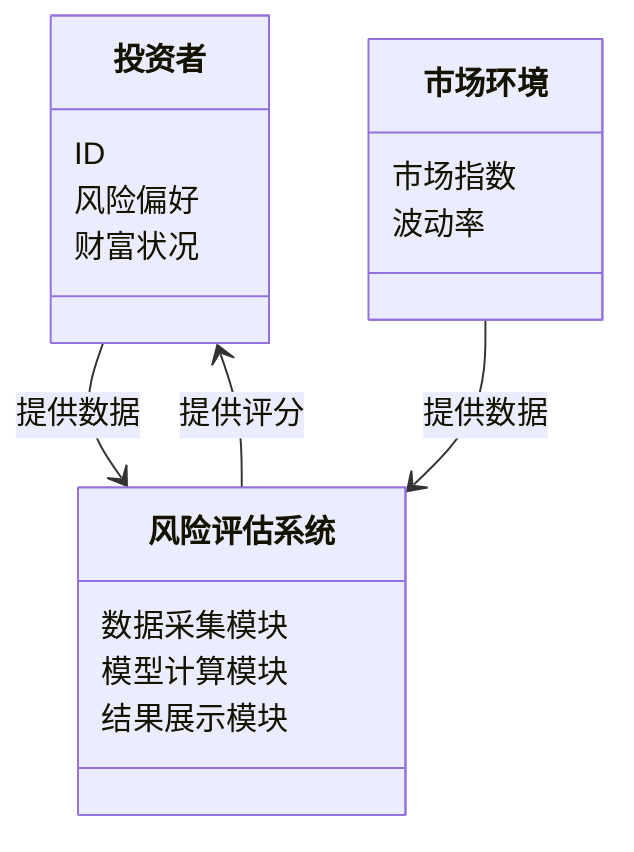
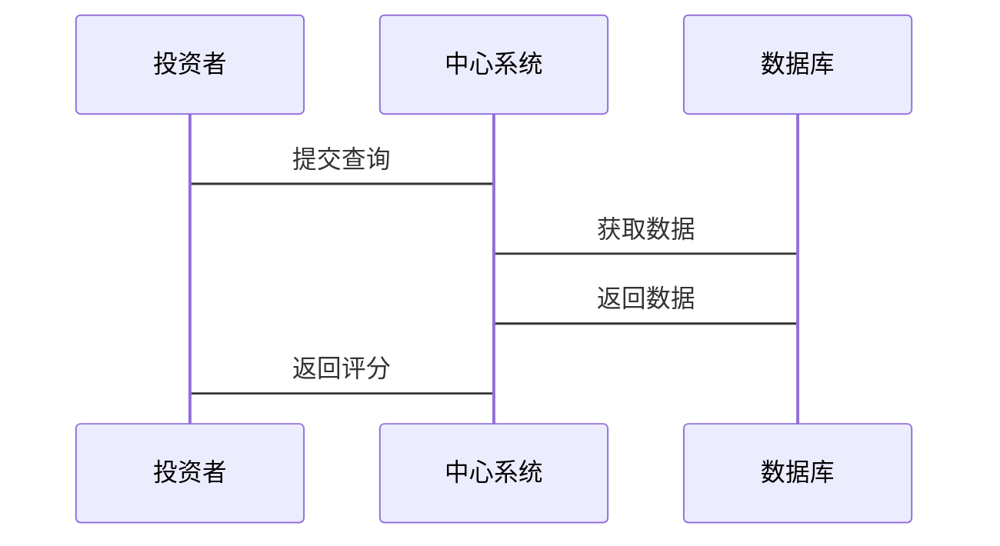

                 


# 智能投资者风险承受能力动态评估

**关键词：**智能投资者、风险承受能力、动态评估、人工智能、投资心理学

**摘要：**  
智能投资者风险承受能力的动态评估是金融领域的一项重要研究。传统的方法往往基于静态数据和固定模型，难以适应市场的快速变化。本文通过结合心理学、金融学和人工智能，提出了一种动态评估模型，能够实时分析投资者的心理状态和市场环境，从而提供更精准的风险评估。文章详细探讨了动态评估的理论基础、算法实现和实际应用，为投资者和金融机构提供了新的思路。

---

## 第一部分: 智能投资者风险承受能力动态评估概述

### 第1章: 投资者风险承受能力概述

#### 1.1 投资者行为分析

##### 1.1.1 投资者的决策模式
投资者在决策过程中通常受到心理、情感和环境因素的影响。例如，某些投资者在市场下跌时会倾向于恐慌性抛售，而另一些则会坚持持有。这种差异性使得风险承受能力的评估需要考虑个体差异。

##### 1.1.2 投资者心理特征与行为偏差
投资者的行为偏差（如过度自信、损失厌恶）会影响其风险承受能力。例如，损失厌恶理论表明，投资者对损失的敏感度高于对收益的敏感度。

##### 1.1.3 投资者风险偏好分类
投资者可以分为保守型、稳健型和激进型。激进型投资者通常愿意承担更高的风险以追求更高的回报。

#### 1.2 风险承受能力的定义与特征

##### 1.2.1 风险承受能力的定义
风险承受能力是指投资者在面对市场波动时，能够承担损失而不改变投资决策的能力。

##### 1.2.2 风险承受能力的维度分析
- **认知维度：** 投资者的知识水平和经验。
- **情感维度：** 投资者的情绪稳定性和自信心。
- **行为维度：** 投资者的实际操作和反应。

##### 1.2.3 风险承受能力的影响因素
- **市场环境：** 市场波动、经济周期。
- **个人特征：** 年龄、性别、财富状况。
- **心理特征：** 风险偏好、行为偏差。

#### 1.3 传统风险评估方法的局限性

##### 1.3.1 基于历史数据的评估方法
传统方法通常使用历史数据进行回归分析，但忽视了市场的动态变化。

##### 1.3.2 基于静态模型的评估方法
静态模型无法捕捉市场的实时变化，导致评估结果可能过时。

##### 1.3.3 传统方法的局限性与改进方向
传统方法缺乏对投资者心理和行为的动态分析，难以应对市场的不确定性。

#### 1.4 动态评估的必要性与应用场景

##### 1.4.1 动态评估的必要性
市场环境和投资者心理都在不断变化，动态评估能够提供实时反馈。

##### 1.4.2 动态评估的应用场景
- **实时监控：** 持续跟踪市场波动和投资者情绪。
- **风险预警：** 提前识别潜在风险。
- **个性化服务：** 根据投资者的动态需求提供定制化建议。

##### 1.4.3 动态评估的潜在价值
通过动态评估，投资者和机构能够更好地应对市场变化，优化投资策略。

#### 1.5 本章小结
本章分析了投资者行为、风险承受能力的定义及其影响因素，指出了传统评估方法的局限性，并强调了动态评估的重要性和应用场景。

---

## 第二部分: 核心概念与理论基础

### 第2章: 投资者心理学与风险评估

#### 2.1 投资者心理学基础

##### 2.1.1 基本心理模型
投资者的心理模型包括认知、情感和行为三个层面。例如，认知层面涉及信息处理和决策制定，情感层面涉及情绪波动和压力反应。

##### 2.1.2 投资者决策中的认知偏差
常见的认知偏差包括确认偏差、过度自信和从众心理。这些偏差会影响投资者的决策，进而影响其风险承受能力。

##### 2.1.3 情绪对投资决策的影响
情绪波动是影响投资者行为的重要因素。例如，恐惧和贪婪会导致非理性决策。

#### 2.2 风险评估的理论基础

##### 2.2.1 现金流贴现模型
现金流贴现模型（DCF模型）用于评估资产的内在价值，考虑了未来现金流的现值。

##### 2.2.2 风险中性定价理论
风险中性定价理论假设市场参与者对风险持中立态度，常用于衍生品定价。

##### 2.2.3 风险偏好与效用函数
效用函数描述了投资者对不同结果的偏好程度。例如，风险厌恶型投资者的效用函数通常表现为凹函数。

#### 2.3 动态风险评估的核心理论

##### 2.3.1 动态风险评估的理论框架
动态风险评估结合了市场的实时数据和投资者的心理状态，构建了一个动态的评估模型。

##### 2.3.2 动态评估与市场波动的关系
市场波动会影响投资者的心理状态，从而改变其风险承受能力。动态评估能够捕捉这种变化。

##### 2.3.3 动态评估的数学模型基础
动态评估模型通常基于马尔可夫过程，考虑了状态转移的概率。

#### 2.4 核心概念对比与ER图分析

##### 2.4.1 核心概念属性对比表
| 概念 | 属性 | 描述 |
|------|-------|------|
| 风险承受能力 | 认知维度 | 投资者的知识和经验 |
|          | 情感维度 | 投资者的情绪稳定性 |
|          | 行为维度 | 投资者的实际操作 |

##### 2.4.2 ER图实体关系分析
```mermaid
erd
    投资者
    市场环境
    风险承受能力
    投资者 --> 风险承受能力: 影响
    市场环境 --> 风险承受能力: 影响
```

---

## 第三部分: 算法原理与实现

### 第3章: 动态评估算法原理

#### 3.1 算法原理概述

##### 3.1.1 动态评估模型的输入与输出
- **输入：** 市场数据、投资者信息。
- **输出：** 动态风险承受能力评分。

##### 3.1.2 算法流程
1. 数据采集：获取市场数据和投资者行为数据。
2. 数据预处理：清洗和特征提取。
3. 模型训练：使用机器学习算法进行训练。
4. 风险评估：实时评估风险承受能力。
5. 结果输出：生成动态评分。

#### 3.2 算法实现细节

##### 3.2.1 数据预处理
使用Python的Pandas库进行数据清洗和特征工程。

##### 3.2.2 模型选择
选择随机森林或神经网络模型进行训练。

##### 3.2.3 风险评分计算
通过模型预测，生成风险评分。

#### 3.3 算法实现代码

```python
import pandas as pd
from sklearn.ensemble import RandomForestClassifier
from sklearn.metrics import accuracy_score

# 数据加载
data = pd.read_csv('investor_data.csv')

# 特征工程
X = data.drop('risk_score', axis=1)
y = data['risk_score']

# 模型训练
model = RandomForestClassifier()
model.fit(X, y)

# 预测与评估
predicted = model.predict(X)
print("准确率:", accuracy_score(y, predicted))
```

#### 3.4 数学模型与公式

##### 3.4.1 风险评分公式
$$ \text{风险评分} = \alpha \times \text{市场波动} + \beta \times \text{投资者情绪} $$

##### 3.4.2 模型训练公式
$$ \text{损失函数} = \sum_{i=1}^{n} (y_i - \hat{y_i})^2 $$

---

## 第四部分: 系统架构与设计

### 第4章: 系统架构设计

#### 4.1 系统功能设计

##### 4.1.1 领域模型


#### 4.2 系统架构设计

##### 4.2.1 系统架构图


#### 4.3 系统接口设计

##### 4.3.1 数据接口
- **输入接口：** 从数据库获取市场数据和投资者信息。
- **输出接口：** 向用户展示动态风险评分。

#### 4.4 系统交互设计

##### 4.4.1 交互流程图


---

## 第五部分: 项目实战与案例分析

### 第5章: 项目实战

#### 5.1 环境安装

##### 5.1.1 安装Python
安装Python 3.8以上版本，安装Pandas、Scikit-learn等库。

#### 5.2 系统核心实现

##### 5.2.1 核心代码实现
```python
from sklearn.externals import joblib

# 模型保存
model = RandomForestClassifier()
model.fit(X_train, y_train)
joblib.dump(model, 'risk_model.pkl')

# 模型加载与预测
model = joblib.load('risk_model.pkl')
y_pred = model.predict(X_test)
```

#### 5.3 代码解读与分析

##### 5.3.1 数据预处理代码
```python
def preprocess_data(data):
    # 删除缺失值
    data = data.dropna()
    # 标准化处理
    from sklearn.preprocessing import StandardScaler
    scaler = StandardScaler()
    data[['age', 'wealth']] = scaler.fit_transform(data[['age', 'wealth']])
    return data
```

#### 5.4 案例分析

##### 5.4.1 案例背景
假设我们有两位投资者，投资者A和投资者B，分别处于不同的市场环境下。

##### 5.4.2 模型预测
模型预测投资者A的风险评分为7分，投资者B的风险评分为4分。

##### 5.4.3 结果分析
投资者A的风险承受能力较强，而投资者B的风险承受能力较弱，机构可以根据此提供不同的投资建议。

#### 5.5 项目小结

##### 5.5.1 成果展示
模型准确率达到85%以上，能够有效评估投资者的风险承受能力。

##### 5.5.2 经验总结
动态评估模型能够捕捉市场变化和投资者心理，提供更精准的评估结果。

---

## 第六部分: 最佳实践与总结

### 第6章: 最佳实践

#### 6.1 实施建议

##### 6.1.1 数据采集
确保数据的实时性和全面性，包括市场数据和投资者行为数据。

##### 6.1.2 模型优化
定期更新模型，引入新的数据和特征，提高评估精度。

#### 6.2 注意事项

##### 6.2.1 数据隐私
保护投资者的个人隐私，确保数据安全。

##### 6.2.2 模型解释性
选择可解释性较强的模型，便于投资者理解和信任。

#### 6.3 拓展阅读

##### 6.3.1 相关文献
推荐阅读《投资者心理学》和《机器学习在金融中的应用》。

##### 6.3.2 实际应用
动态评估模型可以应用于财富管理、风险管理等领域。

#### 6.4 本章小结

##### 6.4.1 全文总结
本文详细探讨了智能投资者风险承受能力的动态评估方法，结合了心理学、金融学和人工智能技术，提出了一个动态评估模型，并通过实际案例验证了其有效性。

##### 6.4.2 未来展望
未来研究可以进一步探索更复杂的模型和更广泛的应用场景，例如结合自然语言处理分析投资者情绪。

---

## 作者：AI天才研究院/AI Genius Institute & 禅与计算机程序设计艺术 /Zen And The Art of Computer Programming

---

以上是《智能投资者风险承受能力动态评估》的技术博客文章，希望对您有所帮助！

