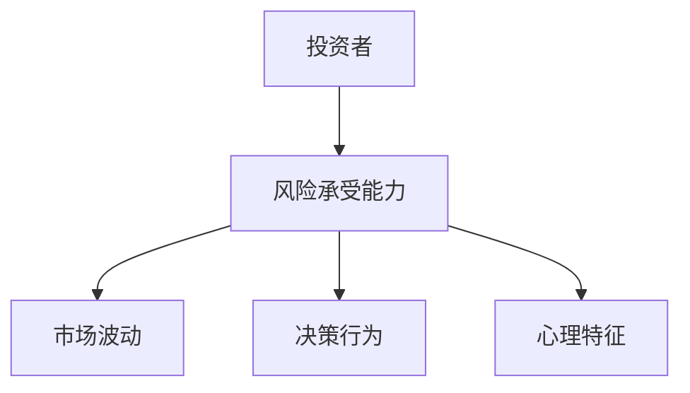
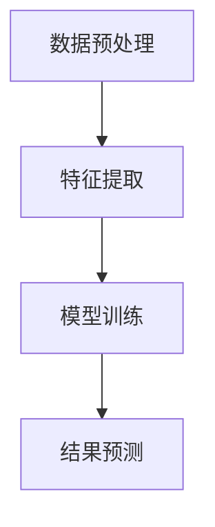
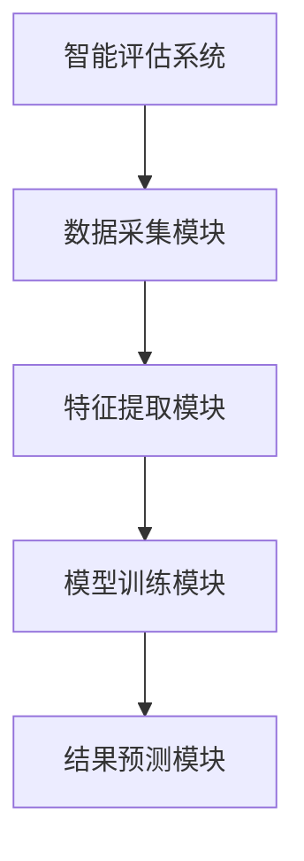

                 


# 智能投资者风险承受能力评估

> 关键词：智能投资者、风险承受能力、评估模型、机器学习、金融系统

> 摘要：本文系统地探讨了智能投资者风险承受能力评估的背景、核心概念、算法原理、系统架构、项目实战及最佳实践。通过多维度分析，结合心理学、金融学与机器学习技术，构建了高效的评估模型，为投资者和金融机构提供科学的决策支持。

---

## 第1章: 智能投资者风险承受能力评估的背景介绍

### 1.1 问题背景与定义
智能投资者风险承受能力评估是指通过技术手段，分析投资者的心理、行为和认知特征，结合市场环境，智能评估其风险承受能力。传统评估方法依赖问卷，存在主观性和片面性，无法准确反映投资者的真实风险承受能力。

### 1.2 核心概念与问题描述
投资者风险承受能力由心理特征（情绪稳定性、自信心）、行为特征（决策速度、一致性）、认知特征（信息处理能力、风险认知偏差）和情景特征（市场波动反应）构成。传统评估方法忽视个体差异，无法动态调整评估结果。

### 1.3 问题解决与评估框架
构建多维度评估模型，整合心理、行为、认知和情景特征，结合机器学习算法，动态调整评估结果，提高评估的准确性和科学性。

---

## 第2章: 核心概念与联系分析

### 2.1 核心概念的原理与特征
- **心理特征**：情绪稳定性和自信心影响投资者在市场波动中的决策。
- **行为特征**：决策速度和一致性反映投资者的纪律性。
- **认知特征**：信息处理能力和风险认知偏差影响决策质量。
- **情景特征**：市场波动反应体现投资者的动态适应能力。

### 2.2 核心概念的属性对比
| 特征类型 | 属性1 | 属性2 | 属性3 |
|----------|-------|-------|-------|
| 心理特征 | 情绪稳定性 | 自信心 | 自我调节能力 |
| 行为特征 | 决策速度 | 决策一致性 | 决策纪律性 |
| 认知特征 | 信息处理能力 | 风险认知偏差 | 风险认知深度 |
| 情景特征 | 市场波动反应 | 风险情景模拟 | 风险承受能力变化 |

### 2.3 ER实体关系图


---

## 第3章: 算法原理与数学模型

### 3.1 算法原理
- **机器学习模型**：选择线性回归和决策树模型。
- **算法流程**：数据预处理、特征提取、模型训练、结果预测。



### 3.2 数学模型与公式
- **线性回归模型**：用于预测风险承受能力评分。
  $$ y = \beta_0 + \beta_1x_1 + \beta_2x_2 + ... + \beta_nx_n + \epsilon $$
  其中，$y$为评分，$x_i$为特征变量，$\beta$为回归系数。

- **决策树模型**：用于分类投资者类型。
  使用信息熵公式选择最优特征：
  $$ \text{信息熵} = -\sum_{i=1}^{n} p_i \log_2 p_i $$

---

## 第4章: 系统分析与架构设计

### 4.1 系统架构设计


### 4.2 接口设计
- **数据接口**：从数据库读取投资者数据。
- **模型接口**：调用训练好的机器学习模型进行预测。
- **结果接口**：将评估结果返回给用户或系统。

---

## 第5章: 项目实战

### 5.1 环境安装
- 安装Python和机器学习库（如scikit-learn、pandas）。

### 5.2 核心代码实现
```python
import pandas as pd
from sklearn.linear_model import LinearRegression
from sklearn.tree import DecisionTreeClassifier

# 加载数据
data = pd.read_csv('investors.csv')

# 数据预处理
data.dropna()

# 特征提取
X = data[['age', 'income', 'risk_tolerance']]
y = data['score']

# 模型训练
model_linear = LinearRegression()
model_linear.fit(X, y)

model_tree = DecisionTreeClassifier()
model_tree.fit(X, y)

# 预测
new_investor = [[45, 100000, 0.7]]
print("Linear Regression预测:", model_linear.predict(new_investor)[0])
print("Decision Tree预测:", model_tree.predict(new_investor)[0])
```

### 5.3 案例分析
以一位45岁、收入10万元、风险偏好中等的投资者为例，模型预测其风险承受能力评分为0.8，属于中高风险承受能力。

---

## 第6章: 最佳实践与总结

### 6.1 注意事项
- 数据隐私保护。
- 模型泛化能力。

### 6.2 未来研究方向
- 引入实时市场数据。
- 结合自然语言处理分析投资者情绪。

### 6.3 总结
智能投资者风险承受能力评估通过技术手段提升评估的准确性和科学性，为投资者和金融机构提供可靠决策支持。

---

## 作者：AI天才研究院 & 禅与计算机程序设计艺术

