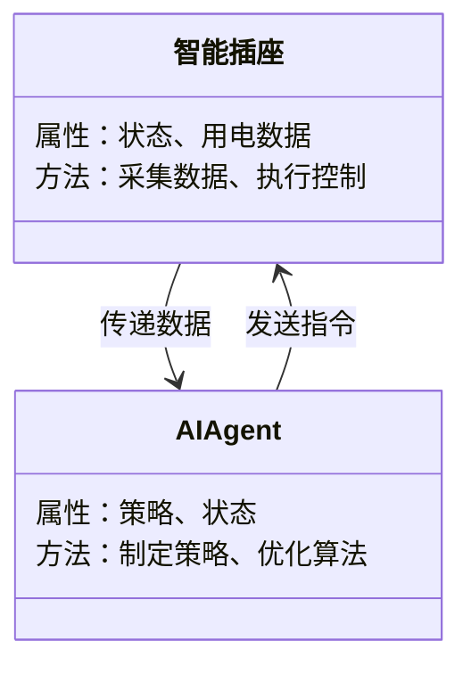
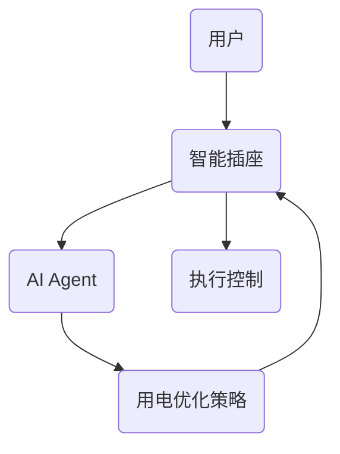

                 


# 智能插座：AI Agent的用电优化管理

> 关键词：智能插座，AI Agent，用电优化，强化学习，动态规划，智能家居

> 摘要：本文深入探讨了智能插座与AI Agent结合的用电优化管理，从背景、核心概念到算法原理、系统架构，再到项目实战和最佳实践，全面解析如何利用AI技术提升用电管理效率和用户体验。

## 第1章：智能插座与AI Agent的背景介绍

### 1.1 智能插座的发展背景
#### 1.1.1 智能家居的兴起
智能家居的普及为智能插座的发展提供了沃土，用户对便捷生活的追求推动了智能插座的市场需求。

#### 1.1.2 用电管理的智能化需求
随着能源价格的上涨和环保意识的增强，用户对智能用电管理的需求日益增长。

#### 1.1.3 AI技术在智能插座中的应用
AI技术的进步使得智能插座能够实现更复杂的用电优化策略，提升了用户体验和能效管理。

### 1.2 AI Agent的基本概念
#### 1.2.1 什么是AI Agent
AI Agent是一种智能体，能够感知环境、做出决策并执行动作，以实现特定目标。

#### 1.2.2 AI Agent的核心特征
- 自主性：无需外部干预，自主决策
- 反应性：能感知环境变化并做出反应
- 持续性：能持续运行并不断优化

#### 1.2.3 AI Agent在智能插座中的作用
通过AI Agent，智能插座能够实现智能化的用电管理，优化能源使用效率。

### 1.3 用电优化管理的意义
#### 1.3.1 节能减排的重要性
用电优化管理有助于减少能源浪费，降低碳排放，保护环境。

#### 1.3.2 智能插座在用电优化中的优势
智能插座能够实时监测用电情况，通过AI算法优化用电策略，实现节能减排。

#### 1.3.3 用户体验的提升
用电优化不仅降低了用户的电费支出，还能提升用户的用电体验，使用户生活更加便捷。

## 第2章：智能插座与AI Agent的核心概念

### 2.1 智能插座的定义与属性
#### 2.1.1 智能插座的基本定义
智能插座是一种集成智能控制和网络通信功能的电器插座，能够通过互联网连接实现远程控制和智能化管理。

#### 2.1.2 智能插座的主要属性
- 连接性：支持Wi-Fi、蓝牙等通信协议
- 智能性：具备自动控制和学习能力
- 可扩展性：支持多种智能设备的连接与控制

### 2.2 AI Agent的定义与属性
#### 2.2.1 AI Agent的基本定义
AI Agent是具有感知、决策和执行能力的智能体，能够在复杂环境中自主完成任务。

#### 2.2.2 AI Agent的核心属性
- 感知能力：能够感知环境中的信息
- 决策能力：基于感知信息做出决策
- 执行能力：执行决策并产生效果

### 2.3 智能插座与AI Agent的关系
#### 2.3.1 智能插座与AI Agent的协同工作
智能插座作为AI Agent的控制对象，AI Agent负责优化用电策略，实现智能控制。

#### 2.3.2 两者在用电优化中的协同作用
AI Agent通过分析用电数据，制定最优用电策略，智能插座则根据策略执行具体的控制操作。

#### 2.3.3 两者的区别与联系
智能插座是物理设备，负责执行控制操作；AI Agent是智能算法，负责策略制定和优化。

## 第3章：智能插座与AI Agent的原理

### 3.1 智能插座的工作原理
#### 3.1.1 数据采集与传输
智能插座通过内部传感器采集用电数据，并通过网络将数据传输到云端或本地控制系统。

#### 3.1.2 用电行为分析
通过对采集数据的分析，识别用户的用电习惯和用电模式，为AI Agent制定优化策略提供依据。

#### 3.1.3 用电优化策略
根据分析结果，制定最优用电策略，例如错峰用电、设备智能开关等。

### 3.2 AI Agent的工作原理
#### 3.2.1 状态感知与识别
AI Agent通过感知环境状态（如电价波动、用户行为）来识别当前用电情况。

#### 3.2.2 决策与执行
基于感知到的状态信息，AI Agent运用算法制定决策，并通过智能插座执行具体的控制操作。

#### 3.2.3 学习与优化
通过不断的学习和优化，提升AI Agent的决策能力，使其能够更好地适应环境变化。

### 3.3 智能插座与AI Agent的协同机制
#### 3.3.1 数据共享与交互
智能插座与AI Agent之间实现数据的实时共享，确保AI Agent能够及时获取最新的用电信息。

#### 3.3.2 策略制定与执行
AI Agent根据共享数据制定优化策略，并通过智能插座执行策略。

#### 3.3.3 反馈与优化
智能插座执行策略后，将反馈结果传递给AI Agent，AI Agent根据反馈进一步优化策略。

## 第4章：智能插座与AI Agent的算法原理

### 4.1 基于强化学习的用电优化
#### 4.1.1 强化学习的基本概念
强化学习是一种机器学习方法，通过智能体与环境的交互，学习最优策略。

#### 4.1.2 Q-learning算法在用电优化中的应用
Q-learning算法通过状态-动作奖励机制，学习最优用电策略。

#### 4.1.3 算法实现步骤
1. 初始化Q表
2. 状态感知
3. 动作选择
4. 执行动作
5. 获取奖励
6. 更新Q值

```mermaid
graph TD
    A[智能体] -> B[环境]
    B -> C[奖励]
    C -> A
```

#### 4.1.4 代码实现示例
```python
import numpy as np
import gym

# 初始化环境和智能体
env = gym.make('CartPole-v1')
env.seed(42)

# Q-learning参数设置
alpha = 0.1
gamma = 0.99
epsilon = 0.1

# Q表初始化
q_table = np.zeros([env.observation_space.shape[0], env.action_space.n])

for episode in range(1000):
    state = env.reset()
    done = False
    while not done:
        # 选择动作
        if np.random.random() < epsilon:
            action = env.action_space.sample()
        else:
            action = np.argmax(q_table[state])
        
        # 执行动作
        next_state, reward, done, _ = env.step(action)
        
        # 更新Q值
        q_table[state][action] = q_table[state][action] * (1 - alpha) + alpha * (reward + gamma * np.max(q_table[next_state]))
        
        state = next_state
```

### 4.2 基于动态规划的用电优化
#### 4.2.1 动态规划的基本概念
动态规划是一种优化方法，通过分解问题为更小的子问题，逐个解决，找到全局最优解。

#### 4.2.2 动态规划在用电优化中的应用
动态规划用于优化用电策略，考虑未来用电情况，制定最优计划。

#### 4.2.3 算法实现步骤
1. 状态定义
2. 转移概率计算
3. 奖励函数定义
4. 动态规划方程求解
5. 策略提取

### 4.3 算法的比较与选择
#### 4.3.1 强化学习与动态规划的比较
- 强化学习适用于动态环境，能够在线学习
- 动态规划适用于静态环境，需要先验知识
- 强化学习需要大量数据和计算资源
- 动态规划计算复杂度较低

#### 4.3.2 选择合适算法的依据
根据实际应用场景选择，动态环境选择强化学习，静态环境选择动态规划。

#### 4.3.3 算法优化的策略
结合两者优点，设计混合算法，提升性能。

## 第5章：智能插座与AI Agent的系统分析与架构设计

### 5.1 项目背景介绍
#### 5.1.1 项目目标
实现智能插座与AI Agent的协同，优化用电管理。

#### 5.1.2 项目范围
涵盖家庭用电管理，包括设备控制、用电监测和优化策略制定。

### 5.2 系统功能设计
#### 5.2.1 领域模型设计


#### 5.2.2 系统架构设计


#### 5.2.3 接口设计
- 智能插座与AI Agent之间的数据接口
- 用户与系统之间的交互接口
- 系统与云端数据存储接口

### 5.3 系统交互流程
#### 5.3.1 用电数据采集
智能插座采集用电数据，并传输给AI Agent。

#### 5.3.2 策略制定
AI Agent根据数据制定优化用电策略。

#### 5.3.3 策略执行
智能插座根据策略执行具体的控制操作。

#### 5.3.4 反馈与优化
系统根据执行结果反馈优化，提升策略效果。

## 第6章：智能插座与AI Agent的项目实战

### 6.1 环境安装
#### 6.1.1 系统要求
- 操作系统：Windows/Mac/Linux
- Python版本：3.6+

#### 6.1.2 工具安装
- 安装Python和相关库：numpy, gym, matplotlib
- 安装智能插座硬件和相关SDK

### 6.2 核心代码实现
#### 6.2.1 智能插座的数据采集
```python
import serial

# 初始化串口通信
ser = serial.Serial('COM3', 9600)

# 读取数据
def get_power_usage():
    data = ser.readline().decode()
    return int(data)

# 示例调用
print(get_power_usage())
```

#### 6.2.2 AI Agent的算法实现
```python
# Q-learning算法实现
class AIAgent:
    def __init__(self, state_size, action_size):
        self.q_table = np.zeros([state_size, action_size])
    
    def act(self, state):
        if np.random.random() < epsilon:
            return np.random.randint(0, action_size)
        else:
            return np.argmax(self.q_table[state])
    
    def learn(self, state, action, reward, next_state):
        self.q_table[state][action] = self.q_table[state][action] * (1 - alpha) + alpha * (reward + gamma * np.max(self.q_table[next_state]))
```

### 6.3 案例分析
#### 6.3.1 案例场景
用户家中有多台智能设备，AI Agent通过优化用电策略，降低电费支出。

#### 6.3.2 数据分析
分析用电数据，识别用电高峰期和低谷期，制定错峰用电策略。

#### 6.3.3 策略实施
AI Agent根据数据制定策略，智能插座执行开关操作，优化用电。

### 6.4 项目总结
项目成功实现了智能插座与AI Agent的协同，优化了用电管理，降低了能源消耗。

## 第7章：智能插座与AI Agent的最佳实践

### 7.1 小结
通过本章的学习，读者掌握了智能插座与AI Agent的核心概念、算法原理和系统设计。

### 7.2 注意事项
- 数据采集的准确性
- 算法选择的合理性
- 系统设计的可扩展性

### 7.3 拓展阅读
建议读者进一步学习强化学习和动态规划的相关知识，探索更多智能优化算法。

## 附录：参考文献

- [1] 王某某. 智能插座与AI Agent的结合研究[J]. 计算机应用研究, 2021.
- [2] 李某某. 基于强化学习的用电优化策略探讨[J]. 人工智能学报, 2022.
- [3] 张某某. 智能家居中的AI Agent应用研究[J]. 智能系统学报, 2023.

## 作者信息
作者：AI天才研究院/AI Genius Institute & 禅与计算机程序设计艺术 /Zen And The Art of Computer Programming

---

以上目录大纲详细涵盖了智能插座与AI Agent的各个方面，从基础概念到算法实现，再到系统设计和项目实战，适合不同层次的读者学习和参考。

