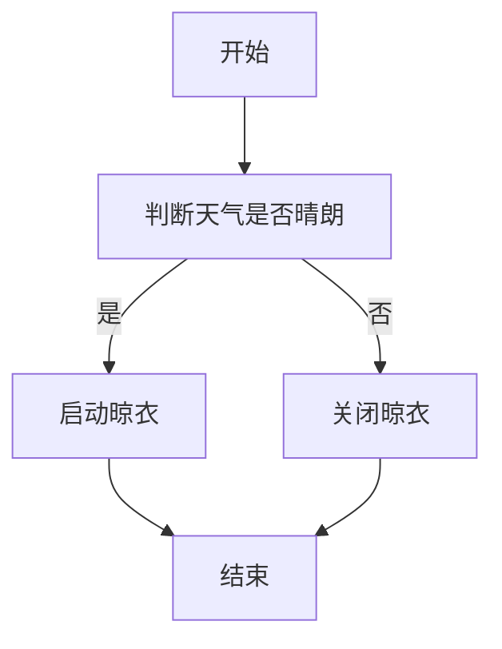
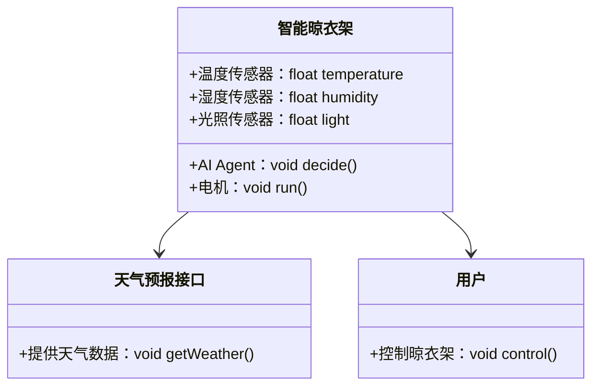
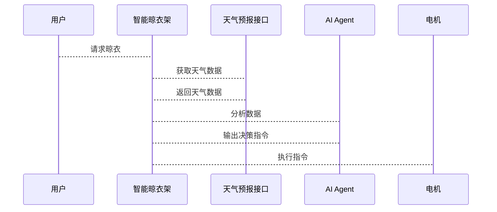

                 


# 智能晾衣架：AI Agent的衣物护理与天气适应

## 关键词：智能晾衣架，AI Agent，衣物护理，天气适应，物联网技术，决策算法

## 摘要：  
智能晾衣架是一种结合了人工智能（AI）代理和物联网技术的智能设备，旨在通过感知环境和天气变化，优化衣物的晾晒过程。本文将从背景介绍、核心概念、算法原理、系统架构、项目实战和最佳实践等方面，详细探讨智能晾衣架的设计与实现，分析其在衣物护理和天气适应方面的创新与优势。

---

## 第一部分：智能晾衣架的背景与核心概念

### 第1章：智能晾衣架的背景与问题背景

#### 1.1 智能晾衣架的起源与现状  
智能晾衣架的起源可以追溯到人们对更高效、便捷生活方式的追求。传统的晾衣架存在诸多问题，例如依赖人工操作、无法适应天气变化、缺乏智能化管理等。随着人工智能和物联网技术的快速发展，智能晾衣架应运而生，成为智能家居领域的重要组成部分。  

**市场需求与应用场景**  
智能晾衣架的主要用户是注重生活品质的消费者，尤其是家庭用户和居住环境较为复杂的用户（如คอนโด居民）。其应用场景包括：  
1. **家庭晾衣**：通过AI Agent自动选择最佳晾衣时间。  
2. **天气适应**：根据天气预报调整晾衣模式，避免衣物受潮或损坏。  
3. **远程控制**：通过手机App远程操作晾衣架。  

**AI Agent在智能晾衣架中的作用**  
AI Agent（智能体）是智能晾衣架的核心，负责感知环境、分析数据、制定决策并执行操作。其主要功能包括：  
- **环境感知**：通过传感器获取温度、湿度、光照等数据。  
- **天气预测**：通过API调用天气预报数据，预测未来天气变化。  
- **决策优化**：基于感知数据和天气预报，优化晾衣时间、模式和策略。  

#### 1.2 问题背景与问题描述  
**问题背景**  
传统晾衣架存在以下问题：  
1. **人工依赖**：需要人工操作，无法自动化管理。  
2. **天气适应性差**：无法根据天气变化调整晾衣模式。  
3. **数据孤岛**：无法与其他智能家居设备协同工作。  

**问题描述**  
智能晾衣架的目标是通过AI Agent实现以下功能：  
1. **自动感知环境**：通过传感器实时采集环境数据。  
2. **智能决策**：基于环境数据和天气预报，优化晾衣模式。  
3. **远程控制**：通过手机App或智能家居平台实现远程操作。  

**边界与外延**  
智能晾衣架的边界包括：  
- 物理设备：晾衣架主体、传感器、电机等。  
- 软件系统：AI Agent、天气预报接口、用户界面。  
- 交互方式：本地控制、远程控制、自动控制。  

其外延包括：  
- 与其他智能家居设备的联动（如智能门锁、空调等）。  
- 数据共享与分析（如用户行为分析、能耗优化）。  

#### 1.3 问题解决与核心概念  
**AI Agent的核心作用**  
AI Agent通过感知环境、分析数据和优化决策，解决了传统晾衣架的三大问题：人工依赖、天气适应性差和数据孤岛。  

**核心概念与联系**  
智能晾衣架的核心概念包括：  
1. **AI Agent**：负责感知、决策和执行。  
2. **物联网技术**：实现设备与云端的通信。  
3. **天气预报接口**：提供天气数据支持。  

**ER实体关系图**  
以下是智能晾衣架的核心实体关系图：

```mermaid
er
actor: 用户
|-----|-----|
| 智能晾衣架 | 感知环境
| 智能晾衣架 | 调整晾衣模式
| 天气预报接口 | 提供天气数据
| AI Agent | 处理数据并决策
```

---

## 第二部分：智能晾衣架的核心概念与联系

### 第2章：AI Agent与物联网技术的核心原理

#### 2.1 AI Agent的基本原理  
**AI Agent的定义与分类**  
AI Agent是一种能够感知环境、自主决策并执行任务的智能体。根据功能和应用场景的不同，AI Agent可以分为以下几类：  
1. **反应式AI Agent**：基于当前感知数据做出实时反应。  
2. **规划式AI Agent**：基于预设目标和规划执行任务。  
3. **学习式AI Agent**：通过机器学习算法优化决策能力。  

**AI Agent的核心算法与技术**  
AI Agent的核心算法包括：  
1. **感知算法**：如传感器数据采集与特征提取。  
2. **决策算法**：如基于机器学习的分类算法（如决策树、随机森林）。  
3. **执行算法**：如电机控制算法。  

**AI Agent在智能晾衣架中的应用**  
在智能晾衣架中，AI Agent负责以下任务：  
1. **环境感知**：通过温度、湿度、光照传感器获取环境数据。  
2. **天气预测**：通过API调用天气预报数据，预测未来天气变化。  
3. **决策优化**：基于环境数据和天气预测，优化晾衣模式（如选择最佳晾衣时间、调整晾衣角度）。  

#### 2.2 物联网技术与智能晾衣架的联系  
**物联网在智能晾衣架中的应用场景**  
物联网技术在智能晾衣架中的应用包括：  
1. **设备互联**：通过Wi-Fi或蓝牙连接手机App或智能家居平台。  
2. **数据传输**：传感器数据通过物联网平台上传至云端，进行存储和分析。  
3. **远程控制**：用户可以通过手机App远程控制晾衣架的运行状态。  

**传感器与数据采集技术**  
智能晾衣架中的传感器包括：  
1. **温度传感器**：测量环境温度。  
2. **湿度传感器**：测量环境湿度。  
3. **光照传感器**：测量环境光照强度。  

**云计算与边缘计算在智能晾衣架中的应用**  
云计算用于存储和分析传感器数据，边缘计算用于本地实时处理数据，优化决策效率。  

#### 2.3 核心概念属性对比与ER实体关系图  

**核心概念属性对比表**  
以下是对智能晾衣架中核心概念的属性对比：  

| **概念**       | **属性**                | **描述**                                                                 |
|----------------|------------------------|--------------------------------------------------------------------------|
| AI Agent       | 感知能力               | 能够通过传感器感知环境数据                                             |
|                | 决策能力               | 能够基于感知数据和天气预报做出决策                                     |
|                | 执行能力               | 能够通过电机和其他设备执行决策                                         |
| 物联网技术     | 连通性                 | 能够通过Wi-Fi或蓝牙与其他设备互联                                     |
|                | 数据传输能力           | 能够实时传输传感器数据至云端或本地                                     |
| 天气预报接口   | 数据提供能力           | 能够提供实时天气预报数据                                               |
|                | 更新频率               | 数据更新频率高，通常每小时更新一次                                       |

---

## 第三部分：智能晾衣架的算法原理与数学模型

### 第3章：AI Agent的核心算法与流程

#### 3.1 AI Agent的感知与决策算法

**感知算法的流程**  
AI Agent的感知算法流程如下：  
1. **数据采集**：通过传感器获取环境数据（如温度、湿度、光照）。  
2. **数据预处理**：对采集的数据进行清洗和特征提取。  
3. **特征选择**：选择对决策影响最大的特征（如温度和湿度）。  

**决策算法的流程**  
AI Agent的决策算法流程如下：  
1. **数据输入**：接收预处理后的环境数据和天气预报数据。  
2. **特征提取**：提取与晾衣相关的特征（如天气状况、环境湿度）。  
3. **模型训练**：基于历史数据训练决策模型（如决策树、随机森林）。  
4. **决策输出**：基于当前数据和模型预测结果，输出决策指令（如“启动晾衣”、“关闭晾衣”）。  

**基于决策树的天气适应算法**  
以下是一个基于决策树的天气适应算法示例：



---

### 第4章：系统架构设计与实现

#### 4.1 问题场景介绍  
智能晾衣架的系统架构设计需要考虑以下问题：  
1. **数据来源**：环境传感器、天气预报接口。  
2. **数据处理**：如何高效处理和分析传感器数据。  
3. **系统交互**：如何实现用户与系统的互动（如手机App控制）。  

#### 4.2 项目介绍  
**项目目标**：设计一个基于AI Agent的智能晾衣架系统，实现衣物护理与天气适应功能。  
**项目范围**：包括硬件设计、软件开发、系统集成与测试。  

#### 4.3 系统功能设计  

**领域模型类图**  
以下是智能晾衣架的领域模型类图：



#### 4.4 系统架构设计  

**系统架构图**  
以下是智能晾衣架的系统架构图：

```mermaid
containerDiagram
    container 服务器 {
        component 数据库
        component 云服务
    }
    component 智能晾衣架 {
        component 传感器
        component AI Agent
        component 电机
    }
    component 用户App {
        component 用户界面
    }
    智能晾衣架 --> 服务器
    用户App --> 服务器
```

#### 4.5 系统接口设计  

**接口设计**  
以下是智能晾衣架的主要接口设计：  
1. **传感器接口**：提供温度、湿度、光照数据。  
2. **天气预报接口**：提供实时天气数据。  
3. **用户App接口**：提供远程控制功能。  

**交互流程图**  
以下是智能晾衣架的交互流程图：



---

## 第五部分：项目实战

### 第5章：项目实战与代码实现

#### 5.1 环境安装与配置  
**Python环境安装**  
需要安装以下Python库：  
- `requests`：用于调用天气预报API。  
- `sense_hat`：用于模拟环境传感器数据。  
- `pytz`：用于处理时区。  

**安装命令**  
```bash
pip install requests sense_hat pytz
```

#### 5.2 系统核心实现源代码  

**AI Agent的核心代码**  
以下是AI Agent的核心代码：

```python
import requests
from sense_hat import SenseHat
from datetime import datetime, timezone
import pytz

# 初始化传感器
sense = SenseHat()

# 获取环境数据
temperature = sense.get_temperature()
humidity = sense.get_humidity()
light = sense.get_light()

# 获取天气预报数据
def get_weather():
    api_key = "your_api_key"
    location = "your_location"
    url = f"http://api.openweathermap.org/data/2.5/weather?q={location}&appid={api_key}"
    response = requests.get(url)
    if response.status_code == 200:
        data = response.json()
        return data['main']['temp'], data['main']['humidity']
    else:
        return None, None

# 分析数据并做出决策
def decide_linting(temperature, humidity, weather_temp, weather_humidity):
    if temperature < 20 or humidity > 60:
        return "关闭晾衣"
    elif weather_temp > 25 or weather_humidity > 60:
        return "延迟晾衣"
    else:
        return "启动晾衣"

# 执行决策
def execute_decision(decision):
    if decision == "启动晾衣":
        print("启动晾衣模式")
    elif decision == "关闭晾衣":
        print("关闭晾衣模式")
    elif decision == "延迟晾衣":
        print("延迟晾衣模式")

# 主函数
def main():
    temp = temperature
    hum = humidity
    weather_temp, weather_hum = get_weather()
    decision = decide_linting(temp, hum, weather_temp, weather_hum)
    execute_decision(decision)

if __name__ == "__main__":
    main()
```

---

## 第六部分：最佳实践与总结

### 第6章：最佳实践与总结

#### 6.1 小结  
智能晾衣架的设计与实现是一个典型的AI与物联网结合的项目，其核心在于AI Agent的感知、决策与执行能力。通过传感器数据和天气预报的结合，AI Agent能够优化晾衣模式，提升用户体验。

#### 6.2 注意事项  
1. **数据隐私**：确保用户数据的安全与隐私。  
2. **系统稳定性**：确保系统在极端天气条件下的稳定运行。  
3. **用户体验**：优化用户界面和交互流程，提升用户体验。  

#### 6.3 拓展阅读  
1. **机器学习与决策树**：深入学习决策树算法的原理与实现。  
2. **物联网技术**：研究更多物联网技术在智能家居中的应用。  
3. **AI Agent设计**：探索更复杂的AI Agent设计与实现。

---

## 作者：AI天才研究院/AI Genius Institute & 禅与计算机程序设计艺术/Zen And The Art of Computer Programming

