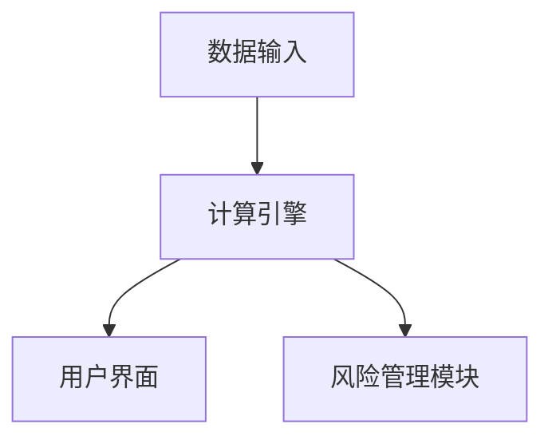
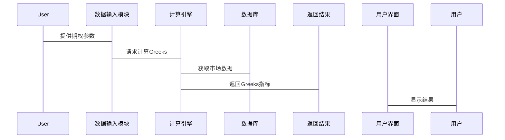

                 


# 《智能期权组合Greeks管理系统》

## 关键词：智能期权，Greeks，风险管理，算法，系统架构

## 摘要：本文深入探讨智能期权组合Greeks管理系统的原理、算法实现和系统架构，结合实际案例，分析其在金融风险管理中的应用，帮助读者理解如何利用现代技术优化期权组合管理。

---

## 第1章: 智能期权组合Greeks管理系统的背景与作用

### 1.1 期权组合Greeks的基本概念
#### 1.1.1 什么是期权组合Greeks
Greeks是衡量期权价格对不同因素敏感度的指标，包括Delta、Gamma、Vega、Theta和Rho。这些指标帮助投资者评估风险和潜在收益。

#### 1.1.2 Greeks在风险管理中的作用
Greeks用于量化和管理期权组合的风险，帮助投资者在市场波动中做出更明智的决策。

#### 1.1.3 智能化管理的必要性
传统方法依赖人工计算，效率低且容易出错。智能化系统通过算法优化计算，提高准确性和效率。

### 1.2 期权组合Greeks管理系统的背景
#### 1.2.1 传统期权组合管理的局限性
传统方法计算复杂，难以实时处理大量数据，且容易受主观因素影响。

#### 1.2.2 智能化管理的驱动因素
技术进步（如AI和大数据）推动了智能化管理的发展，提高了决策效率和准确性。

#### 1.2.3 系统的目标与意义
系统目标是优化期权组合管理，降低风险，提高收益。其意义在于帮助投资者更好地应对市场波动。

### 1.3 系统的功能与边界
#### 1.3.1 核心功能模块
系统包括数据输入、Greeks计算、风险评估和优化建议模块。

#### 1.3.2 系统的边界与外延
系统专注于期权组合管理，不涉及股票交易或其他资产类别。

#### 1.3.3 关键性能指标
计算速度、准确性、用户体验和稳定性是关键性能指标。

### 1.4 系统的核心要素与组成
#### 1.4.1 数据流与信息处理
系统处理市场数据、期权参数和用户输入，生成Greeks指标和风险报告。

#### 1.4.2 算法模型与计算引擎
使用蒙特卡罗模拟和数值方法计算Greeks，确保高精度和实时性。

#### 1.4.3 用户界面与交互设计
直观的界面和实时反馈帮助用户快速理解风险状况并做出决策。

### 1.5 本章小结
本章介绍了Greeks的基本概念、系统背景及其在风险管理中的作用，强调了智能化管理的必要性和优势。

---

## 第2章: 期权组合Greeks的核心概念与原理

### 2.1 Delta、Gamma、Vega、Theta、Rho的定义与计算
#### 2.1.1 Delta的定义与计算公式
Delta衡量期权价格对标的资产价格变化的敏感度，公式为：
$$ Delta = \frac{dC}{dS} $$

#### 2.1.2 Gamma的定义与计算公式
Gamma是Delta的敏感度，计算公式为：
$$ Gamma = \frac{dDelta}{dS} $$

#### 2.1.3 Vega的定义与计算公式
Vega衡量期权价格对波动率变化的敏感度，公式为：
$$ Vega = \frac{dC}{d\sigma} $$

#### 2.1.4 Theta的定义与计算公式
Theta衡量期权价格对时间流逝的敏感度，公式为：
$$ Theta = \frac{dC}{dt} $$

#### 2.1.5 Rho的定义与计算公式
Rho衡量期权价格对利率变化的敏感度，公式为：
$$ Rho = \frac{dC}{d r} $$

### 2.2 Greeks之间的关系与综合分析
通过表格对比，展示每个Greeks的定义、用途和计算方式，帮助读者理解它们的异同。

| GREEK | 定义 | 公式 | 用途 |
|------|------|------|------|
| Delta | 期权价格对标的资产价格变化的敏感度 | $$ \frac{dC}{dS} $$ | 评估价格变动风险 |
| Gamma | Delta对标的资产价格变化的敏感度 | $$ \frac{dDelta}{dS} $$ | 评估Delta的变化 |
| Vega | 期权价格对波动率变化的敏感度 | $$ \frac{dC}{d\sigma} $$ | 评估波动率风险 |
| Theta | 期权价格对时间流逝的敏感度 | $$ \frac{dC}{dt} $$ | 评估时间 decay |
| Rho | 期权价格对利率变化的敏感度 | $$ \frac{dC}{d r} $$ | 评估利率风险 |

### 2.3 GREEKS的综合应用
通过综合分析Greeks，投资者可以全面评估期权组合的风险，制定更有效的风险管理策略。

### 2.4 本章小结
本章详细讲解了每个Greeks的定义、计算方法及其在风险管理中的应用，帮助读者理解它们的综合影响。

---

## 第3章: 智能期权组合Greeks管理系统的算法原理

### 3.1 蒙特卡罗模拟算法
#### 3.1.1 算法原理
蒙特卡罗模拟通过随机抽样生成多种可能的市场情景，计算Greeks的平均值。

#### 3.1.2 算法步骤
1. 设定初始参数（如标的资产价格、波动率等）。
2. 生成随机数模拟市场情景。
3. 计算每种情景下的期权价格。
4. 计算Greeks指标。
5. 输出结果。

#### 3.1.3 代码示例
```python
import numpy as np

def monte_carlo_option Greeks(s0, k, r, sigma, t, n=10000):
    s_final = s0 * np.exp((r - 0.5*sigma**2)*t + sigma*np.sqrt(t)*np.random.randn(n))
    payoff = np.maximum(s_final - k, 0)
    delta = (payoff.mean() * s0) / s0
    return delta
```

### 3.2 数值方法（如二叉树模型）
#### 3.2.1 算法原理
二叉树模型将期权价格变化分为多个时间段，计算每一步的可能价格。

#### 3.2.2 算法步骤
1. 构建二叉树价格路径。
2. 计算期权价格。
3. 计算Greeks指标。

#### 3.2.3 代码示例
```python
def binomial_tree Greeks(s0, k, r, sigma, t, steps):
    dt = t / steps
    df = np.exp(-r * dt)
    u = np.exp(sigma * np.sqrt(dt))
    d = 1 / u
    pu = (np.exp(r * dt) - d) / (u - d)
    
    # 计算期权价格和 Greeks
    # 详细步骤略
    return delta, gamma, vega, theta, rho
```

### 3.3 优化算法
#### 3.3.1 使用机器学习优化Greeks计算
通过训练模型预测Greeks，减少计算时间。

#### 3.3.2 代码示例
```python
from sklearn.linear_model import LinearRegression

# 训练数据
X = ... # 输入特征
y = ... # 目标Greeks值

model = LinearRegression()
model.fit(X, y)

# 预测新的Greeks值
new_X = ... 
predicted_greeks = model.predict(new_X)
```

### 3.4 本章小结
本章介绍了蒙特卡罗模拟和二叉树模型的算法原理，并展示了如何使用Python代码实现这些算法，同时提到了机器学习的优化方法。

---

## 第4章: 智能期权组合Greeks管理系统的系统架构设计

### 4.1 系统架构概述
系统包括数据输入、计算引擎、用户界面和风险管理模块。

### 4.2 系统功能设计
#### 4.2.1 数据输入模块
接收市场数据和期权参数。

#### 4.2.2 计算引擎模块
执行Greeks计算和风险评估。

#### 4.2.3 用户界面模块
展示结果并提供交互功能。

### 4.3 系统架构图


### 4.4 系统接口设计
API接口定义数据输入和结果输出的格式。

### 4.5 系统交互流程


### 4.6 本章小结
本章详细描述了系统的架构设计，包括模块划分、接口设计和交互流程，确保系统高效运行。

---

## 第5章: 智能期权组合Greeks管理系统的项目实战

### 5.1 环境安装
安装Python、NumPy、Pandas和Matplotlib等库。

### 5.2 系统核心实现
#### 5.2.1 数据预处理
清洗和格式化数据，确保计算准确。

#### 5.2.2 模型训练与优化
训练机器学习模型，优化Greeks计算速度。

#### 5.2.3 结果展示
可视化Greeks指标，帮助用户直观理解风险。

### 5.3 代码实现
#### 5.3.1 数据处理
```python
import pandas as pd

data = pd.read_csv('market_data.csv')
data_clean = data.dropna()
```

#### 5.3.2 模型实现
```python
from sklearn import svm

model = svm.SVR()
model.fit(X_train, y_train)
```

#### 5.3.3 结果展示
```python
import matplotlib.pyplot as plt

plt.plot(results)
plt.show()
```

### 5.4 案例分析
通过具体案例，展示系统如何计算和优化期权组合的Greeks，帮助用户降低风险。

### 5.5 本章小结
本章通过实际项目展示系统的实现过程，帮助读者了解如何应用智能系统进行期权组合管理。

---

## 第6章: 智能期权组合Greeks管理系统的最佳实践与小结

### 6.1 最佳实践
#### 6.1.1 数据质量控制
确保数据准确性和及时性。

#### 6.1.2 系统维护与更新
定期更新模型和数据，保持系统性能。

#### 6.1.3 用户培训
培训用户正确使用系统，避免误操作。

### 6.2 小结
智能期权组合Greeks管理系统通过先进的算法和系统架构，显著提高了风险管理的效率和准确性，帮助投资者在复杂市场中做出明智决策。

### 6.3 展望
未来，系统可能结合更多市场数据和复杂模型，进一步提升风险管理能力。

---

## 作者：AI天才研究院 & 禅与计算机程序设计艺术

---

**总结：** 本文详细介绍了智能期权组合Greeks管理系统的原理、算法实现和系统架构，并通过实际案例展示了其在金融风险管理中的应用。

