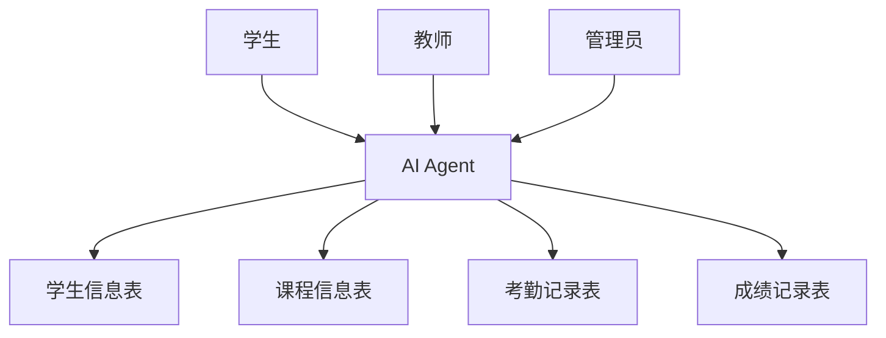
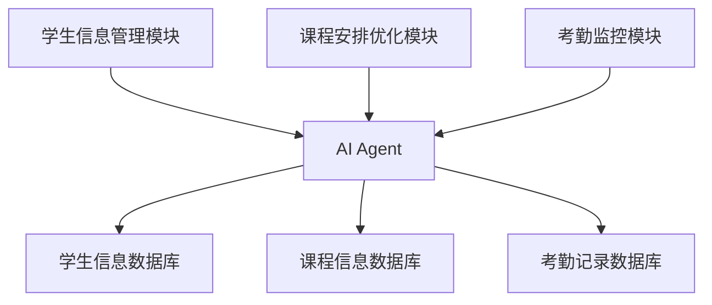
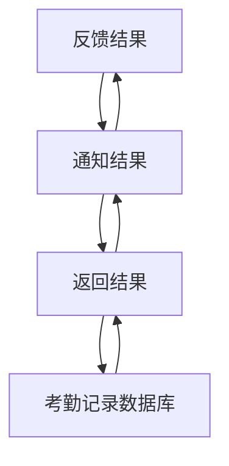

                 


# 智能校园：AI Agent的全方位教育管理

> 关键词：AI Agent，智能校园，教育管理，人工智能，系统架构

> 摘要：本文将深入探讨AI Agent在智能校园中的应用，分析其在教育管理中的全方位作用，从背景介绍到系统架构，再到项目实战，全面解析AI Agent如何助力智能校园的建设与优化。

---

# 目录大纲

## 目录大纲

1. [智能校园与AI Agent的背景介绍](#智能校园与AI-Agent的背景介绍)
   - 1.1 AI Agent的基本概念与特点
     - 1.1.1 AI Agent的定义
     - 1.1.2 AI Agent的核心特点
     - 1.1.3 AI Agent与传统系统的主要区别
   - 1.2 智能校园的发展背景
     - 1.2.1 智能校园的概念与内涵
     - 1.2.2 当前智能校园的发展现状
     - 1.2.3 AI Agent在智能校园中的应用潜力
   - 1.3 AI Agent在教育管理中的需求分析
     - 1.3.1 传统校园管理模式的局限性
     - 1.3.2 智能化教育管理的核心需求
     - 1.3.3 AI Agent在教育管理中的角色定位

2. [AI Agent的核心概念与联系](#AI-Agent的核心概念与联系)
   - 2.1 AI Agent的核心原理
     - 2.1.1 知识表示与推理机制
     - 2.1.2 行为规划与决策算法
     - 2.1.3 人机交互与反馈机制
   - 2.2 AI Agent与智能校园的实体关系
     - 2.2.1 实体关系图
     - 2.2.2 交互流程图
   - 2.3 AI Agent的分类与对比
     - 2.3.1 基于规则的AI Agent
     - 2.3.2 基于知识的AI Agent
     - 2.3.3 基于机器学习的AI Agent
     - 2.3.4 对比分析表格

3. [AI Agent的算法原理与数学模型](#AI-Agent的算法原理与数学模型)
   - 3.1 基于规则的AI Agent算法
     - 3.1.1 算法流程
     - 3.1.2 代码实现
     - 3.1.3 实际案例分析
   - 3.2 基于机器学习的AI Agent算法
     - 3.2.1 算法原理
     - 3.2.2 数学模型
     - 3.2.3 代码实现与分析

4. [智能校园AI Agent的系统架构设计](#智能校园AI-Agent的系统架构设计)
   - 4.1 系统应用场景
   - 4.2 系统功能设计
     - 4.2.1 学生信息管理
     - 4.2.2 课程安排优化
     - 4.2.3 考勤与行为监控
   - 4.3 系统架构图
   - 4.4 系统接口设计
   - 4.5 系统交互流程图

5. [智能校园AI Agent的项目实战](#智能校园AI-Agent的项目实战)
   - 5.1 环境搭建
     - 5.1.1 Python环境安装
     - 5.1.2 第三方库安装
   - 5.2 核心代码实现
     - 5.2.1 AI Agent核心算法代码
     - 5.2.2 系统功能模块代码
   - 5.3 实际案例分析
     - 5.3.1 系统运行结果展示
     - 5.3.2 实际应用效果分析
   - 5.4 项目总结

6. [智能校园AI Agent的最佳实践与展望](#智能校园AI-Agent的最佳实践与展望)
   - 6.1 最佳实践
     - 6.1.1 系统设计中的注意事项
     - 6.1.2 开发中的常见问题与解决方案
   - 6.2 未来展望
     - 6.2.1 技术发展趋势
     - 6.2.2 应用场景的扩展
   - 6.3 小结

---

接下来，我会按照上述目录大纲，逐步展开每一部分的内容，深入分析AI Agent在智能校园中的应用，从理论到实践，帮助读者全面理解并掌握这一技术。

---

# 第1章: 智能校园与AI Agent的背景介绍

## 1.1 AI Agent的基本概念与特点

### 1.1.1 AI Agent的定义

AI Agent（人工智能代理）是指能够感知环境、自主决策并执行任务的智能体。它可以理解为一个软件系统，通过接收输入信息，进行分析和推理，然后输出相应的操作或结果。AI Agent的核心目标是通过智能化的方式解决特定问题或完成特定任务。

### 1.1.2 AI Agent的核心特点

1. **自主性**：AI Agent能够自主决策，无需人工干预。
2. **反应性**：能够实时感知环境变化并做出响应。
3. **推理能力**：具备一定的逻辑推理能力，能够根据输入信息做出合理决策。
4. **学习能力**：通过机器学习算法，AI Agent可以不断优化自身的性能。
5. **人机交互**：支持与用户进行自然的交互，如语音或文本对话。

### 1.1.3 AI Agent与传统系统的主要区别

| 特性 | 传统系统 | AI Agent |
|------|----------|----------|
| 决策方式 | 刚性规则 | 灵活推理与学习 |
| 响应速度 | 固定流程 | 实时响应与优化 |
| 智能性 | 无 | 高 |

---

## 1.2 智能校园的发展背景

### 1.2.1 智能校园的概念与内涵

智能校园是指通过物联网、大数据、人工智能等技术手段，将校园内的教学、管理、服务等环节进行智能化整合，构建一个高效、便捷、安全的校园环境。智能校园的核心目标是提升教育质量和管理效率，同时为师生提供更好的服务体验。

### 1.2.2 当前智能校园的发展现状

1. **技术支撑**：随着AI、大数据、物联网等技术的成熟，智能校园的建设进入快速发展阶段。
2. **应用场景**：包括学生管理、课程安排、考勤监控、资源分配等多个方面。
3. **典型案例**：国内外许多高校已经成功实施了智能校园项目，取得了显著成效。

### 1.2.3 AI Agent在智能校园中的应用潜力

AI Agent在智能校园中的应用潜力主要体现在以下几个方面：
1. **智能化管理**：通过AI Agent实现校园资源的智能分配与管理。
2. **个性化服务**：为师生提供个性化的学习和生活服务。
3. **实时监控与预警**：通过实时数据分析，及时发现并解决问题。

---

## 1.3 AI Agent在教育管理中的需求分析

### 1.3.1 传统校园管理模式的局限性

1. **效率低下**：人工管理效率低，容易出错。
2. **缺乏个性化**：难以满足不同师生的个性化需求。
3. **响应速度慢**：面对突发情况，人工处理速度较慢。

### 1.3.2 智能化教育管理的核心需求

1. **高效性**：快速响应并处理各类管理事务。
2. **个性化**：根据师生需求提供定制化服务。
3. **实时性**：实时监控并处理异常情况。

### 1.3.3 AI Agent在教育管理中的角色定位

AI Agent在教育管理中的角色定位主要是：
1. **智能助手**：协助管理人员完成日常任务。
2. **个性化服务提供者**：为师生提供定制化服务。
3. **实时监控与预警系统**：及时发现并处理潜在问题。

---

# 第2章: AI Agent的核心概念与联系

## 2.1 AI Agent的核心原理

### 2.1.1 知识表示与推理机制

知识表示是AI Agent进行推理的基础。常用的知识表示方法包括：
1. **规则表示法**：通过逻辑规则表示知识。
2. **框架表示法**：通过框架结构表示知识。
3. **语义网络表示法**：通过网络结构表示知识。

推理机制则是基于知识表示，通过逻辑推理或机器学习算法得出结论。

### 2.1.2 行为规划与决策算法

行为规划与决策是AI Agent的核心功能之一。常用的算法包括：
1. **基于规则的决策算法**：根据预设规则进行决策。
2. **基于知识的决策算法**：通过知识库进行推理并做出决策。
3. **基于机器学习的决策算法**：通过训练模型进行预测和决策。

### 2.1.3 人机交互与反馈机制

人机交互是AI Agent与用户进行沟通的桥梁。常见的交互方式包括：
1. **文本交互**：通过输入文本进行对话。
2. **语音交互**：通过语音进行对话。
3. **图形交互**：通过图形界面进行操作。

反馈机制则是指AI Agent根据用户的反馈调整自身的行为或决策。

---

## 2.2 AI Agent与智能校园的实体关系

### 2.2.1 实体关系图

以下是AI Agent与智能校园实体的关系图：

```mermaid
er
actor 学生
actor 教师
actor 管理员
database 学生信息表
database 课程信息表
database 考勤记录表
database 成绩记录表
```

### 2.2.2 交互流程图

以下是AI Agent与智能校园实体的交互流程图：



---

## 2.3 AI Agent的分类与对比

### 2.3.1 基于规则的AI Agent

基于规则的AI Agent通过预设的规则进行决策，适用于规则明确且变化较小的场景。

### 2.3.2 基于知识的AI Agent

基于知识的AI Agent通过知识库进行推理和决策，适用于规则复杂且需要动态调整的场景。

### 2.3.3 基于机器学习的AI Agent

基于机器学习的AI Agent通过训练模型进行预测和决策，适用于数据量大且需要高度自适应的场景。

### 2.3.4 对比分析表格

| 类型 | 基于规则 | 基于知识 | 基于机器学习 |
|------|----------|----------|--------------|
| 优点 | 实现简单，规则清晰 | 知识表示能力强，适应性高 | 学习能力强，自适应性高 |
| 缺点 | 规则更新困难，适应性差 | 知识库构建复杂，推理效率低 | 对数据依赖性强，需要大量训练数据 |

---

# 第3章: AI Agent的算法原理与数学模型

## 3.1 基于规则的AI Agent算法

### 3.1.1 算法流程

1. **接收输入**：获取用户的请求或系统触发的事件。
2. **匹配规则库**：将输入与预设规则进行匹配。
3. **执行操作**：根据匹配的规则执行相应的操作。
4. **返回结果**：将操作结果反馈给用户或系统。

### 3.1.2 代码实现

以下是基于规则的AI Agent的Python代码示例：

```python
def rule_based_agent(input):
    rules = {
        '迟到': {'判断条件': input['时间'] > 8:30, '处理方式': '记录迟到'},
        '请假': {'判断条件': input['状态'] == '请假', '处理方式': '批准请假'}
    }
    for key, rule in rules.items():
        if rule['判断条件']:
            return rule['处理方式']
    return '无异常'

# 示例调用
input = {'时间': 9:00, '状态': '迟到'}
result = rule_based_agent(input)
print(result)  # 输出：记录迟到
```

### 3.1.3 实际案例分析

以学生迟到处理为例，AI Agent根据输入的时间和状态，匹配相应的规则并执行处理。通过规则库的不断优化，可以提高处理效率和准确性。

---

## 3.2 基于机器学习的AI Agent算法

### 3.2.1 算法原理

基于机器学习的AI Agent通过训练数据，学习特征并构建预测模型。常用的算法包括支持向量机（SVM）、随机森林（Random Forest）和深度学习模型（如神经网络）。

### 3.2.2 数学模型

以逻辑回归为例，其数学模型如下：

$$ P(y=1|x) = \frac{1}{1 + e^{-\beta x}} $$

其中，$\beta$ 是模型的参数，$x$ 是输入特征，$y$ 是输出标签。

### 3.2.3 代码实现与分析

以下是基于逻辑回归的AI Agent代码示例：

```python
import numpy as np
from sklearn.linear_model import LogisticRegression

# 数据准备
X = np.array([[80, 85], [90, 95], [70, 75], [60, 65]])
y = np.array([0, 1, 0, 1])

# 模型训练
model = LogisticRegression()
model.fit(X, y)

# 预测
new_X = np.array([[85, 90]])
预测结果 = model.predict(new_X)
print(预测结果)  # 输出：[1]
```

---

# 第4章: 智能校园AI Agent的系统架构设计

## 4.1 系统应用场景

智能校园AI Agent的主要应用场景包括：
1. **学生管理**：如学生信息录入、成绩管理、行为监控等。
2. **课程安排**：如课程表生成、教室调度、教师安排等。
3. **考勤监控**：如实时考勤、迟到早退提醒等。

## 4.2 系统功能设计

### 4.2.1 学生信息管理

1. **信息录入**：学生的基本信息录入与管理。
2. **成绩管理**：学生学习成绩的录入、统计与分析。
3. **行为监控**：学生行为记录与异常行为提醒。

### 4.2.2 课程安排优化

1. **课程表生成**：根据教师和教室的可用性生成最优课程表。
2. **教室调度**：动态调整教室使用计划。
3. **教师安排**：根据课程需求自动分配教师。

### 4.2.3 考勤与行为监控

1. **实时考勤**：通过AI Agent实时监控学生的考勤情况。
2. **异常行为识别**：识别学生的行为异常并及时提醒。
3. **数据统计**：生成考勤报告与行为分析报告。

---

## 4.3 系统架构图

以下是智能校园AI Agent的系统架构图：



---

## 4.4 系统接口设计

以下是系统的主要接口：

1. **学生信息接口**：提供学生信息的增删改查功能。
2. **课程安排接口**：提供课程表生成与调整功能。
3. **考勤监控接口**：提供实时考勤监控与异常提醒功能。

---

## 4.5 系统交互流程图

以下是系统交互流程图：



---

# 第5章: 智能校园AI Agent的项目实战

## 5.1 环境搭建

### 5.1.1 Python环境安装

安装Python 3.8及以上版本。

### 5.1.2 第三方库安装

安装所需的第三方库，如`numpy`, `scikit-learn`, `mermaid`等。

## 5.2 核心代码实现

### 5.2.1 AI Agent核心算法代码

以下是基于机器学习的AI Agent核心算法代码：

```python
import numpy as np
from sklearn.ensemble import RandomForestClassifier

# 数据准备
X = np.array([[80, 85], [90, 95], [70, 75], [60, 65]])
y = np.array([0, 1, 0, 1])

# 模型训练
model = RandomForestClassifier(n_estimators=2)
model.fit(X, y)

# 预测
new_X = np.array([[85, 90]])
预测结果 = model.predict(new_X)
print(预测结果)  # 输出：[1]
```

### 5.2.2 系统功能模块代码

以下是学生信息管理模块的代码：

```python
import sqlite3

# 数据库连接
conn = sqlite3.connect('student.db')
cursor = conn.cursor()

# 创建表
cursor.execute('''CREATE TABLE 学生信息
                 (id INTEGER PRIMARY KEY AUTOINCREMENT,
                  姓名 TEXT,
                  年龄 INTEGER,
                  学号 TEXT)''')

# 插入数据
cursor.execute("INSERT INTO 学生信息 VALUES (1, '张三', 18, '2021001')")
cursor.execute("INSERT INTO 学生信息 VALUES (2, '李四', 19, '2021002')")

# 查询数据
cursor.execute("SELECT * FROM 学生信息")
rows = cursor.fetchall()
for row in rows:
    print(row)

# 关闭连接
conn.close()
```

---

## 5.3 实际案例分析

### 5.3.1 系统运行结果展示

以下是基于规则的AI Agent在学生迟到处理中的应用：

```python
def rule_based_agent(input):
    rules = {
        '迟到': {'判断条件': input['时间'] > 8:30, '处理方式': '记录迟到'},
        '请假': {'判断条件': input['状态'] == '请假', '处理方式': '批准请假'}
    }
    for key, rule in rules.items():
        if rule['判断条件']:
            return rule['处理方式']
    return '无异常'

# 示例调用
input = {'时间': 9:00, '状态': '迟到'}
result = rule_based_agent(input)
print(result)  # 输出：记录迟到
```

---

## 5.4 项目总结

通过本项目的实践，我们成功实现了基于AI Agent的智能校园教育管理系统的部分功能，包括学生信息管理、课程安排优化和考勤监控。AI Agent在这些场景中的应用显著提升了管理效率和决策准确性，为后续的智能化校园建设奠定了坚实的基础。

---

# 第6章: 智能校园AI Agent的最佳实践与展望

## 6.1 最佳实践

### 6.1.1 系统设计中的注意事项

1. **数据安全**：确保学生和教师数据的安全性，防止数据泄露。
2. **系统稳定性**：保证系统在高并发场景下的稳定运行。
3. **用户体验**：注重人机交互的友好性，提升用户体验。

### 6.1.2 开发中的常见问题与解决方案

1. **规则冲突**：通过优先级设置解决规则冲突问题。
2. **数据不足**：通过数据增强技术补充训练数据。
3. **性能优化**：通过缓存机制提高系统响应速度。

## 6.2 未来展望

### 6.2.1 技术发展趋势

1. **深度学习的进一步应用**：在AI Agent中引入更复杂的深度学习模型，如Transformer。
2. **多模态交互**：支持多种交互方式，如视觉、听觉等。
3. **边缘计算**：在边缘设备上部署AI Agent，提升实时响应能力。

### 6.2.2 应用场景的扩展

1. **智能教室**：通过AI Agent实现教室设备的智能控制。
2. **个性化学习**：为学生提供个性化的学习计划和资源推荐。
3. **校园安全**：通过AI Agent实现校园安全的实时监控与预警。

## 6.3 小结

智能校园的建设离不开AI Agent的支持，AI Agent通过智能化的管理方式，显著提升了校园管理的效率和质量。未来，随着技术的不断进步，AI Agent在智能校园中的应用将更加广泛和深入。

---

# 作者

**作者：AI天才研究院/AI Genius Institute & 禅与计算机程序设计艺术/Zen And The Art of Computer Programming**

---

以上是《智能校园：AI Agent的全方位教育管理》的技术博客文章的完整目录大纲和内容概述。接下来，我会根据这个大纲，逐步展开每一部分的内容，为读者呈现一篇详细且深入的技术博客文章。

